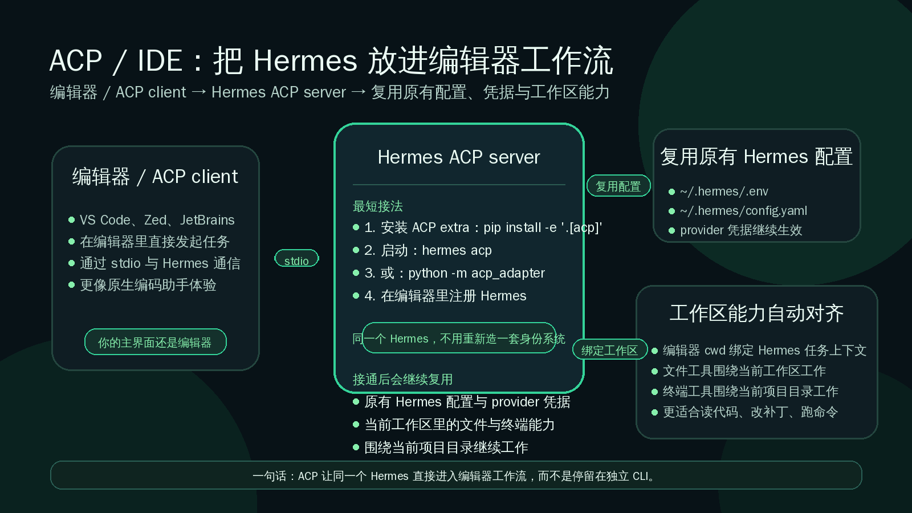

# 🧑‍💻 07-ACP与IDE

这一页只解决一件事：
当你已经不想只在 CLI 或消息窗口里调用 Hermes，而是想让它直接待在编辑器工作流里，像原生编码助手一样围绕当前项目协作时，就该看 ACP / IDE 这一页。



---

## ❓ 什么情况下值得先走 ACP / IDE

下面这些情况，通常就值得优先考虑 ACP / IDE：

- 你主要的工作界面已经是编辑器，而不是终端或消息平台
- 你希望 Hermes 在写代码、查文件、改补丁、跑终端命令时直接围绕当前项目工作
- 你要的是“编辑器里的原生编码助手”体验，而不是额外再开一个独立 CLI 窗口
- 你已经有可用的 Hermes 配置和 provider 凭据，只想把这套能力接进 IDE
- 你希望当前工作区目录自然成为 Hermes 的任务上下文，而不是每次都手动解释项目位置

一句话判断：
如果你想要的不是“换个地方聊天”，而是“让 Hermes 成为编辑器工作台的一部分”，就值得先走 ACP / IDE。

---

## ❓ 它和单纯 CLI 有什么不同

CLI 的重点是：
你主动打开一个独立入口，再让 Hermes 帮你做事。

ACP / IDE 的重点是：
让 ACP-compatible 编辑器通过 stdio 直接和 Hermes 通信，把 Hermes 放进你本来就在用的开发环境里。

可以这样理解两者差别：

<table>
  <colgroup>
    <col style="width: 24%;" />
    <col style="width: 38%;" />
    <col style="width: 38%;" />
  </colgroup>
  <thead>
    <tr>
      <th>方式</th>
      <th>你主要在做什么</th>
      <th>更适合什么情况</th>
    </tr>
  </thead>
  <tbody>
    <tr>
      <td>CLI / 消息入口</td>
      <td>你先进入 Hermes，再把任务带给它</td>
      <td>通用使用、临时探索、跨平台聊天、手动调试</td>
    </tr>
    <tr>
      <td>ACP / IDE</td>
      <td>把 Hermes 放进编辑器，让它围绕当前工作区直接参与编码流程</td>
      <td>项目开发、读改代码、补丁编辑、终端协作、希望获得编辑器内原生体验</td>
    </tr>
  </tbody>
</table>

还有两个用户层最关键的区别：

- ACP 模式更适合编辑器里的原生编码助手体验，不是 standalone CLI / messaging bot 的替代皮肤
- ACP 会把编辑器 cwd 绑定到 Hermes 任务上下文，所以文件和终端工具默认围绕当前工作区工作

所以这一页真正要你建立的心智不是“多一个入口”。
而是：
Hermes 可以进入编辑器工作流，并继续用你原来那套配置和能力做事。

---

## 📌 最短接法

这一页不展开所有编辑器差异。
先把最短路径走通就够了。

### ➡️ 第 1 步：先确认你要的是 ACP-compatible 编辑器路线

ACP 这条路适合你已经决定要把 Hermes 放进编辑器工作流。
如果你只是想在终端里继续单独使用 Hermes，这一页先不用展开。

### ➡️ 第 2 步：安装 ACP extra

官方最短安装动作是给 Hermes 补上 ACP extra：

```bash
pip install -e '.[acp]'
```

这一步的意义很简单：
把 Hermes 运行成 ACP server 所需的依赖装上。

### ➡️ 第 3 步：启动 Hermes ACP server

任意一种方式都可以作为最短启动入口：

```bash
hermes acp
```

或：

```bash
python -m acp_adapter
```

这里的核心不是背命令花样。
而是知道：Hermes 可以作为 ACP server 运行，让 ACP-compatible 编辑器通过 stdio 与 Hermes 通信。

### ➡️ 第 4 步：在编辑器里注册 Hermes

接下来要做的是在 ACP-compatible 编辑器里把 Hermes 注册进去。
用户层只需要先理解这件事：

- 编辑器这边是 ACP client
- Hermes 这边是 ACP server
- 注册成功后，编辑器就知道该怎么拉起或连接 Hermes

像 VS Code 这类编辑器，官方文档已经给出注册思路与示例配置。
当前页先不展开不同编辑器各自的 UI 差异，只先建立“能注册进去”这个最短目标。

### ➡️ 第 5 步：直接复用你原来的 Hermes 配置与凭据

ACP 模式不需要你重新造一套身份系统。
它使用和 CLI 相同的 Hermes 配置与 provider 凭据，例如原来的环境变量、配置文件和 provider 解析结果都会继续生效。

对用户最重要的结论就是：
不是再配一遍新账号，而是把已经能工作的 Hermes 继续带进编辑器。

---

## ✅ 成功标准

这一页最重要的不是记住每个编辑器的按钮位置。
而是知道“到底算不算已经接通”。

你可以看下面这些成功信号：

### 🔹 1）ACP extra 已经装上

你已经完成 `pip install -e '.[acp]'`，并知道 ACP 相关启动入口已经可用。
这说明最基本的 ACP 运行条件已经具备。

### 🔹 2）`hermes acp` 能启动

只要 `hermes acp` 或 `python -m acp_adapter` 能正常启动，就说明 Hermes 这一侧已经能以 ACP server 身份工作。

### 🔹 3）编辑器里已经能注册 Hermes

无论你用的是 VS Code 还是其他 ACP-compatible 编辑器，只要编辑器侧已经成功识别并注册 Hermes，这条链路就不再只是“命令行能跑”。
而是真正进入了编辑器工作流。

### 🔹 4）你知道工作区会成为 Hermes 的默认任务上下文

成功不只是“列表里出现 Hermes”。
还包括你已经理解 ACP 会把编辑器 cwd 绑定到 Hermes 任务上下文，因此文件和终端工具会围绕当前工作区工作。

一句话总结：
装上 ACP extra、能启动 `hermes acp`、能在编辑器里注册成功、知道工作区会成为默认上下文，这几个信号最实用。

---

## 📌 最常见排错入口

这一页先不做复杂故障树。
用户层最常见的排错入口，先记住下面这几类就够了。

### 🔹 1）编辑器里根本看不到 Hermes

先检查：

- ACP extra 有没有装上
- 编辑器是不是 ACP-compatible，且已经装了对应 ACP client / 插件
- 注册时是不是正确指向了官方文档要求的目录或命令入口

### 🔹 2）`hermes acp` 一启动就报错

先回到 Hermes 本体状态检查：

```bash
hermes doctor
hermes status
hermes acp
```

如果 Hermes 本身配置、环境或 provider 就没通，ACP 只是更早把问题暴露出来。

### 🔹 3）编辑器连上了，但模型或凭据不工作

最常见原因不是 ACP 自己有一套单独登录流程。
而是你原来的 Hermes provider 凭据没有配置好。

优先检查：

- `hermes model` 当前配置是否正确
- `~/.hermes/.env` 里的 provider 凭据是否可用
- 你原来在 CLI 下能不能正常调用 Hermes

### 🔹 4）打开项目后行为不像围绕当前工作区工作

优先回头检查你是不是从正确的编辑器工作区启动、注册和调用 Hermes。
因为 ACP 的关键价值之一就是把编辑器 cwd 绑定到 Hermes 任务上下文；如果工作区本身不对，后续文件和终端体验也会跟着偏。

---

## 🔹 哪些情况这一页先不展开

为了保持边界清楚，下面这些方向先不在当前页展开：

- 每个编辑器各自的详细 UI 配置步骤
- ACP registry manifest 的完整字段说明
- ACP 会话管理的完整生命周期细节
- 审批桥接、超时处理、危险命令策略等更细机制
- 和 API Server、MCP、Cron 之间的组合设计
- ACP 协议本身的开发者实现细节

这一页是用户页，不是 ACP 协议开发文档。
当前目标只是让你先理解：什么时候值得把 Hermes 放进编辑器、最短怎么接、接通后看什么信号、常见问题从哪查。

---

## ✅ 什么时候算通过

当前页学完，至少要满足下面这些判断，才算通过：

- 你已经知道什么情况下值得先走 ACP / IDE
- 你已经能说清它和单纯 CLI 的区别
- 你已经知道最短接法包括：安装 ACP extra、启动 `hermes acp` 或 `python -m acp_adapter`、在编辑器里注册 Hermes
- 你已经知道 ACP 模式复用原来的 Hermes 配置与 provider 凭据，不需要重做一套身份系统
- 你已经知道编辑器 cwd 会绑定到 Hermes 任务上下文，所以文件和终端工具围绕当前工作区工作
- 你已经知道最常见的成功信号和排错入口分别看什么
- 你已经知道这一页先不展开协议开发和各编辑器的深层配置细节

如果一句话判断：
你已经不再把 Hermes 只理解成“终端里单独运行的助手”，而是理解成“可以进入编辑器工作流、围绕当前项目直接协作的助手”，这一页就算过了。

---

## ➡️ 下一步

完成后进入：
- [04-自己造东西](../总览.md)
- [04-自己造东西/自动化](./06-自动化.md)
- [01-从这开始](../总览.md)

如果你想先回到上一阶段入口重新确认位置：
- [上一阶段入口](./01-总览.md)
