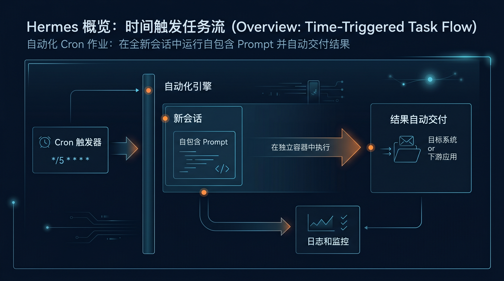

# 🤖 07-让 Hermes 自己自动跑

这一页只解决一件事：
当你已经有一个清楚、重复、按时间发生的任务时，怎样把它交给 Hermes 的 Cron / Automation 稳定执行。



> **一句话结论**：把已跑顺的重复任务交给 Hermes Cron，让它按时间表自动执行并交付结果。

**适合谁**：有清楚、重复、按时间发生的任务（如每日摘要、定期监控、周期报告）需要自动执行的用户。
**不适合谁**：任务本身还没跑顺、需求每天都在变、输出标准还没定的用户——先手动跑通再来自动化。
**最短路径**：把任务写成可复述的自包含说明 → 在 config.yaml 中配置 cronjob 定时 → 设置交付目标（输出到文件/API/通知） → 验证首次执行。
**关键限制**：任务必须已经能稳定手动执行；cron 运行的是全新无交互上下文的会话，prompt 必须自包含、不能依赖历史对话；不支持运行中追问。
**下一步**：继续阅读下方 [先判断：这件事适不适合自动化](#-先判断这件事适不适合自动化) 章节。

---

## 🎯 先判断：这件事适不适合自动化

下面这些情况，通常值得自动化：

- 任务会重复发生
- 你已经知道大概多久执行一次
- 每次目标都差不多
- 结果应该按固定时间送达
- 你已经能把任务写成别人也能执行的说明

如果任务本身还没跑顺、需求每天都变、输出标准还没定，这时先不要自动化。

---

## 🎁 这一步真正改变了什么

自动化不是“定时替你再发一句话”。

它带来的能力变化是：

1. 重复任务开始脱离人工触发
2. Hermes 从“随叫随到的助手”变成“按规则值班的系统能力”
3. 你被迫把任务写清楚，系统边界会更稳
4. 结果可以固定交付到你真正消费的位置

所以自动化解决的是重复劳动托管问题，不是聊天入口替代问题。

---

## 📌 先记住最关键的一条

Cron job 会在 fresh session 里运行。

这意味着：

- 它不会继承你当前聊天窗口的上下文
- prompt 必须自包含
- “照旧来”“按上次那样”这类写法通常会失败

---

## ⚡ 最短上手路径

### 第 1 步：挑一个真正重复的任务

最典型的起点是：

- 每天晨报
- 每晚备份检查
- 每周仓库巡检
- 每隔几小时扫一次更新

### 第 2 步：先手动跑顺一次

先在普通聊天或 CLI 里亲自跑通。
如果手动都还不稳，自动化只会把问题按时放大。

### 第 3 步：把 prompt 改成自包含

坏写法：

```text
按老样子做今天的日报。
```

好写法：

```text
搜索过去 24 小时内 AI agents 和开源 LLM 的最新动态，至少查看 5 个来源，选出最值得关注的 3 条。每条输出标题、2 句摘要和原始链接。整体控制在 300 到 500 字，用简洁专业的中文写成晨间 briefing。
```

### 第 4 步：创建 job，并确认它进入可管理状态

你至少要知道这些生命周期动作存在：

- create
- list
- update
- pause
- resume
- run
- remove

### 第 5 步：先手动试跑，再看交付位置

自动化的价值不是“后台跑过”，而是“结果到了你真的会看的地方”。

---

## 🗓️ 典型起点：Daily Briefing

为什么很多人第一次自动化都从 Daily Briefing 开始：

- 它足够重复
- 好坏很容易判断
- 很容易看出手动触发和自动交付的差别
- 它天然逼你把 prompt 写清楚

如果连这类任务都还写不清楚，说明你更需要先把手动流程跑顺。

---

## 🔍 成功信号

### 1. prompt 已经足够自包含

单独把这段 prompt 拎出去，一个 fresh session 也能执行。

### 2. job 能被列出来和管理

你至少要能确认：

- 已创建成功
- 能 list 到
- 需要时知道怎么 pause / resume / run / remove

### 3. 手动试跑结果和预期一致

正式长期运行前，先 run 一次看输出。

### 4. 结果被送到了真正消费的位置

最强成功信号不是后台有记录，而是你真的拿到了可读、可用的结果。

---

## 🩺 第一次失败时，先查这 5 件事

### 1. 任务本身是不是还没跑顺

如果手动都不稳定，先别怪自动化。

### 2. prompt 里是不是大量依赖隐含上下文

例如：

- 按老样子
- 照旧
- 你知道我意思
- 按上次那个格式

这些都应该改写成显式说明。

### 3. 任务频率是不是太低

低频任务有时手动更省心，不一定值得长期维护一个 job。

### 4. 你有没有先做试跑

先 run 一次，再决定是否长期启用。

### 5. 结果有没有送到你真正会看的地方

如果输出进了一个你根本不看的位置，自动化价值就会大打折扣。

---

## ✅ 什么时候算通过

当你已经满足下面这些判断，这一页就算通过：

- 我知道什么任务适合自动化，什么任务不适合
- 我知道 cron job 在 fresh session 里运行
- 我知道最短路径是：先挑重复任务、先手动跑顺、把 prompt 写成自包含、创建 job、试跑并确认交付
- 我知道成功不是“建了 job”，而是“它能稳定按时交付结果”

---

## ➡️ 下一步
完成后进入：
- [08-放进编辑器里用](<./08-放进编辑器里用.md>)

如果你想先回到上一阶段入口重新确认位置：
- [04-自己造东西](<./01-总览.md>)
