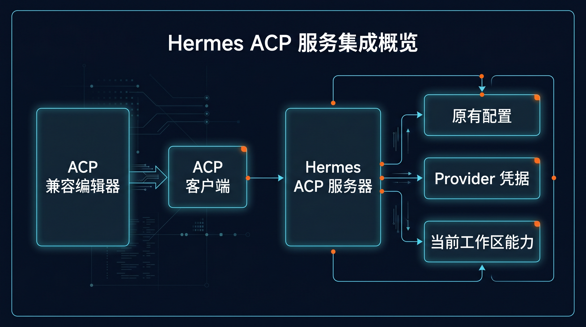

# 🧑‍💻 08-放进编辑器里用

这一页只解决一件事：
当你想让 Hermes 不再待在单独的 CLI 或消息窗口里，而是直接围绕编辑器里的当前项目协作时，怎样用 ACP 路线把它接进 IDE 工作流。



---

## 先判断：你是不是已经进入“编辑器工作台”阶段

下面这些情况，通常就该看这一页：

- 你主要工作界面已经是编辑器
- 你想让 Hermes 围绕当前项目直接读代码、改补丁、跑终端
- 你不想来回切 CLI 和编辑器做同一件事
- 你已经有可用的 Hermes 配置，只想把它带进 IDE

如果你现在还主要靠 CLI 单独工作，这一页可以后看。

---

## 这一步真正改变了什么

把 Hermes 放进编辑器，不是“换个地方聊天”。

它带来的能力变化是：

1. Hermes 开始进入你的开发主战场
2. 当前工作区会自然成为默认任务上下文
3. 文件、终端、补丁、项目结构会围绕 IDE 流程协作
4. 你不再需要每次先跳出编辑器再去启动一轮独立对话

所以这一步改变的是工作方式，而不是界面皮肤。

---

## ACP / IDE 和 CLI 的本质区别

CLI 更像：

- 你先进入 Hermes，再把任务带给它

ACP / IDE 更像：

- 你本来就在编辑器里工作，Hermes 直接围绕当前工作区参与流程

这也是为什么 ACP 更适合长期开发场景。

---

## 最短接法

### 第 1 步：确认你要走的是 ACP-compatible 编辑器路线

如果你只是想继续在终端里使用 Hermes，这一页先不用展开。

### 第 2 步：安装 ACP extra

在 Hermes 环境里执行：

```bash
pip install -e '.[acp]'
```

成功后，Hermes 才具备 ACP 相关能力。

### 第 3 步：启动 Hermes ACP server

执行任意一种：

```bash
hermes acp
```

或：

```bash
python -m acp_adapter
```

只要能正常启动，说明 Hermes 这一侧已经能作为 ACP server 工作。

### 第 4 步：在编辑器里注册 Hermes

用户层只需要先理解三件事：

- 编辑器是 ACP client
- Hermes 是 ACP server
- 注册成功后，编辑器会知道如何拉起或连接 Hermes

### 第 5 步：直接复用你原来的 Hermes 配置和凭据

ACP 模式不是重做一套身份系统。
它沿用原来的 Hermes 配置与 provider 凭据。

如果你原来的模型、key、endpoint 就没配好，先回到基础配置层排查。

---

## 成功信号

### 1. ACP extra 已经安装成功

也就是：

```bash
pip install -e '.[acp]'
```

已经跑通。

### 2. `hermes acp` 能正常启动

这是 Hermes 侧最基本的成功信号。

### 3. 编辑器里已经能注册并识别 Hermes

这说明链路不再停留在命令层，而是真的进入了 IDE 工作流。

### 4. 你已经理解工作区会成为默认上下文

这很关键。
成功不只是“列表里看到了 Hermes”，还包括你知道当前工作区目录会成为它的默认任务上下文。

---

## 第一次失败时，先查这 5 件事

### 1. ACP extra 有没有装上

先确认安装命令是否成功。

### 2. 编辑器是不是 ACP-compatible

不是所有编辑器默认都支持这条路线。

### 3. `hermes acp` 能不能单独启动

如果单独启动都失败，先别急着排查编辑器。

### 4. 你原来的 Hermes 配置和凭据是否可用

很多时候问题不在 ACP，而在模型或 provider 本身。

### 5. 你是不是从正确的工作区启动和注册

如果工作区不对，文件和终端上下文也会跟着跑偏。

---

## 什么时候算通过

当你已经满足下面这些判断，这一页就算通过：

- 我知道什么情况下值得把 Hermes 放进编辑器
- 我知道 ACP / IDE 和 CLI 的本质区别
- 我知道最短接法是：安装 ACP extra、启动 `hermes acp`、在编辑器里注册 Hermes
- 我知道 ACP 复用原来的 Hermes 配置与凭据
- 我知道工作区会成为 Hermes 的默认任务上下文

---

## ➡️ 下一步
完成后进入：
- [01-从这开始](../总览.md)
如果你想先回到上一阶段入口重新确认位置：
- [04-自己造东西](./01-总览.md)
