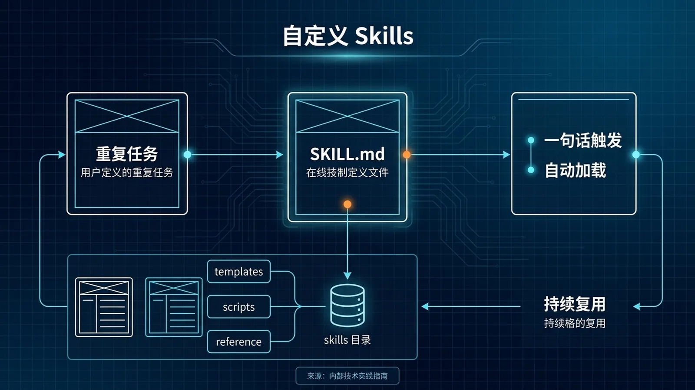

# 如何将重复工作流沉淀为 Skill


*<center>将混沌化为秩序：把重复的手工操作，提炼为可一键调用的结构化能力。</center>*

你是否发现自己总在指挥 Hermes Agent 执行一套相似的“组合拳”？比如晨报整理、项目初始化、周报数据拉取……每次都得重复输入几乎一样的指令，费时又费力。

是时候让你的 Agent “学会”这些操作了。本页将带你把这些重复劳动“沉淀”下来，固化成一个可随时一键调用的 **Skill (技能)**。这就像是为你的 Agent 编写一本“武功秘籍”或“标准作业程序 (SOP)”，让它拥有可复用的新能力，从一个聊天工具，真正进化为你的高效助理。

## ⚙️ 实战：从一个“分析开源项目”的重复工作流开始

假设你经常需要快速了解一个新的开源项目。每次，你的操作都大同小异：

> “帮我分析一下 `https://github.com/torvalds/linux`。先 `clone` 下来，用 `pygount` 统计代码行数，再用 `ls -R` 看目录结构，最后读 `README.md` 并总结一下。”

这个过程涉及多个固定步骤，唯一的变量就是项目的 Git URL。这，就是最适合被沉淀为 Skill 的完美场景。

### 1. 拆解与抽象：从手动到配方

我们先把手动流程拆解成原子操作，然后为这个流程定义清晰的输入和输出。

*   **手动步骤**:
    1.  `git clone <repo_url>`
    2.  `pygount .` (分析代码)
    3.  `ls -R` (查看结构)
    4.  `read_file README.md` (阅读文档)
    5.  总结报告

*   **抽象成配方**:
    *   **输入 (Input)**：流程需要什么变量？很明显，是项目的 Git URL。我们给它起个名字叫 `repo_url`。
    *   **输出 (Output)**：我们期望得到什么？一份关于项目的分析报告。

### 2. 编写配方：`SKILL.md`

现在，我们可以为这个“配方”编写一份正式的说明书——`SKILL.md` 文件。它包含两部分：**元数据 (Frontmatter)**，用来定义名称、描述和参数；**主体 (Body)**，用自然语言描述执行步骤、最佳实践和注意事项。

这就是我们为“代码分析”这个任务编写的 `SKILL.md`：

```markdown
---
name: codebase-analysis-basic
description: "通过 clone、分析代码和阅读 README，对一个 Git 仓库进行快速的基础分析。"
parameters:
  - name: "repo_url"
    description: "需要分析的 Git 仓库的完整 URL (e.g., https://github.com/user/repo)"
    type: "string"
    required: true
---

# 📖 工作流: 代码库基础分析

## 目标
快速分析一个给定的 Git 仓库，并生成一份包含代码统计、文件结构和项目简介的摘要报告。

## 步骤
1.  **克隆仓库**: 使用 `terminal` 工具执行 `git clone {{repo_url}}`。记录下仓库的本地路径。
2.  **分析代码**: 在仓库目录内，使用 `terminal` 执行 `pygount --format=summary .` 来统计代码信息。
3.  **查看结构**: 在仓库目录内，使用 `terminal` 执行 `ls -R | head -n 30` 来预览目录结构。
4.  **阅读文档**: 使用 `read_file` 工具读取仓库根目录下的 `README.md` 文件。
5.  **整合报告**: 综合以上所有信息，向用户生成并汇报一份清晰的分析报告，最后询问是否需要删除本地仓库。

## ⚠️ 注意事项 (Pitfalls)
- **依赖缺失**: `pygount` 可能未安装。如果命令失败，应先尝试 `pip install pygount`。
- **README 不存在**: 如果 `read_file` 失败，应优雅地跳过并在报告中注明。
- **仓库已存在**: `git clone` 前可先检查目录是否存在，避免出错。
```

### 3. 安装与验证：让 Agent 学会新技能

有了说明书，我们该如何让 Agent “学会”呢？使用 `skill_manage` 这个“技能安装器”！

```
# 在与 Agent 对话时调用
skill_manage(
  action='create',
  name='codebase-analysis-basic',
  category='software-development',
  content='''... (此处粘贴上面写好的 SKILL.md 全部内容) ...'''
)
```

执行后，你的 Agent 就正式掌握了这个“新技能”。现在，你可以用更简单的方式命令它了：

> “`use_skill('codebase-analysis-basic')` 然后帮我分析 `https://github.com/nousresearch/hermes-agent` 这个项目。”

Agent 会自动加载对应的 `SKILL.md`，像人类员工阅读 SOP 一样，严格按步骤执行，最后给你一份完整的报告。整个过程不再需要你重复那些繁琐的细节。

## 💡 总结：创建好 Skill 的几个诀窍

1.  **从小处着手**：不要试图一开始就创建庞大的 Skill。从一个简单的、核心的流程开始，验证可行后再迭代。
2.  **参数是关键**：清晰的参数定义（`parameters`）是保证 Skill 可复用性的核心。
3.  **记录失败经验**：如果你在手动执行时遇到过坑（如工具没装、网络超时），一定要把它们写进 `⚠️ 注意事项 (Pitfalls)` 部分。这等于为 Agent 注入“经验”，让它未来能自主规避问题。

## ➡️ 下一步

现在，轮到你了！想一想，在你的日常工作中，有哪些是你经常重复的、由多个步骤组成的工作流？尝试按照本文的流程，创建属于你自己的第一个 Skill 吧！

## 📖 出处
- [Hermes Agent 官方文档：skill_manage](/docs/hermes-agent/tools/skill_manage)
- [Hermes Agent 官方文档：Memory](/docs/hermes-agent/concepts/memory)
