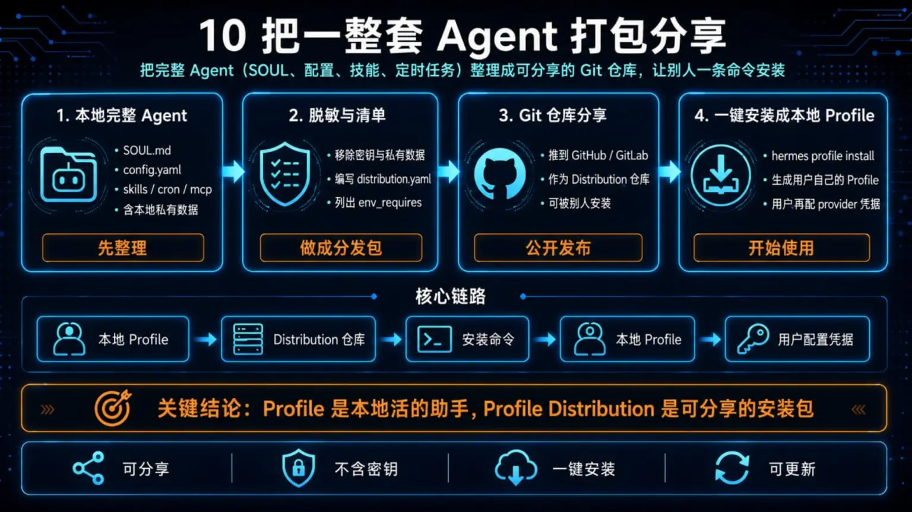
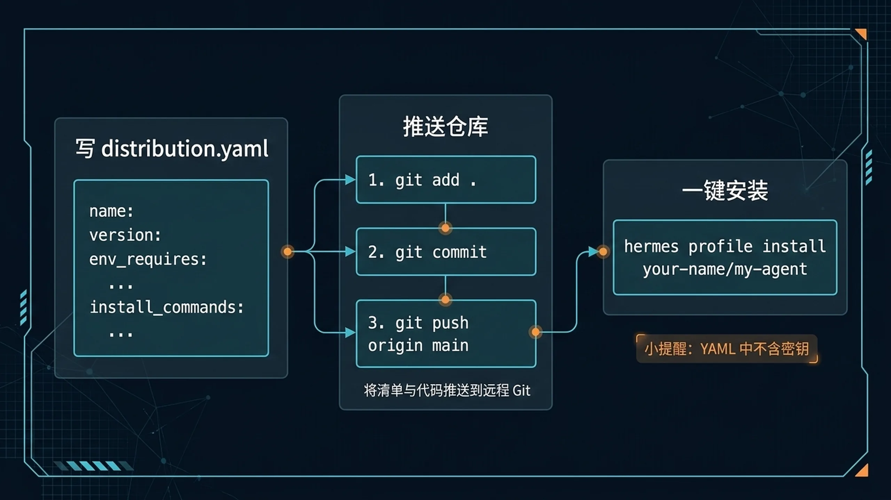

# 📦 10-把一整套 Agent 打包分享

这一页教你如何把一个完整的 Agent（含 SOUL、配置、技能、定时任务）打包成 Git 仓库，分享给别人一键安装。



> **一句话结论**：用 Profile Distribution 把你的 Agent 打包成一个 Git 仓库，别人一条命令就能装上、用起来。

**适合谁**：已经搭好一个完整 Agent，想把它分享给团队或社区的用户；或者想安装别人分享的 Agent 的用户。
**不适合谁**：连一个 Profile 都还没跑通、还不知道 SOUL.md 和 config.yaml 是什么的用户——先回 [02-开始上手](../../01-从这开始/02-开始上手/01-总览.md)。
**最短路径**：理解 Distribution 是什么 → 安装一个别人发的试试 → 照着模板把自己的 Agent 打包 → 推到 GitHub 分享。
**关键限制**：Distribution 不包含密钥和用户私有数据；安装后用户需要自己配 provider 凭据才能跑。
**下一步**：继续阅读下方 [这页做完以后，你应该得到什么](#-这页做完以后你应该得到什么) 章节。

> 📖 官方文档参考：[Profile Distributions](https://hermes-agent.nousresearch.com/docs/user-guide/profile-distributions)

---

## 🎯 这页做完以后，你应该得到什么

走完这一页，你需要拿到三件事：

1. **搞清楚 Profile 和 Profile Distribution 的区别**——知道"一个助手配置"和"一个可分发的助手包"不是同一件事
2. **能安装别人分享的 Agent**——拿到一个 Git 地址后，一条命令装好、跑起来
3. **能发布自己的 Agent**——把自己的完整 Agent 打包成标准 Distribution，推到 GitHub 让别人用

---

## 🧠 Profile 和 Profile Distribution 有什么区别

简单说：

- **Profile** 是你本地的 Agent 配置——它活在你机器上，包含 SOUL.md、config.yaml、技能、记忆等等
- **Profile Distribution** 是一个打包好的、可分享的 Agent 模板——它是一个 Git 仓库，别人装了之后会变成自己本地的 Profile

它们的关系就像：

| | Profile（本地配置） | Profile Distribution（分发包） |
|---|---|---|
| **是什么** | 你机器上一个具体的 Agent 实例 | 一个 Git 仓库，包含 Agent 的"图纸" |
| **在哪里** | 本地 `~/.hermes/profiles/` 下 | GitHub 或任意 Git 仓库 |
| **有没有用户数据** | 有（记忆、会话历史、状态） | 没有（只含模板文件，不含密钥和私有数据） |
| **能不能直接分享** | 不能（包含私有数据） | 能（就是为分享设计的） |
| **安装方式** | 自己手动建或 CLI 创建 | `hermes profile install <source>` 一键装 |

一句话：**Profile 是活的助手，Distribution 是助手的安装包。**

---

## 📋 distribution.yaml 长什么样

每个 Distribution 的根目录必须有一个 `distribution.yaml`，它是这个安装包的清单文件。

一个完整示例：

```yaml
name: my-daily-briefing
version: "1.2.0"
description: "一个每日新闻简报助手，自动搜索、筛选、生成晨间 briefing"
hermes_requires: ">=0.5.0"
author: "your-name"
license: "MIT"
env_requires:
  - BRAVE_API_KEY
distribution_owned:
  - SOUL.md
  - config.yaml
  - skills/
  - cron/
  - mcp.json
```

逐字段解释：

| 字段 | 作用 | 必填 |
|---|---|---|
| `name` | Distribution 的唯一标识名，安装后就是 Profile 名 | ✅ |
| `version` | 语义化版本号（semver），更新时靠它判断版本变化 | ✅ |
| `description` | 一句话描述这个 Agent 是干什么的 | ✅ |
| `hermes_requires` | 要求的 Hermes 最低版本，支持 semver 语法（如 `>=0.5.0`） | ❌ |
| `author` | 作者名或组织名 | ❌ |
| `license` | 开源协议（MIT、Apache-2.0 等） | ❌ |
| `env_requires` | 列出安装后用户需要自己配置的环境变量（如 API Key） | ❌ |
| `distribution_owned` | 列出哪些文件归 Distribution 管理（更新时会被替换） | ❌ |

---

## 🔧 Distribution 的标准目录结构

一个规范的 Distribution 长这样：

```
my-daily-briefing/
├── distribution.yaml       # 清单文件（必须）
├── SOUL.md                 # Agent 人格（必须）
├── config.yaml             # Agent 配置（可选，但常见）
├── mcp.json                # MCP 服务器配置（可选）
├── skills/                 # 自定义技能目录（可选）
│   └── search-and-summarize.md
├── cron/                   # 定时任务目录（可选）
│   └── daily-briefing.yaml
└── README.md               # 给人看的说明（推荐，但非必须）
```

每个文件的作用：

| 文件 | 说明 |
|---|---|
| `distribution.yaml` | 安装包清单，定义名称、版本、依赖等元信息 |
| `SOUL.md` | Agent 的人格描述，装完就是这个 Agent 的"灵魂" |
| `config.yaml` | Agent 的运行配置（模型、工具、上下文等） |
| `mcp.json` | 需要预装哪些 MCP 服务器 |
| `skills/` | Agent 携带的自定义技能文件 |
| `cron/` | Agent 携带的定时任务定义 |
| `README.md` | 给人看的说明文档，告诉用户这个 Agent 干什么、怎么配 |

不是所有文件都要有。**`distribution.yaml` 和 `SOUL.md` 是必须的**，其余按需加。

---

## ⬇️ 安装别人分享的 Agent

安装命令只有一个：

```bash
hermes profile install <source>
```

`<source>` 支持四种格式：

### 1. GitHub 简写

```bash
hermes profile install someone/my-awesome-agent
```

等同于从 `https://github.com/someone/my-awesome-agent` 拉取。

### 2. HTTPS 完整地址

```bash
hermes profile install https://github.com/someone/my-awesome-agent.git
```

适用于 GitHub 以外的 Git 托管平台（Gitee、GitLab 等）。

### 3. SSH 地址

```bash
hermes profile install git@github.com:someone/my-awesome-agent.git
```

适用于你已配好 SSH Key 的场景。

### 4. 本地路径

```bash
hermes profile install /path/to/local/distribution
```

适用于你自己本地还没推远端的 Distribution，或者内网场景。

### 起别名

装完之后每次要打全名很麻烦，可以用 `--alias` 起个短名：

```bash
hermes profile install someone/my-awesome-agent --alias briefing
```

之后用 `hermes chat --profile briefing` 就能快速启动。

### 自定义名称 + 别名

如果你想同时改 Profile 名和别名：

```bash
hermes profile install someone/my-awesome-agent --name my-agent --alias ma
```

---

## ⬆️ 发布自己的 Agent

把你的 Agent 打包成 Distribution 只需 4 步：

### 第 1 步：创建 distribution.yaml

在项目根目录新建 `distribution.yaml`，填写名称、版本、描述等信息。

```yaml
name: my-agent
version: "1.0.0"
description: "一句话说清楚你的 Agent 干什么"
author: "your-name"
license: "MIT"
hermes_requires: ">=0.5.0"
env_requires:
  - OPENAI_API_KEY
distribution_owned:
  - SOUL.md
  - config.yaml
  - skills/
```

`env_requires` 里写上你的 Agent 运行需要但 Distribution 不自带的环境变量（比如 API Key），安装时用户会被提醒自己配。

### 第 2 步：写好 SOUL.md

这是你的 Agent 的人格文件。

直接把你已经跑顺的 SOUL.md 复制过来就行。如果之前没写过，参考 [让 Hermes 更像你](../../01-从这开始/03-玩出花样/02-让 Hermes 更像你.md)。

### 第 3 步：添加配置和附件

把你 Agent 的其他组成部分加进来：

- `config.yaml` — 运行配置（模型选择、工具开关等）
- `skills/` — 自定义技能文件
- `cron/` — 定时任务定义
- `mcp.json` — MCP 服务器配置

需要注意：

- **不要把密钥放进去**。API Key、数据库密码这些属于用户私有，放在 `env_requires` 里提醒用户自己配
- `distribution_owned` 列出你希望更新时自动替换的文件

### 第 4 步：推到 GitHub



```bash
git init
git add .
git commit -m "init: first release of my-agent"
git remote add origin https://github.com/your-name/my-agent.git
git push -u origin main
```

推完之后，别人就可以用 `hermes profile install your-name/my-agent` 一键安装了。

---

## 🔄 更新机制

当你更新了 Distribution 并推送到远端后，安装过的人可以拉取更新：

```bash
hermes profile update my-agent
```

这条命令会从上游仓库拉取最新版本。

### 更新时什么会被替换

只有 `distribution_owned` 里列出的文件会被替换，比如 SOUL.md、skills/、cron/ 等。

### 更新时什么不会被碰

以下用户文件永远不会被更新覆盖：

- 记忆文件（memories/）
- 会话历史（sessions/）
- 状态数据库（state.db）
- 环境变量（.env）
- 日志文件（logs/）

### config.yaml 的特殊处理

`config.yaml` 默认在更新时**不会被覆盖**——因为用户可能已经改过自己的配置。

如果你确实想用 Distribution 的新版本 config.yaml 替换本地的，加 `--force-config`：

```bash
hermes profile update my-agent --force-config
```

⚠️ 这会覆盖用户对 config.yaml 的所有本地修改，用之前确认对方接受。

---

## 🛡️ 作者文件 vs 用户文件

一张表看清楚：

| 文件 | 归属 | 更新时行为 | 说明 |
|---|---|---|---|
| `distribution.yaml` | 📦 作者 | 替换 | 安装包清单 |
| `SOUL.md` | 📦 作者 | 替换 | Agent 人格 |
| `config.yaml` | 📦 作者 | **默认保留用户版**，`--force-config` 时替换 | 运行配置 |
| `skills/` | 📦 作者 | 替换 | 自定义技能 |
| `cron/` | 📦 作者 | 替换 | 定时任务 |
| `mcp.json` | 📦 作者 | 替换 | MCP 服务器配置 |
| `memories/` | 👤 用户 | 不碰 | Agent 的记忆 |
| `sessions/` | 👤 用户 | 不碰 | 会话历史 |
| `state.db` | 👤 用户 | 不碰 | 状态数据库 |
| `.env` | 👤 用户 | 不碰 | 环境变量和密钥 |
| `logs/` | 👤 用户 | 不碰 | 日志文件 |

**核心原则**：作者控制 Agent 的"图纸"，用户控制自己的"数据"。

密钥永远不会被包含在 Distribution 中——它是 `.env` 的一部分，属于用户文件。

---

## 🔗 和中文站「现成方案 / packs」的关系

你可能会想：中文站本身就有"现成方案"或 packs 之类的推荐，这和 Distribution 有什么区别？

它们解决的是不同层面的问题：

| | Distribution（这一页讲的） | 中文站现成方案 / packs |
|---|---|---|
| **形式** | Git 仓库，`hermes profile install` 一键装 | 中文站上的推荐文档或配置示例 |
| **用途** | 机器可读的安装包 | 人可读的方案指南 |
| **适合谁** | 想直接装、直接用的人 | 想先了解方案再决定怎么搭的人 |
| **能不能自动更新** | 能，`hermes profile update` | 不能，需要手动同步 |

它们不冲突、不竞争。一个好的工作流是：

1. 先在中文站看方案介绍，了解思路
2. 看中了某个方案，找到对应的 Distribution 仓库
3. 一条命令装上，开始用

---

## ✅ 这一页什么时候算通过

当下面这些你都能确认，这一页就算通过：

- 我知道 Profile 和 Profile Distribution 的区别：一个是本地活的助手，一个是可分享的安装包
- 我知道怎么用 `hermes profile install` 安装别人分享的 Agent（GitHub 简写、HTTPS、SSH、本地路径都行）
- 我知道怎么把自己的 Agent 打包成 Distribution：写 distribution.yaml → 放 SOUL.md → 加配置和附件 → 推到 GitHub
- 我知道更新时哪些文件会被替换、哪些会被保留
- 我知道密钥和用户数据永远不会被包含在 Distribution 里

---

## ➡️ 下一步

完成这一页后，你可以：

- 回到 [04-自己造东西 总览](./01-总览.md)，看看还有哪些方向没看
- 回到 [01-从这开始 总览](../总览.md)，确认整体进度

如果你想先回到上一阶段入口重新确认位置：
- [04-自己造东西](./01-总览.md)
