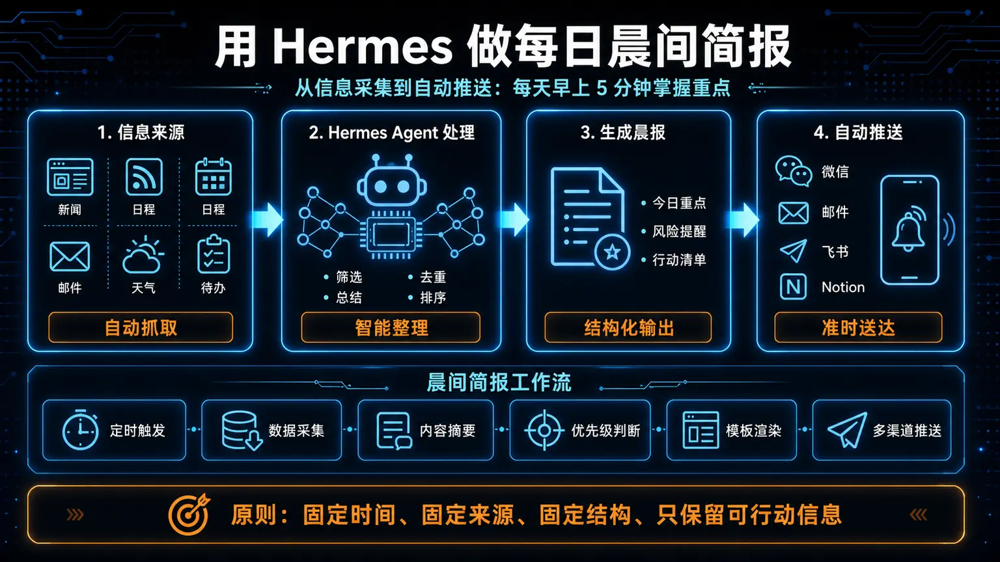
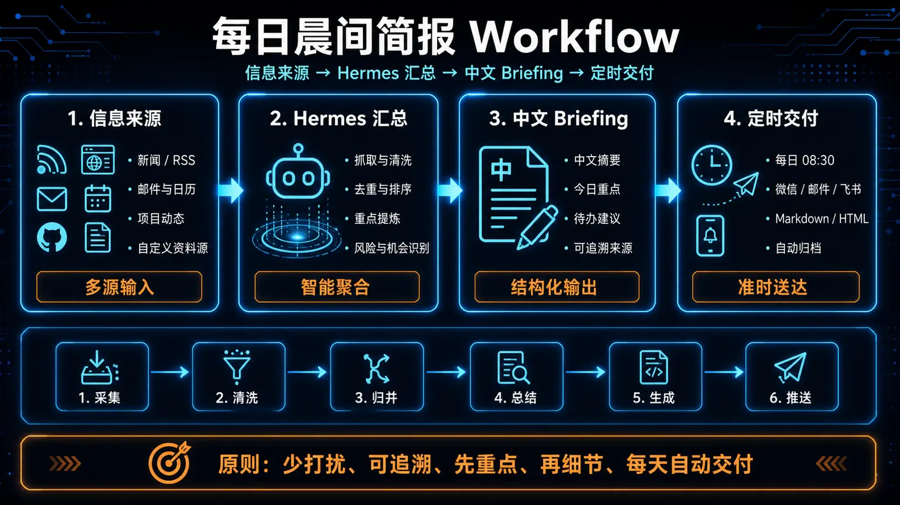

# ☀️ 01-用 Hermes 做每日晨间简报

> 一句话先说清楚：这一页教你把"每天早上刷新闻、看热点、整理要点"这件事，交给 Hermes 的 Cron 自动执行，结果直接送到你的 Telegram 或本地文件。



---

## 👀 适合谁

- 每天早上都要花 15-30 分钟手动刷新闻、整理行业动态的人
- 想用 AI 自动搜集、摘要、推送每日简报的人
- 已经跑通 Hermes 基本安装，想尝试第一个 Cron 自动化任务的人

**前提条件**：你已经完成 Hermes 安装和模型配置，能用 CLI 正常对话。

---

## 🎯 为什么值得做

每日晨间简报是 Cron 自动化最经典的入门场景：

- **任务足够重复**：每天都做，格式固定
- **好坏容易判断**：拿到简报一眼能看出质量
- **天然逼你把 prompt 写清楚**：因为 Cron 跑在全新会话里，没有历史上下文
- **效果可感知**：手动刷 vs 自动推送，差别立竿见影

如果你连这个任务都跑不通，说明更需要先回到手动流程把任务写清楚。

---

## ✍️ 操作步骤：核心思路三步走




### 第 1 步：先手动跑通一次

先在 CLI 里亲自跑一遍，确认输出质量稳定。

```bash
hermes
```

输入测试 prompt：

```text
搜索过去 24 小时内 AI agents 和开源 LLM 的最新动态，至少查看 5 个来源，
选出最值得关注的 3 条。每条输出标题、2 句摘要和原始链接。
整体控制在 300 到 500 字，用简洁专业的中文写成晨间 briefing。
```

如果手动都还不稳，不要急着上 Cron。

### 第 2 步：把 prompt 改成自包含

Cron job 在**全新会话**里运行，不继承任何历史对话。

| ❌ 坏写法 | ✅ 好写法 |
|---|---|
| `按老样子做今天的日报` | 完整写出：搜什么、几个来源、选几条、每条什么格式、总字数 |
| `照旧来一份晨报` | 明确指定：主题范围、摘要长度、输出语言、交付位置 |

### 第 3 步：创建 Cron Job 并验证

**方式 A：在聊天中用自然语言创建**

```text
每天早上 8 点，搜索 AI agents 和开源 LLM 的最新动态。
至少查看 5 个来源，选出最值得关注的 3 条。
每条输出标题、2 句摘要和原始链接。
整体控制在 300-500 字，用简洁专业的中文写成晨间 briefing。
交付到 Telegram。
```

**方式 B：用 CLI 命令（控制更精细）**

```bash
/cron add "0 8 * * *" "搜索过去 24 小时内 AI agents 和开源 LLM 的最新动态。
至少查看 5 个来源，选出最值得关注的 3 条。
每条输出标题、2 句摘要和原始链接。
用简洁专业的中文写成晨间 briefing。"
```

创建后先手动试跑一次：

```bash
/cron run <job_id>
```

确认输出质量后再长期启用。

---

## 📦 交付位置怎么选

| 你的场景 | 交付方式 | 配置 |
|---|---|---|
| 想在手机上第一时间看到 | Telegram | `deliver: telegram`（需先配置 Gateway） |
| 想存档、回查、做对比 | 本地文件 | `deliver: local`，存到 `~/.hermes/cron/output/` |
| 还没配 Telegram，先跑通再说 | 本地文件 | 默认就是 local |

如果还没配 Telegram，先用 `local` 跑通流程，后面再切 Telegram。

---

## 💡 使用心得

### 心得 1：第一版别贪多

第一次只搜 3 条，别一上来就要 10 条。
先确认 3 条的质量稳定了，再扩到 5 条、10 条。

### 心得 2：固定主题比泛搜更有用

"搜 AI 新闻"太泛了。
"搜 AI Agent 新框架发布、开源 LLM 更新、多模态进展"就具体多了。

### 心得 3：用 `[SILENT]` 技巧避免噪音

如果你担心周末或深夜不想被打扰，可以在 prompt 里加一句：

```text
如果今天没有任何重大新闻，输出 [SILENT]。
```

当 Hermes 的最终回复包含 `[SILENT]` 时，交付会被自动抑制——不会发到 Telegram。

---

## ⚠️ 踩坑提醒

### 1. Gateway 没启动，Cron 就不会执行

```bash
hermes gateway              # 前台运行（调试用）
hermes gateway install      # 安装为系统服务（推荐）
```

如果你创建了 Cron job 但什么都没发生，第一件事就是检查 Gateway 是否在运行。

### 2. Prompt 里依赖了隐含上下文

Cron 运行的是全新会话。任何"照旧"、"按上次"、"你知道的"都会失败。
把每次执行当成一个新同事第一天上班——他什么都不知道。

### 3. 忘了设置默认模型

Cron job 需要有可用的默认模型。在创建 job 之前，确认你已经跑通过：

```bash
hermes model    # 查看当前模型
```

### 4. 时区没对齐

Docker 容器默认是 UTC。如果你在东八区，早上 8 点其实是 UTC 0 点。
解决方式：要么在 prompt 里说清楚时区，要么在容器里设 `TZ=Asia/Shanghai`。

---

## ✅ 推荐做法

| 做法 | 原因 |
|---|---|
| 先手动跑通，再上 Cron | 自动化只会把不稳定的问题按时放大 |
| Prompt 写完整搜索范围和输出格式 | 全新会话没有隐含上下文 |
| 先用 `local` 交付验证，再切 Telegram | 降低调试成本 |
| 创建后先 `run` 一次 | 别等明天才发现 prompt 写错了 |
| 周末用 `[SILENT]` 抑制 | 避免无意义的推送 |

---

## ✅ 过关标准

当你满足以下状态，这篇就算跑通了：

- Cron job 能按时间表自动执行
- 拿到的简报有明确的标题、摘要、链接
- 结果送到了你真正会看的位置（Telegram / 本地文件）
- 你知道怎么 `list` / `pause` / `resume` / `remove` 管理 job

---

## ⬅️ 上一步

- [**05-实战应用**](./01-总览.md)

## ➡️ 下一步

- [**02-Telegram 消息入口接入**](./02-Telegram%20消息入口接入.md)

## 📖 出处

本文整理翻译自以下来源：

- Hermes 官方文档 — [Tutorial: Daily Briefing Bot](https://hermes-agent.nousresearch.com/docs/guides/daily-briefing-bot)
- Hermes 官方文档 — [Automate Anything with Cron](https://hermes-agent.nousresearch.com/docs/guides/automate-with-cron)

