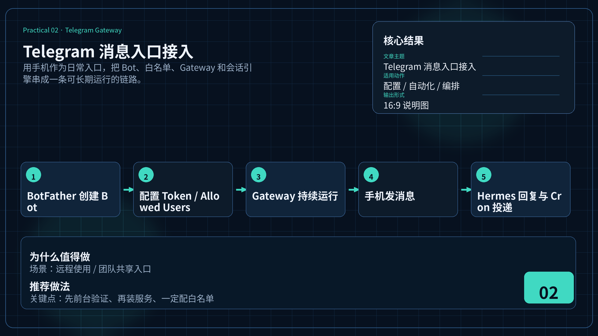

# 💬 02-Telegram 消息入口接入

> 一句话先说清楚：这一页教你把 Hermes 接入 Telegram，让你在手机上直接跟 Agent 对话，不用每次 SSH 到服务器。



---

## 👀 适合谁

- 已经在 CLI 跑通 Hermes，想在手机上随时用的人
- 想把 Hermes 作为团队共享助手，多人通过同一个 Bot 交互的人
- 不想每次都 SSH 到服务器才能跟 Agent 说话的人

**前提条件**：你有一台持续在线的机器（VPS 或本地服务器），Hermes 已经安装并能正常对话。

---

## 🎯 为什么值得做

Telegram 是 Hermes 最成熟的远程入口。接上之后：

- **随时随地对话**：通勤、午休、出差，掏出手机就能用
- **多会话管理**：用 `/new` 开新会话，`/status` 看当前状态
- **Cron 交付终点**：晨间简报、监控告警直接推到 Telegram
- **权限控制**：通过白名单限制谁能用你的 Bot

一句话：CLI 是开发调试入口，Telegram 是日常使用入口。

---

## ✍️ 操作步骤：四步接通

### 第 1 步：在 BotFather 创建 Bot

1. 打开 Telegram，搜索 `@BotFather`
2. 发送 `/newbot`
3. 按提示填写：
   - 显示名称：`My Hermes Bot`
   - 用户名：`my_hermes_bot`（必须以 `_bot` 结尾）
4. **复制 Bot Token**（格式：`7123456789:AAxxxxxxx...`）

> ⚠️ Token 是敏感信息，不要贴到聊天记录、代码仓库或治理文件里。

### 第 2 步：获取你的 User ID

Telegram 的 User ID 是一串纯数字，和 `@username` 不一样。

获取方式：
- 在 Telegram 里给 [@userinfobot](https://t.me/userinfobot) 发任意消息
- 它会返回你的数字 User ID

这个 ID 后面用来配置白名单。

### 第 3 步：配置 Gateway

**方式 A：交互式配置（推荐）**

```bash
hermes gateway setup
```

按箭头键选择 Telegram → 粘贴 Bot Token → 输入 User ID。

**方式 B：手动配置**

编辑 `~/.hermes/.env`：

```bash
# BotFather 给你的 Token
TELEGRAM_BOT_TOKEN=7123456789:AAxxxxxxx...

# 你的数字 User ID（多人用逗号分隔）
TELEGRAM_ALLOWED_USERS=123456789
```

### 第 4 步：启动并验证

**前台测试**（先确认能跑通）：

```bash
hermes gateway
```

预期输出：

```
[Gateway] Starting Hermes Gateway...
[Gateway] Telegram adapter connected
[Gateway] Cron scheduler started (tick every 60s)
```

在 Telegram 里给 Bot 发一条消息，看是否正常回复。

**安装为服务**（确认 OK 后）：

```bash
hermes gateway install                # 用户级服务
sudo hermes gateway install --system  # 系统级服务（开机自启）
```

---

## 📋 常用 BotFather 命令

创建 Bot 之后，可以在 BotFather 里进一步配置：

| 命令 | 作用 |
|---|---|
| `/setdescription` | 设置 Bot 描述（用户打开对话时看到的） |
| `/setcommands` | 设置命令菜单 |
| `/token` | 查看当前 Token |
| `/revoke` | 撤销并重新生成 Token（泄露时用） |

推荐设置命令菜单：

```
new - 开始新对话
model - 查看/切换模型
status - 查看会话状态
help - 显示帮助
stop - 停止当前任务
```

---

## 🔐 安全设置：多人使用

如果你想给团队成员开放使用，有两个关键点：

### 1. 白名单控制

```bash
TELEGRAM_ALLOWED_USERS=123456789,987654321,555555555
```

只有列表里的 User ID 能跟 Bot 交互。其他人发消息会被忽略。

### 2. 每人独立会话

Hermes 会为每个 Telegram User ID 自动维护独立会话。
不同人跟同一个 Bot 聊天，互相看不到对方的对话内容。

---

## 💡 使用心得

### 心得 1：先前台跑通，再装服务

别一上来就 `gateway install`。先前台运行确认 Telegram 能通，再装服务。
否则出问题了不好排查。

### 心得 2：用 `/new` 管理会话

Telegram 里聊着聊着上下文会越来越长。定期用 `/new` 开新会话，保持响应速度。

### 心得 3：长任务用后台模式

如果你让 Hermes 做一个需要几分钟的任务（比如搜索 + 生成报告），它会持续工作。
你可以先去做别的事，完成后结果直接推到 Telegram。

---

## ⚠️ 踩坑提醒

### 1. Token 泄露

不要在聊天记录、GitHub Issue、日志里暴露 Token。
如果不小心泄露了，立即在 BotFather 里 `/revoke` 重新生成。

### 2. Gateway 没装服务，SSH 断开就挂

前台运行只是调试用。生产环境一定要：

```bash
hermes gateway install
```

否则 SSH 断开，Gateway 进程就没了。

### 3. 防火墙挡了出站连接

Telegram Bot API 需要访问 `api.telegram.org`。
如果你的 VPS 有防火墙限制出站连接，确保这个域名能通。

### 4. 多人共用时没配白名单

不配 `TELEGRAM_ALLOWED_USERS`，任何人发现你的 Bot 都能用。
一定配上白名单，哪怕只有你一个人用。

### 5. 在群里 @ Bot 没反应 / BotFather 隐私模式

❓ 问题：把 Bot 拉进 Telegram 群，@ 它完全没有反应。

💡 速答：BotFather 默认开启"隐私模式"（Privacy Mode），Bot 在群里**只能收到**以下消息：
- 直接 @ 它的消息
- 回复它的消息
- 命令（以 `/` 开头）

要让 Bot 能读到群里所有消息（普通群聊模式），有两种方式：

**方式 1（推荐）**：在 BotFather 里关闭隐私模式
```
1. Telegram 里找 @BotFather
2. /setprivacy
3. 选你的 Bot
4. 选 Disable
```
改完之后要把 Bot **踢出群再重新拉进来**才会生效（Telegram 的限制）。

**方式 2**：把 Bot 设为群管理员
- 群设置 → 管理员 → 添加 Bot → 设为 admin
- 管理员身份会绕过隐私模式限制

来源：[官方 Telegram 文档 — BotFather /setprivacy](https://core.telegram.org/bots/faq#what-messages-will-my-bot-get)、[官方 Hermes Telegram 文档](https://hermes-agent.nousresearch.com/docs/user-guide/messaging/telegram)。

### 6. 不知道走 Webhook 还是 Long-polling

❓ 问题：Hermes Telegram 接入有两种模式——Long-polling 和 Webhook，我该选哪个？

💡 速答：Hermes 默认走 **Long-polling（长轮询）**，绝大多数用户不需要改。Webhook 适合有公网域名 + 反向代理 + 高并发的生产场景。

| 模式 | 工作方式 | 适合 | 不适合 |
|------|---------|------|--------|
| **Long-polling（默认）** | Hermes 主动轮询 Telegram API 拉消息 | 99% 个人和小团队场景；VPS 部署；没有公网域名 | 极高并发、消息频率非常高的群 |
| **Webhook** | Telegram 主动 POST 消息到你的 HTTPS 端点 | 已有公网域名 + 反向代理 + 高并发 Bot | 本地开发；没有 HTTPS 证书；NAT 后的家用网络 |

**切换到 Webhook**（仅在你明确知道自己需要时）：

```bash
# 通常通过 hermes gateway setup 或手动配
# Hermes 配置里启用 webhook 模式
TELEGRAM_WEBHOOK_URL=https://your-domain.com/telegram/webhook
TELEGRAM_WEBHOOK_MODE=true
```

⚠️ 切换前确认：
1. 你有公网 HTTPS 证书（Let's Encrypt 可）
2. 反向代理（nginx / caddy）把 `/telegram/webhook` 转发到 Hermes Gateway 端口
3. 服务器防火墙开放 443 入站

来源：[官方 Hermes Telegram 文档 — Polling vs Webhook](https://hermes-agent.nousresearch.com/docs/user-guide/messaging/telegram)。

---

## ✅ 推荐做法

| 做法 | 原因 |
|---|---|
| 先前台测试，再装服务 | 降低排查难度 |
| 一定配白名单 | 防止陌生人消耗你的 Token |
| 用 fine-grained Token 管理 Bot | 泄露时可以精确撤销 |
| 定期 `/new` 清理会话 | 保持响应速度 |
| Cron 结果用 `deliver: telegram` | 跟日常使用同一个入口 |

---

## ✅ 过关标准

- Bot 在 Telegram 里能正常收发消息
- Gateway 安装为系统服务，重启后自动恢复
- 白名单已配置，陌生人无法使用
- 你知道怎么 `/new`、`/model`、`/status`

---

## ➡️ 下一步

完成后进入：
[03-GitHub 备份 Cron Job](./03-GitHub%20备份%20Cron%20Job.md)

如果你想先回到上一阶段入口重新确认位置：
[05-实战应用总览](./01-总览.md)

---

## 📖 出处

本文整理翻译自以下来源：

- Hermes 官方文档 — [Tutorial: Team Telegram Assistant](https://hermes-agent.nousresearch.com/docs/guides/team-telegram-assistant)
- Hermes 官方文档 — [Gateway Messaging Platforms](https://hermes-agent.nousresearch.com/docs/user-guide/messaging/)
