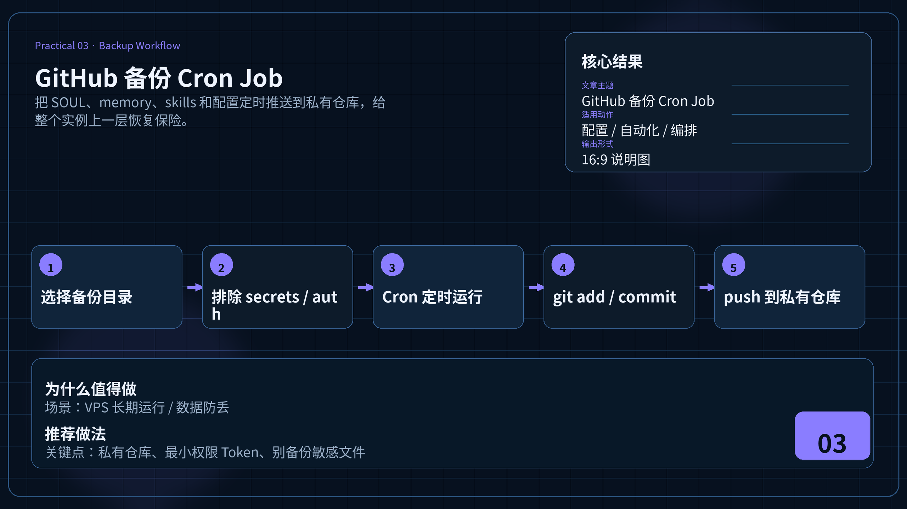

# 🔄 03-GitHub 备份 Cron Job

> 一句话先说清楚：这一页教你用 Hermes Cron 每天自动把 SOUL.md、memory.md、skills 等核心文件推到 GitHub，给整个 Hermes 实例上一份保险。



---

## 👀 适合谁

- 已经在 VPS 上持续运行 Hermes，担心数据丢失的人
- 想给 SOUL.md、memory.md、skills、USER.md 上一份自动保险的人
- 想尝试"用自然语言创建 Cron job"的人

**前提条件**：你有一台持续在线的机器，Hermes 已安装并能用 terminal 工具。

---

## 🎯 为什么值得做

Hermes 的核心资产都是本地文件：

| 文件 | 价值 |
|---|---|
| `SOUL.md` | 你花时间调好的人格配置 |
| `memory.md` | Agent 积累的长期记忆 |
| `USER.md` | 用户偏好档案 |
| `skills/` | 自定义和自动生成的技能 |
| `config.yaml` | 模型、工具、Gateway 配置 |

> 如果容器损坏、磁盘故障、或者你在调试时不小心删了什么东西——这些全没了。

每天自动推到 GitHub，就等于给整个 Hermes 实例上了一层保险。
新机器 `git clone` 下来就能恢复到昨天的状态。

---

## ✍️ 操作步骤：五步搞定

### 第 1 步：创建 GitHub 仓库和 Token

1. 在 GitHub 创建一个**私有仓库**（比如 `hermes-backup`）
2. 生成 **fine-grained personal access token**：
   - Settings → Developer settings → Personal access tokens → Fine-grained tokens
   - 权限：只选这个仓库，`Contents: Read and Write`
   - 过期时间按需设置

> ⚠️ 不要用 Classic Token（权限太大），不要把 Token 贴到聊天记录里。

### 第 2 步：在 Hermes 中安全存储 Token

SSH 到你的服务器，执行：

```bash
hermes config set GITHUB_TOKEN ghp_xxxxxxxxxxxx
```

这会把 Token 写到环境配置文件里，不会进入聊天记录。

### 第 3 步：初始化 Git 仓库

```bash
cd ~/.hermes
git init
git remote add origin https://github.com/<user>/hermes-backup.git
```

创建 `.gitignore` 排除敏感文件：

```text
# 绝对不备份的文件
auth.json
.env
*.key
secrets/
.hermes-proof/
__pycache__/
*.log
```

### 第 4 步：用自然语言创建 Cron Job

在 Hermes 聊天里直接说：

```text
每天凌晨 2 点，进入 ~/.hermes 目录，
把 SOUL.md、memory.md、USER.md、skills/ 和 config.yaml 的变更
commit 并 push 到 GitHub 的 hermes-backup 仓库。
如果没有任何变更，不要创建空 commit。
完成后告诉我结果。
```

Hermes 会自动：
1. 搜索匹配的内置 Skills（GitHub 仓库管理、GitHub Auth）
2. 创建对应的 Cron job
3. 用 `cron job list` 验证注册成功

### 第 5 步：验证首次执行

```bash
/cron list                    # 确认 job 已创建
/cron run <job_id>            # 手动触发一次
```

然后去 GitHub 仓库看是否有 commit。

---

## 🧠 背后的机制

当你说出那句自然语言后，Hermes 内部做了这些事：

1. **搜索内置 Skills**：从 91 个内置技能中找到 `github-repo-management` 和 `github-auth`
2. **检查环境**：确认 Git 已安装、Token 已配置
3. **创建 Cron job**：调用 `cronjob create` 工具
4. **验证**：运行 `cron job list` 确认注册

整个过程不需要你写 crontab 语法、不需要手写 YAML。

---

## 💡 使用心得

### 心得 1：用私有仓库

备份里可能有个人偏好、记忆内容。一定用**私有仓库**，不要公开。

### 心得 2：时区自适应

如果你在 Docker 容器里跑 Hermes，容器默认是 UTC 时区。
Hermes 足够聪明——它会注意到容器时区，自动换算你的本地时间。
但如果你发现凌晨 2 点没跑，检查一下是不是时区没对齐。

### 心得 3：多实例各自备份

如果你有多个 Hermes 实例（比如一个做内容、一个做开发），让它们各自推到不同分支或不同仓库。
不要混在一起。

---

## ⚠️ 踩坑提醒

### 1. Token 进了聊天记录

不要在 Telegram 或 CLI 对话里直接粘贴 Token。
如果发生了，立即去 GitHub 撤销 Token，重新生成。

### 2. .gitignore 没配好

如果你不小心把 `auth.json` 或 `.env` 推到了 GitHub：
1. 立即撤销所有相关 Token 和 API Key
2. 从 Git 历史里清除（`git filter-branch` 或 BFG）
3. 重新生成所有凭据

### 3. 空 commit 堆积

如果每天不管有没有变更都 commit，Git 历史会被空 commit 填满。
在 prompt 里明确说"没有变更就不要创建空 commit"。

### 4. 磁盘满了没发现

Git 历史会增长。定期检查磁盘空间：

```bash
du -sh ~/.hermes/.git
```

---

## ✅ 推荐做法

| 做法 | 原因 |
|---|---|
| 用 fine-grained Token，只给一个仓库的读写权限 | 最小权限原则 |
| 用私有仓库 | 备份内容可能含个人信息 |
| `.gitignore` 排除 `auth.json` 和 `.env` | 防止凭据泄露 |
| Prompt 里说"无变更不 commit" | 避免 Git 历史膨胀 |
| 创建后先手动 `run` 一次 | 别等明天才发现配置错了 |

---

## ✅ 过关标准

- Cron job 能按计划自动执行 git push
- GitHub 仓库里有真实的 commit 记录
- `.env`、`auth.json` 等敏感文件没有被推上去
- 你知道怎么 `pause` / `resume` 这个 job

---

## ➡️ 下一步

- [01-用 Hermes 做每日晨间简报](./01-用%20Hermes%20做每日晨间简报.md)
- [05-Token 成本优化避坑指南](./05-Token%20成本优化避坑指南.md)

---

## 📖 出处

本文整理翻译自以下来源：

- Hermes 官方文档 — [Automate Anything with Cron](https://hermes-agent.nousresearch.com/docs/guides/automate-with-cron)
- GitHub 官方文档 — [Managing your personal access tokens](https://docs.github.com/en/authentication/keeping-your-account-and-data-secure/managing-your-personal-access-tokens)
