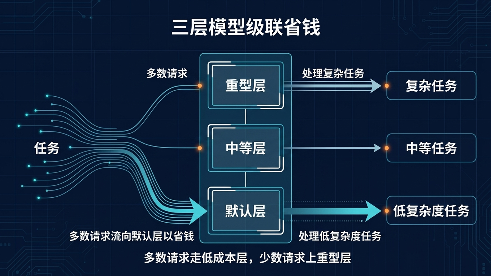

# 💰 04-月费 8 美金跑 Hermes：三层模型级联省钱指南

> 一句话先说清楚：这一页教你用三层模型级联——日常对话用免费/超低价模型，中等任务用中端模型，只有真正复杂的活才上旗舰模型——把月费压到 8 美金左右。



---

## 👀 适合谁

- 每月 LLM 账单超过 30 美金，想大幅压缩的人
- 大部分对话其实不需要 GPT-4 或 Claude Sonnet 的人
- 已经跑通 Hermes，想进一步优化成本的人

**前提条件**：你已经在 Hermes 里配过至少一个模型，了解 `config.yaml` 基本结构。

---

## 🎯 为什么值得做

很多人用 Hermes 的默认配置跑了几个月，发现账单比预期高得多。
原因不是 Hermes 贵，而是**所有任务都在用最贵的模型**。

实际上，一个典型用户的日常任务分布大概是这样：

| 任务类型 | 占比 | 实际需要的模型 |
|---|---|---|
| 闲聊、简单问答、格式整理 | 60-70% | 超低价或免费模型就够 |
| 代码片段、文档搜索、中等分析 | 20-25% | 中端模型 |
| 复杂推理、长文生成、深度调试 | 5-15% | 旗舰模型 |

如果你让 100% 的请求都走旗舰模型，你就在为 70% 的简单任务多付 10-40 倍的钱。

---

## ✍️ 操作步骤：三层模型级联方案

### 第 1 层：日常对话——免费或超低价

**推荐模型**：

| 模型 | 价格 | 适用场景 |
|---|---|---|
| Xiaomi MiMo v2 Pro（Nous Portal 免费层） | $0 | 日常聊天、内容起草、研究辅助 |
| Qwen 2.5-7B-Instruct（OpenRouter） | ~$0.07/百万 input token | 编码辅助、简单分析 |
| DeepSeek V3（OpenRouter） | ~$0.14/百万 input token | 有时比 Qwen 更擅长推理 |

**配置**：

```bash
# 设置默认模型为最低成本
hermes config set model.default openrouter:qwen/qwen-2.5-7b-instruct
```

或者使用 Nous Portal 免费层：

```bash
hermes model
# 选择 nous-portal → mimo-v2-pro
```

> Nous Portal 免费层是按速率限制的（不是按金额），适合个人日常使用。

### 第 2 层：中等任务——中端模型

当任务需要更强的推理或代码能力时，手动切换或通过 Skill 指定：

```bash
hermes config set model.medium openrouter:deepseek/deepseek-chat
```

在 Skill 的 frontmatter 里指定：

```yaml
---
name: code-review-helper
model: medium
---
```

### 第 3 层：重型任务——旗舰模型

只用于真正需要强推理、长上下文、复杂工具调用的场景：

```bash
hermes config set model.heavy openrouter:anthropic/claude-3.5-sonnet
```

在 Skill 里指定：

```yaml
---
name: complex-debugging
model: heavy
---
```

### 三层总览

| 层级 | 用途 | 模型示例 | 单价 | 占比 |
|---|---|---|---|---|
| default | 日常对话 | Qwen 2.5-7B / MiMo v2 Pro | $0 - $0.07/M | ~70% |
| medium | 中等任务 | DeepSeek V3 | ~$0.14/M | ~20% |
| heavy | 旗舰出马 | Claude 3.5 Sonnet | ~$3/M | ~10% |

按这个比例，一个月正常使用的总账单大约 **$5-12**，中位数 **$8** 左右。

---

## 🔧 Provider Routing：让 OpenRouter 帮你选最便宜的

如果你用 OpenRouter，还可以开启 Provider Routing 自动选最便宜的供应商：

```yaml
# ~/.hermes/config.yaml
provider_routing:
  sort: "price"           # 优先选最便宜的供应商
  ignore: ["Together"]    # 排除不信任的供应商
  require_parameters: true # 确保参数不被静默丢弃
  data_collection: "deny"  # 禁止供应商用你的数据训练
```

这样即使你指定了 Claude 3.5 Sonnet，OpenRouter 也会在所有提供这个模型的供应商里选最便宜的那个。

---

## 💡 使用心得

### 心得 1：先从 default 开始省钱

大部分人的账单里，70% 以上都是日常对话。
先把 `model.default` 切到 Qwen 2.5-7B 或 MiMo，立刻就能砍掉一半费用。

### 心得 2：A/B 测试

别凭感觉选模型。用同一个 prompt 分别跑 Qwen、DeepSeek、Claude，对比输出质量。
你会发现很多任务 Qwen 和 DeepSeek 已经够好了。

### 心得 3：用 `/model` 临时切换

在 Telegram 或 CLI 里，可以用 `/model` 临时切换到更强的模型处理当前任务，处理完再切回去。
不需要为了一次复杂任务把 default 改成旗舰。

---

## ⚠️ 踩坑提醒

### 1. 廉价模型不支持 tool use

一些超低价模型可能不支持 function calling / tool use。
如果你发现 Hermes 的工具不工作，可能就是模型不支持。
检查方式：换回中端模型试一下。

### 2. Provider Routing 只在 OpenRouter 有效

如果你直连 Anthropic API 或 Google API，`provider_routing` 配置不会有任何效果。
它只在通过 OpenRouter 路由时生效。

### 3. 免费层有速率限制

Nous Portal 的 MiMo v2 Pro 免费层是按请求频率限制的。
高频使用时可能被限速。如果遇到 429 错误，等几分钟再试。

### 4. 不要只看 input token 价格

有些模型 input 便宜但 output 贵。
比较成本时，按你的典型 input/output 比例（通常 3:1 到 5:1）算总成本。

---

## ✅ 推荐做法

| 做法 | 预期节省 |
|---|---|
| default 切到 Qwen 2.5-7B 或 MiMo | 砍掉 50-70% 费用 |
| Skill 里按任务指定 medium / heavy | 避免一刀切 |
| 开启 `provider_routing: sort: price` | 同模型自动选最便宜供应商 |
| 设置 `data_collection: deny` | 保护隐私 |
| 每月检查一次 OpenRouter 用量面板 | 发现异常消耗 |

---

## ✅ 过关标准

- default 模型已切到低成本选项
- 至少有一个 Skill 指定了 `model: medium` 或 `model: heavy`
- 月账单降到 $15 以下
- 你知道怎么用 `/model` 临时切换

---

## ➡️ 下一步

完成后进入：
[05-Token 成本优化避坑指南](./05-Token%20成本优化避坑指南.md)

如果你想先回到上一阶段入口重新确认位置：
[05-实战应用总览](./01-总览.md)

---

## 📖 出处

本文整理翻译自以下来源：

- Hermes 官方文档 — [Provider Routing](https://hermes-agent.nousresearch.com/docs/user-guide/features/provider-routing)
- OpenRouter 官方文档 — [Models and Pricing](https://openrouter.ai/models)
