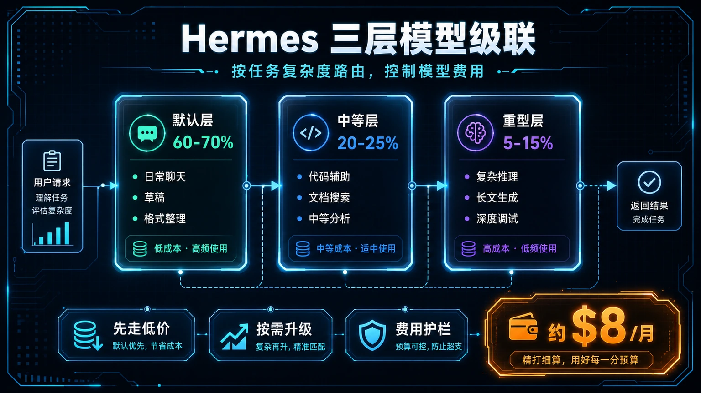
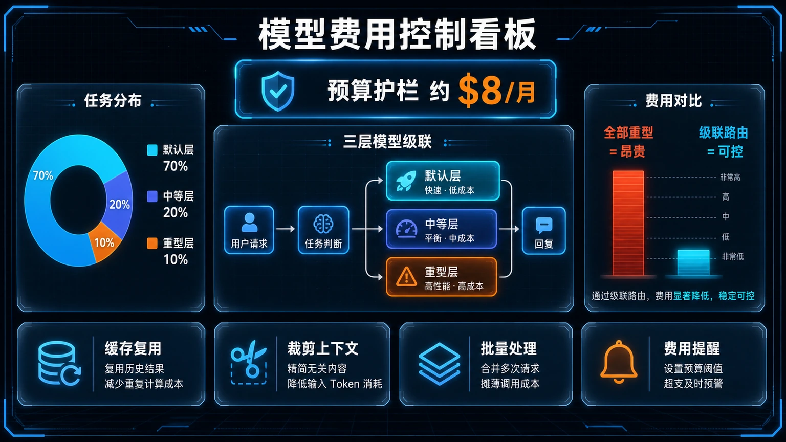

# 💰 04-按任务选择模型：三层控费与实测指南

> 把任务分成日常整理、工具操作、复杂分析三档，再分别验证模型质量与成本。这里的“三层”是使用策略；Hermes 没有本文旧版所写的 `model.medium`、`model.heavy` 自动级联配置。

复核日期：2026-09-30；依据官方稳定标签 **v2026.9.24（v0.21.5）**。本文完成文档和源码核对，未进行付费 API 实测。旧标题中的“月费 8 美金”和“节省 80%”没有可复现工作负载依据，现已撤回；原页面地址保留。

## 👀 适合谁

已完成一次正常互动，想按自己的真实任务降低账单的人。先准备可用的 provider 和模型，再做比较；免费额度、模型目录与单价以厂商当前页面为准。

## 🧭 三档任务如何安排

| 任务档位 | 任务例子 | 验收重点 | 使用方法 |
|---|---|---|---|
| 日常整理 | 改写、格式整理、短摘要 | 事实不丢失、格式正确 | 用通过测试的低成本模型作为默认 |
| 工具操作 | 文件处理、资料查询、代码修改 | 工具调用成功、结果可核验 | 在新会话中选择已配置的合适模型 |
| 复杂分析 | 多来源比较、难题调试、长文审校 | 引用可靠、约束完整 | 用更强模型做小样本比较，再决定是否长期使用 |

不要预设三档任务的占比，也不要认为价格高就一定适合。多轮重试、辅助调用、搜索和运行环境费用都可能改变总成本。



> 图是旧版概念示意：图中 Default / Medium / Heavy 只代表任务档位，不能照抄为配置键；图中的金额不作为实测结果或预算承诺。

## ✍️ 先配置，再选择

在终端运行模型向导，为每个准备比较的 provider 完成认证与模型选择：

```bash
hermes model
```

向导会保存默认模型。聊天中的 `/model` 用来在**已经配置好的** provider / 模型之间选择；需要添加新 provider 时先退出会话，再用终端向导。

```text
/model
```

会话选择和默认配置不是同一件事：是否持久化受 `model.persist_switch_by_default` 等选项影响。需要明确保存全局默认时，用向导或桌面版 Settings → Model；切换后检查实际 provider 和模型。

不要再使用旧文的 `model.medium`、`model.heavy`，也不要依靠 Skill frontmatter 中的 `model: medium/heavy` 自动选档：本轮没有找到对应官方实现。

## 🔧 OpenRouter 的供应商路由

以下配置控制同一模型在 OpenRouter 背后的供应商优先级，不会自动按任务难度切到另一个模型：

```yaml
provider_routing:
  sort: "price"
  require_parameters: true
  data_collection: "deny"
```

它只对 OpenRouter 生效；Nous Portal 和直连厂商接口不会使用该路由对象。参数筛选或数据策略可能减少可用供应商，要验证目标模型仍能正常处理工具调用。

## ❓ auxiliary 副模型与三档任务的关系

<a id="faq-auxiliary-client-what"></a>

辅助模型负责视觉、会话标题、上下文压缩等具体任务，不是“中档/重档主模型”。使用 `hermes model` → **Configure auxiliary models** 查看实际槽位，按 `auxiliary.<task>.provider/model` 单独配置。

稳定标签中已有 `vision`、`title_generation`、`compression` 等槽位；不要沿用旧文“只有三个槽位”或“Web Search 总走副模型”的说法。`auto` 通常跟随主模型，显式覆盖优先；委派子 Agent 另用顶层 `delegation.*`，并非普通辅助调用。

<a id="faq-three-tier-vs-auxiliary"></a>

三档任务划分解决“人如何选主模型”，辅助模型配置解决“后台具体任务用哪个模型”，两者分别验收。给视觉任务选便宜模型之前，应确认它支持视觉；给压缩任务换模型后，应检查约束和关键信息能否保留。

## 📊 做一次可复现的成本比较



> 图用于说明记录维度，图中数字和比例不代表本教程的测量结果。

1. 从自己的任务中选一组固定输入，分别包含三档任务。记录输入文件版本、验收条件和工具配置。
2. 每个候选模型开新会话跑同一组任务。分别记录冷启动和连续会话，避免把缓存命中和模型能力混在一起。
3. 记录 provider、精确模型 ID、输入/输出 token、缓存 token、耗时、重试次数和是否通过验收。用 `/usage` 查看 Hermes 的用量与估算，再核对厂商账单。
4. 单独统计辅助模型、搜索、图像、运行环境和订阅费用；`unknown` 成本表示未知，不等于免费。
5. 在质量达标的前提下，计算每个成功任务的实际成本，再用自己的任务频率外推预算。

| 测试批次 | provider / 模型 ID | 输入 / 输出 / 缓存 token | 总费用与来源 | 通过数 / 总数 | 重试 | 耗时 |
|---|---|---|---|---|---|---|
| 按实际测试填写 | 按实际配置填写 | 按用量记录填写 | 厂商账单或标明“估算” | 按验收记录填写 | 按执行记录填写 | 按执行记录填写 |

按量计费时，可用“非缓存输入 × 输入单价 + 缓存读写 × 对应单价 + 输出 × 输出单价”复算；单位统一到每百万 token。不同厂商的缓存分类、推理 token 和上下文阶梯价不同，以其计费规则为准。订阅费用应另列。

频繁在长会话中换模型会重置模型相关的提示缓存，下一轮可能重新读取整个上下文。比较独立任务时优先开新会话；需要继续同一任务时保留必要上下文，并计入这次切换的成本。

## ✅ 过关标准

- 三档任务均有明确验收条件，所选模型能够正常使用所需工具。
- 记录了成功率、重试和账单来源，能区分估算与实际扣费。
- 预算来自自己的任务频率，没有把示例金额当成保证。

## ⬅️ 上一步

- [03-GitHub 备份 Cron Job](./03-GitHub%20备份%20Cron%20Job.md)

## ➡️ 下一步

- [05-Token 成本优化避坑指南](./05-Token%20成本优化避坑指南.md)
- 回到[实战应用总览](/docs/start/practical)。

## 📖 官方依据

- [稳定标签配置说明](https://github.com/NousResearch/hermes-agent/blob/v2026.9.24/website/docs/user-guide/configuration.md)：主模型与辅助任务配置。
- [稳定标签 Provider 说明](https://github.com/NousResearch/hermes-agent/blob/v2026.9.24/website/docs/integrations/providers.md)：向导和会话内切换。
- [稳定标签 Provider Routing](https://github.com/NousResearch/hermes-agent/blob/v2026.9.24/website/docs/user-guide/features/provider-routing.md)：OpenRouter 路由边界。
- [OpenRouter 模型目录与价格](https://openrouter.ai/models)：使用时核对可用性和单价。
