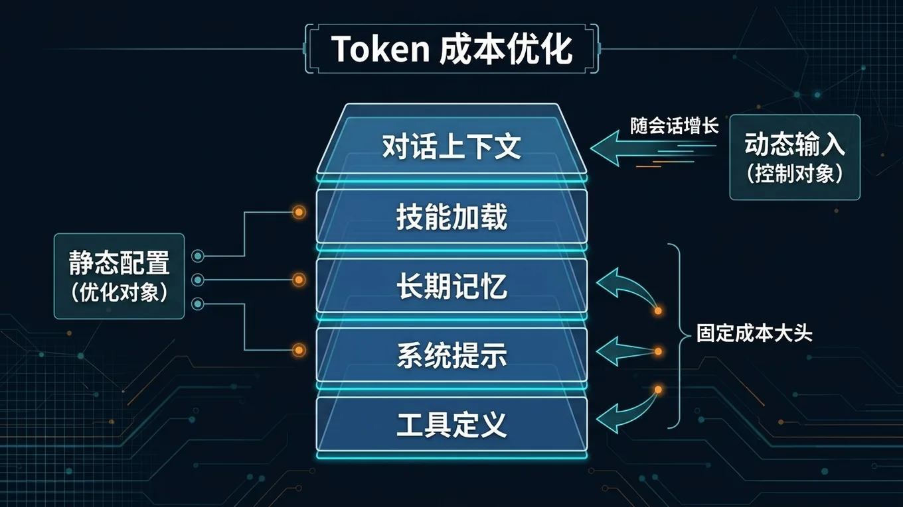

# 🧮 05-Token 成本优化避坑指南

> 一句话先说清楚：这一页帮你找到 Hermes 账单里最隐蔽的 Token 浪费源——工具定义膨胀、冗余 Skill 加载、上下文堆叠——并给出具体可操作的削减方法。



---

## 👀 适合谁

- 已经做了模型级联省钱（参考上一篇），但账单还是偏高的人
- 想深入理解 Hermes 每次 API 调用的 Token 构成的人
- 准备做长期、高频使用，需要提前控制成本的人

**前提条件**：你了解 Hermes 的 config.yaml 基本结构，知道怎么用 CLI 命令。

---

## 🎯 为什么值得做

很多人以为 Token 成本主要是"对话内容"。
实际上，一次 API 调用的 Token 构成大概是这样：

| 组成部分 | Token 占用 | 说明 |
|---|---|---|
| **工具定义**（Tool definitions） | ~8,000-10,000 | 最大头。所有已启用工具的 JSON Schema |
| **系统 Prompt** | ~2,000-3,000 | 行为规则、工具使用说明、格式约束 |
| **SOUL.md + memory.md + USER.md** | ~1,000-5,000 | 人格和持久记忆 |
| **匹配到的 Skill** | 0-2,000 | 只有 Skill 被激活时才占用 |
| **对话上下文** | 随对话增长 | 每轮递增 |

> 一个刚开的新会话，你还没打一个字，就已经消耗了 **12,000-14,000 input token**。

这意味着：如果你启用了大量工具，每一轮对话的固定成本就是 1 万多 token。
按旗舰模型 $3/百万 token 算，每轮对话光固定成本就花掉 $0.04。
一天聊 50 轮，就是 $2/天，$60/月——还没算 output 和上下文增长。

---

## ✍️ 操作步骤：五大优化策略

### 策略 1：削减工具表面（效果最大）

查看当前启用的工具：

```bash
hermes tools list
```

禁用你不用的工具：

```bash
hermes tools disable browser_navigate browser_snapshot
hermes tools disable code_execute_python
```

> ⚠️ 如果某个 Skill 依赖被禁用的工具，它会**静默失败**。按需禁用，不要一刀切。

如果你只用 Telegram 聊天，不需要浏览器和代码执行工具，禁用后每个工具定义大约省 500-800 token。
禁掉 5 个不用的工具 ≈ 省 2,500-4,000 token/轮。

### 策略 2：控制 Skill 加载

Hermes 的 Skill 是按需加载的——只有匹配到当前任务的 Skill 才会被注入上下文。
但如果你安装了大量 Skill，匹配引擎本身也有开销。

建议：
- 只保留你实际在用的 Skill
- 不用的 Skill 直接删掉目录，不要留着

```bash
# 查看已安装的 Skill
ls ~/.hermes/profiles/content/skills/

# 不用的直接删除
rm -rf ~/.hermes/profiles/content/skills/某 个 不 用 的 skill
```

### 策略 3：定期清理对话上下文

对话越长，上下文越大。一个聊了 30 轮的会话，上下文可能膨胀到 20,000+ token。

建议：
- 用 `/new` 定期开新会话
- 完成的任务及时关闭
- 长会话用 `/save` 保存后开新会话继续

### 策略 4：精简 SOUL.md 和 memory.md

这两个文件每次会话都会注入。

**SOUL.md**：控制在 200-500 字以内。只保留长期人格偏好。
**memory.md**：定期清理过期或不再相关的记忆条目。

### 策略 5：用 Tool Gating（v0.10+）

如果你用的是 Hermes v0.10 或更高版本，可以启用 Tool Gating：

```yaml
# ~/.hermes/config.yaml
tool_gating: true
```

Tool Gating 会把重型工具（浏览器、代码执行、文件操作）延迟加载——只有 Agent 判断确实需要时才注入对应的工具定义。
这可以在不牺牲功能的前提下，大幅减少固定 Token 开销。

---

## 📊 优化效果估算

以一个典型用户为例（日均 30 轮对话，使用 Claude 3.5 Sonnet $3/M input）：

| 优化项 | 每轮节省 | 日均节省 | 月节省 |
|---|---|---|---|
| 禁用 5 个不用的工具 | ~3,000 token | ~$0.27 | ~$8 |
| 精简 SOUL.md（1000 → 300 字） | ~700 token | ~$0.06 | ~$2 |
| 定期 `/new`（平均上下文从 15K 降到 8K） | ~7,000 token | ~$0.63 | ~$19 |
| 切 default 到 Qwen 2.5-7B（70% 请求） | 每轮从 $0.04 降到 $0.001 | ~$0.82 | ~$25 |
| **合计** | | | **~$54/月** |

从月费 $60+ 降到 $6-10，完全可行。

---

## 💡 使用心得

### 心得 1：先查再砍

不要盲目禁用工具。先 `hermes tools list` 看看有什么，再对照你实际在用的功能来砍。

### 心得 2：关注 OpenRouter 用量面板

OpenRouter 后台有详细的用量统计，按天、按模型可以看到消耗。
定期看一眼，发现异常消耗及时排查。

### 心得 3：Cron job 也有固定成本

每个 Cron job 执行时也是一次完整的 API 调用，同样有 12K+ 的固定 Token。
如果你有很多 Cron job 在跑，这也是一笔不小的开销。
优化方式：用 `no_agent=True` 的纯脚本 Cron——不需要 LLM 的监控任务走零成本路径。

---

## ⚠️ 踩坑提醒

### 1. 禁了工具导致 Skill 失败

禁用工具前，检查哪些 Skill 依赖它。
如果你不确定，先不禁用，改用 Tool Gating 自动管理。

### 2. 上下文压缩不是免费的

Hermes 有自动上下文压缩功能，但压缩本身也要消耗 Token。
不要以为压缩了就省钱——少生成才是真的省。

### 3. 免费层可能有隐藏成本

有些"免费"模型可能在不显眼的地方收费（比如 tool use 额外计费）。
仔细看 Provider 的定价页面，不要只看 input/output token 单价。

### 4. 记忆写入也在消耗 Token

`memory.md` 每次自动更新都要读取现有内容 + 写入新内容。
如果你从不清理旧记忆，它只会越来越大。

---

## ✅ 推荐做法

| 做法 | 优先级 | 预期效果 |
|---|---|---|
| 禁用不用的工具 | 🔴 高 | 每轮省 2,000-4,000 token |
| default 切到低价模型 | 🔴 高 | 70% 请求成本降 40 倍 |
| 定期 `/new` | 🟡 中 | 防止上下文膨胀 |
| 精简 SOUL.md | 🟡 中 | 省 500-1,000 token/轮 |
| 开启 Tool Gating | 🟢 补充 | 自动化管理工具加载 |
| Cron 用 `no_agent=True` | 🟢 补充 | 监控类任务零 Token |

---

## ✅ 过关标准

- 你知道自己每次 API 调用的 Token 构成
- 已禁用至少 3 个不用的工具
- default 模型已切到低价选项
- 月账单下降了至少 50%
- 你知道用 `hermes tools list` 定期检查

---

## ➡️ 下一步

完成后进入：
[06-VPS 自托管 Hermes](./06-VPS%20自托管%20Hermes.md)

如果你想先回到上一阶段入口重新确认位置：
[05-实战应用总览](./01-总览.md)

---

## 📖 出处

本文整理翻译自以下来源：

- Hermes 官方文档 — [Provider Routing](https://hermes-agent.nousresearch.com/docs/user-guide/features/provider-routing)
- Hermes 官方文档 — [Tools Reference](https://hermes-agent.nousresearch.com/docs/reference/tools-reference)
- Hermes 官方文档 — [Skills Catalog](https://hermes-agent.nousresearch.com/docs/reference/skills-catalog)
