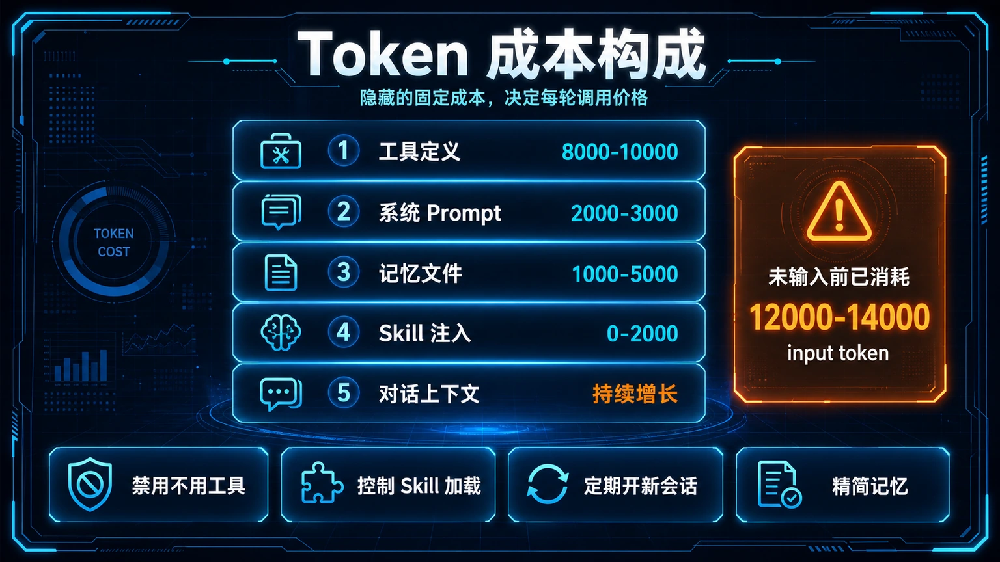

# 🧮 05-Token 成本优化避坑指南

要比较成本，先固定同一模型、任务、输入和工具范围，分别记录输入、输出、缓存与实际费用；本页不提供未经实测的节省比例。模型按量价格参见[DeepSeek 价格与缓存](/docs/china/models/deepseek-metered-api)，套餐的个人/团队及后台限制参见[国内模型产品路线](/docs/china/models)。

> 先测量，再减少不必要的工具、上下文和辅助调用。工具定义、系统提示、技能、记忆与历史都会影响输入，但每轮 token 没有统一固定值。

复核日期：2026-09-30；依据官方稳定标签 **v2026.9.24（v0.21.5）**。本页未进行付费 API 实测，不承诺节省比例或月费。



> 图仅说明输入组成。旧版“每轮固定 12K+”“禁五个工具必省若干 token”等数字未经过本页实测，不再作为教程结论。

## 👀 适合谁

已能正常使用 Hermes，想找出自己的高成本来源的人。先看[按任务选择模型](./04-月费8美金三层模型级联省钱指南.md)，再优化同一模型、同一任务下的输入。

## ✍️ 1. 建立基线

选一个固定任务，记录 provider、模型 ID、工具配置、输入文件和是否新会话。运行后查看 `/usage`，保留输入、输出和缓存统计，与厂商账单对照。桌面状态栏的上下文占用表示窗口使用情况，不能直接替代所有模型调用的累计计费。

分别测量冷会话和连续会话。工具、记忆或模型发生变化，可能改变缓存命中率；“输入更短”不一定意味着这批任务的实际账单更低。

## ✍️ 2. 按平台减少不用的工具

```bash
hermes tools list --platform cli
hermes tools
```

优先在交互界面查看实际可用 toolset，再关闭任务不需要的组合。以下示例仅适用于确实不需要网页检索的 CLI 任务：

```bash
hermes tools disable web --platform cli
# 需要时恢复
hermes tools enable web --platform cli
```

稳定版的 `disable/enable` 接受 **toolset 名称**或 MCP 的 `server:tool` 名称；不要照抄旧文中未经确认的单个内置工具名。Telegram 等入口有各自平台配置，需要单独检查。

关闭前检查 Skill 和任务是否依赖这个工具，关闭后跑同一任务验证。缺少工具可能导致失败或增加重试，不能只看定义 token 的下降。

## ✍️ 3. 管理 Skill 与长期背景

不要为省 token 直接删除技能目录。先备份，通过技能管理入口检查实际启用项和依赖，再停用确实不用的技能。技能描述与被读取的正文是不同开销，按需读取不代表安装再多技能也没有输入成本。

`SOUL.md` 保留长期协作偏好，记忆保留仍然有效的事实；先确认当前 profile 与实际文件位置，再修改。不要把整篇资料或一次性运行日志长期塞入人格和记忆，也不要用固定字数代替质量验收。

## ✍️ 4. 结束任务，带摘要进入新会话

独立任务用 `/new`；长任务先整理目标、结论、文件路径和未完成项。CLI 中可以用 `/save` 保存会话记录，再开新会话；保存文件不会自动让新会话获得全部上下文，需要显式提供必要摘要或文件。

自动压缩可能产生辅助模型调用费用，压缩结果也需要保留关键约束。不要为了省钱关闭保护后继续把长历史全部发送。

## ✍️ 5. 核对辅助调用和脚本任务

用 `hermes model` → **Configure auxiliary models** 查看标题、视觉、压缩等任务的实际模型。选更便宜模型后，分别检查标题、视觉结果和压缩后的事实准确性。

不需要 LLM 判断的监控可使用 **script-only Cron**：`no_agent=True` 是有效的程序参数；CLI 对应 `--no-agent`，并必须提供脚本。

```bash
# 先将已测试脚本放入当前 HERMES_HOME/scripts/，再创建任务
hermes cron create "every 1h"   --no-agent --script disk-watchdog.sh --deliver telegram   --name "disk-watchdog"
```

脚本必须解析到当前 profile 的 `scripts` 目录内。该模式跳过模型推理，不产生 Hermes 模型 token；脚本调用外部 API、服务器和消息平台仍可能收费。实际执行和投递依赖正常运行的 Gateway 及已配置的投递目标。提供给脚本的凭据也需按官方环境变量规则配置，不能假设继承全部模型密钥。

## ⚠️ 不再采用旧版 Tool Gating 配置

本轮在稳定标签的 Python 源码中没有找到 `tool_gating` 配置支持，不能把 `tool_gating: true` 当作可用优化开关。用实际支持的 toolset 配置、上下文管理与辅助模型选择，再测量效果。

## 📊 如何判断优化有效

一次只改一类因素，在同一组任务上比较优化前后。记录全部主模型及辅助调用、重试和通过率；质量不达标的便宜输出不能算成功。

| 记录项 | 优化前 | 优化后 |
|---|---|---|
| 模型 / provider / 工具配置 | 实际填写 | 实际填写 |
| 冷会话 / 连续会话 | 分开记录 | 分开记录 |
| 输入、输出、缓存 token | 用量记录 | 用量记录 |
| 总费用与账单来源 | 区分估算、未知与实扣 | 区分估算、未知与实扣 |
| 验收通过率、重试、耗时 | 实际填写 | 实际填写 |

只有账单和质量同时可追溯，才适合将结果外推到自己的使用频率。旧文的“月省 $54”“账单至少下降 50%”不再作为过关标准。

## ✅ 过关标准

- 找到至少一个实际成本来源，并记录同任务前后对比。
- 所需工具和技能仍可正常完成任务。
- 明确区分未知成本、估算金额、实际扣费和非模型费用。

## ⬅️ 上一步

- [04-按任务选择模型：三层控费与实测指南](./04-月费8美金三层模型级联省钱指南.md)

## ➡️ 下一步

- [06-VPS 自托管 Hermes](./06-VPS%20自托管%20Hermes.md)
- 回到[实战应用总览](/docs/start/practical)。

## 📖 官方依据

- [稳定标签工具命令解析](https://github.com/NousResearch/hermes-agent/blob/v2026.9.24/hermes_cli/subcommands/tools.py)。
- [稳定标签配置与辅助模型](https://github.com/NousResearch/hermes-agent/blob/v2026.9.24/website/docs/user-guide/configuration.md)。
- [稳定标签 Slash Commands](https://github.com/NousResearch/hermes-agent/blob/v2026.9.24/website/docs/reference/slash-commands.md)。
- [稳定标签 Cron：No-agent mode](https://github.com/NousResearch/hermes-agent/blob/v2026.9.24/website/docs/user-guide/features/cron.md)。
