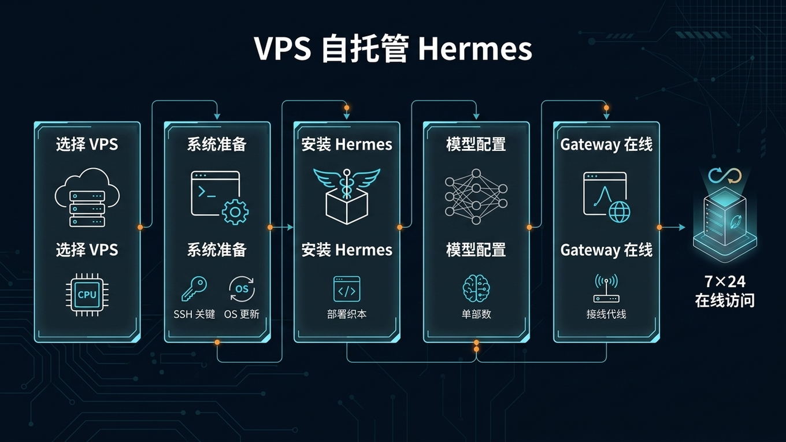

# 🏠 06-VPS 自托管 Hermes

> 一句话先说清楚：这一页教你在 VPS 上从零部署 Hermes，让它 7×24 小时在线，通过 Telegram 随时访问。



---

## 👀 适合谁

- 想让 Hermes 全天在线，不依赖本地电脑的人
- 想通过 Telegram 远程访问 Agent 的人
- 有一定 Linux 基础，能 SSH 到服务器的人

**前提条件**：你有一台 VPS（或者准备买一台），能 SSH 登录。

---

## 🎯 为什么值得做

在本地电脑跑 Hermes 有三个硬伤：

1. **电脑关了 Agent 就断了**——Cron 任务不会执行，Telegram 消息收不到
2. **内网穿透麻烦**——想从外面访问，还得配端口转发或 VPN
3. **家庭网络不稳定**——断网断电就全停了

VPS 解决全部三个问题：
- 机房 7×24 在线，网络稳定
- 公网 IP，Telegram Webhook 直接可达
- 月费 $5-15，比电费还便宜

---

## ✍️ 选什么 VPS

### 最低配置

| 项目 | 最低 | 推荐 |
|---|---|---|
| RAM | 2 GB | 4 GB |
| CPU | 1 vCPU | 2 vCPU |
| 磁盘 | 10 GB SSD | 40 GB SSD |
| 系统 | Ubuntu 22+ / Debian 12+ | 同左 |
| 网络 | 能访问 LLM API 和 Telegram | 同左 |

> Hermes 本身很轻量——它不跑本地模型，API 调用是远程的。2 GB RAM 够了，4 GB 更稳。

### VPS 供应商选择

| 供应商 | 起步价 | 特点 |
|---|---|---|
| RackNerd | ~$2-5/月 | 性价比高，年付更便宜 |
| DMIT | ~$7/月 | 中美线路优化，延迟低 |
| 腾讯云轻量 | ~$5/月 | 国内访问快，需备案 |
| Servury | ~$15/月 | 匿名注册、加密货币支付、无 KYC |

选哪家的核心判断：
- 如果你主要用 Telegram + 海外 LLM API → 选海外 VPS
- 如果你在国内、需要低延迟 → 选腾讯云/阿里云轻量

---

## ✍️ 操作步骤：部署到 VPS

### 第 1 步：系统准备

SSH 登录你的 VPS，执行：

```bash
# 更新系统
apt update && apt install -y python3-pip python3-venv git tmux

# 确认 Python 版本（需要 3.10+）
python3 --version
```

### 第 2 步：安装 Hermes

```bash
# 创建虚拟环境
python3 -m venv ~/hermes
source ~/hermes/bin/activate

# 安装
pip install hermes-agent

# 初始化配置
hermes init
```

按提示选择你的 LLM Provider（OpenRouter / Anthropic / OpenAI / 自定义兼容接口）。

### 第 3 步：验证安装

```bash
hermes doctor     # 检查环境
hermes chat -Q -q "你好，确认一下你能正常回复。" 
```

如果收到正常回复，安装成功。

### 第 4 步：配置 Telegram Gateway

```bash
hermes gateway setup
```

按提示选择 Telegram → 粘贴 Bot Token → 输入 User ID。

### 第 5 步：持久化运行

**方式 A：tmux（最简单）**

```bash
tmux new -s hermes
hermes gateway
# Ctrl+B 然后 D 脱离，Gateway 继续运行
```

**方式 B：系统服务（推荐生产环境）**

```bash
hermes gateway install --system
```

这会创建 systemd 服务，开机自启、崩溃自动重启。

**方式 C：Docker**

```bash
docker run -d --restart unless-stopped --name hermes \
  -v $HOME/.hermes:/root/.hermes \
  ghcr.io/nousresearch/hermes-agent:latest serve
```

---

## 💡 使用心得

### 心得 1：先用 tmux 跑通，再装服务

别一上来就 `gateway install --system`。
先前台运行确认一切正常，再装服务。否则出问题了不好排查。

### 心得 2：设置时区

VPS 默认可能是 UTC。如果你在东八区：

```bash
timedatectl set-timezone Asia/Shanghai
```

这会影响 Cron job 的执行时间。

### 心得 3：用 Docker 更省心

Docker 部署的好处是环境隔离、升级简单：

```bash
# 升级
docker pull ghcr.io/nousresearch/hermes-agent:latest
docker restart hermes

# 备份
docker exec hermes tar czf - /root/.hermes > hermes-backup.tar.gz
```

### 心得 4：善用 `hermes send`

如果你有一个脚本（比如 CI/CD 部署完成后）想通知 Telegram，不需要创建 Cron job：

```bash
echo "部署完成：$(date)" | hermes send --platform telegram
```

---

## ⚠️ 踩坑提醒

### 1. VPS 访问不了 LLM API

如果你用国内 VPS（腾讯云、阿里云），可能访问不了 OpenAI/Anthropic 的 API。
解决方式：配置代理，或者用国产模型的兼容接口（DeepSeek、智谱 GLM 等）。

### 2. 防火墙挡了 Telegram

Telegram Bot API 需要访问 `api.telegram.org`（出站 HTTPS 443）。
检查：

```bash
curl -s https://api.telegram.org
```

如果不通，检查 VPS 的安全组或防火墙规则。

### 3. tmux 会话意外断开

如果你用 tmux 跑 Gateway，SSH 断开时 tmux 会话应该还在。
重新连接后：

```bash
tmux attach -t hermes
```

### 4. 磁盘满了

Hermes 的日志、对话记录、Cron 输出会慢慢占磁盘。
定期检查：

```bash
df -h
du -sh ~/.hermes/
```

---

## ✅ 推荐做法

| 做法 | 原因 |
|---|---|
| 选 4 GB RAM 的 VPS | 2 GB 够用但 4 GB 更稳 |
| 用 systemd 或 Docker 持久化 | 不要靠 tmux 长期跑 |
| 设置正确的时区 | Cron 才会在对的时间执行 |
| 配置好 GitHub 备份 | VPS 随时可能需要迁移 |
| 定期检查磁盘 | 日志和输出会持续增长 |

---

## ✅ 过关标准

- Hermes 在 VPS 上 7×24 运行
- Telegram Bot 能正常收发消息
- Gateway 作为系统服务运行，重启后自动恢复
- 你知道怎么升级、查看日志、检查磁盘

---

## ➡️ 下一步

完成后进入：
[07-SOUL.md 人格定制](./07-SOUL.md%20人格定制.md)

如果你想先回到上一阶段入口重新确认位置：
[05-实战应用总览](./01-总览.md)

---

## 📖 出处

本文整理翻译自以下来源：

- Hermes 官方文档 — [Quick Start / Install](https://hermes-agent.nousresearch.com/docs/)
- Hermes 官方文档 — [Gateway Messaging Platforms](https://hermes-agent.nousresearch.com/docs/user-guide/messaging/)
- Hermes 官方文档 — [Environment Variables Reference](https://hermes-agent.nousresearch.com/docs/reference/environment-variables)
