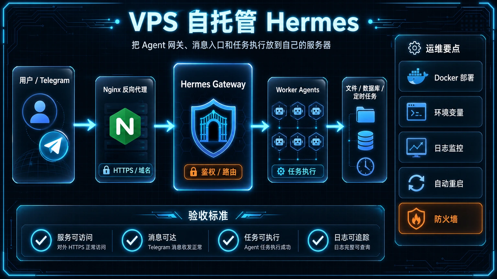
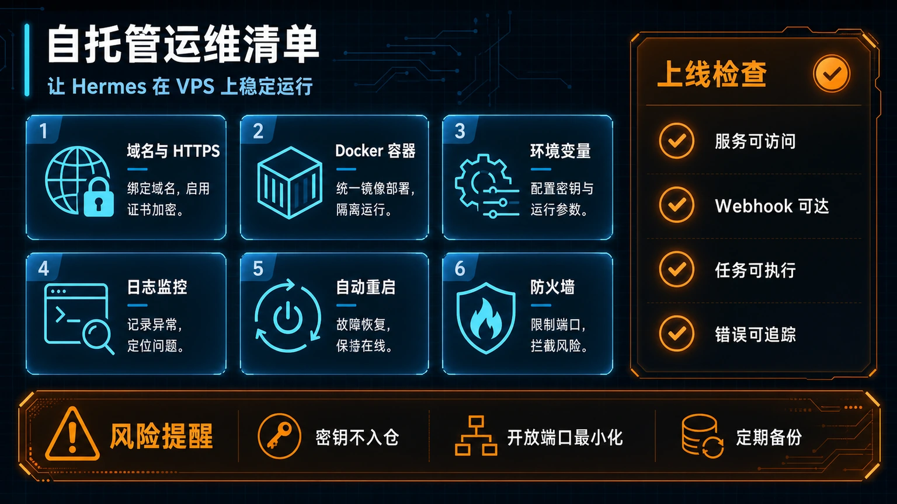

# 🏠 06-VPS 自托管 Hermes

> 在 Linux VPS 上先跑通安装与模型，再验证消息 Gateway，最后选择 systemd 或 Docker 持久化。服务器开机、模型可达和消息平台网络可达都需要分别验收。

复核日期：2026-09-30；依据官方稳定标签 **v2026.9.24（v0.21.5）**。本页完成官方文档与源码核对，未实际购买 VPS、安装 Hermes 或调用模型。



> 图用于理解组件；最小消息部署不要求 Nginx 或公开 Webhook。不要将示意图当成必须开放的端口清单。

## 👀 适合谁

希望电脑关机后消息入口与定时任务仍可运行，且能通过 SSH 管理 Linux 的用户。桌面版远程连接需要额外的 HTTP/WebSocket 后端；只启动消息 Gateway 不等于桌面远程入口已经就绪。

## ✍️ 1. 准备服务器

选择官方支持的 Linux 环境，例如当前 Ubuntu。资源取决于工具、浏览器、并发和文件大小；2 GB 内存不能保证所有工作负载流畅。按实际任务观察峰值并预留空间，不把固定月费或未经测试的厂商套餐作为最低标准。

通过 SSH 登录，以准备长期运行 Hermes 的同一账户执行安装和配置。Debian/Ubuntu 示例：

```bash
sudo apt update
sudo apt install -y git curl xz-utils tmux
```

官方安装器会管理 Python 和其他依赖。若自行准备源码环境，稳定标签的 `pyproject.toml` 要求 **Python >=3.11,<3.14**，不能沿用旧文“3.10+”。

## ✍️ 2. 使用官方安装入口

```bash
curl -fsSL https://hermes-agent.nousresearch.com/install.sh | bash
```

脚本入口随上游变化，不保证固定在本文的稳定标签。安装后查看实际版本；需要严格锁版本时参考官方开发安装说明或下文的固定 Docker 标签。

重新打开 SSH shell，确认 `hermes` 可执行，再配置模型：

```bash
hermes --version
hermes setup
# 已安装后只调整模型，也可使用：
hermes model
```

官方不支持 `pip install hermes-agent` / PyPI 发行安装。旧文的 `hermes init` 应改用 `hermes setup`，不要将另一个同名包当作官方安装。

## ✍️ 3. 验证模型与消息入口

```bash
hermes doctor
hermes chat -Q -q "你好，请只回复：连接正常。"
hermes gateway setup
hermes gateway run
```

`hermes chat -Q -q` 是有效的最小问答命令，仍会调用模型并可能计费。向导配置 Telegram Bot Token 与允许访问的用户后，从自己的账号实际发送和接收一条消息；不要将 Bot Token 发给别人或写入仓库。

国内服务器需要分别验证模型 endpoint 和消息平台连通性。Telegram 通常需要访问 `api.telegram.org` 的出站 HTTPS；成功建立 SSH 不代表这些服务也可达。国内模型与飞书等入口可分别参考[国内落地](/docs/china)。

## ✍️ 4. 持久化运行：选择一种方式

### 临时验证：tmux

```bash
tmux new -s hermes
hermes gateway run
# Ctrl+B，再按 D 脱离；重新连接后可用：
# tmux attach -t hermes
```

tmux 能在 SSH 断开后保留进程，但不保证机器重启或进程崩溃后自动恢复。

### Linux systemd

先结束前台 Gateway，再安装服务；不要让两个进程使用同一个 Bot Token。

```bash
hermes gateway install --system
hermes gateway start --system
hermes gateway status --system
```

系统级服务安装可能需要管理员权限。确认服务使用的账户、profile 和数据目录与前台测试一致。用户级服务是另一条路线，需要正确处理登录后启动与 linger，不能将两种服务混用。

### Docker：独立替代路线

不用先在宿主机安装 pip 包。以下固定标签示例只部署消息 Gateway，并将数据挂到官方镜像的 `/opt/data`：

```bash
mkdir -p ~/.hermes
docker run -it --rm   -v "$HOME/.hermes:/opt/data"   nousresearch/hermes-agent:v2026.9.24 setup

docker run -d --restart unless-stopped --name hermes   -v "$HOME/.hermes:/opt/data"   nousresearch/hermes-agent:v2026.9.24 gateway run

docker logs --tail 100 hermes
```

先在 setup 中完成模型与消息平台配置。若复用旧数据目录，先备份并确认只有一个 Gateway 使用它；也可以使用单独的宿主数据目录。这条最小路线不需要发布管理端口。



## 🔄 升级与备份

Git 安装可以使用 `hermes update`，之后检查实际版本并重启对应 Gateway 服务。更新路径可能跟随主干；需要稳定版本边界时先阅读目标 release。

Docker 安装不支持用 `hermes update` 升级镜像。**pull 后 restart 仍然使用旧容器的镜像；必须重建容器**。下面以 v2026.9.24 为目标示范，实际升级时替换为已审核的目标标签：

```bash
# 先停止当前容器，备份宿主机数据目录（含密钥，妥善保存）
docker stop hermes
tar -czf hermes-backup.tar.gz -C "$HOME" .hermes

docker pull nousresearch/hermes-agent:v2026.9.24
docker rm hermes
docker run -d --restart unless-stopped --name hermes   -v "$HOME/.hermes:/opt/data"   nousresearch/hermes-agent:v2026.9.24 gateway run
docker logs --tail 100 hermes
```

移除的是已停止的容器；不要删除宿主数据目录。目标镜像可能迁移配置，回退前先确认备份与旧版本兼容。备份含 `.env` 等凭据，不要把完整备份上传公开 GitHub。

## 🩺 排障与验收

| 现象 | 先检查什么 | 验收动作 |
|---|---|---|
| `hermes` 找不到 | 安装器输出、shell 与 PATH | 新 SSH shell 中执行版本检查 |
| 模型无法回复 | provider、Key、余额、endpoint 和网络 | 最小问答有正常模型回复 |
| 本地回复但 Telegram 无响应 | Bot Token、访问用户、出站网络、重复 Gateway | 手机发送后收到一次回复 |
| 重启后入口丢失 | 服务状态、运行账户、数据挂载 | 主动重启后复测消息 |
| Cron 时间不对 | 系统与任务时区 | 用可观察的小任务确认触发时刻 |
| pull 后版本没变 | 是否重建容器、目标镜像标签 | 检查新容器镜像与运行版本 |

持续检查磁盘、日志和任务输出。不能以一次最小问答声称已验证 7×24 稳定运行；长期验收需要观察重启恢复和实际负载。

## ⬅️ 上一步

- [05-Token 成本优化避坑指南](./05-Token%20成本优化避坑指南.md)

## ➡️ 下一步

- [07-SOUL.md 人格定制](./07-SOUL.md%20人格定制.md)
- 回到[实战应用总览](/docs/start/practical)。

## 📖 官方依据

- [稳定标签平台支持](https://github.com/NousResearch/hermes-agent/blob/v2026.9.24/website/docs/getting-started/platform-support.md)：不支持 PyPI 安装。
- [稳定标签安装说明](https://github.com/NousResearch/hermes-agent/blob/v2026.9.24/website/docs/getting-started/installation.md)。
- [稳定标签 Python 要求](https://github.com/NousResearch/hermes-agent/blob/v2026.9.24/pyproject.toml)。
- [稳定标签 Docker 说明](https://github.com/NousResearch/hermes-agent/blob/v2026.9.24/website/docs/user-guide/docker.md)：镜像、挂载、Gateway 与重建升级。
- [稳定标签 Gateway 命令解析](https://github.com/NousResearch/hermes-agent/blob/v2026.9.24/hermes_cli/subcommands/gateway.py)。
