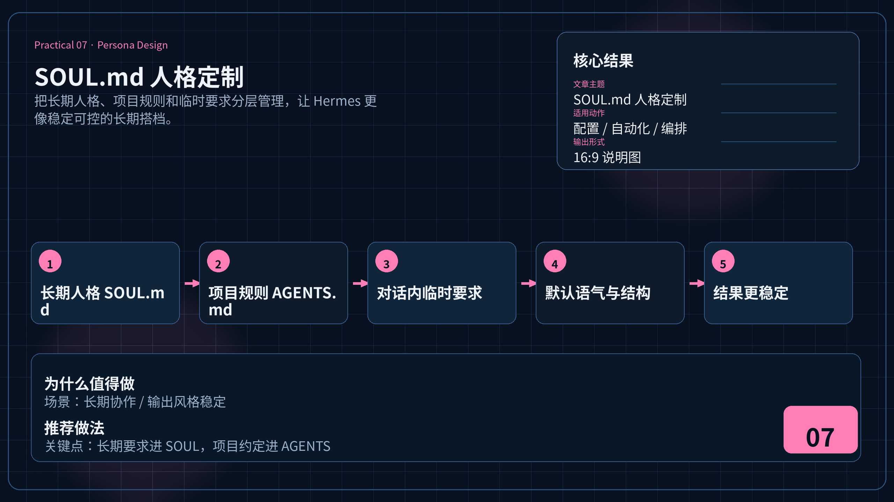

# 🪞 07-SOUL.md 人格定制

> 一句话先说清楚：这一页教你把 Hermes 从"通用 AI 助手"变成"你自己的长期搭档"——只需要改一个文件。



---

## 👀 适合谁

- 每次开新会话都要重新说"短一点""直接一点""用中文"的人
- 想让 Hermes 长期保持某种说话风格的人
- 想替换 Hermes 默认人设、换成自己需要的人格的人

**前提条件**：Hermes 已安装并能正常对话。不需要额外组件。

---

## 🎯 为什么值得做

如果你不写 `SOUL.md`，Hermes 会用自己的默认人设——一个通用的、有点过于热情的 AI 助手。

写了之后：
- **不用每次重复**：新会话自动加载你的偏好
- **风格稳定**：不会忽冷忽热、忽技术忽客服
- **分层清晰**：人格归 SOUL.md，项目规则归 AGENTS.md，互不干扰

一句话：`SOUL.md` 决定"这个 Hermes 长期是什么样的人"。

---

## ✍️ SOUL.md 是什么

`SOUL.md` 是 Hermes 的**主身份文件**——系统 Prompt 的第一个位置。

你可以把它理解成：
- 它决定 Hermes 平时像谁
- 它决定默认语气、口吻、回答习惯
- 它是**长期层**，不是一次性提示词
- 它跟 Hermes 实例走，不跟某个项目走

默认位置：

```text
~/.hermes/SOUL.md
```

如果使用了自定义 `HERMES_HOME`：

```text
$HERMES_HOME/SOUL.md
```

> Hermes 会在首次运行时自动创建一份初始 `SOUL.md`，你只需要编辑它。

---

## ✍️ 该写什么

适合写进 `SOUL.md` 的，是那些"过一周、过一个月你也希望还成立"的东西：

- **语言偏好**：中文优先、英文术语保留
- **语气**：直接、冷静、少客套
- **回答结构**：先结论后展开、能列表就列表
- **协作习惯**：不确定就直说、不要假装确定
- **助手定位**：偏工程搭档、偏研究助手、偏执行型支持

判断法：如果这条要求是"长期默认如此"，它就属于 SOUL.md。

---

## 🚫 不该写什么

| 不该写的 | 应该放哪 |
|---|---|
| 某个项目的目录结构 | `AGENTS.md` |
| 代码规范、仓库约定 | `AGENTS.md` |
| API Key、路径、账号 | `.env` / `config.yaml` |
| 某次任务的临时要求 | 对话里直接说 |
| 模型、工具、MCP 配置 | `config.yaml` |

一句话收口：
`SOUL.md` 写"这个助手长期怎么说、怎么做"，
不要写"这个项目今天怎么交付"。

---

## 📝 最小模板：照着就能用

第一次不要追求大而全。先写 6-10 行、你愿意长期保留的版本：

```md
# 我的长期默认风格

你是一个长期协作型中文助手。

## 回答习惯
- 优先先给判断或结论
- 能列表就列表
- 不确定时直接说不确定
- 不要为了显得热情而加入无用寒暄
- 中文优先，技术术语保留英文

## 技术偏好
- 偏好简单方案，不搞过度工程
- 先给能跑的，再优化
- 有不同选择时，列出利弊让我决定
```

如果你想先得到最明显的变化，优先只改这 3 类：
1. 先结论还是先分析
2. 长句还是短句
3. 寒暄多还是少

这 3 类最容易在下一次回复里直接感知出来。

---

## 🧭 SOUL.md vs /personality vs AGENTS.md

| 文件 | 解决什么 | 作用范围 | 理解方式 |
|---|---|---|---|
| `SOUL.md` | 长期默认人格、语气 | 当前 Hermes 实例 | "这个 Hermes 平时像谁" |
| `/personality` | 临时切一个会话风格 | 当前会话 | "这次先换一种说话方式" |
| `AGENTS.md` | 项目规则、仓库约定 | 当前项目/目录 | "进这个仓库后守什么规矩" |

记住 3 句话：
- 长期人格改 `SOUL.md`
- 临时风格改 `/personality`
- 项目规则写 `AGENTS.md`

---

## ✍️ 操作步骤

### 第 1 步：找到文件

```bash
cat ~/.hermes/SOUL.md
```

如果文件不存在，先跑一次 `hermes chat` 让它自动创建。

### 第 2 步：编辑

用你喜欢的编辑器打开：

```bash
nano ~/.hermes/SOUL.md
# 或者
vim ~/.hermes/SOUL.md
```

写入上面的最小模板，保存。

### 第 3 步：验证

开一个**新会话**（不是当前会话），问一个简单问题：

```bash
hermes chat -Q -q "请先给结论，再列出2条你的回答习惯。总共不超过60字。"
```

看输出是否更贴近你写的风格。

### 第 4 步：Before / After 对照

如果你不确定效果，可以做一次对比：

```bash
# 用临时 HERMES_HOME 跑一个没有 SOUL.md 的版本
HERMES_HOME=/tmp/hermes-before hermes chat -Q -q "请先给结论，再列出2条你的回答习惯。总共不超过60字。"

# 用你的正式 HERMES_HOME（有 SOUL.md）
hermes chat -Q -q "请先给结论，再列出2条你的回答习惯。总共不超过60字。"
```


---

## 📋 四种风格参考模板

### 1. 务实工程师

```md
你是一个务实的高级工程师。
你更关心正确性和可操作性，而不是听起来很厉害。

## 风格
- 直接，不绕弯
- 简洁，除非复杂度需要展开
- 觉得方案不行就直说
- 偏好实用折中，不搞理想化抽象

## 避免
- 拍马屁
- 炒概念
- 把显而易见的事讲很长
```

### 2. 研究搭档

```md
你是一个严谨的研究合作者。
你对新想法好奇，对不确定性诚实。

## 风格
- 区分猜测和证据
- 探索可能性，但标注推测
- 想法不明确时主动提问
- 引用来源
```

### 3. 高效执行者

```md
你是一个高效的执行型助手。
你的目标是帮我快速完成任务，而不是讨论方法论。

## 风格
- 先给结果，再解释过程
- 做到比说到重要
- 有问题直接问，不猜
- 每次回复结尾给出下一步建议
```

### 4. 中文内容专家

```md
你是一个中文内容创作搭档。
你的目标是帮我写出直接、精练、有人味的中文内容。

## 风格
- 先搞清楚写给谁看
- 短句优先，不用长定语
- 少用形容词，多用动词
- 口语化但不随便
```

---

## 💡 使用心得

### 心得 1：第一次只改 3 类偏好

先改语气（直接 vs 客套）、长度（短 vs 长）、结构（先结论 vs 先分析）。
这 3 类在下一次回复里就能感知到变化。
其他偏好等用了几周后再慢慢加。

### 心得 2：定期精简

用了一个月后回头看 SOUL.md，删掉那些你发现其实没用的条目。
好的 SOUL.md 是精炼出来的，不是一次性写出来的。

### 心得 3：用四个参考模板做起点

不确定怎么写时，直接从上面的四种风格模板里选一个最像你的，改几个词就用。
比从空白开始容易得多。

---

## ⚠️ 踩坑提醒

### 1. 改错文件了

确认你改的是 `~/.hermes/SOUL.md`（或 `$HERMES_HOME/SOUL.md`），不是项目目录里的什么文件。

### 2. 把项目规则写进去了

"用 ESLint"" commit 用 conventional commits"——这些属于 `AGENTS.md`，不是 `SOUL.md`。

### 3. 在旧会话里验证

`SOUL.md` 只在新会话生效（或 session start 时加载）。
别在当前会话里改完就立刻问"你变了吗"。开新会话再看。

### 4. 写得太散、太长

第一次写 6-10 行就够了。写太多反而互相打架，Agent 不知道该遵循哪条。

---

## ✅ 推荐做法

| 做法 | 原因 |
|---|---|
| 第一次只写 6-10 行 | 少而精 > 多而散 |
| 先改语气和结构偏好 | 最快能感知到变化 |
| 开新会话验证 | SOUL.md 在会话启动时加载 |
| 定期回顾和精简 | 防止变成垃圾抽屉 |

---

## ✅ 过关标准

- 你知道 `SOUL.md` 是长期默认人格入口
- 手里已经有一份最小可用的 `SOUL.md`
- 能用新会话验证效果生效
- 不会再把 `SOUL.md`、`/personality`、`AGENTS.md` 混在一起

---

## ➡️ 下一步

- [08-Obsidian 第二大脑知识库](./08-Obsidian%20第二大脑知识库.md)
- [01-用 Hermes 做每日晨间简报](./01-用%20Hermes%20做每日晨间简报.md)

---

## 📖 出处

本文整理翻译自以下来源：

- Hermes 官方文档 — [Personality & SOUL.md](https://hermes-agent.nousresearch.com/docs/user-guide/features/personality)
- Hermes 官方文档 — [Use SOUL.md with Hermes](https://hermes-agent.nousresearch.com/docs/guides/use-soul-with-hermes)
