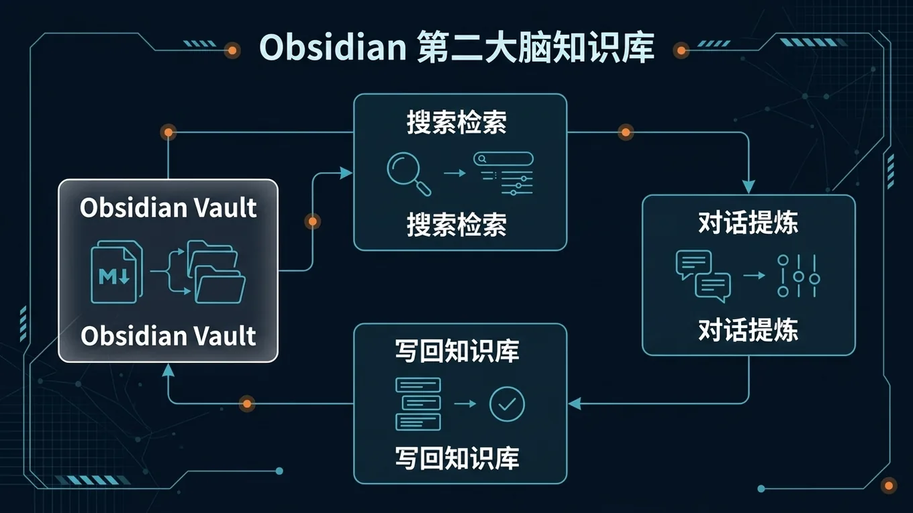

# 🧠 08-Obsidian 第二大脑知识库

> 一句话先说清楚：这一页教你把 Hermes 接入 Obsidian，让你的知识库从"死笔记"变成"能对话、能自动整理、能自主学习的第二大脑"。



---

## 👀 适合谁

- 已经在用 Obsidian 做笔记，想让 AI 帮你管理和检索的人
- 想在手机上随时查询、补充知识库的人
- 想让 Agent 自动从对话中学习并写入记忆的人

**前提条件**：
- 你有 Obsidian 和一个 Vault
- Hermes 已安装并能正常对话
- 你的 Vault 目录可以通过文件系统访问（本地或通过 Syncthing/远程挂载）

---

## 🎯 为什么值得做

传统的 Obsidian 用法有两个痛点：

1. **检索靠手动**——笔记多了以后，找东西靠关键词搜索，找不到就等于没有
2. **整理靠自觉**——零散的想法、读完的文章，不主动整理就永远散落在各处

Hermes + Obsidian 解决的是：
- **自然语言检索**：直接问"我去年关于 Agent 的调研笔记在哪"，Agent 帮你找
- **自动写入**：对话中产生的想法、结论、任务，可以直接存入 Vault
- **自主学习**：Hermes 会在后台从你的对话中提取偏好和模式，自动更新记忆

---

## ✍️ 操作步骤：接入方式

### 方式 A：通过 Hermes 内置 Obsidian Skill

Hermes 自带 Obsidian 操作能力。确保你的 Vault 路径可被 Hermes 访问：

```bash
# 假设你的 Vault 在 ~/Obsidian/MyVault
# 在对话中直接使用
```

在 Hermes 中直接说：

```text
帮我搜索 ~/Obsidian/MyVault 里关于"多 Agent 架构"的笔记，
列出找到的文件路径和每篇的核心要点。
```

Hermes 会调用 Obsidian Skill 的搜索功能，扫描 Markdown 文件并返回匹配结果。

### 方式 B：通过 Discord / Telegram 远程访问

如果你在 VPS 上跑 Hermes，把 Vault 用 Syncthing 同步到 VPS：

```bash
# VPS 上
mkdir -p ~/obsidian-vault
# 配置 Syncthing 把本地 Vault 同步到 VPS
```

然后在 Telegram 里直接对话：

```text
查一下我知识库里关于 Token 优化的笔记，给我一个摘要。
```

Agent 从同步过来的 Vault 文件中搜索并返回结果。

---

## 📝 核心能力

### 1. 搜索笔记

```text
在我的 Obsidian 里搜"晨间例行"相关的笔记，
返回文件路径和每篇的前 3 行。
```

### 2. 创建笔记

```text
帮我在 Obsidian 的 Daily 目录下创建今天的日记，
内容包含：今天的 TODO、昨天的回顾、一个值得记住的想法。
```

### 3. 追加内容

```text
打开 ~/Obsidian/MyVault/Projects/Agent开发.md，
在末尾追加一段："2026-06-04：今天测试了 Hermes Cron 自动化，运行稳定。"
```

### 4. 知识检索 + 生成

```text
基于我 Obsidian 里关于 VPS 部署的所有笔记，
帮我整理一份"VPS 部署检查清单"，格式用表格。
```

---

## 🧠 自主学习：最让人惊喜的能力

这是 Hermes 区别于其他 AI Agent 的核心特性之一。

### 它会自己学

当你持续使用 Hermes 后，它会**在后台自主运行学习流程**：

| 触发条件 | 动作 |
|---|---|
| 对话达到约 10 轮 | 记忆审查 Agent 更新 `USER.md`（你的偏好档案） |
| 工具调用达到约 15 次 | 技能审查 Agent 检查是否需要创建新 Skill |
| 会话闲置约 2 天 | 凌晨 4 点自动回顾最近的对话，提取有价值的信息 |

### 实际表现

> "我装它是为了在手机上跟 Obsidian 对话。一周后，它自己往我的用户档案里写了 7 条记录。" —— Artem Zhutov

两个具体例子：

1. **自动创建 Skill**：当你在对话中走完了一个完整的工作流（比如"搜索 YouTube 视频 → 导入 NotebookLM → 整理笔记"），Hermes 会在后台自动把这个流程封装成一个可复用的 Skill。

2. **自动更新记忆**：当你在对话中表达了偏好（比如"我不喜欢太长的回答"），Hermes 会自动把这条偏好写入 `USER.md`，下次对话自动生效。

> 这个学习过程发生在后台——主对话不会被中断，用户看不到学习 Agent 的存在。

---

## 💡 使用心得

### 心得 1：给 Vault 建一个"Inbox"目录

让 Hermes 创建笔记时默认写入 `Inbox/`，你定期整理到正确位置。
避免 Agent 直接往你的结构化目录里乱写。

### 心得 2：Syncthing 做双向同步

在本地、VPS、手机之间用 Syncthing 同步 Vault。
这样不管你从哪个入口跟 Hermes 对话，它看到的都是最新的 Vault。

### 心得 3：用 Daily Note 做 Agent 的写入终点

让 Hermes 把每日对话摘要、自动学习的结论写入 Daily Note。
这样你的 Daily Note 会自动丰富，而不是只有你自己手写的部分。

---

## ⚠️ 踩坑提醒

### 1. Vault 路径不一致

如果你在本地和 VPS 都跑 Hermes，确保两边指向的 Vault 路径一致（或通过环境变量适配）。
否则 Agent 在 VPS 上创建的笔记，同步回本地后路径不对。

### 2. 同步冲突

Syncthing 双向同步可能产生冲突文件（`.sync-conflict-*`）。
定期检查并合并冲突。

### 3. Agent 写入了你不想要的内容

自主学习是好事，但有时候 Agent 会写入你觉得不准确的内容。
定期检查 `USER.md` 和自动创建的 Skill，删掉不准确的条目。

### 4. 大 Vault 搜索慢

如果你的 Vault 有几千个文件，全文搜索会比较慢。
解决方式：给 Hermes 指定搜索范围（特定目录），而不是整个 Vault。

---

## ✅ 推荐做法

| 做法 | 原因 |
|---|---|
| 设置 Inbox 目录做缓冲 | 避免 Agent 直接污染你的结构 |
| 用 Syncthing 双向同步 | 多入口都能访问最新内容 |
| 定期检查自动写入的内容 | 自主学习不一定每次都准确 |
| 指定搜索范围 | 大 Vault 搜索太慢 |
| 用 Daily Note 做摘要终点 | 自动丰富你的日记 |

---

## ✅ 过关标准

- Hermes 能搜索你的 Obsidian Vault 并返回结果
- 能通过对话创建和追加笔记
- 自主学习功能至少触发过一次（检查 `USER.md` 是否有新条目）
- 你知道在哪里检查和清理 Agent 自动写入的内容

---

## ➡️ 下一步

完成后进入：
[09-Kanban 多 Agent 编排](./09-Kanban%20多%20Agent%20编排.md)

如果你想先回到上一阶段入口重新确认位置：
[05-实战应用总览](./01-总览.md)

---

## 📖 出处

本文整理翻译自以下来源：

- Hermes 官方文档 — [Memory Features](https://hermes-agent.nousresearch.com/docs/user-guide/features/memory)
- Hermes 官方文档 — [Skills Catalog](https://hermes-agent.nousresearch.com/docs/reference/skills-catalog)
- Obsidian 官方帮助 — [Obsidian Help](https://help.obsidian.md/)
