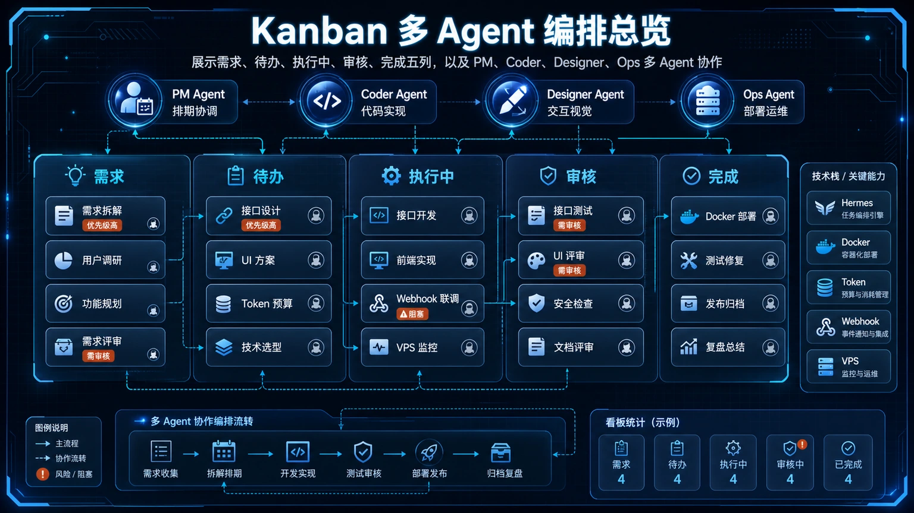
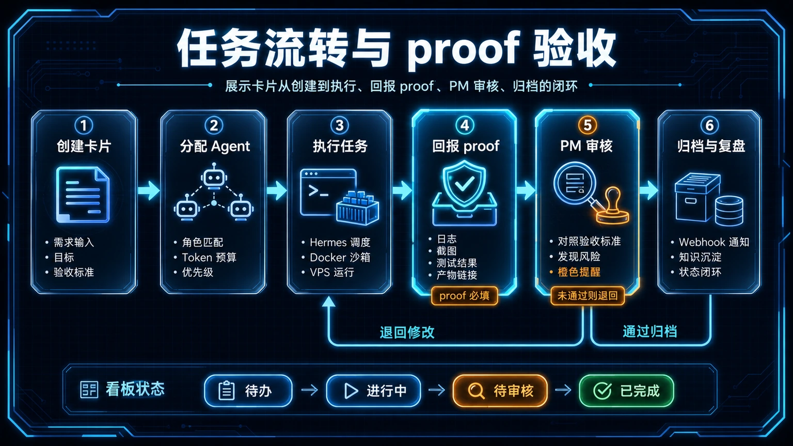

# 📋 09-Kanban 多 Agent 编排

> 一句话先说清楚：这一页教你怎么用 Hermes 的 Kanban 看板把多个 Agent 任务串起来——从需求拆解到分工执行到验收交付，全流程可视化。



---

## 🔎 搜索收录速答

Kanban 多 Agent 编排适合把复杂任务拆成待办、执行、验证和归档几个阶段，并让多个 Agent 或多轮会话围绕同一块看板协作。关键不是“开更多 Agent”，而是定义清楚状态流转、验收证据和失败回滚。想继续扩展自动化，可以接着看[三层模型级联](/docs/start/practical/three-tier-model-routing)和[上下文引用](/docs/start/build/context-system/context-references)。


## 👀 适合谁

- 已经会用单 Agent 完成任务，但开始觉得一个人不够用的人
- 想给不同任务分配不同专长的 Agent Profile 的人
- 想把"需求 → 拆解 → 分工 → 执行 → 验收"流程化的人

**前提条件**：
- 你已经创建过多个 Hermes Profile
- 你了解基本的 delegate_task 用法
- Hermes 版本 v0.12+（Kanban 在此版本引入）

---

## 🎯 为什么值得做

当你只有一个 Agent 时，所有任务都排着队一个一个来。
当你有多个 Agent 时，如果没有编排机制，就是一团乱麻。

Kanban 看板解决的是：
- **可视化**：所有任务、状态、负责人一目了然
- **自动分工**：Dispatcher 根据 Lane 和 Profile 自动分配
- **依赖管理**：任务 A 完成后才触发任务 B
- **持久化**：所有状态存在 SQLite，不怕重启



---

## ✍️ Kanban 的核心概念

### Lane（泳道）

每个 Lane 代表任务的一个阶段：

| Lane | 含义 | 谁在执行 |
|---|---|---|
| `todo` | 待处理 | 无人——等待 Dispatcher |
| `ready` | 就绪 | Dispatcher 准备分配 |
| `in_progress` | 执行中 | 某个 Profile 正在工作 |
| `review` | 待审查 | 等待验收 |
| `done` | 完成 | 归档 |

### Profile（角色）

每个 Profile 对应一个专长角色：

```bash
# 创建不同专长的 Profile
hermes profile create pm-agent --clone       # 产品/需求分析
hermes profile create coder-agent --clone     # 代码实现
hermes profile create reviewer-agent --clone  # 审查验收
```

### Dispatcher（调度器）

Dispatcher 是 Kanban 的核心引擎。它负责：
1. 监控 `ready` Lane 里的任务
2. 根据任务标签匹配对应的 Profile
3. 自动 `spawn` Profile 去执行
4. 执行完后推进到下一个 Lane

---

## ✍️ 操作步骤

### 第 1 步：创建 Kanban 看板

在 Hermes 中直接说：

```text
创建一个 Kanban 看板，项目名是"网站改版"。
Lane 包含：todo、ready、in_progress、review、done。
参与 Profile：pm-agent（需求）、coder-agent（开发）、reviewer-agent（审查）。
```

### 第 2 步：添加任务

```text
往"网站改版"看板添加以下任务：

1. 任务：撰写首页文案改版方案
   Lane: todo
   Assigned: pm-agent

2. 任务：实现首页新布局
   Lane: todo
   Assigned: coder-agent
   Depends on: 1

3. 任务：验收首页改版
   Lane: todo
   Assigned: reviewer-agent
   Depends on: 2
```

### 第 3 步：启动 Dispatcher

```text
启动"网站改版"看板的 Dispatcher。
```

Dispatcher 会自动：
1. 把 `todo` 里没有依赖的任务推到 `ready`
2. 把 `ready` 的任务分配给对应 Profile
3. Profile 开始执行后，任务变成 `in_progress`
4. 执行完成后，推进到 `review` 或 `done`
5. 如果有依赖，上游完成后自动解锁下游

### 第 4 步：查看进度

```text
显示"网站改版"看板的当前状态。
```

你会看到类似这样的视图：

```
│ todo │ ready │ in_progress │ review │ done │
│      │       │ coder-agent │        │      │
│      │       │ 实现首页布局 │        │      │
│      │       │             │        │ pm   │
│      │       │             │        │ 方案 │
```

---

## 🤝 多 Agent 通信模式

Kanban 是一种编排方式。社区里还有其他几种常见的多 Agent 协作模式：

### 模式 A：共享任务看板（GitHub/GitLab Issues）

让不同 Agent 通过 Issue 互相沟通：
- PM Agent 创建 Issue（包含需求描述）
- Coder Agent 看到 Issue 后开始实现
- Reviewer Agent 验收后关闭 Issue

**优点**：有完整的历史记录，适合团队协作
**复杂度**：低

### 模式 B：异步消息总线

Agent 之间通过共享的文件/数据库交换消息，不直接对话：
- Agent A 完成任务后写一条消息
- Agent B 下次被调用时检查消息

**优点**：防止 Agent 之间无限循环对话
**复杂度**：中高

### 模式 C：Kanban + Dispatcher

用 Hermes 原生 Kanban 做调度：
- Dispatcher 管理流转
- 每个 Profile 在自己的 Lane 里执行

**优点**：可视化、有依赖引擎、SQLite 持久化
**复杂度**：中

---

## 💡 使用心得

### 心得 1：别一上来就搞 5 个 Agent

先用 2 个 Profile（一个执行、一个验收）跑通流程。
确认稳定后再加角色。

### 心得 2：依赖关系要写清楚

如果任务 B 依赖任务 A 的输出，一定要在 Kanban 里标明。
Dispatcher 会根据依赖关系自动控制执行顺序。

### 心得 3：验收环节不能省

没有验收的多 Agent 协作等于没有质量门。
最后一个 Lane 一定要是 `review`，由独立的 Profile 做 pass/fail 判断。

### 心得 4：社区在快速迭代

> "别花太多力气改造 Hermes——下一个版本可能就自带你要的功能了。" —— 社区用户

Kanban 功能还在活跃迭代中。遇到问题时先 `hermes update`。

---

## ⚠️ 踩坑提醒

### 1. Profile 管理开销

当前 Kanban 的执行模型是通过 `hermes -p <profile> chat` spawn Profile。
每个 Profile 需要独立维护配置。
如果你有 10 个 Profile，管理成本就上去了。

### 2. Dispatcher 没启动

Dispatcher 需要你手动启动（或配成自动启动）。
如果发现任务卡在 `ready` 不动，检查 Dispatcher 是否在运行。

### 3. 循环依赖

任务 A 依赖 B，B 又依赖 A——Dispatcher 会死锁。
添加依赖关系前检查有没有循环。

### 4. 早期版本有 bug

Kanban 是 v0.12 引入的新功能，早期用户报告过一些问题。
遇到异常时先升级到最新版本。

---

## ✅ 推荐做法

| 做法 | 原因 |
|---|---|
| 从 2 个 Profile 开始 | 降低管理复杂度 |
| 标清依赖关系 | Dispatcher 才能正确排序 |
| 必须有验收环节 | 没有质量门的多 Agent = 没有多 Agent |
| 定期升级 | 功能在快速迭代 |
| 用 Git Issue 做任务记录 | 可追溯、可审计 |

---

## ✅ 过关标准

- 看板已创建，至少有 3 个任务
- Dispatcher 能自动推进任务状态
- 依赖关系正确工作（B 等 A 完成后才启动）
- 至少有一条任务跑完了全链路（todo → done）

---

## 🔗 实战路径

- 回到[实战应用总览](/docs/start/practical)，确认多 Agent 编排在完整实战路线中的位置。

## ⬅️ 上一步

- [**08-Obsidian 第二大脑知识库**](./08-Obsidian%20第二大脑知识库.md)

## ➡️ 下一步

- [**10-Home Assistant 智能家居**](./10-Home%20Assistant%20智能家居.md)

## 📖 出处

本文整理翻译自以下来源：

- Hermes 官方文档 — [Profiles](https://hermes-agent.nousresearch.com/docs/user-guide/profiles)
- Hermes 官方文档 — [Cron Jobs](https://hermes-agent.nousresearch.com/docs/user-guide/features/cron)
- Hermes Agent 内置技能 — hermes-agent skill 中的 Spawning / Multi-Agent Coordination 说明
