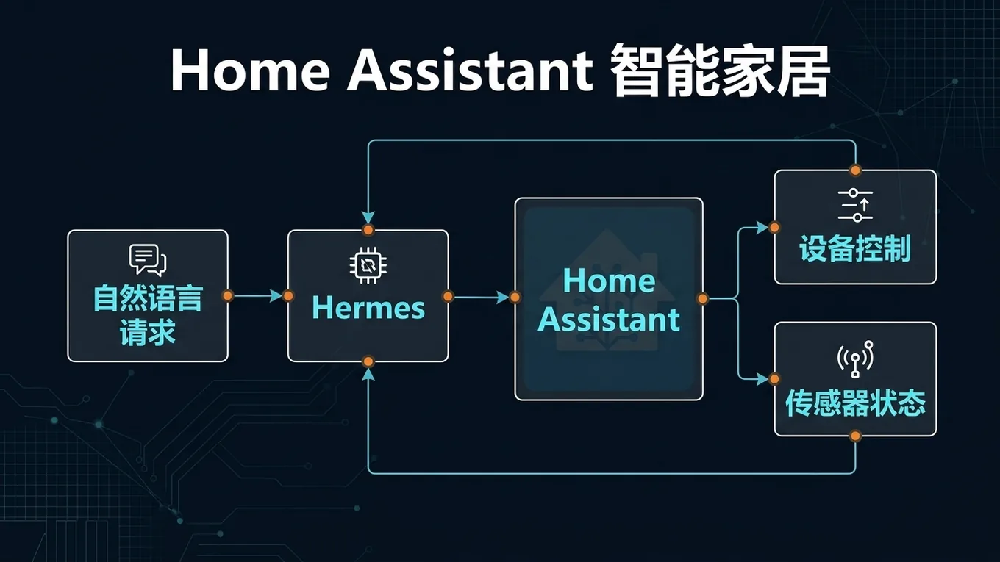

# 🏡 10-Home Assistant 智能家居

> 一句话先说清楚：这一页教你把 Hermes 接入 Home Assistant，用自然语言控制家里的灯、空调、窗帘、传感器——"帮我把客厅灯调暗一点"就够了。



---

## 👀 适合谁

- 已经在用 Home Assistant 管理智能家居的人
- 想用自然语言代替仪表盘控制设备的人
- 想让 AI 根据传感器数据自动做决策的人

**前提条件**：
- Home Assistant 已部署并能正常访问
- 你有 HA 的管理员权限，能创建 Long-Lived Access Token
- Hermes 已安装在能访问 HA 的网络环境中

---

## 🎯 为什么值得做

Home Assistant 的核心交互方式是仪表盘——手动点按钮、设自动化规则。
接上 Hermes 之后：

- **自然语言控制**："把卧室空调调到 26 度制热模式"，不用打开 HA 面板
- **智能场景判断**：Agent 能根据温度、湿度、时间等多个传感器综合决策
- **远程语音入口**：通过 Telegram 说一句话就能控制家里的设备
- **自动化升级**：把死板的 YAML 自动化规则变成有判断力的 AI 决策

一句话：仪表盘是手动挡，Hermes + HA 是自动挡 + 语音控制。

---

## ✍️ 操作步骤：接入 Home Assistant

### 第 1 步：创建 Home Assistant 长期令牌

> ⚠️ 必须用 Long-Lived Access Token。短期的 UI 会话 Token 不能用。

在 Home Assistant 中：
1. 点击左下角你的**用户头像** → 进入个人资料页
2. 滚动到底部 → **长期访问令牌**（Long-lived access tokens）
3. 点击**创建令牌** → 给它起个名字（比如 `hermes-agent`）
4. **复制生成的 Token**

> 这个 Token 很长，格式类似：`eyJhbGciOi...`
> 只显示一次，复制后保存好。

### 第 2 步：配置 Hermes 环境

编辑 `~/.hermes/.env`：

```bash
# 必填：你的 HA 长期令牌
HASS_TOKEN=eyJhbGciOiJIUzI1NiIs...

# 选填：HA 的访问地址（默认是 http://homeassistant.local:8123）
HASS_URL=http://192.168.1.100:8123
```

> 设置 `HASS_TOKEN` 后，`homeassistant` 工具集会**自动启用**。不需要额外开关。

### 第 3 步：启动 Gateway

```bash
hermes gateway
```

Home Assistant 会作为一个已连接的平台出现，和 Telegram、Discord 并列。

### 第 4 步：测试基本控制

在对话里试试：

```text
列出客厅里所有的灯。
```

```text
把客厅的灯打开，亮度设为 50%。
```

```text
卧室现在的温度是多少？
```

```text
把空调切到制冷模式，目标温度 24 度。
```

如果这些都能正常工作，接入成功。

---

## 🔧 四个核心工具

Hermes 的 Home Assistant 工具集提供 4 个核心操作：

### 1. `ha_list_entities` — 列出设备

| 参数 | 示例 |
|---|---|
| `domain` | `light`、`switch`、`climate`、`sensor`、`cover` |
| `area` | `living room`、`kitchen`、`bedroom` |

```text
列出所有卧室的传感器。
```

### 2. `ha_get_state` — 查看设备状态

| 参数 | 示例 |
|---|---|
| `entity_id` | `light.living_room`、`climate.thermostat` |

```text
查看客厅灯的当前状态和亮度。
```

### 3. `ha_list_services` — 查看可用服务

```text
空调有哪些可用的操作？
```

### 4. `ha_call_service` — 控制设备

| 参数 | 示例 |
|---|---|
| `domain` | `light`、`switch`、`climate`、`cover`、`media_player` |
| `service` | `turn_on`、`turn_off`、`toggle`、`set_temperature` |
| `entity_id` | `light.living_room` |
| `data` | 服务特定参数（亮度、颜色、温度等） |

常见控制示例：

```text
# 开关灯
打开厨房的灯。
关闭所有客厅的灯。

# 调亮度
把客厅灯亮度调到 30%。

# 空调
把卧室空调设为制热模式，温度 22 度。

# 窗帘
打开客厅窗帘到 70%。

# 场景
激活"电影模式"场景。
```

---

## 💡 进阶用法：AI 智能决策

这才是 Hermes + HA 真正强大的地方——不是简单替你点按钮，而是根据上下文做判断。

### 场景 1：根据传感器自动调节

```text
检查一下卧室的温度和湿度。
如果温度超过 27 度，把空调打开调到 25 度制冷模式。
如果湿度低于 40%，打开加湿器。
```

Hermes 会：
1. 调用 `ha_get_state` 读取温湿度传感器
2. 判断条件是否满足
3. 执行对应的设备控制

### 场景 2：定时检查 + Telegram 通知

配合 Cron 使用：

```text
每天晚上 10 点检查所有窗户传感器。
如果有窗户没关，发 Telegram 通知我。
```

### 场景 3：语音场景激活

通过 Telegram 直接说：

```text
我要看电影了。
```

Hermes 理解意图后：
1. 调暗客厅灯
2. 关闭窗帘
3. 打开电视并切到 HDMI 1
4. 启动"电影模式"场景

---

## 💡 使用心得

### 心得 1：先用 `ha_list_entities` 摸清家底

接入后第一步：让 Agent 列出所有设备，存到记忆里。
这样后面控制时不用每次都搜索。

### 心得 2：给设备起好名字

HA 里的 `friendly_name` 会被 Hermes 使用。
`light.living_room_main` 配上"客厅主灯"比"灯光 1"好得多。

### 心得 3：区域分组很重要

HA 的 Area 分区会被 Hermes 利用。
"关闭卧室所有灯"依赖于设备正确分配到了卧室 Area。

### 心得 4：复杂操作用场景

如果你有一个固定的操作组合（比如"回家模式"），在 HA 里创建一个 Scene。
然后让 Hermes 激活这个 Scene——比让 Agent 一个一个设备控制更可靠。

---

## ⚠️ 踩坑提醒

### 1. 用了短期 Token

HA 的浏览器会话 Token 会过期。
一定用 **Long-Lived Access Token**（个人资料页底部创建）。

### 2. 网络不通

如果 Hermes 跑在 VPS 上，HA 在家里内网：
- 确保 HA 有公网访问（通过 Nabu Casa 或反向代理）
- 或者把 Hermes 跑在本地（比如 Home Assistant OS 旁边的容器）

### 3. Token 泄露

HA Token 可以控制你家里所有设备。
不要把 Token 贴到聊天记录、Git 仓库、治理文件里。
泄露了立即在 HA 里撤销并重新生成。

### 4. Agent 做了你不想要操作

AI 有时候会"太聪明"——你让它"让房间暖和一点"，它可能同时开了暖气、关了窗户、调了窗帘。
建议：敏感操作（门锁、安防）不要交给 Agent 自动执行。

---

## ✅ 推荐做法

| 做法 | 原因 |
|---|---|
| 用 Long-Lived Token | 短期 Token 会过期 |
| 先 `list_entities` 再控制 | 确认设备名称和状态 |
| 给设备起清晰的 friendly_name | Agent 能更准确匹配 |
| 复杂操作用 Scene | 比逐个设备控制更稳 |
| 门锁/安防不交给 Agent | 防止误操作 |

---

## ✅ 过关标准

- `HASS_TOKEN` 已配置，工具集自动启用
- 能用自然语言查询设备状态
- 能用自然语言控制至少 3 种设备（灯、空调、窗帘等）
- 知道怎么通过 Telegram 远程控制家里设备

---

## ➡️ 下一步

完成后进入：
[11-Discord 接入：让你的 AI 助手住进服务器](<./11-Discord 接入.md>)

如果你想先回到上一阶段入口重新确认位置：
[05-实战应用总览](./01-总览.md)

---

## 📖 出处

本文整理翻译自以下来源：

- Hermes 官方文档 — [Home Assistant Integration](https://hermes-agent.nousresearch.com/docs/user-guide/messaging/homeassistant)
- Home Assistant 开发者文档 — [Long-Lived Access Tokens](https://developers.home-assistant.io/docs/auth_api/#long-lived-access-token)
