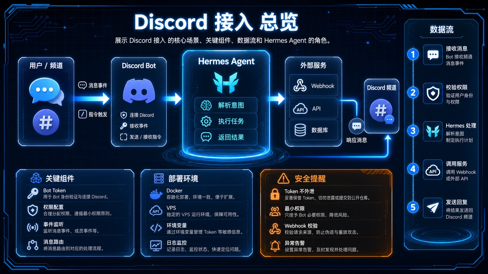
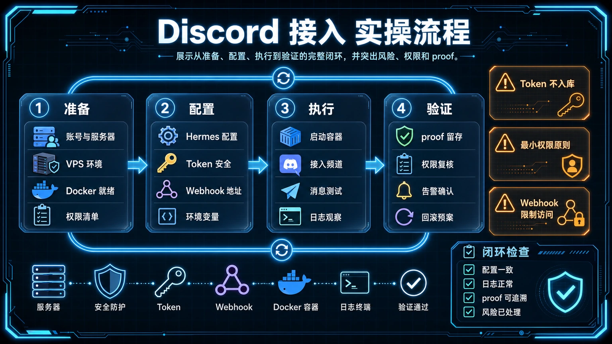

# 🎮 11-Discord 接入：让你的 AI 助手住进服务器

> 一句话先说清楚：这一页教你把 Hermes 接入 Discord 服务器，让团队成员在频道里 @ 一下 Bot 就能拿到 Agent 的回答，不用再切到 CLI 或 Telegram。



---

## 👀 适合谁

- 团队已经在用 Discord 当协作工具，想让 AI 助手也"住"进来
- 想要多人共享同一个 Bot、各自拥有独立会话的人
- 需要把 AI 拉进项目频道做实时问答、PR 通知、Bug 跟踪的人
- 已经接通 Telegram、想再开一个 Discord 入口的人

**前提条件**：
- 你有"管理服务器"权限，能把 Bot 拉进目标服务器
- Hermes 已经能在 CLI 跑通，并且 Gateway 能正常启动
- 你已经看过 [02-Telegram 消息入口接入](./02-Telegram%20消息入口接入.md) 知道 Gateway 是怎么工作的

**不适合谁**：
- 团队不用 Discord，只用微信 / 飞书 / 钉钉的人——这些平台没有官方 Bot API，不要硬接
- 想把 Bot 拉进几百人的开放社区"当群聊 AI 用"——Token 烧得快、上下文管理会爆炸，先用 Telegram 一对一跑顺
- 没装过 Hermes、Gateway 还没跑通的人——先回 [01-先跑起来](../01-先跑起来/01-总览.md)

---

## 🎯 为什么值得做（和 Telegram 的差异）

Telegram 是一对一的私人助手入口，Discord 是团队协作的公共入口。Hermes 接入 Discord 之后能干的事，和 Telegram 一起看就一目了然：

| 维度 | Telegram | Discord |
|---|---|---|
| 主要场景 | 个人对话、Cron 推送 | 团队频道、多人共用一个 Bot |
| 触发方式 | 直接发消息 | 默认必须 @Bot，可在指定频道免 @ |
| 会话隔离 | 按 User ID 天然隔离 | 默认按"用户 × 频道"隔离，互不串扰 |
| 线程 | 无原生线程 | 自动开 Thread，方便追溯讨论 |
| 语音 | 只能语音留言 | 可加入语音频道，"群聊式"对话 |
| 团队权限 | 白名单即可 | 配合 Role 做"管理员/普通用户"分级 |

一句话：Telegram 是私人 AI 管家，Discord 是团队 AI 同事。



---

## ✍️ 操作步骤：五步接通 Discord

### 第 1 步：在 Discord Developer Portal 创建 Application 和 Bot

1. 打开 [Discord Developer Portal](https://discord.com/developers/applications)
2. 点击 **New Application** → 起个名字（比如 `Hermes Team Bot`）→ 同意条款
3. 左侧菜单进入 **Bot** 页面
4. 可以在这里换头像、改用户名、写 Bot 描述
5. 点击 **Reset Token** → **复制 Bot Token**

> ⚠️ Token 只显示一次。和 Telegram Bot Token 一样，泄露了只能重新生成。
>
> 同时记下 **General Information** 页面里的 **Application ID**，下一步要用。

### 第 2 步：开启 Privileged Gateway Intents（关键一步）

这一步是 Discord 接入独有的，**漏掉 Bot 就在线但不响应消息**。

在 Bot 页面往下滚到 **Privileged Gateway Intents**：

| Intent | 是否必开 |
|---|---|
| Presence Intent | 选填 |
| Server Members Intent | **必开** |
| Message Content Intent | **必开** |

保存 Changes。

### 第 3 步：生成邀请链接，把 Bot 拉进服务器

在左侧菜单进入 **OAuth2**：

**方式 A：用 URL Generator（最简单）**

1. Scopes 勾选：`bot`、`applications.commands`
2. Bot Permissions 勾选（推荐权限整数：`274878286912`）：
   - View Channels
   - Send Messages
   - Send Messages in Threads
   - Embed Links
   - Attach Files
   - Add Reactions
   - Read Message History
3. 复制最下方生成的 URL → 在浏览器打开 → 选择服务器 → 授权

**方式 B：手动拼接 URL（私有 Bot 时用）**

```
https://discord.com/oauth2/authorize?client_id=你的APP_ID&scope=bot+applications.commands&permissions=274878286912
```

最小权限整数是 `117760`（不含 Embed / Thread / Reaction），但团队场景建议直接用推荐的 `274878286912`。

### 第 4 步：拿到你的 User ID 并配置 Hermes

**获取 User ID：**

1. Discord 设置 → **Advanced** → 打开 **Developer Mode**
2. 右键点你自己的头像 → **Copy User ID**
3. 得到一串 18 位数字（占位示例：`[REDACTED_USER_ID]`）

**配置 Hermes：**

**方式 A：交互式（推荐）**

```bash
hermes gateway setup
```

选 Discord → 粘贴 Bot Token → 输入 User ID。

**方式 B：手动编辑 `~/.hermes/.env`**

```bash
DISCORD_BOT_TOKEN=[REDACTED]

# 你的 User ID，多人用逗号分隔（示例为占位 ID）
DISCORD_ALLOWED_USERS=[REDACTED_USER_ID]

# （可选）想让 Bot 默认主动发消息到哪个频道（占位示例 Channel ID）
# DISCORD_HOME_CHANNEL=[REDACTED_CHANNEL_ID]
```

> 也可以用 Role 做白名单（占位示例 Role ID）：`DISCORD_ALLOWED_ROLES=[REDACTED_ROLE_ID]`，与 User ID 是 OR 关系。

### 第 5 步：启动 Gateway 并验证

```bash
hermes gateway
```

预期看到 Discord adapter 连接成功的日志。

到服务器里 **@你的Bot 你好** ——看是否回复。能回复就算通了。

确认无误后再装成服务：

```bash
hermes gateway install
```

---

## 🧩 Discord 独有的"频道/线程/自由回复"模式

接通只是起点。Discord 真正比 Telegram 强的是 **频道维度** 和 **线程维度** 的精细化控制。

### 三种频道响应模式

| 模式 | 配置 | 用途 |
|---|---|---|
| 默认：必须 @ | `DISCORD_REQUIRE_MENTION=true` | 团队频道里只回应被点名时 |
| 自由回复频道 | `DISCORD_FREE_RESPONSE_CHANNELS=频道ID1,频道ID2` | 指定几个"AI 频道"，不用 @ |
| 永远不响应 | `DISCORD_IGNORED_CHANNELS=频道ID1` | 把敏感频道拉黑（如 `#announce`、`#alert`） |

编辑 `~/.hermes/.env`：

```bash
# 通用频道需要 @
DISCORD_REQUIRE_MENTION=true

# 但 #ai-chat 和 #playground 不用 @（以下为占位示例 Channel ID）
DISCORD_FREE_RESPONSE_CHANNELS=[REDACTED_CHANNEL_ID],[REDACTED_CHANNEL_ID]

# #announce 和 #alert 永远不响应（占位示例 Channel ID）
DISCORD_IGNORED_CHANNELS=[REDACTED_CHANNEL_ID]
```

### 自动 Thread（默认开）

在通用频道里 @ Bot 时，Hermes 会自动创建一个 Thread 把对话放进去。这样：

- 频道主页不被刷屏
- 每个问题独立成线，回查清晰
- Thread 内的后续消息默认不需要再 @

关掉：`DISCORD_AUTO_THREAD=false`。

### 会话隔离（默认开）

同一个频道里 Alice 和 Bob 都 @ 了 Bot，他们各自的会话互相看不到。
配置项：`group_sessions_per_user: true`（默认）。

---

## 💡 使用心得

### 心得 1：先把"管理员"和"普通用户"分开

Discord 支持 Role-based 白名单。团队场景建议：

```bash
# 管理员：能用 /model、/restart 这种管理命令
DISCORD_ALLOWED_ROLES_ADMIN=ROLE_ID_管理员

# 普通用户：只能聊天
DISCORD_ALLOWED_ROLES=ROLE_ID_普通成员
```

避免每个团队成员都能 `/model` 把模型切到贵的。

### 心得 2：用"自由回复频道"做 AI 专区

不要让 Bot 在所有频道都响应。专门开几个频道（`#ai-assistant`、`#code-review`）设成 free-response，团队成员随便问。其他频道保持必须 @。

### 心得 3：Thread 是天然的会话管理

每个 Thread 自动成为独立 session。把不同问题放不同 Thread，避免上下文混淆。

### 心得 4：Cron 推送投递到 Discord

```bash
DISCORD_HOME_CHANNEL=频道ID
```

配置好后，Cron job 可以用 `deliver: discord` 把结果推到这个频道（比如每天早上的 build 状态汇总）。

---

## ⚠️ 踩坑提醒

### 1. Bot 在线但不响应消息

99% 是 **Message Content Intent** 没开。回 Developer Portal → Bot 页面 → Privileged Gateway Intents → 打开 Message Content Intent。

### 2. 邀请 Bot 时提示"缺少权限"

确认你有目标服务器的 **Manage Server** 权限。只是普通成员拉不了 Bot。

### 3. Bot Token 泄露

在 Developer Portal → Bot 页面点击 **Reset Token** 立即失效旧 Token，同步更新 `~/.hermes/.env`。

### 4. 用了普通 Discord 账号而不是 Bot 账号

Discord 区分 User Token 和 Bot Token。Hermes 必须用 Bot Token（在 Bot 页面生成的那种）。User Token 会导致账号被封禁。

### 5. 多人共用但没配白名单

和 Telegram 一样，不配 `DISCORD_ALLOWED_USERS` 任何人都能用你的 Bot，烧的是你的 Token。一定配上。

### 6. 反应（emoji）功能被关

默认 `DISCORD_REACTIONS=true`，Bot 处理消息时会出现 👀（处理中）、✅（完成）、❌（失败）三个反应。如果你的 Bot 完全没反应，检查是不是被关了。

---

## ✅ 推荐做法

| 做法 | 原因 |
|---|---|
| 必开 Message Content Intent | 没开就废了 |
| 用 Role 做白名单而非 User ID | 团队成员变动时不用改配置 |
| 开几个"AI 专区"频道做 free-response | 隔离干扰，提升体验 |
| 让 Cron 推送投到 Discord 频道 | 团队所有人共享关键事件 |
| Thread 模式默认开 | 自动管理会话上下文 |
| 服务器和 DM 用不同 session reset 策略 | 团队讨论可能持续很久，DM 反而需要频繁 reset |

---

## ✅ 过关标准

当你满足以下状态，这篇就算跑通了：

- Bot 在 Discord 服务器里能响应 @ 消息
- 团队成员各自跟 Bot 对话时互不串扰（同一频道独立 session）
- 至少配置了一个自由回复频道或忽略频道
- 白名单（User 或 Role）已配置，陌生人无法使用
- 你知道 `/platforms`、`/new`、`/status` 在 Discord 里怎么用

---

## ⬅️ 上一步

- [**10-Home Assistant 智能家居**](./10-Home%20Assistant%20智能家居.md)

## ➡️ 下一步

- [**12-MCP 接入指南：给 Hermes 装上"万能插头"**](./12-MCP%20接入指南.md)

## 📖 出处

本文基于以下来源做了原创中文整理：

- Hermes 官方文档 — [Discord Setup](https://hermes-agent.nousresearch.com/docs/user-guide/messaging/discord)
- Hermes 官方文档 — [Messaging Gateway](https://hermes-agent.nousresearch.com/docs/user-guide/messaging/)
- Discord Developer Portal — [Applications](https://discord.com/developers/applications)
- Discord Developer 文档 — [Privileged Gateway Intents](https://discord.com/developers/docs/topics/gateway#privileged-intents)
