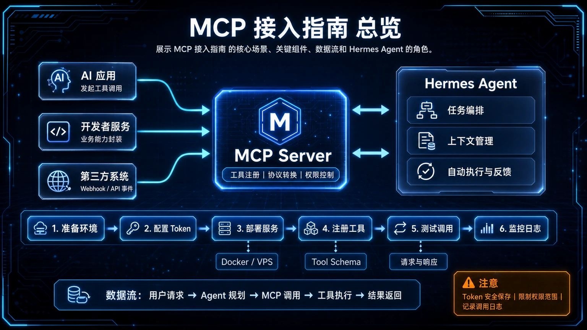
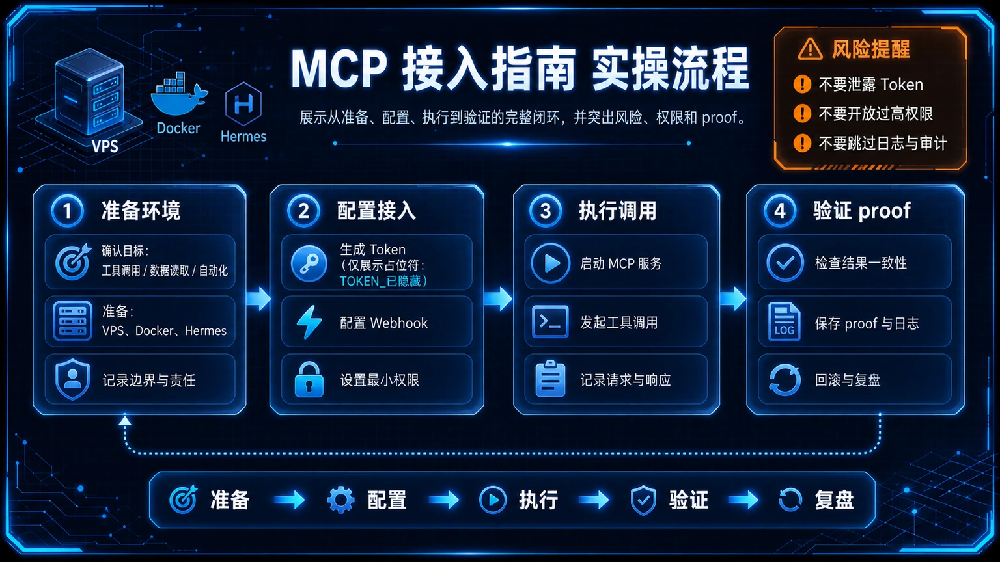

# 🔌 12-MCP 接入指南：给 Hermes 装上"万能插头"

> 一句话先说清楚：MCP（Model Context Protocol）是一个让 Hermes 调用外部工具的标准协议。装上 MCP 之后，你的 Agent 不只能"自己跑命令"，还能直接读 GitHub Issue、查 Linear 任务、操作 Postgres、浏览 Figma 设计稿——不用你写一行工具代码。



---

## 👀 适合谁

- 已经能让 Hermes 跑 CLI 命令，但想让 Agent 也能直接操作 GitHub、Linear、Notion、数据库等第三方系统
- 不想自己写 Python 工具代码、维护一堆私房 API wrapper
- 想用同一个协议统一管理"外部系统能力"的人
- 已经在用 Claude Desktop、Cursor、Cline 等 MCP 客户端，想让 Hermes 也能复用同一批 MCP Server

**前提条件**：
- Hermes 已安装并能正常对话
- 你大概知道什么是"工具调用"（function call），不需要会写代码
- 已经看过 [04-自己造东西/05-把 Hermes 接进外部系统](../04-自己造东西/05-把%20Hermes%20接进外部系统.md) 的概念

**不适合谁**：连 Hermes CLI 都没装好的人——先回 [01-先跑起来](../01-先跑起来/01-总览.md)。

---

## 🎯 为什么值得做（和"自己写工具"的差别）

Hermes 自带 30+ 工具（terminal、web、file、vision……），但都局限在"你这台机器上"。
要让它操作 GitHub、Linear、Notion、数据库，传统做法是：

1. 自己写 Python 工具
2. 注册到 registry
3. 维护 API 版本变化
4. 一台机器一台机器部署

MCP 把这件事标准化了：

| 维度 | 自己写工具 | 用 MCP |
|---|---|---|
| 上手成本 | 写代码 + 注册 + 测试 | 写几行 YAML |
| 维护成本 | API 变了你改代码 | 上游 MCP Server 改了，你升级版本就行 |
| 复用 | 只能在 Hermes 里用 | 同一个 MCP Server 在 Claude Desktop、Cursor、Cline 都能用 |
| 工具数 | 一人写 1-2 个顶天 | 社区已经有 100+ 个开箱即用 |

一句话：MCP 不是让你"用某个工具"，而是让你"接入一整个工具生态"。



---

## ✍️ 操作步骤：三步接通第一个 MCP Server

### 第 1 步：装 MCP 依赖

```bash
cd ~/.hermes/hermes-agent
uv pip install -e ".[mcp]"
```

> 如果你是用 `pip install hermes-agent` 装的，改成：
> ```bash
> pip install "hermes-agent[mcp]"
> ```

### 第 2 步：选一个 MCP Server，加进 config.yaml

打开 `~/.hermes/config.yaml`，找到（或新建）`mcp_servers` 段。

**例 1：GitHub MCP Server（stdio，本地子进程）**

```yaml
mcp_servers:
  github:
    command: "npx"
    args: ["-y", "@modelcontextprotocol/server-github"]
    env:
      GITHUB_PERSONAL_ACCESS_TOKEN: "${GITHUB_TOKEN}"
```

> `${GITHUB_TOKEN}` 会在连接时从环境变量（包括 `~/.hermes/.env`）读取，**不会**写到 config.yaml 里。

**例 2：Linear MCP Server（HTTP + OAuth，远程托管）**

```yaml
mcp_servers:
  linear:
    url: "https://mcp.linear.app/mcp"
    auth: oauth
```

第一次跑会触发浏览器 OAuth，登录 Linear 授权一次即可。

**例 3：本地文件系统 MCP Server**

```yaml
mcp_servers:
  filesystem:
    command: "npx"
    args: ["-y", "@modelcontextprotocol/server-filesystem", "/home/you/projects"]
    tools:
      include: [read_file, list_directory, search_files]
```

`tools.include` 是白名单：只暴露这三个工具给 Agent，不让它写或删文件。

### 第 3 步：重启 Hermes，验证工具被发现

```bash
hermes
```

新会话启动时 Hermes 会去 ping 所有 MCP Server，把它们的工具注册成内部工具。

验证：

```text
列出你当前所有可用的 MCP 工具。
```

或者直接试一个：

```text
列出 GitHub 上 nousresearch/hermes-agent 仓库最近 10 个 open issue。
```

如果 Agent 调用了 `mcp_github_list_issues` 这种工具并返回真实数据，说明 MCP 通了。

---

## 🧭 一键安装 Catalog（最快路径）

Hermes 内置了一个 Nous 团队审过的 MCP Catalog，不用自己拼 YAML：

```bash
hermes mcp                # 交互式选择
hermes mcp catalog        # 看完整列表
hermes mcp install n8n    # 按名字装
hermes mcp configure linear  # 后续改工具白名单
```

Catalog 里的 MCP 都经过 PR Review，但**装之前还是建议看一眼 manifest**，特别是 `source:` 和 `transport.command:` 这两段。

---

## 🧩 MCP 工具的命名规则（容易踩坑）

Hermes 会给 MCP 工具加前缀，避免和内置工具冲突：

| MCP Server | MCP 原始工具名 | Hermes 内部工具名 |
|---|---|---|
| `github` | `create_issue` | `mcp_github_create_issue` |
| `linear` | `search-tickets` | `mcp_linear_search-tickets` |
| `my-api` | `query.data` | `mcp_my_api_query.data` |

记住这个规则，下次你在 `/tools` 里看到 `mcp_*` 开头的就知道是 MCP 暴露的。

---

## 🛡 工具白名单和黑名单

MCP Server 可能暴露 20 个工具，你不一定都想给 Agent 用。

### 白名单（只暴露这几个）

```yaml
mcp_servers:
  github:
    command: "npx"
    args: ["-y", "@modelcontextprotocol/server-github"]
    tools:
      include: [list_issues, get_issue, create_comment]
```

### 黑名单（暴露除了这几个之外的）

```yaml
mcp_servers:
  github:
    tools:
      exclude: [delete_issue, delete_repo]
```

> 两个都写时，`include` 优先。

### 整个 Server 暂时关掉

```yaml
mcp_servers:
  legacy:
    enabled: false
```

---

## 🔁 OAuth MCP 的注意事项（远程部署）

Linear、Sentry、Atlassian、Figma、Stripe 这些都用 OAuth。流程是：

1. 第一次连接时 Hermes 启动一个本地 loopback HTTP 服务
2. 跳转到浏览器让你登录授权
3. Token 缓存到 `~/.hermes/mcp-tokens/<server>.json`（0600 权限）

**两个常见坑：**

**坑 1：VPS 上跑 Hermes，浏览器打不开**

OAuth 需要 loopback 回调，远程机器上没法直接弹浏览器。解决：

```bash
ssh -N -L 8910:127.0.0.1:8910 user@your-vps
```

把 VPS 上的 8910 端口转发到本地，然后在本地浏览器打开授权页面。

**坑 2：Google Drive / Atlassian 不支持自动注册客户端**

这些平台不允许 dynamic client registration，你得自己申请 OAuth Client：

```yaml
mcp_servers:
  googledrive:
    url: "https://drivemcp.googleapis.com/mcp/v1"
    auth: oauth
    oauth:
      client_id: "<你的 OAuth client id>"
      client_secret: "<你的 OAuth client secret>"
```

然后跑一次 `hermes mcp login googledrive`，5 分钟内会完成授权。

---

## 💡 使用心得

### 心得 1：stdio vs HTTP 怎么选

- **stdio**：MCP Server 跟 Hermes 跑在同一台机器，作为子进程启动。延迟低，但占资源。
- **HTTP**：MCP Server 在远端托管（Linear、Sentry 这种 SaaS 都是 HTTP）。本机零资源，但需要网络通。

社区提供的 MCP 多数两种都有，按你的环境选。

### 心得 2：MCP 工具不要全开

Catalog 里有几十个 MCP，全开会让系统提示膨胀、Token 成本飞涨。建议按"我现在真实需要"逐步装：

- 写代码 → 装 GitHub MCP
- 做 PM → 装 Linear / Notion MCP
- 做数据分析 → 装 Postgres / SQLite MCP

### 心得 3：MCP Server 启动失败不会让 Hermes 挂

某个 MCP Server 连不上时，Hermes 只是跳过它，不会崩溃。看日志：

```bash
tail -50 ~/.hermes/logs/errors.log
```

如果看到 `MCP server github: connection failed`，多半是 Token 没配或 npx 没装。

### 心得 4：把 `${VAR}` 占位符用起来

不要把 Token 硬编码进 config.yaml。用环境变量占位：

```yaml
mcp_servers:
  postgres:
    command: "uvx"
    args: ["mcp-server-postgres"]
    env:
      DATABASE_URL: "${POSTGRES_URL}"
```

然后在 `~/.hermes/.env` 写 `POSTGRES_URL=postgresql://...`。

### 心得 5：MCP 是"扩展点"不是"替换"

MCP 装了 GitHub MCP，不代表 Hermes 内置的 `terminal` / `file` / `web` 没用了。**MCP 是补位**——让 Agent 能调用原本没有的能力。两套并存。

---

## ⚠️ 踩坑提醒

### 1. 没装 mcp extra 就开始改 config

`pip install hermes-agent` 默认不带 mcp。报错信息里看到 `ImportError: mcp` 时，回去补：

```bash
pip install "hermes-agent[mcp]"
```

### 2. `${VAR}` 没生效

config.yaml 里**只能用 `${VAR}` 这种大括号语法**，`$VAR` 不会展开。如果 token 在 .env 里但 MCP 连接报"unauthorized"，先检查变量名拼写和 `${}` 语法。

### 3. npx 不存在

stdio MCP Server 很多用 `npx` 启动。没装 Node.js 时会报 `command not found`：

```bash
# Ubuntu/Debian
curl -fsSL https://deb.nodesource.com/setup_lts.x | sudo -E bash -
sudo apt install -y nodejs

# macOS
brew install node
```

### 4. 编辑 config.yaml 时正在跑 session

OAuth 类 MCP 的配置在跑着的会话里改不会生效。退出 CLI → 改配置 → 重新启动。

### 5. Catalog 里的 MCP 不会自动更新

Catalog 装的时候是当时最新版本，**Hermes 升级时不会自动升级已装的 MCP**。要更新：

```bash
hermes mcp install <name>
```

再装一次就是升级。

---

## ✅ 推荐做法

| 做法 | 原因 |
|---|---|
| 用 `hermes mcp` 交互式安装 | 比手写 YAML 不容易出错 |
| Token 一定走 `${VAR}` 占位 | 不把密钥写进 config |
| 给每个 MCP Server 配 `tools.include` | 控制 Agent 能力边界 |
| 装完先在 CLI 验证一次 | 确认工具被注册 |
| 远程机器用 SSH 转发做 OAuth | 避免授权卡住 |
| 不要把 Catalog 全装 | 控制系统提示和 Token 成本 |

---

## ✅ 过关标准

当你满足以下状态，这篇就算跑通了：

- 至少一个 MCP Server 被成功注册（用 `hermes mcp list` 能看到）
- 在对话里能调用 MCP 暴露的工具（比如 GitHub MCP 的 `list_issues`）
- 知道怎么用 `tools.include / exclude` 控制暴露范围
- 知道怎么排查 MCP 启动失败

---

## ⬅️ 上一步

- [**11-Discord 接入：让你的 AI 助手住进服务器**](./11-Discord%20接入.md)

## ➡️ 下一步

- [**13-Ollama 本地模型：让 Hermes 完全免费跑起来**](./13-Ollama%20本地模型.md)

## 📖 出处

本文基于以下来源做了原创中文整理：

- Hermes 官方文档 — [MCP (Model Context Protocol)](https://hermes-agent.nousresearch.com/docs/user-guide/features/mcp)
- Anthropic MCP 官方规范 — [modelcontextprotocol.io](https://modelcontextprotocol.io/)
- Hermes 官方文档 — [Configuration: mcp_servers](https://hermes-agent.nousresearch.com/docs/user-guide/configuration)
- 社区 MCP Server 列表 — [awesome-mcp-servers](https://github.com/modelcontextprotocol/servers)
