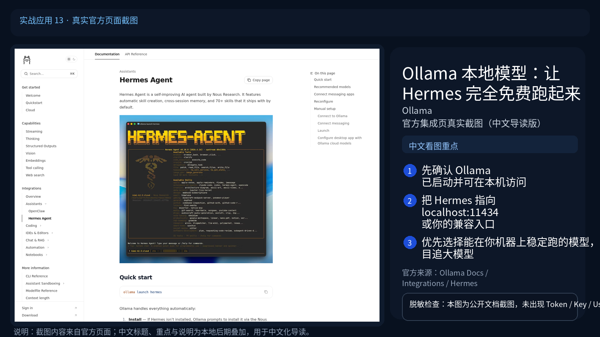

# 🦙 13-Ollama 本地模型：让 Hermes 完全免费跑起来

> 一句话先说清楚：这一页讲的是怎么让 Hermes 接入 Ollama 作为推理后端，跑在自家显卡上——零账单、零数据出网、零外部 API 依赖。但更重要的是讲清楚"什么时候值得用，什么时候会反过来拖累你"。



---

## 👀 适合谁

- 有空闲显卡（≥8 GB 显存），想让 Hermes 跑日常任务不再烧云端 Token
- 关心数据隐私，不想把公司代码或客户对话发给 OpenAI / Anthropic
- 想做一套"本地兜底 + 云端高难度"的混合模型路由
- 已经在玩 Ollama，想把它接到 Hermes 上做真正的 Agent 工作

**前提条件**：
- Hermes 已经能正常用云端模型对话
- 你大致清楚自己机器的显存大小
- 知道 [04-月费 8 美金三层模型级联省钱指南](./04-月费8美金三层模型级联省钱指南.md) 的三层路由思路

**不适合谁**：
- 显卡只有 4 GB 显存（最小可用模型也吃力）
- 完全没有 GPU（CPU 推理 Qwen2.5-7B 都要 30 秒/回复，没意义）
- 想要"完全免费跑得跟 Claude 一样快"——这种好事不存在

---

## 🎯 为什么值得做（以及边界在哪）

先把丑话说清楚：**本地模型 ≠ 云端模型的免费替代**。它是一个有清晰边界的能力。

| 维度 | 云端模型（Claude、GPT、GLM） | 本地模型（Ollama 跑 Qwen、Llama） |
|---|---|---|
| 单次成本 | 按 Token 计费 | 零账单 |
| 响应速度 | 1-3 秒首 Token | 看 GPU，10-50 Token/s |
| 上下文窗口 | 200K+ | 8K-32K 居多 |
| 工具调用 | 稳定 | 需要选对模型，且容易出错 |
| 视觉理解 | 顶级模型原生支持 | 多模态本地模型极少 |
| 数据出网 | 是 | 否 |
| 可用性 | 看 API 状态 | 显卡在你机器上，永远可用 |
| 复杂推理 | 强 | 弱（参数量限制） |

**结论：本地模型适合"低频/隐私/兜底"场景，不适合做主力 Agent 引擎。**

具体怎么用，看下一节的实操边界。

---

## 🧭 实操边界：什么场景用什么

### ✅ 适合本地模型

| 场景 | 为什么合适 | 推荐模型 |
|---|---|---|
| 总结、改写、翻译 | 简单文本任务，7B 模型够用 | `qwen2.5:7b`、`llama3.1:8b` |
| 离线代码补全 | 不出网、低延迟 | `qwen2.5-coder:7b` |
| 隐私文档问答 | 数据不出机器 | `qwen2.5:14b`（需 16GB 显存） |
| Cron 跑"是否要继续"的判断 | 不需要复杂推理 | `qwen2.5:3b`（轻量） |
| 开发/调试 prompt | 烧的是电费不是 Token | 任意 |
| SOUL 人格对话 | 风格化任务，本地模型够 | `qwen2.5:7b` |

### ❌ 不适合本地模型

| 场景 | 为什么不行 |
|---|---|
| 复杂工具调用链（多 Agent 编排） | 工具调用准确率低，容易卡在循环里 |
| 长文档总结（>32K 输入） | 上下文窗口不够 |
| 视觉理解（截图分析、PDF 解析） | 本地多模态模型效果差 |
| 复杂代码重构 | 弱模型会改坏 |
| Web Search 后的多源信息综合 | 推理能力不够 |

**实操建议：把本地模型放在三层路由的"日常层"，复杂任务路由到云端。**

---

## ✍️ 操作步骤：把 Ollama 接到 Hermes

### 第 1 步：装 Ollama 并拉模型

```bash
# 一键安装（Linux/macOS）
curl -fsSL https://ollama.com/install.sh | sh

# 拉一个 7B 模型（Qwen2.5 中文不错，~5GB 下载）
ollama pull qwen2.5:7b

# 试一下能不能跑
ollama run qwen2.5:7b "你好，请用一句话介绍你自己"
```

确认模型能正常出字。Ollama 默认监听 `127.0.0.1:11434`。

### 第 2 步：把 Ollama 注册成 Hermes 的 Provider

**方式 A：用 `hermes model`（推荐）**

```bash
hermes model
# 选 "Ollama Cloud"（云托管版）或 "LM Studio / Ollama"（本地）
# 输入 base_url: http://127.0.0.1:11434/v1
# 不需要 API Key
```

**方式 B：手动改 config.yaml**

```yaml
model:
  default: qwen2.5:7b
  provider: ollama
  base_url: http://127.0.0.1:11434/v1
  api_key: "ollama"   # 占位符，Ollama 不校验
```

### 第 3 步：验证连通性

```bash
hermes chat -q "用中文介绍一下你自己" -m qwen2.5:7b --provider ollama
```

如果 5-10 秒内开始出字、30 秒内出完，说明本地推理跑通了。

### 第 4 步：把它加进三层路由（关键一步）

参考 [04-月费 8 美金三层模型级联省钱指南](./04-月费8美金三层模型级联省钱指南.md)，把 Ollama 设为"日常任务"层：

```yaml
routing:
  tiers:
    - name: 日常-本地
      provider: ollama
      model: qwen2.5:7b
      use_for: [translation, summary, formatting]
    
    - name: 分析-云端
      provider: openrouter
      model: anthropic/claude-haiku-4
      use_for: [research, code_review]
    
    - name: 复杂-云端
      provider: anthropic
      model: claude-sonnet-4
      use_for: [complex_reasoning, long_context]
```

让简单任务自动走本地、零成本。

---

## 🔧 性能调优（N 卡用户）

Ollama 默认会用 CUDA（如果有）。可以调的几个参数：

### 1. 指定 GPU

```bash
CUDA_VISIBLE_DEVICES=0 ollama serve
```

### 2. 调整上下文长度（默认 2048 太短）

启动 Ollama 时改：

```bash
OLLAMA_NUM_PARALLEL=2 OLLAMA_MAX_LOADED_MODELS=2 ollama serve
```

或者在跑模型时指定：

```bash
ollama run qwen2.5:7b --ctx-size 8192
```

### 3. 量化版本

显存吃紧的话，用量化版本：

```bash
ollama pull qwen2.5:7b-instruct-q4_K_M
```

4-bit 量化把显存从 ~6GB 压到 ~4GB，准确度损失约 2-5%。

---

## 💡 使用心得

### 心得 1：本地模型 + 工具调用 = 容易翻车

7B-14B 本地模型在工具调用（function call）上准确率明显低于 Claude Sonnet / GPT-4o。如果某个工具调用任务频繁失败，先试试把它切到云端模型。

```bash
# 临时切云端
/model anthropic/claude-sonnet-4
```

### 心得 2：长上下文的代价是显存

Qwen2.5-7B 用 32K 上下文，显存占用从 6GB 涨到 10GB+。不是显存够就能开很大，要看 token-per-second 还能不能接受。

### 心得 3：Cron 任务跑本地模型最香

Cron 任务多在凌晨跑，不抢你的工作时段显卡。把每天早上的新闻摘要、周报生成、文件整理这种"简单但重复"的任务跑在本地 Ollama 上，能省 80% 的 Token 账单。

### 心得 4：用 [SILENT] 抑制空跑

参考 [01-用 Hermes 做每日晨间简报](./01-用%20Hermes%20做每日晨间简报.md) 的 `[SILENT]` 技巧，让本地模型先判断"今天有没有值得报的事"，没有就直接退出。

### 心得 5：远端访问 Ollama 需要 SSH 隧道

Ollama 默认绑 127.0.0.1，外部访问需要：

```bash
# 启动时绑定 0.0.0.0
OLLAMA_HOST=0.0.0.0:11434 ollama serve

# 或者 SSH 隧道（更安全）
ssh -N -L 11434:127.0.0.1:11434 user@your-gpu-server
```

---

## ⚠️ 踩坑提醒

### 1. 显存不够模型自动卸载

Ollama 显存不够时会回退到 CPU 推理，速度直接掉到 1-2 Token/s。看日志确认：

```bash
ollama ps
# 看是 GPU 还是 CPU
```

### 2. 模型名带 tag 不一致

`qwen2.5:7b` 和 `qwen2.5:7b-instruct-q4_K_M` 是不同模型。在 Hermes config 里写的模型名必须和 `ollama list` 里显示的完全一致。

### 3. Ollama 服务没启动就跑 Hermes

```bash
systemctl status ollama   # 看服务
ollama serve              # 手动启动（调试用）
```

### 4. 工具调用陷入死循环

7B 模型有时候会反复调同一个工具。在 SOUL.md 里加一条规则：

```text
如果同一个工具连续调用超过 3 次还没拿到结果，直接告诉我"工具调用失败"，不要再试。
```

### 5. base_url 写错

Hermes 的 `model.base_url` 是 **OpenAI 兼容端点**，Ollama 是 `/v1` 结尾：

```yaml
# 对
base_url: http://127.0.0.1:11434/v1

# 错（少 /v1）
base_url: http://127.0.0.1:11434
```

### 6. 用本地模型跑视觉任务

Qwen2.5-VL 这种多模态本地模型在 Ollama 里效果比云端 GPT-4o 差一截。需要看图分析的任务还是建议走云端。

---

## ✅ 推荐做法

| 做法 | 原因 |
|---|---|
| 用 7B 起步，跑通再考虑 14B | 7B 显存友好，验证流程够用 |
| 本地只做轻量任务 | 工具调用复杂场景留给云端 |
| 把它配进三层路由的"日常层" | 真正省钱的关键 |
| 量化模型先试 | 4-bit 损失小但显存省一半 |
| Cron 任务优先跑本地 | 凌晨不抢你工作时间 |
| 长上下文任务留云端 | 32K 上下文的本地推理会很慢 |

---

## ✅ 过关标准

当你满足以下状态，这篇就算跑通了：

- Ollama 跑起来了，能用 `ollama run` 直接对话
- Hermes 能切到 Ollama Provider 完成简单任务（比如翻译一段文字）
- 三层路由配置里，至少有一种任务被路由到 Ollama
- 你清楚知道哪些任务**不该**跑在本地（视觉、长上下文、复杂工具链）

---

## ➡️ 下一步

完成后进入：
[14-GitHub PR 自动审查：给仓库配一个不睡觉的 Code Reviewer](<./14-GitHub PR 自动审查.md>)

如果你想先回到上一阶段入口重新确认位置：
[05-实战应用总览](./01-总览.md)

---

## 📖 出处

本文基于以下来源做了原创中文整理：

- Hermes 官方文档 — [AI Providers: Ollama / LM Studio](https://hermes-agent.nousresearch.com/docs/integrations/providers)
- Ollama 官方文档 — [ollama.com](https://ollama.com/)
- QwenLM 官方 — [Qwen2.5 模型卡](https://qwenlm.github.io/blog/qwen2.5/)
- Hermes 实战 [04-三层模型级联省钱指南](./04-月费8美金三层模型级联省钱指南.md)
