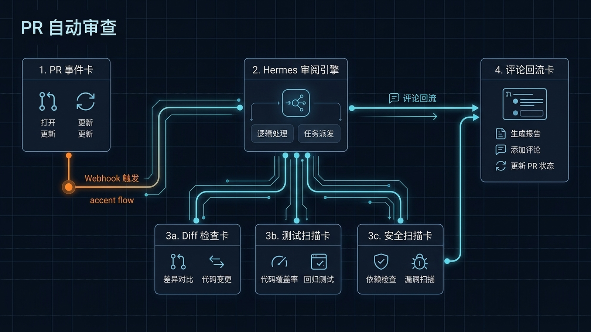

# 🔍 14-GitHub PR 自动审查：给仓库配一个不睡觉的 Code Reviewer

> 一句话先说清楚：这一页教你把 Hermes 变成一个"PR 打开瞬间自动跑检查 + 留评论"的 Code Reviewer。区别于手动 `/review`：它不是"被人叫才看"，而是仓库一有动静它就干活。



---

## 👀 适合谁

- 个人维护一两个开源仓库，没人帮你 review，但又不放心直接 merge
- 小团队想给 PR 加一层"24 小时值班的初筛"
- 已经在用 GitHub Actions 跑 CI，但 CI 只能查 lint / test，查不出"逻辑反模式"
- 想试用 AI Code Review 但不想花钱买 CodeRabbit / Greptile 这种 SaaS

**前提条件**：
- 你有一个 GitHub 仓库，且有 admin 权限
- Hermes 已经能在 VPS 上 7×24 在线（参考 [06-VPS 自托管 Hermes](./06-VPS%20自托管%20Hermes.md)）
- 已经看过 [03-GitHub 备份 Cron Job](./03-GitHub%20备份%20Cron%20Job.md)，知道怎么配 GitHub Token
- 你的 Hermes 装了 `github-code-review` skill

**不适合谁**：
- 还没把 Hermes 跑起来过的人——先回 [01-先跑起来](../01-先跑起来/01-总览.md)
- 仓库 PR 量大到一天 50+，建议直接用专业 SaaS

---

## 🎯 为什么值得做（和手动 /review 的差别）

很多人用 Hermes 时是这么 review 的：朋友发来一个 PR 链接，复制 diff 喂给 Hermes，让它评一下。这能用，但是：

| 维度 | 手动 /review | 自动 PR Reviewer |
|---|---|---|
| 触发时机 | 你想起来才用 | PR 一打开就跑 |
| 一致性 | 每次标准不一样 | 用同一份 checklist |
| 覆盖范围 | 你想到了才查 | 标准化清单全覆盖 |
| 留痕 | 对话记录里翻 | 评论留在 PR 里 |
| 团队复用 | 别人不知道你查了啥 | 所有人能看到 Bot 的反馈 |

一句话：手动 review 是"个人帮手"，自动 reviewer 是"团队基础设施"。

---

## ✍️ 操作步骤：四步搭起自动审查流水线

### 第 1 步：装好 GitHub Token

参考 [github-auth skill](https://hermes-agent.nousresearch.com/docs/integrations/providers) 或直接：

```bash
# 在 ~/.hermes/.env 里加
GITHUB_TOKEN=ghp_***
```

> 用 fine-grained PAT，scope 只给目标仓库 + Contents Read + Pull Requests Read+Write + Issues Read+Write。
> 不要用 `ghp_` 开头的 classic PAT，已被 Hermes 弃用。

验证：

```bash
hermes chat -q "用 GitHub 工具列出 nousresearch/hermes-agent 仓库最近 5 个 open PR"
```

### 第 2 步：加载 code-review skill

```bash
hermes skills list
```

如果没看到 `github-code-review`：

```bash
hermes skills install github-code-review
```

装好之后确认 skill 被启用：

```bash
hermes skills config
# 给 CLI 和 Gateway 都开
```

### 第 3 步：建立"PR 事件 → Hermes"的触发桥

这一步是关键，有两种方案：

**方案 A：GitHub Actions 触发（最简单）**

在目标仓库加一个 `.github/workflows/hermes-pr-review.yml`：

```yaml
name: Hermes PR Review

on:
  pull_request:
    types: [opened, synchronize, reopened]

jobs:
  review:
    if: github.event.pull_request.draft == false
    runs-on: ubuntu-latest
    steps:
      - name: Trigger Hermes
        env:
          HERMES_WEBHOOK_URL: ${{ secrets.HERMES_WEBHOOK_URL }}
        run: |
          curl -X POST "$HERMES_WEBHOOK_URL" \
            -H "Content-Type: application/json" \
            -d '{
              "repo": "${{ github.repository }}",
              "pr_number": ${{ github.event.pull_request.number }},
              "sha": "${{ github.event.pull_request.head.sha }}",
              "action": "${{ github.event.action }}"
            }'
```

在 Hermes 端开一个 webhook：

```bash
hermes webhook subscribe pr-review
```

Hermes 会监听 `/webhooks/pr-review`，把进来的 payload 当成 prompt 处理。

**方案 B：纯 Hermes Cron 轮询（适合不想动 Actions 的）**

```bash
hermes cron create "*/10 * * * *" "列出 myorg/myrepo 仓库所有 open、最近 10 分钟内有更新的 PR。
对每个 PR 用 github-code-review skill 做一次 review，
把检查结果作为评论发到对应 PR。如果评论已存在，跳过。
"
```

轮询方案的代价是有 10 分钟延迟，优点是不需要碰 Actions 配置。

### 第 4 步：写一份固定 Checklist（强制一致性的关键）

在仓库根目录放一份 `.hermes/review-checklist.md`：

```markdown
## Review Checklist

每次 PR review 必查：

1. **类型安全**：是否引入 any / unknown 滥用？
2. **错误处理**：异常是否被吞掉？
3. **测试覆盖**：新增逻辑有没有对应测试？
4. **依赖安全**：是否引入了有漏洞的依赖？
5. **API 兼容**：是否破坏了对外 API？
6. **性能红线**：是否有 N+1 查询、循环里调外部 API？
7. **文档同步**：API/行为变更是否更新了文档？

不要查的：
- 代码风格（lint 工具负责）
- 命名（personal preference）
```

让 skill 加载这份清单：

```bash
hermes webhook subscribe pr-review --skill github-code-review
```

或者直接在 Cron prompt 里引用：

```text
按 .hermes/review-checklist.md 的清单做 review。
```

### 第 5 步：验证一个 PR

开一个测试 PR（故意改点东西），观察：

- Hermes 日志里看到 webhook 收到事件
- Agent 调用 GitHub 工具读 diff、读文件
- Agent 用 PR 评论 API 留下评论
- 评论结构化，每条 checklist 项有结论

如果评论没出来，看 `~/.hermes/logs/errors.log`。

---

## 🧩 三种评论模式

### 模式 1：总结式（默认）

PR 评论里给一段 Markdown 总结：

```markdown
## Hermes Code Review

✅ 测试覆盖完整
⚠️ src/auth.py L42 异常被 catch 但没记日志
🚫 src/db.py L78 引入了 N+1 查询

整体建议：merge 前修复 db.py 的问题。
```

### 模式 2：行内评论

通过 GitHub API 把每条问题作为 inline comment 留在对应代码行：

```bash
gh api repos/OWNER/REPO/pulls/NUMBER/comments \
  -f body="⚠️ 这里异常被 catch 但没记日志" \
  -F line=42 \
  -F path="src/auth.py" \
  -F commit_id="HEAD_SHA"
```

### 模式 3：失败状态

检查到严重问题时，把 PR commit status 设成 failure：

```bash
gh api repos/OWNER/REPO/statuses/SHA \
  -f state="failure" \
  -f description="Hermes Review: N+1 query in db.py" \
  -f context="Hermes/CodeReview"
```

CI 这时会显示 ❌，提示作者必须修复才能合并。

---

## 💡 使用心得

### 心得 1：用"draft PR 不审查"过滤噪音

WIP 的 PR 没必要审查。在 Actions 触发条件里加：

```yaml
if: github.event.pull_request.draft == false
```

或者在 Hermes prompt 里：

```text
如果是 draft PR，跳过 review。
```

### 心得 2：限定每次只 review 改动的文件

PR 越大，AI review 越不准。给 skill 加一条：

```text
只看 diff 涉及的文件，不要 review 整个仓库。
```

### 心得 3：合并已有评论

同一个 PR 多次更新会触发多次 review，让 Hermes 跳过已经评论过的：

```text
先列出现有 review 评论，如果某个问题已经在评论里被指出过，不要重复。
```

### 心得 4：选对模型

review 是典型的"高质量推理"任务。**不要用便宜模型做 review**。建议：

- `anthropic/claude-sonnet-4`：综合最佳
- `openai/gpt-4o`：长 diff 表现稳定
- `anthropic/claude-haiku-4`：简单 PR 可以

### 心得 5：把检查结果归档到 Obsidian

参考 [08-Obsidian 第二大脑知识库](./08-Obsidian%20第二大脑知识库.md)，每次 review 后把结果存到 Obsidian：

```text
Review 完成后，把摘要追加写入 Obsidian 仓库的 "Reviews/<repo>/<date>.md"。
```

时间长了能看出团队的常见问题模式。

---

## ⚠️ 踩坑提醒

### 1. Token 权限不全

PAT 缺 `Pull requests: write` 时评论会失败。Hermes 看到的是 403：

```bash
# 验证
curl -H "Authorization: token $GITHUB_TOKEN" \
  https://api.github.com/repos/OWNER/REPO/pulls/1/comments
```

### 2. PR diff 太大

PR 改动 5000+ 行时，单次 review 容易超时或上下文爆。在 SOUL.md 里加：

```text
如果 diff > 1000 行，分批 review，每批最多 500 行。
```

### 3. 重复评论刷屏

每次 PR push 都触发 review 会刷屏。在 webhook payload 里加个 dedup hash，或者：

```bash
hermes webhook subscribe pr-review --throttle 30m
```

### 4. AI 幻觉，给不存在的代码挑刺

模型有时候会"基于文件名猜测内容"然后挑刺。让 Hermes 在评论前先 `gh api` 拉真实文件内容。

### 5. 用便宜模型导致评论胡说

Haiku / 7B 本地模型做 review 经常给出"看着有理实际错误"的建议。review 这种事烧 Token 是值得的，别在这省钱。

### 6. 评论语气得罪人

让 Agent 用"建议"而不是"错误"：

```text
评论语气保持友好，用"建议"而非"错误"，避免让人感觉被指责。
```

---

## ✅ 推荐做法

| 做法 | 原因 |
|---|---|
| 用 fine-grained PAT 而不是 classic | 权限可控可撤销 |
| Draft PR 不审查 | 减少噪音 |
| 限定 review 改动的文件 | 避免 diff 过大失焦 |
| 用 Sonnet / GPT-4o 级模型 | review 是推理密集任务 |
| 给 skill 写死 checklist | 一致性是 Bot 的核心价值 |
| 加 throttle 避免刷屏 | 多次更新同一 PR 别连发 |
| 把结果归档到 Obsidian | 长期看出团队问题模式 |

---

## ✅ 过关标准

当你满足以下状态，这篇就算跑通了：

- 一个新 PR 打开后，Hermes 自动跑了一次 review 并评论
- 评论内容覆盖了你定的 checklist，不是泛泛而谈
- 第二次更新同一 PR 时不会重复评论已指出的问题
- 失败的检查会以 inline comment 或 status check 形式呈现
- 你知道怎么调试"webhook 没触发"

---

## ❓ FAQ：Webhook 入站与多平台分发

<a id="faq-webhook-what-and-how"></a>

### Q1｜Hermes 的 Webhook 入站是什么？怎么用它接 GitHub / GitLab / n8n / Make？

**速答**：Webhook 入站是 Hermes 的"被外部系统触发"机制——GitHub PR 打开、GitLab push、n8n 工作流跑完、Make.com 接到新事件，都可以通过 HTTP POST 打到 Hermes 的 webhook endpoint，由 Hermes 路由到对应的 skill 或 agent 执行，再把结果通过 deliver 推回 Telegram / Discord / 飞书 / 钉钉 / 企业微信 / 微信。

**和 cron 的区别**：
- `hermes cron` = 时间触发（每 30 分钟、每天 9 点）
- Webhook 入站 = 事件触发（GitHub 那边有动静就打过来）

**最短路径**：

```bash
# 1. 看已订阅的 webhook
hermes webhook list

# 2. 订阅一个 GitHub PR 事件
hermes webhook subscribe pr-review \
  --source github \
  --event pull_request.opened \
  --skill github-code-review

# 3. 测试一次（不依赖真实 GitHub 事件）
hermes webhook test pr-review --payload ./test-payload.json
```

**HMAC 验签（强烈建议开）**：

GitHub / GitLab 推过来的 webhook 必须验签，防止有人伪造请求触发你的 agent。Hermes 支持 HMAC-SHA256：

```bash
hermes webhook subscribe pr-review \
  --source github \
  --secret $WEBHOOK_SECRET
```

GitHub 那边配同一个 secret，Hermes 收到请求时会验签，验不过直接丢弃。

**deliver 路由：触发完往哪儿推结果**

webhook 触发 skill 跑完后，结果默认进会话历史。如果你想让结果自动推到某个消息平台，用 `--deliver`：

```bash
hermes webhook subscribe pr-review \
  --source github \
  --skill github-code-review \
  --deliver telegram:-1001234567890:pr-review-topic
```

支持的 deliver 目标：`telegram`、`discord`、`feishu`、`dingtalk`、`wecom`、`weixin`。

**常见误判**：
- 以为 webhook 不通是 Hermes 的 bug → 多数情况是 GitHub 那边 secret 没配对，或 Hermes 服务没暴露公网
- 以为 webhook 能取代 cron → 错，cron 是时间触发，webhook 是事件触发，两者不重叠

来源：[官方文档 — Webhooks](https://hermes-agent.nousresearch.com/docs/zh-Hans/user-guide/messaging/webhooks)；[YouTube — Hermes + Webhooks 实战](https://www.youtube.com/watch?v=WNYe5mD4fY8)；[02-CLI 命令参考 — `hermes webhook`](../06-reference/02-CLI%20命令参考.md)。

---

<a id="faq-webhook-vs-api-server"></a>

### Q2｜Webhook 入站和 API Server / Hermes Proxy 是同一个东西吗？

**速答**：不是。三者方向完全不同：

| 机制 | 方向 | 用途 |
|------|------|------|
| **Webhook 入站** | 外部 → Hermes | GitHub / n8n / Make 推事件给 Hermes |
| **API Server** | 应用 → Hermes | 你的前端 / Open WebUI / LobeChat 调 Hermes |
| **Hermes Proxy** | Hermes → 上游 | v0.14 新增的 OAuth 透传本地代理 |

如果你要做"PR 自动评论"，用 Webhook 入站；如果你要做"Open WebUI 接 Hermes"，用 API Server；如果你要让本地 Hermes 走上游 OAuth 订阅（Nous Portal 等），用 Proxy。

---

## ➡️ 下一步

完成后进入：
[15-自定义 Skills：教 Hermes 学会你的独门工作流](<./15-自定义 Skills.md>)

如果你想先回到上一阶段入口重新确认位置：
[05-实战应用总览](./01-总览.md)

---

## 📖 出处

本文基于以下来源做了原创中文整理：

- Hermes 官方文档 — [Skills System](https://hermes-agent.nousresearch.com/docs/user-guide/features/skills)
- Hermes 内置 skill — `github-code-review`、`github-pr-workflow`、`requesting-code-review`
- GitHub Developer 文档 — [Pull Request API](https://docs.github.com/en/rest/pulls)
- 实战参考 — [03-GitHub 备份 Cron Job](./03-GitHub%20备份%20Cron%20Job.md)
