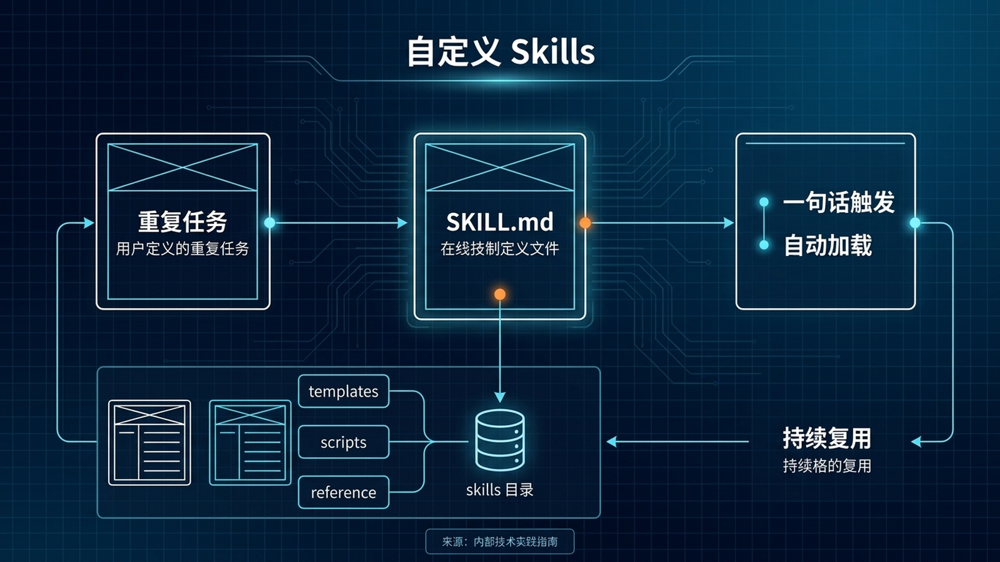

# 🧠 15-自定义 Skills：教 Hermes 学会你的独门工作流

> 一句话先说清楚：这一页讲的不是"用 Hermes 自带的 skill"，而是"把你重复做的事情固化成 Hermes 自己的 skill"——下次一句话或一个 slash 命令就能让 Agent 复用你的整套工作流。Skills 是 Hermes 区别于"一次性 prompt"的核心机制。



---

## 👀 适合谁

- 已经在 Hermes 里反复输入同一类指令（"按这个模板写周报"、"用这套规则 review PR"），想固化下来
- 团队有一些只有自己懂的 SOP（上线检查清单、客户沟通话术、Bug 分流规则），想让 AI 也能照着做
- 想让 Hermes 不只是"通用 AI 助手"，而是"懂你业务的人"
- 已经用过 `/skill` 加载 skill、`/plan` 进入计划模式这种 slash 命令，想自己造一个

**前提条件**：
- Hermes 已经能正常对话
- 你能用 Markdown 写文档（不需要会代码）
- 你至少有一个"每周做 3 次以上"的重复任务

**不适合谁**：还在装 Hermes 的人——先回 [01-先跑起来](../01-先跑起来/01-总览.md)。

---

## 🎯 为什么值得做（和"写个 Prompt"的差别）

很多人觉得"我写个好 prompt 就行了"，但 Prompt 和 Skill 是两回事：

| 维度 | Prompt（贴在对话里） | Skill（写成 SKILL.md） |
|---|---|---|
| 持久性 | 当前对话有效，关掉就没了 | 跨会话、跨设备持久 |
| 触发方式 | 每次手动粘贴 | 一句话或 `/skill-name` 自动加载 |
| 复用 | 自己记得才能用 | 团队所有人都能用 |
| 演进 | 每次都用旧版本 | 改一次所有人受益 |
| Token 成本 | 每次都进系统提示 | Progressive disclosure，按需加载 |
| 配合工具 | 只能描述意图 | 可以引用 skill 自带的脚本、模板、参考 |

一句话：Prompt 是"临时口令"，Skill 是"沉淀下来的能力"。

---

## ✍️ 操作步骤：从想法到能跑的 Skill

### 第 1 步：选一个真正值得固化的场景

不是所有 prompt 都值得写成 skill。判断标准：

- ✅ 一周用 3 次以上
- ✅ 步骤固定（即使数据不同，流程一样）
- ✅ 你反复在脑子里回想"先做什么后做什么"
- ✅ 团队里别人也想用

**好的例子**：
- "把会议纪要压成 3 段话 + 行动项"
- "Bug 报告转 Jira Issue 模板"
- "小红书文案按品牌话术生成"

**坏的例子**：
- "帮我写一封邮件"（不够重复）
- "解释一下这段代码"（已经有更好的方式）
- "今天天气怎么样"（一次性查询）

### 第 2 步：写 SKILL.md

所有 Skill 都是一个 Markdown 文件 + 可选的参考文档。

**目录结构：**

```
~/.hermes/skills/
└── my-team-report/
    ├── SKILL.md          # 主文件，必需
    ├── references/
    │   └── report-template.md  # 模板/参考资料
    └── scripts/
        └── fetch-metrics.py    # 可选，调用脚本
```

**最小可用 SKILL.md：**

```markdown
---
name: weekly-report
description: 把会议纪要转换成结构化周报
version: 1.0.0
---

# 周报生成

## When to Use
当用户说"做周报"、"生成周报"、"整理本周"，或者粘贴会议纪要让你处理时。

## Procedure
1. 让用户提供本周的会议纪要、工单、PR 等原始输入
2. 提取关键事件，分类为：完成的事、计划中的事、阻塞
3. 按 references/report-template.md 的模板输出
4. 输出长度控制在 300-500 字
5. 阻塞项必须包含具体人和事

## Pitfalls
- 不要把"讨论了"写成"决定了"
- 不要漏掉阻塞项，那是周报最重要的一部分

## Verification
输出包含三段：本周完成 / 下周计划 / 当前阻塞。
```

**完整字段的 SKILL.md（带条件激活）：**

```yaml
---
name: deploy-checklist
description: 上线前自动跑一遍检查清单
version: 1.0.0
platforms: [macos, linux]    # 限定操作系统
metadata:
  hermes:
    tags: [devops, deploy]
    category: devops
    requires_toolsets: [terminal]   # 只在有 terminal 工具集时显示
    requires_tools: [terminal]      # 或者按工具粒度
    config:
      - key: deploy.target_env
        description: 默认部署环境
        default: staging
        prompt: 你的默认部署环境是？
---

# 上线检查清单

## When to Use
当用户说"上线"、"deploy"、"准备发布"时自动加载。

## Procedure
1. 跑 `git status` 确认没有未提交改动
2. 跑 `git log --oneline -10` 看最近 commit
3. 跑 `pytest tests/` 确认测试全过
4. 跑 `npm run lint` 确认无 lint 错误
5. 看是否有未合并的 main 分支 commit
6. 输出检查结果：每项 ✅ 或 ❌

## Pitfalls
- 别在 production 环境跑这个 skill（它会读 git，不会写，但还是别走神）
- 测试失败时不要继续往下走

## Verification
输出一个 5 行的 checklist，每行一个状态 emoji。
```

### 第 3 步：放到 `~/.hermes/skills/`

```bash
mkdir -p ~/.hermes/skills/weekly-report
# 把 SKILL.md 和 references/ 放进去
```

> 也可以放团队共享目录（通过 git 管理），然后软链：
> ```bash
> ln -s /path/to/team-skills/weekly-report ~/.hermes/skills/weekly-report
> ```

### 第 4 步：让 Hermes 重新加载

```bash
hermes skills list
# 应该能看到 weekly-report

hermes skills config
# 给 CLI / Gateway 都启用
```

新会话生效：

```bash
hermes
```

### 第 5 步：测试触发

**显式触发：**

```bash
/skill weekly-report

或者：

hermes --skills weekly-report
```

**自然语言触发：**

```text
帮我做本周周报，下面是会议纪要：...
```

Hermes 会自动匹配 skill description，加载 SKILL.md，按 Procedure 执行。

---

## 🧠 Progressive Disclosure（控制 Token 成本的关键）

Skill 不是"一次性塞进系统提示"。它分三层加载：

| 层级 | 加载什么 | 什么时候 | Token 成本 |
|---|---|---|---|
| Level 0 | `name` + `description` 列表 | 每次会话开始 | ~3K（所有 skill 加起来） |
| Level 1 | 完整 SKILL.md | 用户触发或 LLM 主动调用 | 看你 SKILL.md 多长 |
| Level 2 | references/scripts 里的文件 | LLM 在执行时需要 | 按需 |

**这意味着：**你写 50 个 skill 不会让 Hermes 启动变慢、Token 爆炸。Hermes 只看 description 决定要不要加载完整内容。

实操建议：**description 写清楚触发场景**，比 SKILL.md 写得完美更重要。

---

## 🧩 进阶：让 Skill 自带脚本和模板

### 场景：自动抓数据 + 套模板

```
my-team-report/
├── SKILL.md
├── scripts/
│   └── fetch-metrics.py    # 从内网 API 抓数据
└── templates/
    └── report-template.md  # 套版用的模板
```

**SKILL.md 里调用：**

```markdown
## Procedure
1. 跑 `python scripts/fetch-metrics.py --week=this` 抓本周指标
2. 把数据套进 templates/report-template.md
3. 输出最终周报
```

Hermes 会用 `terminal` 工具跑脚本，用 `file` 工具读模板，把两者拼起来。

### 场景：条件激活（fallback）

Skill 可以声明"当某个工具不可用时才出现"：

```yaml
metadata:
  hermes:
    fallback_for_toolsets: [web]
```

意思是：用户的 Hermes 没装 web 工具集时，这个 skill（可能教 Agent 怎么用本地缓存）才会出现。

### 场景：Skill 套 Skill

一个 skill 可以引用另一个：

```markdown
## Procedure
1. 调用 `weekly-report` skill 生成数据
2. 调用 `slack-post` skill 把结果发到 Slack
```

---

## 💡 使用心得

### 心得 1：从"复制粘贴"开始

第一次写 skill 不要追求完美。把你现在每天粘贴到 Hermes 里的那段 prompt 原样放进 SKILL.md，跑两周，根据 Agent 的实际表现迭代。

### 心得 2：用 Git 管理 Skills

```bash
cd ~/.hermes/skills
git init
git remote add origin git@github.com:yourname/my-hermes-skills.git
git add . && git commit -m "feat: initial skills"
git push -u origin main
```

跨机器同步、版本管理、团队协作一次搞定。

### 心得 3：description 写"什么时候用"

错误的 description：

```yaml
description: 一个很有用的 skill
```

对的：

```yaml
description: 把会议纪要转换成结构化周报。当用户说"做周报"、"生成周报"、"整理本周"时使用。
```

Hermes 看到 description 来判断要不要加载，描述越具体触发越准。

### 心得 4：给 Skill 加 pitfalls

Skill 写好后，每次 Hermes 用错了都把错误案例加到 Pitfalls 段：

```markdown
## Pitfalls
- 不要假设用户每次都给完整数据，缺数据要主动问
- 不要把"讨论了"写成"决定了"
- 不要省略阻塞项
```

时间长了 Pitfalls 段会越来越准，Skill 越用越好。

### 心得 5：团队 Skill 用 `skills tap` 共享

```bash
hermes skills tap add git@github.com:yourteam/team-skills.git
hermes skills install team-deploy-checklist
```

新人入职直接 tap 团队仓库，所有团队 Skill 一键装好。

### 心得 6：Skill 和 SOUL.md 分工

| 内容 | 放哪 |
|---|---|
| 长期人格、语气偏好 | SOUL.md |
| 固定的"做什么"流程 | Skill |
| 团队规范、SOP | Skill |
| 个人记忆、偏好 | memory |

SOUL.md 是"我是谁"，Skill 是"我怎么做某件事"。

---

## ⚠️ 踩坑提醒

### 1. frontmatter 写错

YAML 字段必须用空格缩进，不能 tab。description 必须用引号包起来（如果有特殊字符）：

```yaml
description: "把会议纪要转换成结构化周报"
```

### 2. description 太笼统

`description: "帮助用户"` 这种描述 Hermes 永远不会主动加载。要写明"在什么场景下"。

### 3. SKILL.md 太长

超过 2000 字的 SKILL.md 会让每次加载都烧 Token。把详细模板放 references/，主文件只写流程。

### 4. 改了 skill 不重启会话

Skill 在会话开始时快照。改完 SKILL.md 必须 `/reset` 或开新会话才生效。

### 5. Skill 名字和内置冲突

不要叫 `web`、`terminal`、`plan` 这种内置名。用 `my-web-search` 这种命名空间。

### 6. Skill 链调用死循环

A skill 调用 B skill、B 又调用 A，会无限循环。给每个 skill 加一条：

```markdown
## Pitfalls
- 不要递归调用其他 skill 超过 2 层
```

---

## ✅ 推荐做法

| 做法 | 原因 |
|---|---|
| 从复制粘贴起步 | 低成本验证 |
| 用 Git 管理 | 跨机器跨团队 |
| description 写清触发场景 | Progressive disclosure 的核心 |
| Pitfalls 持续迭代 | 让 skill 越用越准 |
| 主文件 ≤ 2000 字 | 控制 Token 成本 |
| 团队用 skills tap 共享 | 新人零门槛上手 |
| Skill 和 SOUL.md 分工清晰 | 别什么都往 SOUL 塞 |

---

## ✅ 过关标准

当你满足以下状态，这篇就算跑通了：

- 至少写了一个自定义 Skill 并放到 `~/.hermes/skills/`
- 用 `/skill name` 或自然语言成功触发
- Skill 里至少有 When to Use、Procedure、Pitfalls 三段
- 修改 SKILL.md 后知道要 `/reset` 让其生效
- 你的 Skill 在另一台机器上也能用（git 同步）

---

## ➡️ 下一步

完成后进入：
[16-安全加固：给你的 AI Agent 划好安全红线](<./16-安全加固.md>)

如果你想先回到上一阶段入口重新确认位置：
[05-实战应用总览](./01-总览.md)

---

## 📖 出处

本文基于以下来源做了原创中文整理：

- Hermes 官方文档 — [Skills System](https://hermes-agent.nousresearch.com/docs/user-guide/features/skills)
- agentskills.io — [Skill 规范](https://agentskills.io/specification)
- Hermes 内置 skill — `hermes-agent-skill-authoring`、`writing-plans`
- 实战参考 — [07-SOUL.md 人格定制](./07-SOUL.md%20人格定制.md)
