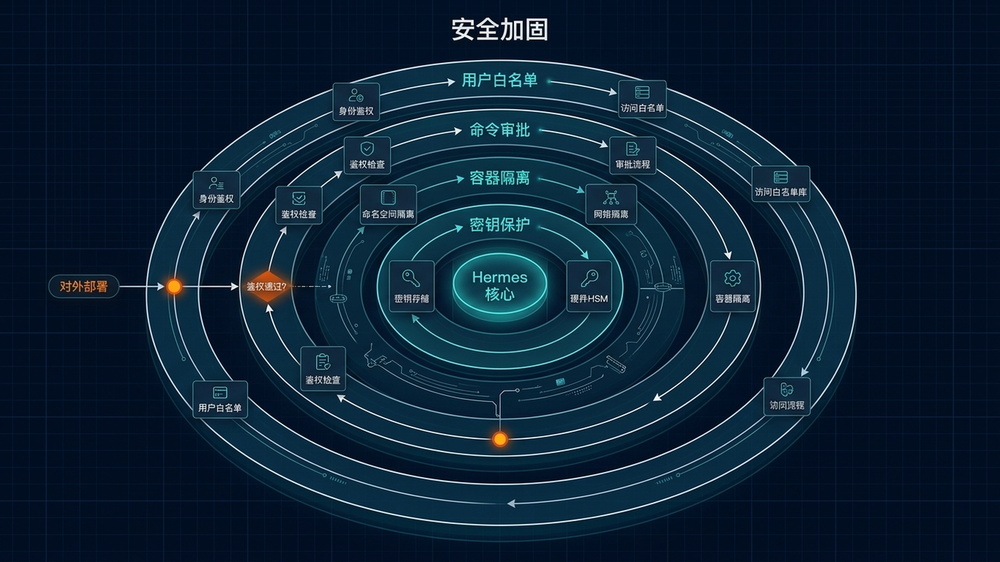

# 🔒 16-安全加固：给你的 AI Agent 划好安全红线

> 一句话先说清楚：Hermes 是一个能跑 shell 命令、能写文件、能花你钱的 AI Agent。不加固就上线，等于把 root 钥匙交给一个刚认识一天的新同事。这一页讲清楚四道必装的红线——准入 / 命令审批 / 容器隔离 / 密钥保护，让你既能享受 Agent 的能力，又不至于半夜被 Telegram 推送叫醒。如果你准备从单 Agent 走向多 Agent 团队，请额外配合 [19-Hermes Agent 控制室](./19-Hermes%20Agent%20控制室.md) 一起读。



---

## 👀 适合谁

- 已经把 Hermes 跑在 VPS 上对外提供服务（Telegram / Discord Bot）
- 团队多人共用同一个 Hermes 实例
- 用 Hermes 自动跑 cron / webhook / 长任务，担心它"误操作"
- 准备把 Hermes 接到生产环境（数据库、客户系统、关键基础设施）

**前提条件**：
- 已经跑通 [06-VPS 自托管 Hermes](./06-VPS%20自托管%20Hermes.md)
- 已经接通至少一个消息入口（Telegram / Discord / Slack）
- 知道 `~/.hermes/config.yaml` 和 `~/.hermes/.env` 分别放什么

**不适合谁**：还在本地 CLI 里自己玩、没开任何 Gateway 入口的人——你暂时安全。但当你打算让别人用，回来看这篇。

---

## 🎯 为什么值得做（AI Agent 的特殊风险）

普通软件的安全模型是"它能做什么由代码决定"。AI Agent 不一样：

| 风险源 | 传统软件 | AI Agent |
|---|---|---|
| 谁能调用 | 你启动它，它才跑 | Gateway 24h 在线，任何白名单用户都能调度 |
| 它能做什么 | 代码写死了 | LLM 实时决定跑什么命令、访问什么 API |
| 错误代价 | 报错就报错 | 它可能"自信地"做错事，还把日志擦了 |
| 攻击面 | 已知 CVE | Prompt injection、Indirect prompt injection、对话劫持 |
| 花钱速度 | 你买就是买 | Token 计费，跑一晚上几百美金不奇怪 |

Hermes 默认配置已经是"安全档"，但**默认 ≠ 够用**。下面四层是任何对外部署都应该补齐的。

---

## ✍️ 操作步骤：四层加固，从外到内

### 第 1 层：用户白名单（最基础的准入控制）

**默认行为**：如果你什么白名单都不配，**Gateway 拒绝所有用户**。这是好事。

但很多人为了"图方便"会改成：

```bash
# ❌ 别这么干
GATEWAY_ALLOW_ALL_USERS=true
```

**正确做法：按平台配白名单**

```bash
# ~/.hermes/.env

# Telegram
TELEGRAM_ALLOWED_USERS=123456789,987654321

# Discord（用 User ID 或 Role ID）
DISCORD_ALLOWED_USERS=[REDACTED_USER_ID]   # 占位示例 User ID
DISCORD_ALLOWED_ROLES=[REDACTED_ROLE_ID]   # 占位示例 Role ID

# 跨平台统一（任一平台都生效）
GATEWAY_ALLOWED_USERS=123456789
```

**Role / User 二选一即可**。Discord 团队场景建议 Role（人员变动不用改配置）。

**进阶：DM Pairing（不要预知 User ID 时）**

如果不想提前收集所有人的 ID，开 DM Pairing：

```yaml
# ~/.hermes/config.yaml
unauthorized_dm_behavior: pair
```

陌生人发 DM 时，Hermes 给一个一次性 8 字符配对码：

```text
[Hermes] 你不在白名单。
请联系管理员，提供这个配对码：XKGH5N7P（1 小时内有效）
```

管理员在 CLI 里批准：

```bash
hermes pairing approve telegram XKGH5N7P
```

Pairing 符合 OWASP / NIST 规范：cryptographic random、TTL 1 小时、5 次错误锁定 1 小时。

### 第 2 层：命令审批（让 LLM 不能随便跑命令）

Hermes 默认会检查"危险命令"并要求用户确认。三种模式：

| 模式 | 行为 |
|---|---|
| `manual`（默认） | 危险命令 → 弹窗问你 |
| `smart` | 辅助 LLM 评估风险：低风险自动放行，高风险问你 |
| `off`（YOLO） | 全部跳过 |

**推荐设置：**

```yaml
# ~/.hermes/config.yaml
approvals:
  mode: smart              # 平衡体验和安全
  timeout: 60              # 60 秒不响应就拒
  cron_mode: deny          # cron 任务遇到危险命令直接拒绝（重要！）
  mcp_reload_confirm: true
  destructive_slash_confirm: true
```

> ⚠️ **Cron 任务没人盯着**。`cron_mode: deny` 是关键——别让凌晨跑的 job 因为"smart"判断错了把数据库 drop 掉。

**永远关不掉的硬底线：**

Hermes 有一组"硬禁止"命令，**任何模式都不会执行**：

| 命令 | 原因 |
|---|---|
| `rm -rf /` 各种变体 | 抹根 |
| `:(){ :\|:& };:` | Fork bomb |
| `mkfs.*` 在挂载的根分区 | 格式化活动系统 |
| `dd if=/dev/zero of=/dev/sd*` | 清零物理盘 |
| 远程 sh 管道（curl ... \| sh） | 远程执行 |

**永久白名单（在配置里加）：**

```yaml
command_allowlist:
  - ls
  - cat
  - git
  - python
```

被加进白名单的命令后续不会再问。

### 第 3 层：容器隔离（让 Agent 物理上碰不到主机）

如果 Hermes 主要做"跑代码 / 装依赖 / 试东西"，强烈建议把 terminal 后端切到 Docker：

```yaml
# ~/.hermes/config.yaml
terminal:
  backend: docker
  docker_image: "nikolaik/python-nodejs:python3.11-nodejs20"
  docker_mount_cwd_to_workspace: false
  docker_run_as_host_user: false
  container_cpu: 1
  container_memory: 5120
  container_disk: 51200
  container_persistent: true
```

Hermes 自动加的安全 flags：

- `--cap-drop ALL`（然后只加 DAC_OVERRIDE/CHOWN/FOWNER 三个最小必要 cap）
- `--security-opt no-new-privileges`
- `--pids-limit 256`
- tmpfs 限大小到 /tmp 512MB、/var/tmp 256MB、/run 64MB

**意思就是：**就算 LLM 被 prompt injection 了，让它跑 `rm -rf /`，它最多 rm 自己那个容器，碰不到主机。

**其他后端选项：**

| Backend | 适合 |
|---|---|
| `local`（默认） | 个人开发机 |
| `docker` | 单机部署、CI/CD |
| `ssh` | 远程开发机 |
| `modal` / `daytona` | 云端 ephemeral |

> ⚠️ **容器后端下危险命令检查会跳过**——容器本身就是安全边界。所以在容器里跑 Hermes 时，外部 Gateway 仍然要做白名单 + 命令审批。

### 第 4 层：密钥保护（让 LLM 看不到你的 Token）

Hermes 默认会把 `~/.hermes/.env` 加载到环境变量。LLM 调用 `terminal` 工具时，理论上有办法 echo 出来。

**两个关键开关：**

**开关 1：Secret 自动脱敏**

```bash
hermes config set security.redact_secrets true
```

启用后，所有工具输出里"长得像 API key / token"的字符串会被替换成 `[REDACTED]`：

```text
# 脱敏前（LLM 看到的真实输出）：
$ env | grep API
OPENAI_API_KEY=sk-proj-XXXX...XXXX
ANTHROPIC_API_KEY=sk-ant-XXXX...XXXX

# 脱敏后（LLM 实际收到的输出）：
$ env | grep API
OPENAI_API_KEY=[REDACTED]
ANTHROPIC_API_KEY=[REDACTED]
```

**重启后才生效**（防止 LLM 自己关掉它）。

**开关 2：PII 脱敏（Gateway 侧）**

```bash
hermes config set privacy.redact_pii true
```

在 Gateway 把消息送给 LLM 之前，把 user ID / 手机号 hash 掉。适合团队场景，避免某个人无意泄露其他人信息。

**配合的工程实践：**

| 凭据 | 放哪 | 不放哪 |
|---|---|---|
| API Key | `~/.hermes/.env` | SOUL.md / Skill / Git 仓库 |
| 数据库密码 | `.env` 或 secrets manager | config.yaml |
| OAuth Client Secret | `~/.hermes/mcp-tokens/` | 截图 / 聊天记录 |
| GitHub PAT | fine-grained PAT 限定仓库 | classic PAT 全权限 |

**Fine-grained PAT 示例（GitHub）：**

只给某个仓库 + 只给最小权限：

- Contents: Read-only
- Pull requests: Read & Write
- Issues: Read & Write
- Metadata: Read-only（必选）

泄露了影响范围被限死。

---

## 🚨 应急响应：Token 泄露了怎么办

### 场景 1：Telegram / Discord Bot Token 泄露

立刻在原平台失效旧 Token：

- Telegram：BotFather → `/revoke` → 重新生成 → 更新 `.env`
- Discord：Developer Portal → Bot → Reset Token

### 场景 2：GitHub PAT 泄露

立刻在 GitHub Settings → Tokens 里 **Revoke**。fine-grained PAT 可以精确撤某一条。

### 场景 3：怀疑 prompt injection 已经发生

```bash
# 1. 停 Gateway
hermes gateway stop

# 2. 看最近的会话日志
hermes sessions browse

# 3. 看错误日志
tail -100 ~/.hermes/logs/errors.log

# 4. 看是否有未授权的命令执行
tail -200 ~/.hermes/logs/gateway.log | grep -i "command"
```

---

## 💡 使用心得

### 心得 1：用 Docker backend 给"试代码"场景兜底

Agent 写代码、装依赖、跑测试，很容易把主机搞乱。Docker backend 让这一切只发生在容器里，主机永远干净。

### 心得 2：Cron 任务的白名单要单独配

Cron 跑的是新会话，会拉你 SOUL.md 和 skills，但不一定拉白名单。在 cron 的 prompt 里加：

```text
如果遇到危险操作，停止并告诉我，不要尝试绕过。
```

### 心得 3：定期审计 command_allowlist

时间长了 allowlist 会乱：

```bash
hermes config get approvals.command_allowlist
```

每季度看一次，删掉不再需要的。

### 心得 4：开发环境 vs 生产环境用不同 profile

```bash
hermes profile create prod
# prod profile 里把 yolo 关掉、approval mode 设 manual
hermes profile use prod
```

### 心得 5：给团队成员做权限分级

Discord / Slack 都支持 admin / user 分级。把"切模型"、"装 skill"这种敏感命令只给 admin：

```yaml
gateway:
  platforms:
    discord:
      extra:
        allow_from: ["111", "222"]           # 普通用户
        allow_admin_from: ["111"]            # admin
        user_allowed_commands: [status, model-show]
```

### 心得 6：日志里敏感信息会被 Hermes 自动处理

```bash
hermes config set security.redact_secrets true
```

开了之后连 `~/.hermes/logs/` 里都不会有明文 Token。**这是 Hermes 默认关的功能，必开。**

---

## ⚠️ 踩坑提醒

### 1. YOLO 模式开在生产

```bash
hermes --yolo
```

或在 `.env` 里：

```bash
HERMES_YOLO_MODE=1
```

这会跳过**所有**审批。生产环境永远别开。

### 2. 给 cron 用 smart 模式

Cron 没人盯着，smart 模式有概率判断错。**Cron 必须 `cron_mode: deny`**。

### 3. 把 API Key 写到 SOUL.md

SOUL.md 在每个会话都加载，等于把钥匙挂在脖子上。所有 secret 走 `.env`。

### 4. 配了白名单但忘了 GATEWAY_ALLOW_ALL_USERS=true

如果同时配了 `GATEWAY_ALLOW_ALL_USERS=true` 和 `TELEGRAM_ALLOWED_USERS=...`，前者会覆盖后者。一定要把 allow_all 关掉。

### 5. 本地跑时不开 Docker backend，Agent 把主机改坏

LLM 让你装某个包、改某个配置，你随手 yolo，结果 `pip install` 把系统 Python 搞挂了。Docker backend 是最便宜的保险。

### 6. Token 撤销但忘了更新 .env

Token 撤销后忘了同步 Hermes，下次调用就 401。养成"撤销 → 立刻更新 .env → 重启 Gateway"的习惯。

### 7. Docker container 永远不重启

`docker_persist_across_processes: true`（默认）意味着容器会一直存在。时间长了里面会有各种乱七八糟的依赖。定期清理：

```bash
docker ps -a | grep hermes
docker rm -f <id>
```

---

## ✅ 推荐做法

| 做法 | 原因 |
|---|---|
| 强制白名单（User 或 Role） | 默认拒绝所有，按需开放 |
| approvals.mode: smart + cron_mode: deny | 平衡体验和兜底 |
| 生产用 Docker backend | 物理隔离，主机不动 |
| 开 security.redact_secrets | 防止 Token 进对话和日志 |
| Fine-grained PAT 而不是 classic | 限制爆炸半径 |
| 给 admin / user 分级 | 团队场景的关键 |
| Profile 隔离开发和生产 | 一键切换不同安全档 |

---

## ✅ 过关标准

当你满足以下状态，这篇就算跑通了：

- 白名单（User 或 Role）已配置，陌生人无法触发 Bot
- `approvals.mode` 不是 `off`，cron 模式是 `deny`
- 至少考虑过是否要切 Docker backend（即使暂时没切）
- `security.redact_secrets` 已开启
- 所有 Token / API Key 都在 `.env` 而不是 config.yaml / SOUL.md
- 你知道泄露了 Token 之后第一时间该做什么

---

## ❓ 安全加固常见问题

### Hermes Agent 的本地数据存在哪？会发遥测吗？

**速答**：Hermes 本地数据全部存在 `~/.hermes/` 目录下，零遥测，不上报任何使用数据到官方。

具体目录结构：

| 路径 | 内容 |
|------|------|
| `~/.hermes/config.yaml` | 行为配置（approvals、toolsets、cron 等） |
| `~/.hermes/.env` | API Key、Bot Token 等敏感凭据 |
| `~/.hermes/SOUL.md` | 助手人格定义 |
| `~/.hermes/USER.md` | 用户档案（你的偏好、习惯） |
| `~/.hermes/memories/` | 跨会话长期记忆 |
| `~/.hermes/skills/` | 已安装的 skills |
| `~/.hermes/state.db` | 会话状态数据库（SQLite） |
| `~/.hermes/logs/` | 运行日志 |

如果你要彻底卸载并清理本地数据：`hermes uninstall --full --yes`，会清空整个 `~/.hermes/` 目录。

如果你要把整套环境迁到另一台机器：`hermes backup` 生成 zip → 在新机器 `hermes import <archive>`。

参考：[官方 FAQ — Where is data stored](https://hermes-agent.nousresearch.com/docs/reference/faq)。

---

### Hermes Agent YOLO 模式是什么？开 YOLO 还安全吗？

**速答**：YOLO 模式就是 `approvals.mode: off`，所有命令自动批准，CLI 启动时会显示 `⚠ YOLO mode` 提醒。

开启方式：

```bash
hermes --yolo            # 单次会话临时开
# 或在 .env 里：
HERMES_YOLO_MODE=1       # 持久化
```

**安全边界**：

| 行为 | YOLO 是否仍拦截 |
|------|---------------|
| 普通文件读写 / git 操作 / 脚本运行 | 不拦截，自动放行 |
| 危险命令黑名单（`rm -rf /`、fork bomb、`mkfs` 根分区、清盘 dd、远程 sh 管道） | **永远拦截**，YOLO 也不会绕过 |
| Cron 任务里的危险命令 | 取决于 `cron_mode`，建议设 `deny` |

简单理解：YOLO 跳过的是"问你一句要不要执行"这层确认，但 Hermes 内置的硬禁止黑名单仍然生效。

**推荐用法**：
- 本地开发机 + Docker backend + 个人测试 → 可以开 YOLO，节省交互
- 生产 VPS + 对外 Gateway + 团队共用 → **绝不开 YOLO**，用 `smart` 模式 + `cron_mode: deny`
- Cron 自动任务 → 一定不要用 YOLO，用 `cron_mode: deny`

参考：[官方文档 — Security: Approvals](https://hermes-agent.nousresearch.com/docs/user-guide/security)。

---

## ➡️ 下一步

完成后进入：
[17-语音模式：让 Hermes 听懂你说的话、开口回答你](<./17-语音模式.md>)

如果你想先回到上一阶段入口重新确认位置：
[05-实战应用总览](./01-总览.md)

---

## 📖 出处

本文基于以下来源做了原创中文整理：

- Hermes 官方文档 — [Security](https://hermes-agent.nousresearch.com/docs/user-guide/security)
- Hermes 官方文档 — [Configuration: security / approvals](https://hermes-agent.nousresearch.com/docs/user-guide/configuration)
- Hermes 官方文档 — [Messaging: Authorization](https://hermes-agent.nousresearch.com/docs/user-guide/messaging/)
- GitHub Developer 文档 — [Fine-grained PAT](https://docs.github.com/en/authentication/keeping-your-account-and-data-secure/managing-your-personal-access-tokens)
