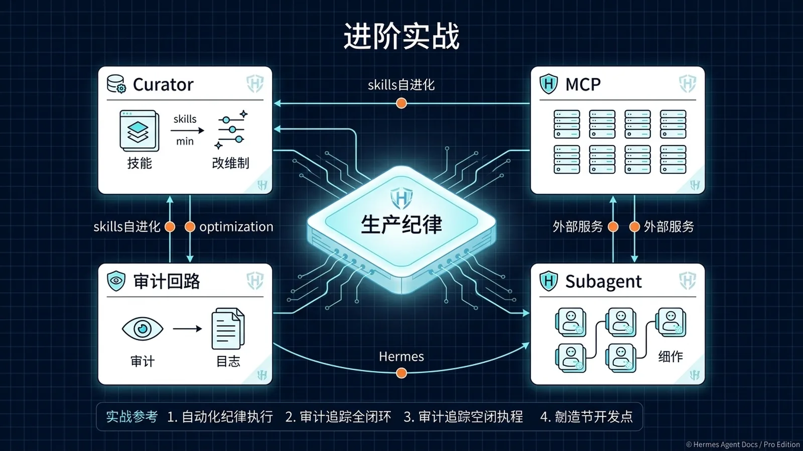

# 🧭 18-Hermes Agent 进阶实战：自进化 Skills、MCP、Subagent 编排与生产纪律

> 一句话先说清楚：这一页不是"再讲一遍 Skills 和 MCP 怎么用"，而是讲清楚 Hermes 从"我让它干活它能干"过渡到"它在生产环境长期可靠运行"必须补的四道纪律——**自进化 Skills 治理、MCP 深度集成、Subagent 编排、生产可观测**。框架本身只给能力，不给纪律。



---

## 👀 适合谁

- 已经跑通 Hermes 基础安装，至少有 3–5 个 `agent_created/` 自动生成的 skill
- 看着自己的 `agent_created/` 目录越来越大，但不知道哪些可信、哪些会反咬一口
- 开始把 MCP（GitHub / Supabase / 自建）接进 Hermes，但发现"能跑"和"稳跑"是两件事
- 想从"单 Agent 全包"演进到"Orchestrator + Worker"的多人格编排
- 准备把 Hermes 从"个人玩具"推到"对外 7×24 生产线"

**前提条件**：

- 你已经看完 [15-自定义 Skills](./15-自定义%20Skills.md) 并至少手写过 1 个 skill
- 你已经在用 cron 让 Hermes 跑日常任务，至少见过 `agent_created/` 长出新文件
- 你已经看过 [12-MCP 接入指南](<./12-MCP%20接入指南.md>) 知道 MCP 是什么、怎么开

**不适合谁**：

- 还没装好 Hermes、还没跑通第一次对话——先回 [01-先跑起来](../01-先跑起来/01-总览.md)
- 还没遇到 skill 自我膨胀、还没遇到 token 失控——这一页是"痛过之后才看得懂"

---

## 🎯 先看结论：四道纪律，框架不替你做

| 纪律 | 框架给你的 | 框架不替你做的 |
|---|---|---|
| 自进化 Skills 治理 | `skill_manage` 工具，自动写 `agent_created/<name>/SKILL.md` | 判断"这个自动生成的 skill 是不是该删/合并/降权" |
| MCP 深度集成 | stdio/HTTP MCP client，nativemcp 工具集 | 决定哪些工具进 context、失败重试、密钥轮换、依赖收敛 |
| Subagent 编排 | `delegate_task` 工具、`role: orchestrator/leaf`、context 隔离 | 切分任务边界、设定验收、处理子任务超时和失败重试 |
| 生产可观测 | SessionDB（SQLite WAL+FTS5）、`/status`、`--resume` | 监控告警、成本归因、回归基线、事故复盘 |

一句话：**框架给你的，是能力；框架不替你做的，是纪律**。生产可靠性 = 能力 × 纪律，缺一不可。

---

## 🔄 真实场景：从 demo 到生产的"五个一夜间出现的问题"

下面这五个问题，几乎每个把 Hermes 推过两周生产期的人都会撞上：

1. **周一早上发现 `agent_created/` 多了 12 个 skill**，其中 7 个名字奇怪、3 个明显是同义重复、2 个有 bug 但你不敢删
2. **接了 GitHub MCP 之后，发现 prompt 突然涨了 8k token**，因为 MCP 把所有工具 schema 全塞进了 system prompt
3. **让 Hermes 做一次深度调研，跑了 35 分钟后超时**，但你不知道是哪个 subagent 卡住、是模型慢还是工具慢
4. ** orchestrator 把同一个任务派给了 3 个 worker**，因为 delegate 调用没有 idempotency，账单翻了 3 倍
5. **某个 skill 在 6 月初还工作，6 月中突然失效**——因为底层 API 改了，但 skill 里写死了 endpoint

这五个问题不是 Hermes 的 bug，是"没有纪律"的必然结果。下面四节按"先 Skills、再 MCP、再 Subagent、最后生产可观测"展开。

---

## 🛠️ 工作流拆解 1：自进化 Skills 的" curator 心智"

### 现象

Hermes 解决任何"非平凡任务"后会自动调用 `skill_manage` 写一份 SKILL.md 进 `~/.hermes/profiles/content/skills/agent_created/`。这是 Hermes 区别于"一次性 prompt"的核心机制——**用得越久越聪明**。

但聪明是有代价的：

- **同名漂移**：Hermes 这次写的 `git-pr-review` 和上一次写的 `github-code-review` 其实是一回事
- **错误固化**：一次跑通了不等于正确，下次直接复用就把错误固化了
- **prompt 膨胀**：每个 skill 都会被加进 system prompt 的"available skills"清单，过多 = 上下文噪音
- **影子 skill**：你手写的 `~/skills/git-pr-review` 和 agent_created 里的 `git-pr-review` 谁先生效，取决于加载顺序

### 治理模板：每周一次 curator pass

把这段加到 SOUL.md 的 "Work Style" 或单独的 `~/.hermes/profiles/content/skills/agent_created/README.md`：

```markdown
# agent_created/ 治理规则

## 每周一 10:00 自动 curator 任务（cron）
1. 列出 agent_created/ 下所有 skill 名 + 文件大小 + 上次修改时间
2. 标记三类候选：
   - 同义/近义（名字不同但功能描述重合度 > 70%）→ 合并
   - 超过 30 天未触发（看 SessionDB 里 skill_load 记录）→ 降权或归档
   - 与手写 skill 同名 → 强制改名为 `agent-<原名>`，避免覆盖
3. 删除前先 git commit，保留可回退的快照

## 任何 skill 写入必须包含的 frontmatter
- when_to_use: 触发场景的一句话描述（必填）
- prerequisites: 这个 skill 调用前必须满足的状态（如"已安装 gh CLI"）
- known_failure_modes: 至少列 1 个已知失败场景
- last_verified_against: 上次验证可用的依赖版本/endpoint（如 "gh 2.40, GitHub API v3"）
```

### 真实风险

- **Skill 反噬**：写错但被反复加载的 skill，会让 Hermes 在错误的方向上越走越远——比"没 skill"更糟
- **审计盲区**：autonomous skill 创建如果没有日志，你不知道行为变化来自哪一次写入

> 📌 **这一节的纪律就是"审计优先于能力"**：宁可慢一点，也要让每次 skill 演化都可追溯、可回退、可问责。

---

## 🔌 工作流拆解 2：MCP 深度集成的"工具膳食"

### 现象

接 MCP 不难。难的是接完之后：

- system prompt 涨了 5k–15k token（每个 MCP server 默认暴露所有工具 schema）
- 一个失败的 MCP server 会让整个 session 启动卡住 30 秒（stdio 超时）
- 同一类工具（GitHub）你既接了 native 又接了 MCP，agent 不知道该用哪个
- MCP server 的环境变量泄露进了日志

### 治理模板：MCP 接入清单

每次新增一个 MCP server，先填这张表（建议存在 `governance/mcp-inventory.md`）：

| 字段 | 示例 | 必填 |
|---|---|---|
| server_name | `github-mcp` | ✅ |
| transport | stdio / HTTP / SSE | ✅ |
| 提供工具数 | 24 | ✅ |
| 启用工具白名单 | `["create_issue", "list_prs", "merge_pr"]`（其余 disabled） | ✅ |
| 启动超时（秒） | 8 | ✅ |
| 失败重试策略 | 3 次指数退避，超时后整 server 禁用本次 session | ✅ |
| 密钥来源 | `~/.hermes/.env` 的 `GITHUB_MCP_TOKEN`，永不入 config.yaml | ✅ |
| 与 native 工具重叠 | native `gh_cli` 已能做 PR review → MCP 只启用 issue/merge | ✅ |
| 监控点 | 每次 session 启动记录 server 启动耗时、首工具延迟 | ✅ |

### 真实工作流（以 GitHub + Supabase + 自建公司 wiki 为例）

1. **先收口工具表**：列一个 markdown 表，列出"所有要给 agent 的外部能力"，每个能力标 native 还是 MCP
2. **去重**：同一个能力只保留一条路径。MCP 默认是用来补 native 缺失的能力（如 Supabase query、Linear issue），不是替代 native
3. **白名单启用**：在 config.yaml 用 `enabled_tools` 而不是 `disabled_tools`——白名单比黑名单更安全
4. **隔离密钥**：MCP server 的 token 永远从 env 读，不写 config.yaml、不写 SOUL.md
5. **加超时和重试**：在 `mcp.servers.<name>` 下加 `timeout: 8` 和 `retry: { count: 3, backoff: exponential }`
6. **建监控**：每天 cron 一次"列出所有 MCP server 状态 + 最近 24 小时调用次数 + 失败次数"

---

## 🎯 工作流拆解 3：Subagent 编排的"任务单 + 验收单"

### 现象

`delegate_task` 是 Hermes 给的"Orchestrator + Workers"基础能力。但用错的方式比比皆是：

- orchestrator 自己又跑代码又做调研 → 上下文爆掉，等于没用 subagent
- 子任务之间没 dependency 声明 → 三个 worker 跑同件事
- 子任务结果直接信任 → orchestrator 没做"verifiable proof" 验证就交付
- subagent 自报"我成功了"，但实际写错文件 / 调错 API

### 治理模板：派单的"四件套"

每个 delegate 调用必须带这四件套（强制写进 SOUL.md 的 "Work Style"）：

```markdown
## Subagent 派单硬规则

### 1. 任务卡（goal）
- 必须自包含：subagent 不知道父对话历史
- 必须有明确的"完成态定义"（不是"做好这件事"而是"产出 X 文件，路径 Y"）

### 2. 输入上下文（context）
- 文件路径、错误信息、约束、上游输出格式
- 如果 subagent 要做"读后判断"的事，必须提供"判断依据"，不要让它自己猜

### 3. 工具集（toolsets）
- 显式列出允许的工具集，避免 subagent 自行启用浏览器 / cron 等高成本工具
- 默认推荐：`['terminal', 'file', 'web']`

### 4. 验收凭据（verifiable proof）
- subagent 的 final response 必须包含"可验证的 handle"：文件路径 + 行号区间、HTTP 响应码、git commit SHA、URL
- orchestrator 必须亲自验证：`read_file` 看 diff、`curl` 看 endpoint、`git log` 看 commit
- 子任务自报"完成"不等于完成，验证通过才算
```

### 真实场景：让 subagent 写一篇技术调研

**错误方式**（一次性派一个大任务）：

```
goal: 调研 LangGraph v0.3 的变更，写一篇 2000 字中文综述
```

**正确方式**（拆成 3 个 subagent + 验收）：

| Step | 派给 | goal | 验收 |
|---|---|---|---|
| 1 | leaf-1 | 抓 LangGraph v0.3 release notes 和 changelog，输出 markdown 到 `/tmp/research/raw.md` | orchestrator `read_file` 验证有 release date / breaking changes 段 |
| 2 | leaf-2 | 读 `/tmp/research/raw.md`，提取 5 个最重要变更，每个 200 字，写到 `/tmp/research/digest.md` | orchestrator `wc -l` + 抽查 2 条 |
| 3 | leaf-3 | 读 `/tmp/research/digest.md`，按"先看结论/真实场景/工作流拆解/边界/下一步"结构扩写到 `/tmp/research/final.md` | orchestrator 校验六段结构都存在，再交付用户 |

### 边界

- Subagent 隔离了 context，但**没有隔离文件系统**——多个 subagent 并发写同一文件会撕裂
- Orchestrator + Workers 模式下，token 总消耗 ≈ 单 agent 的 1.3–1.8 倍（因为每个 subagent 要重复加载 SOUL + tools schema），不要为小任务开 orchestrator

---

## 📊 工作流拆解 4：生产可观测的"四张仪表"

### 现象

Hermes 在生产模式跑两周后，你会想知道：

- 这一周 token 花在哪了？哪个 provider？哪个 skill？
- 哪些 session 失败了？失败原因？
- `agent_created/` 这一周多了几个 skill？分别被加载几次？
- cron 任务的实际执行时间 vs 预期？

Hermes 本身给了 SQLite SessionDB（含 FTS5），但**没有给现成的看板**。

### 治理模板：每天一次的"自检 cron"

把这段加到 `~/.hermes/scripts/daily-self-check.sh`（通过 Hermes 自身的 cron 工具跑）：

```bash
#!/usr/bin/env bash
set -euo pipefail
HERMES_HOME="${HERMES_HOME:-$HOME/.hermes}"
DB="$HERMES_HOME/sessiondb.sqlite"

echo "## Hermes 每日自检 $(date +%F)"
echo "### Token 消耗（过去 24h，按 provider 分组）"
sqlite3 -readonly "$DB" <<'SQL'
SELECT provider, model, SUM(prompt_tokens) AS p, SUM(completion_tokens) AS c
FROM messages WHERE role='assistant' AND created_at > datetime('now','-1 day')
GROUP BY provider, model ORDER BY p+c DESC;
SQL

echo "### 失败 session（过去 24h）"
sqlite3 -readonly "$DB" <<'SQL'
SELECT id, started_at, error FROM sessions
WHERE status='error' AND started_at > datetime('now','-1 day')
ORDER BY started_at DESC LIMIT 20;
SQL

echo "### Skill 加载次数 Top 10（过去 7 天）"
sqlite3 -readonly "$DB" <<'SQL'
SELECT skill_name, COUNT(*) FROM skill_loads
WHERE loaded_at > datetime('now','-7 days')
GROUP BY skill_name ORDER BY 2 DESC LIMIT 10;
SQL

echo "### agent_created/ 新增文件（过去 7 天）"
find "$HERMES_HOME/profiles/content/skills/agent_created/" -name "SKILL.md" -mtime -7 -printf '%T+ %p\n' | sort
```

输出推到 Telegram，你早上喝咖啡时一扫就能看到。

### 进阶：成本归因到 skill

如果你想知道"每个 skill 真实花了我多少钱"，要在 `skill_manage` 调用前后包一层 token 计数。最简单的做法：在 `~/.hermes/scripts/` 写一个 `skill-cost.py`，扫 SessionDB 找出"skill_load 后到下一次 user message 之间"的 assistant token，按当前 model 价目表换算。

> 📌 **这一节的纪律是"可观测先于优化"**：你不知道钱花在哪、错误出在哪，就不要谈"优化"——所有"优化"都是猜测。

---

## ⚠️ 边界与风险

| 风险 | 触发条件 | 缓解 |
|---|---|---|
| Skill 反噬 | 错误 skill 被反复加载 | 每周 curator pass + git 快照 |
| MCP prompt 爆炸 | 不开白名单、接很多 MCP | `enabled_tools` 白名单 + 监控启动 prompt token |
| Subagent 自报完成 | 没验证凭据 | 强制 verifiable proof + orchestrator 亲自验证 |
| Token 失控 | 60+ iteration 默认 + 长 cron | IterationBudget 调到 30–40；cron 任务用更小模型 |
| `agent_created/` 失控 | 没人审 | 每周 curator pass 写进 SOUL.md "Work Style" |
| Paywall 信息盲引 | 看到原文标题就引用 | 仅引用公开可验证部分，未验证章节明确标注 |

### 📌 关于本文来源的可验证边界

本文基于 Roan Brasil Monteiro 在 Medium 发布的《Hermes Agent Advanced: Self-Evolving Skills, MCP, Subagents, and Production》（2026-05-20）公开预览部分整理。

- ✅ **可验证部分**：开篇论点（self-evolving agents 需要审计）、Topic 1（The Curator）、Topic 2（MCP in Depth，含 Composio/GitHub/Supabase 列表）、Topic 3（Subagents & Parallel Orchestration）、关键引语 "A self-learning agent without auditing isn't dangerous because it's autonomous..."
- ⚠️ **未验证部分**：Topic 4–8（被 Medium paywall 遮蔽，原作者列举但未公开内容）。本文**没有引用 Topic 4–8 的任何具体内容**。如果你需要这部分细节，请直接购买 Medium 会员访问原文，不要相信任何二手转述。

---

## ✅ 过关标准

当你能回答下面五个问题，这一页就算吃透了：

- 你能不能说出自己 `agent_created/` 里前 5 个 skill 各自的"when_to_use"和"last_verified_against"？
- 你接的所有 MCP server 是否都填了上面的 9 字段清单？
- 你最近一次 delegate_task 是否带了"四件套"（goal/context/toolsets/proof）？
- 你每天能不能在 1 分钟内看到过去 24 小时的 token 消耗、失败 session、新增 skill？
- 你是否有一个明确的"什么时候不该用 Hermes"清单？

---

## ⬅️ 上一步

- [**17-语音模式：让 Hermes 听懂你说的话、开口回答你**](./17-语音模式.md)

## ➡️ 下一步

- [**19-Hermes Agent 控制室：从一个 Agent 到专员团队的演进模板**](./19-Hermes%20Agent%20控制室.md)

## 📖 出处

本文基于以下来源做了原创中文整理：

- Roan Brasil Monteiro — [Hermes Agent Advanced: Self-Evolving Skills, MCP, Subagents, and Production](https://medium.com/@roanmonteiro/hermes-agent-advanced-self-evolving-skills-mcp-subagents-and-production-8c827c79ce7e)（2026-05-20，Medium，部分内容 paywall；GitHub Actions runner 受 Medium 反爬影响返回 403，普通浏览器可正常打开）
- Sathish Raju 在 Medium 发表的相关评论（公开引用部分）
- Hermes 官方文档 — [Skills System](https://hermes-agent.nousresearch.com/docs/user-guide/features/skills)、[Native MCP Client](https://hermes-agent.nousresearch.com/docs/user-guide/features/mcp)
- Hermes 官方文档 — [Delegation & Subagents](https://hermes-agent.nousresearch.com/docs/user-guide/features/delegation)
