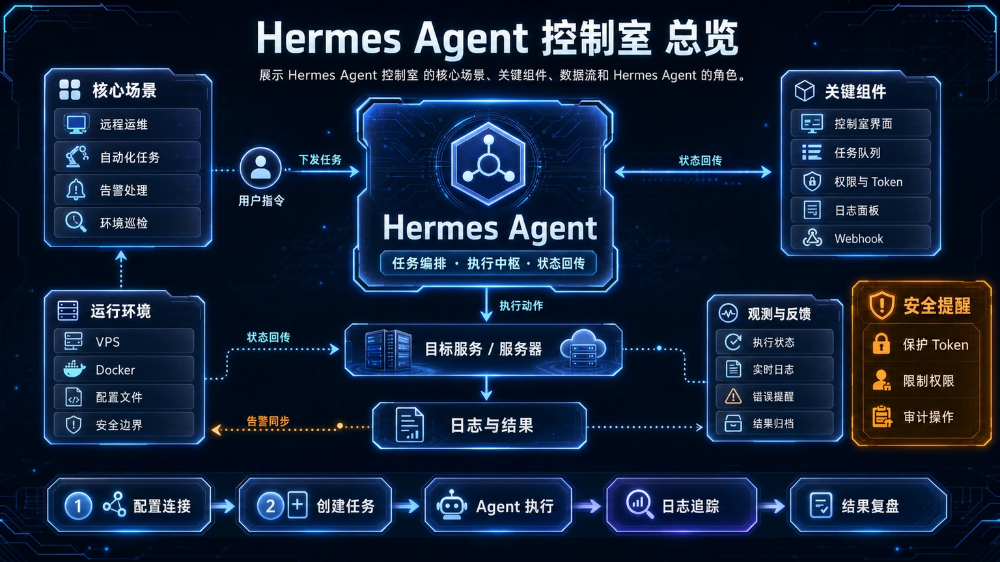
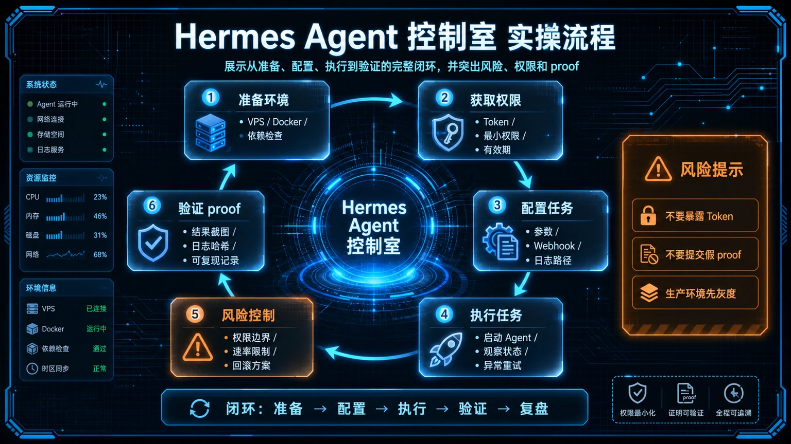

# 🕹️ 19-Hermes Agent 控制室：从一个 Agent 到专员团队的演进模板

> 一句话先说清楚：这一页讲的不是"怎么写一个 Agent"，而是"怎么管一堆 Agent"。Hermes 一个实例就是一个人格、一套记忆、一把钥匙——当你从 1 个走向 5 个，需要的不是更多的 Hermes，而是一个**控制室（Control Room）**：登记册、运行手册、任务总线、备份策略、安全审计。这一页给你一套可直接 fork 的演进模板。



---

## 👀 适合谁

- 已经在跑 2 个以上 Hermes 实例（比如一个生活助手、一个代码助手、一个内容助手），但凭记忆管
- 准备把 Hermes 推到团队/公司场景，需要多人共用、多 Agent 协作
- 想给每个 Agent 配独立的 SOUL、Memory、Skills，但不想每次都从零搭
- 已经撞上"哪个 Agent 在哪台 VPS、用什么 token、上次为什么挂掉"的混乱
- 想要一份"明天我休假同事接手也能看懂"的运维手册

**前提条件**：

- 已经看完 [18-Hermes Agent 进阶实战](./18-Hermes%20Agent%20进阶实战.md)
- 至少跑过 1 个 VPS 上的 Hermes 实例（[06-VPS 自托管 Hermes](./06-VPS%20自托管%20Hermes.md)）
- 理解 `HERMES_HOME` 概念，知道每个 Agent 应该有独立的 home 目录

**不适合谁**：

- 还在用 1 个 Hermes 做所有事，且工作流稳定——别提前上控制室，徒增复杂度
- 团队只有你一个人，且没有"接手交接"诉求——直接 SOUL.md + memory 够用

---

## 🎯 先看结论：控制室不是 Agent，是 sidecar

控制室的核心心智一句话：**Control Room is NOT an agent. It's the system map, operating manual, registry, runbook library, and recovery notebook for the agents you run.**

它是一个仓库 / 一组文件夹 / 一组 markdown，**不是运行时**。它的作用是：

1. **登记册**：每个 Agent 的 VPS、端口、SOUL、Model、Token 来源、最后备份时间
2. **运行手册**：每个 Agent 怎么启动、怎么重启、怎么诊断、怎么回滚
3. **任务总线**：Orchestrator 和 Workers 之间的派单 / 收件 / 验收协议
4. **备份审计**：每个 Agent 的 SOUL/Memory/Skills 何时备份、备份在哪
5. **安全红线**：哪些 Agent 持有哪些密钥、密钥轮换策略、最小权限原则

> 📌 **关键判断**：如果你的"控制室"在脑子里——你还没准备好让 Hermes 进生产。把它写下来，写到 git 里。

---

## 🔄 真实场景：从 1 个到 5 个的失控路径

| 阶段 | 你有什么 | 你缺什么 | 这时长出什么 |
|---|---|---|---|
| 起步 | 1 个 Hermes CLI 跑日常对话 | 不缺 | `~/.hermes/` |
| 分化 | 1 个生活助手 + 1 个代码助手 | 共享 memory 会串味 | 两套 `HERMES_HOME`，但凭记忆管 |
| 扩张 | + 1 个内容助手 + 1 个研究助手 + 1 个运维助手 | 谁在哪台 VPS、各自挂过几次 | Excel 表 / Notion 表 / 脑子记，开始乱 |
| 团队 | 同事要接手某个 Agent | 没有运维手册 | "等我下周回来再说" |
| 生产 | Agent A 调用 Agent B 的服务 | 没有 API 合约、没有降级 | 一个人改了 token，全线挂 |

**控制室的存在意义**：当你在第 3 阶段就把控制室建好，第 4、5 阶段就是"打开 markdown 找答案"，而不是"翻聊天记录 / 问昨天自己"。

---

## 🏗️ 工作流拆解：四级架构演进

控制室模板（来自 [shannhk/hermes-agent-control-room](https://github.com/shannhk/hermes-agent-control-room)）把团队演进拆成 4 级。**每一级都对应明确的"什么时候升级"信号**——不要提前升级，也不要忽略信号。

### Level 1：控制室 + 单 Agent

**配置**：

```
agent-control-room/
├── README.md
├── agents/
│   └── hermes-life/
│       ├── inventory.md    ← 这个 Agent 在哪台 VPS、端口、SSH alias
│       ├── env-map.md      ← 它读哪些 env 变量，分别来自哪
│       ├── runbook.md      ← 怎么启动 / 重启 / 看日志 / 回滚
│       └── backup.md       ← 备份什么、备份到哪、上次备份时间
└── shared/
    └── security.md         ← 安全红线
```

**什么时候升级到 Level 2**：

- 你开始跟同一个 Agent 用不同 SOUL 切换（"现在你是技术助手 / 现在你是写作助手"）
- 你的 memory.md 超过 5000 字，开始有矛盾条目
- 你想给不同入口（CLI vs Telegram）配不同人格

### Level 2：直属专员 Agent 团队

**配置**：在 `agents/` 下加多个 Agent，每个独立 `HERMES_HOME`：

```
agents/
├── hermes-life/      ← 生活助手：日历、提醒、买咖啡
├── hermes-dev/       ← 代码助手：写代码、跑测试、PR
├── hermes-cmo/       ← 内容助手：写推文、写文章
├── hermes-seo/       ← SEO/分析
└── hermes-ops/       ← 运维助手：cron、备份、监控
```

**关键原则**：

- 你直接 `hermes --profile hermes-dev` 选某个 Agent 对话，不经过中间层
- 每个 Agent 持有**最小权限**的密钥：`hermes-dev` 只拿 GitHub Token，`hermes-ops` 只拿 VPS SSH Key
- Agent 之间不共享 memory，避免污染

**什么时候升级到 Level 3**：

- 你开始忘记"这件事该问哪个 Agent"
- 你想做一个统一的入口："对它说一句，它派给合适的专员"
- 多个 Agent 之间需要协作完成一件事（比如"研究 → 写作 → 发布"流水线）

### Level 3：Orchestrator + 任务总线

**新增**：

```
agents/
└── hermes-orchestrator/   ← 前台，只做派单不做实际工作
shared/
└── task-bus/              ← 任务总线
    ├── agents.yaml        ← 专员清单 + 能力声明
    ├── task-template.md   ← 派单模板
    └── result-template.md ← 验收模板
```

**Orchestrator 的硬规则**（写进它的 SOUL.md）：

```markdown
## 我是 Orchestrator

### 我做什么
- 接收用户的任务
- 把任务拆成可派单的子任务
- 通过 task-bus 派给合适的专员
- 收集结果并验收
- 给用户一个汇总答案

### 我不做什么
- ❌ 我不写代码（让 hermes-dev 做）
- ❌ 我不写文章（让 hermes-cmo 做）
- ❌ 我不直接持有任何密钥（密钥只在专员那里）
- ❌ 我不会变成"什么都自己干"的超级 Agent

### 派单原则
- 每个派单必须带：goal / context / toolsets / proof 要求
- 我不能因为"自己干更快"就越权——长期看派单更便宜
- 派单失败的 retry 次数 ≤ 2，超过就人工介入
```

**警告**：Orchestrator 最容易发生的退化是"我什么都能干"。一旦它持有所有密钥、所有工具，就变成了一个比单 Agent 更糟糕的超级 Agent——上下文爆炸、安全失控。**Orchestrator 必须比专员更"瘦"**。

### Level 4：自动化团队（Cron + Webhook）

**新增**：

```
shared/
├── cron-plans/         ← 每个 recurring workflow 的计划文档
└── webhooks/           ← 外部触发器 → 派单到哪个专员
```

**重要原则**：**自动化必须建立在手动跑通之后**。Level 4 不是"开始用 cron"——而是"Level 3 的手动工作流已经稳定跑 2 周以上，再写 cron 让它自动跑"。

**典型自动化**：

- 每天 8:00 orchestrator 派给 hermes-seo："生成今日晨会简报"
- GitHub PR 打开 → webhook → hermes-dev 跑 PR review
- 服务器磁盘 > 80% → webhook → hermes-ops 执行清理 SOP

---

## 🔑 关键模板：5 个必填的 markdown

下面 5 个文件是控制室的"骨架"，fork 仓库后**必须按你的实际情况填**——不要让它们停留在模板状态。

### 1. `agents/<name>/inventory.md`

```markdown
# Agent: hermes-dev

| 字段 | 值 |
|---|---|
| VPS | hetzner-cnx1（SSH alias） |
| 项目路径 | /opt/hermes-dev/ |
| HERMES_HOME | /opt/hermes-dev/.hermes/ |
| 端口 | (无外部端口，纯 CLI) |
| 模型 | anthropic/claude-haiku-4 (主) + deepseek-v4 (兜底) |
| Provider | OpenRouter |
| 启动命令 | `hermes --profile dev` |
| 最后备份 | 2026-06-04 02:00 UTC |
| 状态 | active |
```

### 2. `agents/<name>/runbook.md`

```markdown
# Runbook: hermes-dev

## 启动
SSH 进 hetzner-cnx1 → `cd /opt/hermes-dev && tmux a -t dev`

## 重启
`hermes --profile dev --reset`（清空 session） / `hermes --profile dev`（保留）

## 常见故障
| 现象 | 排查 | 修复 |
|---|---|---|
| 回复变慢 | 看 `--status` 是否 OpenRouter 限流 | 切到 deepseek-v4 兜底 |
| 工具调用失败 | 看 SessionDB error 列 | 多半是 GitHub token 过期 |
| Skill 加载 0 个 | 看 `~/.hermes/profiles/content/skills/` 是否被误删 | git restore |

## 回滚
git log 看上次稳定 commit → `git checkout <sha> -- profiles/`

## 假如我休假，接手的人第一句要看
README.md → inventory.md → runbook.md
```

### 3. `agents/<name>/env-map.md`

```markdown
# Env Map: hermes-dev

| 变量 | 用途 | 来源 |
|---|---|---|
| OPENROUTER_API_KEY | 模型调用 | Vault `/secrets/hermes-dev/openrouter` |
| GITHUB_TOKEN | gh CLI / GitHub MCP | GitHub fine-grained PAT（仅 hermes-dev repo） |
| ANTHROPIC_API_KEY | 直连 Claude（兜底） | 1Password |

## 密钥轮换策略
- OPENROUTER：90 天一次
- GITHUB_TOKEN：60 天一次（fine-grained 缩小 scope）
- 任何泄露 → 24h 内轮换 + 审计 SessionDB
```

### 4. `shared/task-bus/task-template.md`

```markdown
# Task: <task_id>

## Goal
<一句话，自包含>

## Context
- 相关文件路径：
- 上游输出格式：
- 已知约束：

## Toolsets
- [ ] terminal
- [ ] file
- [ ] web

## Proof Requirement
- [ ] 文件路径 + 行号
- [ ] HTTP 状态码
- [ ] git commit SHA
- [ ] URL（可访问）

## Status
- [ ] dispatched
- [ ] in_progress
- [ ] completed (with proof)
- [ ] failed
```

### 5. `shared/security.md`

```markdown
# 控制室安全红线

## 密钥
- 永远在 `.env` 或 Vault，不入仓
- 每个 Agent 持有最小权限的 PAT
- Orchestrator 不持有写权限密钥

## 网络
- 所有 VPS 仅开放 SSH + 必要端口
- Hermes 不直接暴露公网

## 审计
- 每天 cron 跑 `agent-security-auditor` skill
- 任何"异常端口 / 异常 SSH 登录 / 异常 token 调用"→ 立即 Telegram 告警

## 备份
- 每个 Agent 的 HERMES_HOME 每天 02:00 cron → 推到私有 GitHub repo
- 保留 30 天
```

---

## ⚠️ 边界与风险

| 风险 | 触发条件 | 缓解 |
|---|---|---|
| 控制室变 Agent | 把 markdown 当执行体 | 控制室只读 + git，不跑代码 |
| Orchestrator 失控 | 持有所有密钥 | 强制最小权限 + 不持有写权限密钥 |
| 任务总线无 ack | 派单后没回执 | task-template.md 强制 status 字段流转 |
| 备份只有一份 | 单点故障 | 至少两份（GitHub + B2 / R2） |
| Level 跳级 | Level 1 直接上 Level 4 | 严格按"手动跑通 2 周再自动化" |
| 控制室不同步 | 多人改但没 commit | 强制每天 pull + commit |
| 安全审计形同虚设 | 没人看告警 | 告警必须推 Telegram，主理人每天 ack |

### 📌 关于本模板来源

本文基于社区开源项目 [shannhk/hermes-agent-control-room](https://github.com/shannhk/hermes-agent-control-room)（MIT 协议）做了原创中文整理和场景化扩写。该项目还附带 8 个 bundled skill：`create-vps`、`setup-control-room`、`agent-control-room`、`agent-task-router`、`agent-registry-manager`、`agent-backup-manager`、`agent-security-auditor`、`agent-team-cron-planner`。配套英文文章：[shannholmberg 在 X 的 article](https://x.com/shannholmberg/article/2055335043904492011)。

---

## ✅ 过关标准

- 你 fork 了仓库并在 `agents/` 下至少有 1 个完整 Agent 目录（5 个 markdown 都填了真实数据）
- 你能 1 分钟内回答"hermes-dev 在哪台 VPS、用什么 token、上次备份何时"
- 你有 task-template / result-template，且至少跑过 1 次完整的派单 → 验收循环
- 你的 orchestrator SOUL.md 里有明确的"我不做什么"清单
- 你有 1 个"接手 1 小时上手"文档（README → inventory → runbook）

---

## ⬅️ 上一步

- [**18-Hermes Agent 进阶实战：自进化 Skills、MCP、Subagent 编排与生产纪律**](./18-Hermes%20Agent%20进阶实战.md)

## ➡️ 下一步

- [**20-60 天分析师工作流：6 条架构教训**](./20-60%20天分析师工作流.md)

## 📖 出处

本文基于以下来源做了原创中文整理：

- shannhk — [hermes-agent-control-room](https://github.com/shannhk/hermes-agent-control-room)（GitHub，MIT 协议）
- shannholmberg — [Hermes Agent Control Room — From One Agent to Specialist Teams](https://x.com/shannholmberg/article/2055335043904492011)（X article）
- Hermes 官方文档 — [Profiles](https://hermes-agent.nousresearch.com/docs/user-guide/profiles)
- Hermes 官方文档 — [Delegation & Subagents](https://hermes-agent.nousresearch.com/docs/user-guide/features/delegation)



