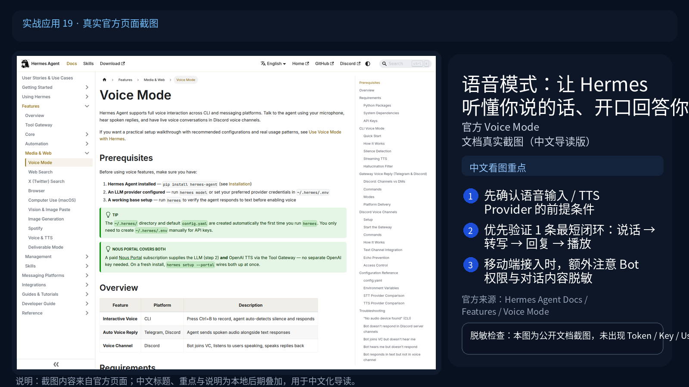

# 🎙️ 19-语音模式：让 Hermes 听懂你说的话、开口回答你

> 一句话先说清楚：这一页教你打开 Hermes 的"嘴和耳朵"——CLI 里按 Ctrl+B 就能跟它说话、Telegram 里发语音消息它能听懂、Discord 里它能加进语音频道跟你群聊。三种入口，一套 STT/TTS 引擎。



---

## 👀 适合谁

- 不想每次都打字，想直接跟 Hermes 说话的人
- 在通勤、做饭、健身时想"动嘴不动手"用 Hermes 的人
- 团队想在 Discord 语音频道开"AI 加入会议"的人
- 想用 AI 给盲人 / 老人 / 视力不便的人做语音助手的人

**前提条件**：
- Hermes 已能正常用文字对话
- CLI 语音模式：你的机器有麦克风和扬声器
- Telegram 语音：Gateway 已接通
- Discord 语音频道：Bot 已加入服务器，且 Hermes 安装了 `discord.py[voice]`
- 知道 STT 是"语音转文字"、TTS 是"文字转语音"

**不适合谁**：
- 在 SSH 远程机器上想用 CLI 语音——除非你做了音频重定向，否则没意义
- 在公共场合开扬声器——会被同事 / 室友讨厌

---

## 🎯 为什么值得做（三种入口怎么选）

很多人不知道，Hermes 的语音模式不是"一个功能"，是**三套不同的入口**：

| 入口 | 在哪用 | 谁能听到 | 适合场景 |
|---|---|---|---|
| CLI 语音 | 终端里 | 只有你（戴耳机） | 个人电脑独处、不想打字 |
| Telegram 语音回复 | 手机 | 只有你（私聊 Bot） | 通勤、散步、做饭 |
| Discord 语音频道 | 服务器语音频道 | 频道里所有人 | 团队会议、协同 review |

底层都走同一套 STT/TTS，所以切换入口不用重新配。

---

## ✍️ 操作步骤：四步开语音

### 第 1 步：装语音依赖

**Python 包：**

```bash
# CLI 麦克风 + 音频播放
pip install "hermes-agent[voice]"

# Telegram + Discord bot（含 Discord 语音）
pip install "hermes-agent[messaging]"

# 全装
pip install "hermes-agent[all]"
```

**系统依赖：**

```bash
# Ubuntu / Debian
sudo apt install portaudio19-dev ffmpeg libopus0
# 可选：本地 TTS 用 espeak-ng
sudo apt install espeak-ng

# macOS
brew install portaudio ffmpeg opus
brew install espeak-ng
```

| 依赖 | 干嘛的 | 缺了会怎样 |
|---|---|---|
| PortAudio | 麦克风输入和扬声器播放 | CLI 语音完全不能用 |
| ffmpeg | 音频格式转换（Opus ↔ MP3 ↔ WAV） | 所有平台语音都不能用 |
| Opus | Discord 语音编解码 | Discord 语音频道连不上 |
| espeak-ng | 本地 TTS 的音素化后端 | NeuTTS 不能用（其他 TTS 不影响） |

**验证：**

```bash
python -c "import sounddevice; print('PortAudio OK')"
ffmpeg -version | head -1
```

### 第 2 步：选 STT 和 TTS Provider

**STT（语音转文字）——优先级从便宜到贵：**

```bash
# 选项 1：本地 faster-whisper（推荐，免费，~150MB 模型）
pip install faster-whisper
# 不需要任何 API Key

# 选项 2：Groq Whisper（云，免费 tier，速度快）
echo "GROQ_API_KEY=gsk_***" >> ~/.hermes/.env

# 选项 3：OpenAI Whisper（云，付费）
echo "VOICE_TOOLS_OPENAI_KEY=sk-***" >> ~/.hermes/.env

# 选项 4：Mistral Voxtral（云，付费）
echo "MISTRAL_API_KEY=***" >> ~/.hermes/.env
```

**TTS（文字转语音）——按效果和成本选：**

| Provider | 成本 | 效果 | 中国可用 |
|---|---|---|---|
| Edge TTS（默认） | 免费 | 一般 | 可用 |
| NeuTTS（本地） | 免费 | 一般 | 可用 |
| OpenAI TTS | 付费 | 好 | 可用 |
| MiniMax | 付费 | 中文很好 | 可用 |
| Mistral Voxtral | 付费 | 好 | 可用 |
| ElevenLabs | 免费额度 | 顶级 | 国内访问不稳定 |

**写入 config.yaml：**

```yaml
stt:
  enabled: true
  provider: local              # local / groq / openai / mistral
  local:
    model: base                # tiny / base / small / medium / large-v3

tts:
  provider: edge               # edge / elevenlabs / openai / minimax / mistral / neutts
```

**最快上手：什么都不配，本地 STT + Edge TTS 就能跑，零成本。**

### 第 3 步：启动并验证

**CLI 语音模式：**

```bash
hermes
```

进入对话后，按 **Ctrl+B**（默认）开始录音：

- 听到一声 beep → 开始说话
- 默认 3 秒不说话自动结束
- Agent 收到转写后的文字 → 处理 → 用 TTS 把回复说出来

调出状态：

```text
/voice status
```

切换语音模式：

```text
/voice on       # 启用：你说话它回答文字 + 语音
/voice tts      # 只听你的语音，回复文字（不开 TTS）
/voice off      # 关闭
```

**Telegram 语音回复：**

启动 Gateway 之后，给 Bot 发语音消息，Hermes 自动：

1. STT 把语音转文字
2. Agent 处理文字
3. TTS 把回复转成语音消息发回来

无需任何额外命令。如果只想要文字回复：

```text
/voice off
```

**Discord 语音频道：**

进入服务器语音频道后，**@ 你的 Bot 让它加入**：

```text
@HermesBot 加入语音频道
```

Hermes 加入后：

- 谁说话它就听谁
- 它的回复会被播放出来给频道所有人听到

让它退出：

```text
@HermesBot 离开语音频道
```

### 第 4 步：调细节让体验更好

**调沉默检测（CLI）：**

默认 3 秒不说话就结束录音。说话慢的人会感到不爽：

```yaml
# ~/.hermes/config.yaml
voice:
  silence_threshold: 200        # 触发沉默的能量阈值
  silence_duration: 5.0         # 沉默多久结束（秒）
  record_key: "ctrl+b"          # 默认录音键
  beep_enabled: true            # 开始 / 结束的提示音
```

**调 TTS 速度（Edge）：**

```yaml
tts:
  provider: edge
  edge:
    voice: "zh-CN-XiaoxiaoNeural"   # 中文女声
    rate: "+10%"                    # 加速 10%
```

**调 STT 模型大小（本地）：**

| 模型 | 大小 | 准确度 | 速度 |
|---|---|---|---|
| `tiny` | ~75 MB | 一般 | 快 |
| `base`（默认） | ~150 MB | 不错 | 中 |
| `small` | ~500 MB | 好 | 慢 |
| `medium` | ~1.5 GB | 很好 | 很慢 |
| `large-v3` | ~3 GB | 顶级 | 最慢 |

GPU 用户尽量用 `medium` 以上，CPU 用户建议 `base`。

---

## 🎙️ 三种入口的实测体验

### CLI 语音（电脑端独处场景）

**最佳场景**：写代码累了，按 Ctrl+B 问"这个函数是干嘛的"。

**实测：**
- 沉默检测默认 3 秒，说话快的人会感觉它"打断你"
- TTS 用 Edge 默认声音偏机械，ElevenLabs 才有真人感
- 戴耳机很重要，不然 Agent 的回复会被你麦克风又录进去

**调优后**：`silence_duration: 4.0` + 中文 Edge voice，体验已经接近 ChatGPT App。

### Telegram 语音（移动场景）

**最佳场景**：散步、做饭时发语音问 Hermes 帮我搜一下、写一下。

**实测：**
- 中文识别用 `base` 模型已经 90%+ 准确
- 回复延迟 = STT 时间 + Agent 处理 + TTS 时间，约 5-15 秒
- 复杂回复（>1 分钟）会被截成多段语音消息发出来

**调优后**：把 STT 切到 Groq，延迟降到 3-5 秒，体验飞跃。

### Discord 语音频道（团队场景）

**最佳场景**：团队 standup、PR review、会议纪要生成。

**实测：**
- Bot 进频道后会一直听，多人说话也能识别
- 但谁的话对应谁不区分（所有声音都被同一个 session 处理）
- 群聊场景容易混乱，更适合"一个人主讲、Bot 补充"模式

**调优后**：限制 Bot 只在被 @ 时响应；告诉团队"演讲模式而非讨论模式"。

---

## 💡 使用心得

### 心得 1：本地 STT 跑得起就别用云

`faster-whisper` 在 8GB 显存上跑 `base` 模型，单次转写 1-3 秒，比 Groq 还快。零账单零延迟。

### 心得 2：TTS 中文优先 MiniMax / Edge

OpenAI TTS 中文有口音。MiniMax 的中文最自然。Edge 的 `zh-CN-XiaoxiaoNeural` 是免费里最好的。

### 心得 3：用 `[SILENT]` 让 Bot 别回语音

参考 [01-晨间简报](./01-用%20Hermes%20做每日晨间简报.md) 的技巧：

```text
如果问题需要短回答，输出 [SILENT]。
```

匹配到 `[SILENT]` 的回复不会发语音，只保留文字。

### 心得 4：把 STT 配置写到 cron 用

Cron 任务的输出可以走 TTS：

```bash
hermes cron create "0 8 * * *" "查一下今天的天气。输出适合 5 秒语音播报的简短回答。"
# deliver: telegram
```

每天早上 Telegram 收到一条语音播报。

### 心得 5：Discord 语音频道用"`/` 命令"而非自然语言

在频道里让 Bot 退出，比"@bot 离开"更稳的方式是用 slash command：

```text
/voice leave
```

### 心得 6：长时间对话用 /new

语音模式会话上下文积累更快（每句话都是几秒音频+文字）。10 分钟对话后建议：

```text
/new
```

避免响应变慢。

---

## ⚠️ 踩坑提醒

### 1. PortAudio 装不上

macOS 用 brew：

```bash
brew install portaudio
pip install pyaudio
```

Ubuntu：

```bash
sudo apt install portaudio19-dev python3-pyaudio
```

### 2. 没装 ffmpeg 导致 Telegram 语音发不回来

所有平台都需要 ffmpeg 做格式转换。看错误日志：

```bash
tail -50 ~/.hermes/logs/errors.log | grep -i "ffmpeg\|audio"
```

### 3. 本地 Whisper 第一次跑卡顿

第一次跑会下载 ~150MB 模型。挂着梯子或者用国内镜像。下完之后跑得很快。

### 4. Discord 语音频道连接失败

99% 是 Opus 库没装：

```bash
pip install "discord.py[voice]"
```

或者系统层：

```bash
sudo apt install libopus0
```

### 5. 录音一直触发沉默检测

调 `silence_threshold` 和 `silence_duration`：

```yaml
voice:
  silence_threshold: 100        # 降低阈值，敏感度更高
  silence_duration: 5.0         # 给更多沉默容忍
```

### 6. TTS 回复被麦克风又录进去

CLI 语音模式别开外放。戴耳机，或者把 TTS 输出和麦克风输入隔开。

### 7. Edge TTS 偶尔 429

免费 Edge TTS 有速率限制。频率高的话换 MiniMax / OpenAI。

### 8. 用中文 STT 但模型识别成英文

明确指定语言：

```yaml
stt:
  local:
    model: base
    language: zh        # 强制中文
```

### 9. Bot 在 Discord 语音频道里听不见

Bot 加入频道后需要有"说话"和"听"的权限。检查频道权限，特别是 Stage Channel 的"演讲者"角色。

---

## ✅ 推荐做法

| 做法 | 原因 |
|---|---|
| 优先本地 faster-whisper | 零成本零延迟 |
| TTS 中文用 MiniMax 或 Edge 中文声音 | 自然度最高 |
| CLI 戴耳机 | 防止回声 |
| Telegram 用 Groq STT | 移动场景延迟低 |
| Discord 语音频道设为演讲模式 | 避免多人说话混乱 |
| silence_duration 调到 4-5 秒 | 默认 3 秒太激进 |
| 复杂任务用文字 | 语音只适合短交互 |

---

## ✅ 过关标准

当你满足以下状态，这篇就算跑通了：

- 至少一种语音入口能用：CLI Ctrl+B、Telegram 语音、Discord 语音频道
- STT 转写中文准确率 ≥ 80%（短句）
- TTS 输出能听、不刺耳
- 你知道 `/voice on/off/status` 和 silence_duration 怎么调
- 你清楚哪些场景用语音比打字好，哪些场景反而更慢

---

## ➡️ 下一步

完成后进入：
[文档总览：从这里选择下一条学习主线](../../00-文档总览.md)

如果你想先回到上一阶段入口重新确认位置：
[05-实战应用总览](./01-总览.md)

---

## 📖 出处

本文基于以下来源做了原创中文整理：

- Hermes 官方文档 — [Voice Mode](https://hermes-agent.nousresearch.com/docs/user-guide/features/voice-mode)
- Hermes 官方文档 — [Configuration: stt / tts / voice](https://hermes-agent.nousresearch.com/docs/user-guide/configuration)
- faster-whisper 项目 — [github.com/SYSTRAN/faster-whisper](https://github.com/SYSTRAN/faster-whisper)
- Edge TTS — [github.com/rany2/edge-tts](https://github.com/rany2/edge-tts)
- 实战参考 — [02-Telegram 消息入口接入](./02-Telegram%20消息入口接入.md)、[11-Discord 接入](<./11-Discord 接入.md>)
