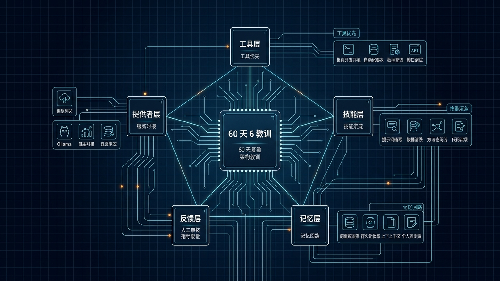

# 📊 20-60 天分析师工作流：6 条架构教训

> 一句话先说清楚：这一页不是"怎么用 Hermes 做分析师"，而是一个真实社区用户跑了 60 天分析师工作流后，总结出来的 6 条**架构教训**。结论很反直觉：**Agent 不败在智能，败在架构。** 大部分 bug 是工具互相打架，不是模型蠢。



---

## 👀 适合谁

- 已经把 Hermes 跑通，但觉得"用了一段时间没什么进步"
- 在做内容 / 投研 / 数据分析类工作流，想用 Hermes 把"找信源 → 整理 → 输出"自动化
- 想知道哪些"看起来很努力"的优化其实是浪费
- 已经撞上过"换 provider、加 skill、调 prompt 都救不了"的瓶颈
- 想看一个真实 60 天的工作流案例（不是营销稿）

**前提条件**：

- 你已经跑通过 [01-用 Hermes 做每日晨间简报](./01-用%20Hermes%20做每日晨间简报.md) 或类似的 cron 自动化
- 你有至少一个稳定跑了 7 天以上的真实工作流
- 你知道 Provider / Skill / Memory / Cron 是什么

**不适合谁**：

- 还没装好 Hermes——先回 [01-先跑起来](../01-先跑起来/01-总览.md)
- 想找"一键暴富 prompt"——这一页讲工程纪律，不讲 prompt 玄学
- 寄希望于"换一个更聪明的模型就能解决一切"——这一页明确否定这条路

---

## 🎯 先看结论：6 条教训，1 条总纲

| # | 教训 | 反常识点 |
|---|---|---|
| 1 | **Provider hopping is expensive** | 频繁换 provider 比锁定一个更贵（调试成本 2-3 倍） |
| 2 | **Tools & Skills > Models** | 工具和 skill 比"换个更强的模型"更影响输出质量 |
| 3 | **Preferences + External Memory = 差异化** | 真正的差异化来自记忆层，不来自模型 |
| 4 | **Feedback loop 是训练方法** | 每天 6 步循环比"换 prompt"更可靠 |
| 5 | **x402 改变工具经济** | 一次 $5 充值解锁百款付费工具，比一家家注册省 90% 时间 |
| 6 | **Skill 是目录，不是 prompt** | 2000 字的 monolithic prompt 是反模式 |

**总纲**：**Building an agent is 90% architecture, 10% AI.**

下面 6 节展开。每节都给"作者当时怎么撞墙 → 撞完发现什么 → 给你的可执行模板"。

---

## 💸 教训 1：Provider Hopping 是最贵的"省钱"

### 真实场景

作者 60 天内换过：

- OpenRouter（Kimi-k2.6、Qwen 3.6 27B、DeepSeek v4 Flash & Pro、Gemma）
- Opencode Go 订阅 + Zen（Mini Max 2.5-2.7、GLM5.1、Kimi-k2.6）
- DeepSeek 直连 API
- Venice AI（隐私推理）
- Grok 订阅（专门跑 x_search）

**每一次切换的隐藏成本**：

- 2–3 次 debugging session：API 兼容性、auth flow、timeout 配置
- 重新跑回归测试："这个工作流在新 provider 上还能跑通吗"
- 调整 system prompt 适配新模型的"听不懂"边界

### 关键洞察

> Model matters less over time. Open-weight labs matching frontier lab intelligence at lower cost.

**推荐**：

- **选 1 个 provider，直连 API**——比 aggregator 更便宜、更可控
- DeepSeek 在直连 API 上**直接打了 75% 折扣**（在永久降价前）
- Opencode Go $5/月有 5–10 秒的 multi-hop 延迟，比直连慢
- 把"换 provider"当成季度决策，不是日常决策

### 给你的模板：Provider 决策表

每季度填一次（`governance/provider-decision.md`）：

```markdown
# Provider 决策 - 2026 Q2

## 当前选择
- 主：DeepSeek 直连（deepseek-v4）
- 兜底：OpenRouter（claude-haiku-4）

## 价格对比（input $/M token）
| Provider | 主模型 | 价格 | 备注 |
|---|---|---|---|
| DeepSeek 直连 | deepseek-v4 | $0.27 | 已稳定 60 天 |
| OpenRouter | deepseek-v4 | $0.36 | aggregator 加价 |
| Anthropic 直连 | claude-haiku-4 | $1.00 | 兜底用 |

## 切换成本
- 调试时间预期：2-3 个 session × 30 分钟
- 回归测试：3 个核心工作流

## 决策
本季度不切换。下次评审：2026 Q3。
```

---

## 🛠️ 教训 2：Tools & Skills 比 Models 更重要

### 反常识点

很多人觉得"模型不行就换更贵的模型"。但 60 天实战发现：**输出质量的天花板，是被 tools 和 skills 决定的，不是模型**。

### 工具选择决策表（作者实测）

| 场景 | 推荐 | 为什么不选另一个 |
|---|---|---|
| 结构化网页搜索 | **Exa** | 比 Tavily 返回更结构化 |
| JS 重渲染的网站 | **Firecrawl** | requests 看不到动态内容 |
| 浏览器自动化 | **Browser CDP** | Cloudflare 会拦截 Playwright |
| 重复 / cron 任务 | **直连 API / MCP / markdown skill** | 不要每次开浏览器，贵 |
| 一次性抓取 | **Browser CDP / agentic search** | 不值得为一次性写脚本 |

### Skill 数量："多" 比 "少" 好

社区里有"skill 太多会爆 prompt"的争论。作者明确站队：

> "Having too many skills = a lot better than not having enough skills for Hermes."

原因：

- Hermes 的 skill 加载是**按需**（progressive disclosure），不是一次性全塞进 prompt
- 缺 skill 时，agent 会用低效的方式重做（"重新发明轮子"），消耗更多 token
- 自动 skill 创建：让一个 3 分钟的手动流程，第二次跑变成 10 秒

### 用户的主要工作

> User's main job: Point agent to correct tools, course-correct when wrong.

**不是写 prompt，是配工具 + 纠偏**。

---

## 🧠 教训 3：Preferences + External Memory = 差异化

### 真实场景

作者的记忆栈：

| 层 | 工具 | 用途 |
|---|---|---|
| 原生 | `USER.md` | 用户画像：名字、时区、沟通风格 |
| 原生 | `MEMORY.md` | 环境事实、项目约定、工具怪癖 |
| 原生 | `SOUL.md` | 人格 |
| **外部** | **Hindsight** | 高准确率的长程召回 |

### 撞墙案例（重要）

作者把 Hindsight 接到 OpenRouter + Kimi-k2.6 上，并配置了多个 cron 跑 `reflect`。结果：

- **每天烧 $20–30** 仅在 "reflect" 上
- Reflect 单次经常跑 240 秒，会 timeout
- Cron 的"每日晨会简报"被 reflect 拖垮

### 修复

> Use **"Recall"** for time-sensitive cron jobs like morning briefs.

**关键区分**：

| 操作 | 延迟 | 成本 | 用在哪 |
|---|---|---|---|
| Reflect | 240s | 高 | 不赶时间（周末复盘） |
| Recall | < 10s | 低 | cron 任务（每日简报） |

### 给你的模板：Memory 成本审计

加到每日自检 cron：

```bash
# Memory 操作成本（过去 24h）
sqlite3 -readonly "$HERMES_HOME/sessiondb.sqlite" <<SQL
SELECT
  CASE WHEN message LIKE '%reflect%' THEN 'reflect'
       WHEN message LIKE '%recall%' THEN 'recall'
       ELSE 'other' END AS op,
  COUNT(*) AS calls,
  SUM(prompt_tokens + completion_tokens) AS tokens
FROM messages
WHERE role='assistant' AND created_at > datetime('now','-1 day')
GROUP BY op ORDER BY tokens DESC;
SQL
```

发现 reflect 单日 > $5 就该降频。

---

## 🔁 教训 4：Feedback Loop 是训练方法

### 旗舰工作流

作者最稳的工作流：每天 10:00 晨会简报（X 账号、新闻源、portco 更新、Top 10 综合）。

### 6 步反馈循环

```
1. Hermes 产出输出
2. 你立刻读 → 标错（具体到哪一段、哪一句）
3. 给具体 correction + 期望的 next steps
4. Hermes 编码为 "permanent rule"（写进 MEMORY.md / SOUL.md / skill）
5. 下次输出自动收紧
6. 重复
```

**关键点**：

- 第 2 步要"立刻"——隔天就忘了细节
- 第 3 步要"具体"——不是"写得不好"，是"第 3 段把 TSMC 和 NVIDIA 的因果搞反了"
- 第 4 步必须是 permanent rule，不是当下改一句

### 未解决的问题：信息茧房

作者承认：经过 60 天反馈循环，"why it matters" 段落开始**重复提及现有持仓**（NVIDIA、TSMC、MU、VRT、SIVE）。

> Echo chamber / self-reinforcing loop 是 feedback loop 的固有副作用。

**缓解建议**：

- 每周强制引入 1 个"反方信源"（你不同意的 viewpoint）
- 在 SOUL.md 加："如果今天的输出和过去 7 天重合度 > 60%，主动引入新视角"

---

## 💳 教训 5：x402 改变工具经济

### 痛点（前 x402 时代）

想给 Hermes 加一个新工具，你要：

1. 找工具（搜索、问社区）
2. 检查有没有 MCP server
3. 注册账号、申请 API key
4. 谈价格、付费方案
5. 集成调试

**每个工具 ≈ 半天到一天**。

### x402 之后

```
1. 一次 install
2. 给 agent 钱包充 $5–10 USDC
3. 直接调几百个 premium 工具，按调用次数 cents 计费
```

作者解锁的 premium 工具：

- Nansen（链上分析）
- Exa / Firecrawl（高级搜索 / 抓取）
- Surf
- BlockRun

**已集成进标准 due diligence 工作流**。

### 给你的判断点

| 是否上 x402 | 你的情况 |
|---|---|
| ✅ 推荐 | 你需要 ≥ 3 个 premium 数据源，且不想每家注册 |
| ⚠️ 谨慎 | 你只用 1 个工具，直接 API key 可能更便宜 |
| ❌ 不上 | 你完全用免费工具，加 x402 反而引入加密钱包管理复杂度 |

---

## 📦 教训 6：Skill 是目录，不是 prompt

### 反模式（作者踩过的坑）

作者的第一个 onchain dump investigation skill：

- **2000+ 字的 monolithic prompt**
- 每次发现 bug，prompt 变得更长（"再多加一条规则"）
- 每次会话从零开始，agent 要从"意大利面条墙"里重新推导
- 修一个 bug 引入两个新 bug

### 正确模式：Skill as Directory

```
onchain-dump-investigation/
├── SKILL.md             # 流水线逻辑（~100 行）
├── references/
│   ├── nansen-agentcash.md      # endpoint shape + 字段怪癖
│   ├── base-rpc-endpoints.md    # 可用 RPC、限流模式
│   └── cookie-mcp-queries.md    # 查询模板 + 交叉验证矩阵
└── scripts/
    └── check_wallets.sh
```

### 经济账

| 项 | 单 prompt | 目录化 Skill |
|---|---|---|
| 加载成本 | 5000 token/次 | ~500 token/次（SKILL.md + 2-3 refs） |
| 修 bug | 改 prompt → 全 agent 重读 | 改 reference 文件 → 只影响相关调用 |
| 跨场景复用 | 整段复制粘贴 | import 同一 reference |
| 一周累计 | 35k token × N 次 = 烧钱 | 35k × 1 + 500 × N = 省钱 |

> **Well-bundled skill costs ~500 tokens to load, saves 5000+ tokens per session. Compounds over hundreds of sessions.**

### 写新 skill 的检查表

- [ ] SKILL.md < 200 行
- [ ] 至少有 1 个 `references/` 文件，把"会变的事实"（API endpoint、字段名、价格）和"不会变的逻辑"分离
- [ ] 至少有 1 个 `scripts/`（如果适用）
- [ ] frontmatter 含 `when_to_use`、`prerequisites`、`known_failure_modes`、`last_verified_against`

---

## ⚠️ 边界与风险

| 风险 | 触发条件 | 缓解 |
|---|---|---|
| Provider 频繁切换 | 看到新模型就试 | 季度评审，平时不动 |
| 反馈循环形成茧房 | 持续表扬 agent 同一类输出 | 每周强制反方信源 |
| Reflect 烧钱 | 接到 OpenRouter 多 cron | 区分 reflect / recall 场景 |
| Monolithic skill | "再加一条规则" | 触发 200 行 → 拆 directory |
| x402 钱包管理 | 忘了充值 | 设低水位告警 |
| 工具表无审计 | 用了 50 个工具没人管 | 每月清点 + 去重 |

### 📌 关于本案例来源

本文基于 [0xJeff 在 Substack 发布的 "6 Workflows, 6 Lessons, 60 Days"](https://defi0xjeff.substack.com/p/6-workflows-6-lessons-60-days)（《Hermes as Personal Analyst》系列第 8 篇）做了原创中文整理和模板化扩写。文中所有数据（provider 列表、价格、token 消耗）均来自原文公开内容。

---

## ✅ 过关标准

- 你能不能列出自己当前用的 1 个主 provider + 1 个兜底，且能说明"为什么不换"
- 你有没有一张工具选择表，决定什么场景用什么工具
- 你是否知道 reflect / recall 的区别，并按场景使用
- 你的旗舰工作流有没有跑 6 步反馈循环至少 2 周
- 你最长的 skill 是不是已经拆成 directory 结构

---

## ➡️ 下一步

完成后进入：
[21-Hermes Agent + Ollama：本地部署最快路径](./21-Hermes%20Agent%20与%20Ollama%20最快路径.md)

如果你想先回到上一阶段入口重新确认位置：
[05-实战应用总览](./01-总览.md)

---

## 📖 出处

本文基于以下来源做了原创中文整理：

- 0xJeff — [6 Workflows, 6 Lessons, 60 Days](https://defi0xjeff.substack.com/p/6-workflows-6-lessons-60-days)（Substack，《Hermes as Personal Analyst》系列第 8 篇）
- Hermes 官方文档 — [Skills System](https://hermes-agent.nousresearch.com/docs/user-guide/features/skills)
- Hermes 官方文档 — [Memory Architecture](https://hermes-agent.nousresearch.com/docs/user-guide/features/memory)
- x402 协议 — [x402.org](https://x402.org/)
