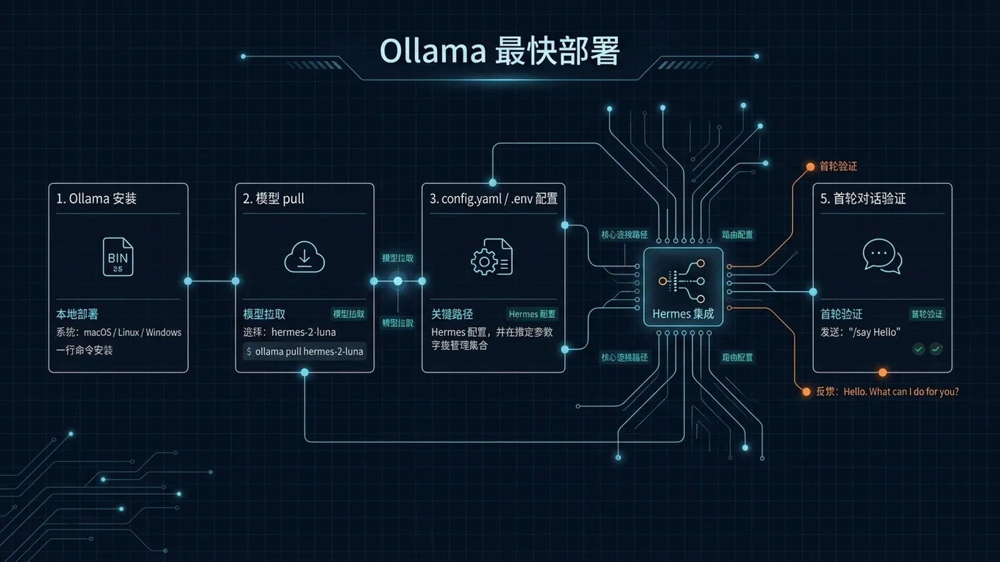

# ⚡ 21-Hermes Agent + Ollama：本地部署最快路径

> 一句话先说清楚：[13-Ollama 本地模型](./13-Ollama%20本地模型.md) 讲的是"为什么要用、什么时候不该用、怎么混搭三层路由"。这一页**只讲一件事**：从 0 到第一次本地对话完成，最短路径、最少配置、最少坑。**适合不想读 300 行原理，只想 5 分钟跑通的人**。



---

## 👀 适合谁

- 听说 Hermes + Ollama 能让 AI 完全免费本地跑，想立刻试一下
- 有 ≥ 16 GB RAM 或 ≥ 8 GB 显存的 Mac / Linux / Windows(WSL) 机器
- 不想看原理、不想配三层路由，只想"装完就能用"
- 愿意接受"模型不是最强，但够日常 80% 任务"

**前提条件**：

- 你已经会打开终端、跑 shell 命令
- 你的机器能装 Ollama（macOS / Linux / WSL）
- 你愿意接受默认推荐（`gpt-oss:20b`），跑通后再换

**不适合谁**：

- 想要 Claude Sonnet 级别智能——本地模型目前做不到，去开 OpenRouter
- 想跑长上下文（> 32k）——本地模型显存撑不住
- 想用 Hermes 做视觉任务——本地多模态还远未成熟

**和 13-Ollama 本地模型.md 的边界**：

- 这一页 = **5 分钟跑通的最短路径**
- [13-Ollama 本地模型](./13-Ollama%20本地模型.md) = **三层路由、显存调优、混搭策略、安全边界、何时退回云端**
- 建议：先用这一页跑通 → 跑了一周后再读 13 优化

---

## 🎯 先看结论：7 步、20 分钟、零账单

| 步骤 | 操作 | 时间 |
|---|---|---|
| 1 | 装 Ollama | 2 分钟 |
| 2 | 拉 `gpt-oss:20b` 模型 | 5–10 分钟（看网速） |
| 3 | 装 Hermes | 2 分钟 |
| 4 | 配置向导：选 Custom OpenAI 兼容 | 1 分钟 |
| 5 | 指向 `http://localhost:11434/v1`，留空 API key | 10 秒 |
| 6 | 选 `gpt-oss:20b` | 10 秒 |
| 7 | 第一次对话 | 立刻 |

**总时间**：≈ 20 分钟（拉模型占大头）。
**总账单**：$0。

---

## 🔄 真实场景：为什么是"最快路径"而不是"最优路径"

社区里有两种本地部署文章：

- **A 类（原理派）**：讲三层路由、Q4 vs Q8 量化、显存计算、KV cache 调优。读 30 分钟，配置 2 小时，跑通后还想继续调。
- **B 类（流水账派）**：截图 30 张，每一步都展开，看完不知道核心 5 步是哪些。

这一页是**第三种**：**只给你跑通需要的最少决策**。如果你之后想优化，去看 [13-Ollama 本地模型](./13-Ollama%20本地模型.md)。

---

## 🛠️ 工作流拆解：7 步实操

### Step 1：装 Ollama

**macOS**：

```bash
# 方式 A：官网下载 .dmg
# 访问 https://ollama.com/download/mac
# 或：
brew install ollama
```

**Linux / WSL**：

```bash
curl -fsSL https://ollama.com/install.sh | sh
```

**Windows**：先装 WSL2（`wsl --install`），然后在 WSL 里跑 Linux 命令。

**验证**：

```bash
ollama --version
# 应该输出 ollama version is 0.x.x
```

### Step 2：拉推荐模型

```bash
ollama pull gpt-oss:20b
```

**为什么是 `gpt-oss:20b`**：

- 微软开源的 20B 参数模型
- 量化后约 12 GB，16 GB 内存或 8 GB 显存能跑
- 工具调用支持良好（Hermes 重度依赖 tool calling）
- 中文输出质量在本地模型里属于第一梯队

**如果你显存更小**（≤ 8 GB，但纯 CPU 跑）：

```bash
ollama pull qwen2.5:7b-instruct-q4_K_M
```

**显存更大**（≥ 16 GB）：

```bash
ollama pull gpt-oss:20b-instruct-q8_0   # 更高精度
# 或
ollama pull qwen3:32b                    # 中文更强
```

**验证**：

```bash
ollama run gpt-oss:20b "你好"
# 应该有正常中文输出
```

如果跑不动（很慢、报 OOM），换 7B 模型。详见 [13-Ollama 本地模型](./13-Ollama%20本地模型.md) 的"显存对照表"。

### Step 3：装 Hermes

```bash
curl -fsSL https://raw.githubusercontent.com/NousResearch/hermes-agent/main/scripts/install.sh | bash
```

**如果你机器上已经有 OpenClaw**：

- 安装脚本会检测 `~/.openclaw`，提示是否自动迁移 settings/memories
- 选择"是"，或者后续跑 `openclaw-migration` skill 也可以

**验证**：

```bash
hermes --version
# 应该输出 hermes 0.x.x
```

### Step 4：跑配置向导

第一次跑 `hermes` 会自动进入配置向导。

**关键选择**（这一页只列"最快路径"的推荐值，理由看 [13-Ollama 本地模型](./13-Ollama%20本地模型.md)）：

| 选项 | 推荐值 | 备注 |
|---|---|---|
| Inference Provider | **Custom OpenAI-compatible endpoint** | 不要选 OpenAI / Anthropic（这些要走云） |
| Base URL | `http://localhost:11434/v1` | Ollama 默认端口 |
| API Key | **留空** | 本地不需要鉴权 |
| Model | `gpt-oss:20b` | 与 Step 2 一致 |
| Context Length | **留空（自动检测）** | Ollama 会自己报 |
| Max Iterations | `60` | 默认值，跑通后可降到 30 |
| Tool Progress Display | `all` | 看清每一步 |
| Context Compression | `0.5` | 上下文到 50% 时压缩 |
| Session Reset | 1440 分钟 + 04:00 重置 | 默认 |
| Messaging | **跳过**（CLI 先跑通） | 之后接 Telegram/Discord |
| Tools | 全部默认开启 | 跑通后按需关闭 |
| Browser | Local Browser（免费 headless） | |
| TTS | Microsoft Edge TTS（免费） | |

### Step 5：启动 Hermes

```bash
hermes
```

第一次启动会：

- 加载所有工具的 schema（约 10 秒）
- 启动 SessionDB
- 显示 TUI 界面

### Step 6：检查模型是否真的指向 Ollama

**重要**：仪表盘有时会默认显示 Claude 或 GPT-4（向导 bug 或缓存）。如果不确定：

```bash
# 退出 hermes 仪表盘（Ctrl+C 或 /exit）
hermes model
```

应该看到：

```
Provider: Custom (http://localhost:11434/v1)
Model: gpt-oss:20b
```

如果显示 OpenAI / Anthropic / OpenRouter，重新选：选你刚保存的本地 endpoint → 确认 model。

### Step 7：第一次对话

```bash
hermes
```

在 TUI 里输入：

```
帮我写一个 Python 函数，判断一个字符串是不是回文
```

正常情况下：

- Agent 会调用 `terminal` 或 `file` 工具
- 跑 10–30 秒（本地模型比云端慢）
- 输出代码 + 解释

**如果跑了 60 秒还没响应**：

- 看 `--status`，是不是在调用工具
- 看 Ollama 日志（`ollama ps`），是不是还在生成
- 大概率是 context 太长，关掉重启

**如果跑出乱码 / 中文烂**：

- 检查模型选对没有
- 换 `qwen3:32b` 或 `qwen2.5:14b`

---

## 🔧 关键配置模板：跑通后的第一次优化

跑通 1 周后，建议加这两个优化（不要一开始就加）：

### A. 关掉用不到的 toolsets

编辑 `~/.hermes/config.yaml`：

```yaml
tools:
  disabled_toolsets:
    - mixture_of_agents   # 多模型投票，本地跑会爆
    - rl_training         # 不在本地训练
    - homeassistant       # 没装 HA 就关掉
```

### B. 加最小成本兜底

如果 Ollama 挂了，自动切到云端（要 OpenRouter key）：

```yaml
providers:
  local:
    base_url: http://localhost:11434/v1
    api_key: ""
    models:
      - gpt-oss:20b
  cloud:
    base_url: https://openrouter.ai/api/v1
    api_key: ${OPENROUTER_API_KEY}
    models:
      - deepseek/deepseek-chat-v4

model_routing:
  default: local/gpt-oss:20b
  fallback: cloud/deepseek/deepseek-chat-v4
```

---

## ⚠️ 边界与风险

| 风险 | 触发条件 | 缓解 |
|---|---|---|
| 显存不够 | 7B 跑不动 | 换 Q4 量化或纯 CPU |
| 模型不会调工具 | 选了 base 模型不是 instruct | 一定要 `-instruct` 后缀 |
| 中文输出乱 | 模型对中文不好 | 换 qwen 系列 |
| 工具调用慢 | 本地推理慢是物理事实 | 接受或回云端 |
| 自动 skill 生成质量低 | 本地模型智能有限 | 跑一周后人工 review agent_created/ |
| 误以为"本地 = 隐私" | 模型是本地的但工具可能上云 | 你的 web_search 仍走外部 API |

### 关于隐私的常见误解

> **"用 Ollama 就是隐私"——错。**

模型推理在本地，但你用的工具（如 `web_search`、`firecrawl`）依然把请求发到云端。**真正端到端隐私需要把所有 toolset 也换成本地版本**（如 `whisper` 转写而不是 OpenAI Whisper API、本地向量库而不是 Pinecone）。

详见 [13-Ollama 本地模型](./13-Ollama%20本地模型.md) 的"边界与风险"一节。

---

## 📊 对比：Hermes vs OpenClaw（本地部署视角）

社区经常把这两个放一起对比。本页只讲**本地部署视角**：

| 维度 | Hermes Agent | OpenClaw |
|---|---|---|
| 主用途 | 个人伴侣 / 顾问 | 多 Agent 编排 |
| 资源占用 | ~20 MB | ~200 MB+ |
| Skill 维护 | 自动生成 + 自我修复 | 人工写 + 维护 |
| 本地部署难度 | 单命令 + 5 个问题 | 多服务编排 |
| 跑得动 7B | ✅ | ⚠️（需要更多 RAM） |
| 推荐 | 个人 / 独立工作者 | 团队 / 多 Agent 场景 |

> 推荐：**两个都装**——它们能在同一台机器共存，不冲突。

---

## ✅ 过关标准

- `ollama run gpt-oss:20b "你好"` 有正常中文输出
- `hermes model` 显示 provider = Custom、URL = localhost:11434
- 在 Hermes 里至少跑通 1 次工具调用（如让 Agent 写文件、跑 shell 命令）
- 你清楚"本地 ≠ 隐私"，知道哪些工具还在上云
- 你知道跑不动时怎么降级到 7B 模型

---

## ➡️ 下一步

完成后进入：
[22-Hermes Agent 深度拆解与自建指南](./22-Hermes%20Agent%20深度拆解与自建指南.md)

如果你想看更深的本地模型原理（三层路由、显存计算、混搭策略）：
[13-Ollama 本地模型](./13-Ollama%20本地模型.md)

如果你想先回到上一阶段入口重新确认位置：
[05-实战应用总览](./01-总览.md)

---

## 📖 出处

本文基于以下来源做了原创中文整理：

- gaodalie — [Hermes Agent + Ollama: FASTEST Way to Install Locally](https://gaodalie.substack.com/p/hermes-agent-ollama-fastest-way-to)（Substack）
- Hermes 官方文档 — [AI Providers: Ollama / Custom OpenAI-compatible](https://hermes-agent.nousresearch.com/docs/integrations/providers)
- Ollama 官方 — [ollama.com](https://ollama.com/)
- Microsoft 开源 — [gpt-oss-20b 模型卡](https://ollama.com/library/gpt-oss)
