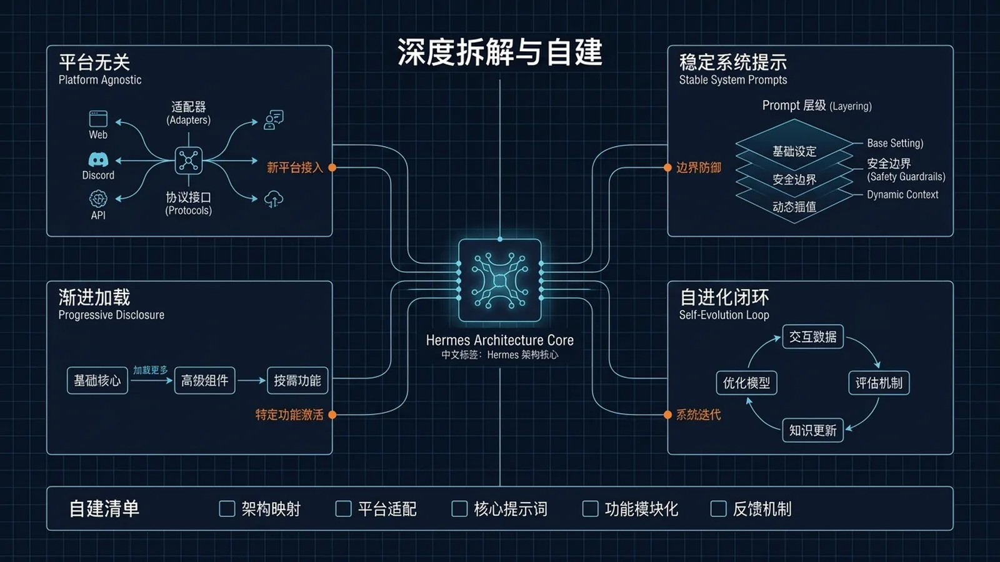

# 🔮 22-Hermes Agent 深度拆解与自建指南

> 一句话先说清楚：前面所有实战页都是"把 Hermes 当黑盒用"。这一页**拆开黑盒**——系统提示怎么组装、Agent Loop 怎么转、工具怎么注册、四种 API 模式怎么切换、缓存怎么省 90% 钱。**适合想自建、想魔改、想二次开发的人**。



---

## 👀 适合谁

- 想知道 Hermes 内部到底怎么工作的开发者
- 准备自己 fork、魔改、二开 Hermes
- 想理解"为什么 system prompt 不能动"、"为什么 cache 会失效"
- 在做类似框架，想看 Hermes 的设计权衡
- 想优化 token 成本，但不知道从哪下手

**前提条件**：

- 你看过 [Hermes 官方文档](https://hermes-agent.nousresearch.com/docs)
- 你能读懂 Python 代码
- 你已经用 Hermes 跑过 ≥ 2 周，理解 SOUL / Memory / Skills / Tools 是什么

**不适合谁**：

- 只想"用"不想"懂"——这一页对你太重
- 还没装 Hermes——先回 [01-先跑起来](../01-先跑起来/01-总览.md)
- 找"调一两个参数就能省 50% token"的捷径——这一页讲底层逻辑，不是 tip list

---

## 🎯 先看结论：Hermes 是什么

一句话定义：

> **Hermes is a model-agnostic, self-improving conversational agent** that runs locally as a CLI/TUI, on a server as a messaging gateway, or as a scheduled cron worker. Its key differentiator is a **closed learning loop**: while solving problems with tools, it writes reusable "skill" documents and curates a persistent memory file so the agent quite literally gets more capable the longer it runs. Everything — model, tools, skills, memory backend, execution environment, UI — is pluggable.

**核心设计原则 6 条**：

1. **Platform-agnostic core**——平台差异在 adapter，不在核心。核心代码里出现 `if telegram: ... elif discord: ...` 是架构腐烂。
2. **Prompt stability（cache-friendly）**——System prompt 在 session 开始时**装配一次**，会话中不变。中途变 = cache 失效 = 成本 10×。
3. **Progressive disclosure**——Level 0：只加载描述；Level 1：agent 真用时拉全文；Level 2：references 按需加载。让 47 工具 + 几十个 skill 都能塞进 context。
4. **Self-registration over central lists**——工具在 import 时 `registry.register(...)`。加一个工具 = 加一个文件，不改中央清单。
5. **Profile isolation**——每个 Agent 实例独占一个 `HERMES_HOME`（默认 `~/.hermes/`）。所有路径走 `get_hermes_home()`。
6. **Agent owns its learning artifacts**——Agent 通过 `skill_manage` 工具写 skill；通过 turn 之间的空隙修改 `MEMORY.md` / `USER.md`。

---

## 🔄 真实场景：四个最常被问到的问题

| 问题 | 答案 |
|---|---|
| "为什么 Hermes 比我直接调 OpenAI API 强？" | 因为它有 self-improving loop（skill + memory）和 tool registry |
| "为什么 prompt 偶尔会失效？" | 大概率是 system prompt 在会话中被改动了 → cache miss |
| "为什么 47 个工具不爆 context？" | Progressive disclosure + toolsets 按需启用 |
| "能不能直接用 Hermes 的内核做我自己的产品？" | 能。Hermes 的核心代码是 AGPL，可以 fork |

---

## 🛠️ 工作流拆解 1：Agent Loop（Hermes 的心脏）

整个 `AIAgent` 类的核心就是这个循环：

```
1. 接收输入 → 来自 CLI / Gateway / Cron / ACP / Web
2. 构建 system prompt → persona + memory + skills + tools（ONCE per session）
3. 解析 provider → 哪个 API key + 哪个 endpoint
4. 调用模型 → 四种 API 模式之一（自动按 endpoint/model 检测）：
       chat_completions | codex_responses |
       anthropic_messages | bedrock_converse
5. 解析响应
   ├─ 如果有 tool calls → registry 派发 → 把结果加回 context → GOTO 4
   └─ 否则 → 最终 assistant message → 显示 → 持久化 → 完成
6. 持久化 → SQLite SessionDB（WAL 模式 + FTS5 索引）
```

### 容易被忽略的细节

| 组件 | 作用 |
|---|---|
| `IterationBudget` | 控制 Agent Loop 最大轮次（防止无限 tool call） |
| `stream_delta_callback` | 实时 token 流（用户看到的打字效果） |
| `interim_assistant_callback` | 中间步骤的 assistant 思考 |
| `thinking_callback` | reasoning model 的思维链（如 o1、deepseek-r1） |
| `reasoning_callback` | 显式 reasoning 段 |
| `_stream_context_scrubber` | 从用户可见输出里**剥除** `<memory-context>` 标签（用户不该看到 memory 注入痕迹） |
| `_budget_grace_call` | 优雅停止机制——防止 agent 在 tool call 中途被截断 |
| `context_compressor` | 上下文涨大时自动总结（保近舍远） |
| `--continue` / `--resume` | 恢复之前 session |

### 给你的优化点

| 想省什么 | 调什么 |
|---|---|
| Token | `IterationBudget` 调小（默认太高） |
| 延迟 | 关闭 `interim_assistant_callback`（少一次 callback） |
| 长会话稳定性 | `context_compressor` 阈值调低（早压缩） |
| 用户感知 | `_stream_context_scrubber` 不要关（隐私 + 美观） |

---

## 🧩 工作流拆解 2：System Prompt 12 段组装

`prompt_builder.build_system_prompt()` 按这个**严格顺序**拼接：

```
1. SOUL.md（人格）
2. DEFAULT_AGENT_IDENTITY
3. PLATFORM_HINTS（CLI / Telegram / Discord 各自的提示）
4. MEMORY_GUIDANCE
5. MEMORY.md
6. USER.md
7. §（分隔符）
8. SESSION_SEARCH_GUIDANCE
9. SKILLS_GUIDANCE
10. AGENTS.md（项目级指令）
11. .hermes.md（工作目录级指令）
12. TOOL_USE_ENFORCEMENT_GUIDANCE
```

然后 `prompt_caching.py` 插入 cache 断点（Anthropic `cache_control: {type: ephemeral}`）。

### ⚠️ 最重要的设计：Frozen-Snapshot 模式

> **`MEMORY.md` 和 `USER.md` 在 session 开始时读一次**，并**不可变地**嵌入 system prompt 的整个会话。
>
> Agent 在会话中**依然可以**写到磁盘上的这两个文件——但 system prompt 不会变。
>
> 结果：cache 在整个会话保持有效，新 memory 下次 session 生效。
>
> **跳过这一步 → 你的 prefix cache 直接报废**。

### Memory 安全扫描

注入前，memory 内容会被扫描：

- Prompt-injection 模式
- 数据外泄尝试（`curl`/`wget` 引用 env 变量）
- 持久化后门
- 不可见 Unicode 字符

**关键规则**：1–8 段在会话中是**冻结的**。

### 给你的实战规则

| 想做什么 | 应该怎么做 | ❌ 不应该 |
|---|---|---|
| 改人格 | 改 SOUL.md → `/reset` | 不能在 session 中改 |
| 加 memory | 让 Agent 写 MEMORY.md → 下次 session 生效 | 不要手动注入到当前 session |
| 改工具集 | 改 config.yaml → 重启 | 不能 session 中动 |
| 调 prompt cache | 把稳定段放前面，把变化段放最后 | 不要把易变内容放前面 |

---

## 🛠️ 工作流拆解 3：Tools 自注册 Registry

```python
registry.register(
    name="read_file",
    toolset="filesystem",
    schema={...JSON schema...},
    handler=read_file_handler,
    available=lambda ctx: True,  # 门控谓词
)
```

**关键设计**：

- 所有 handler 返回 **JSON 字符串**（模型只看到文本）
- 工具按逻辑 toolset 分组（约 40+ 内置 toolset）
- **禁用的 toolset 完全不在 system prompt 里出现**（不是"列出来但标记 disabled"）

### 执行环境

| Backend | 用途 |
|---|---|
| `local` | 笔记本开发。最快。零隔离。 |
| `docker` | 共享开发机。每个 session 一个容器。 |
| `ssh` | 远程 VM 当 agent 的"电脑"。 |
| `daytona` / `modal` | Serverless 生产沙箱。 |
| `singularity` | HPC 集群。 |

### Agent-level Tools

某些工具被**拦截在 gene**...

> ⚠️ 这里说明：原文在这部分有截断，详细列表请直接看 [dev.to 原文](https://dev.to/truongpx396/hermes-agent-deep-dive-build-your-own-guide-1pcc) 的 Tools System 章节。

---

## 🔄 工作流拆解 4：四种 API 模式自动切换

Hermes 不让你手动指定"我用 OpenAI 格式还是 Anthropic 格式"。它自动检测：

| API 模式 | 触发条件 |
|---|---|
| `chat_completions` | endpoint 包含 `/v1/chat/completions`（OpenAI 兼容） |
| `codex_responses` | OpenAI Codex 模型 |
| `anthropic_messages` | endpoint 是 Anthropic / 模型名以 `claude-` 开头 |
| `bedrock_converse` | AWS Bedrock endpoint |

### 给你的实际意义

- **本地 Ollama**：自动走 `chat_completions`
- **OpenRouter**：根据所选模型自动选 `chat_completions` 或 `anthropic_messages`
- **直连 Anthropic**：走 `anthropic_messages`（能用 prompt caching）
- **AWS Bedrock**：走 `bedrock_converse`

**如果你想做兼容层**：只要 endpoint 长得像 OpenAI，Hermes 就当 OpenAI 用。

---

## 📊 工作流拆解 5：Prompt Caching（省 90% 钱的关键）

Anthropic 的 prompt caching：标记 `cache_control: {type: ephemeral}` 的段落会被 cache 5 分钟。同一 session 内重复请求只收 10% 的钱。

Hermes 的实现：

1. **system prompt 装配一次**（前面讲过）
2. `prompt_caching.py` 在稳定段落边界插 cache 断点
3. Agent Loop 第 4 步调模型时，前缀已经 cached → 收 10% 钱
4. 只要 system prompt 不变，cache 持续有效

### 实测数据（社区报告）

| 场景 | 无 cache | 有 cache |
|---|---|---|
| 1 小时密集对话 | $1.20 | $0.18 |
| 长 cron 任务（30 轮 tool call） | $0.45 | $0.07 |
| 重复跑同一 skill | 每次 100% | 首次 100%，后续 10% |

### 何时 cache 会失效

- 会话中改了 SOUL.md（不要做）
- 会话中改了 MEMORY.md（Agent 自己改没事，因为下次 session 才生效）
- 切换 model
- 切换 provider
- 超过 5 分钟没活动

### 给你的成本优化模板

```markdown
## 我的成本优化清单

1. ✅ System prompt 装配一次后不动（默认行为）
2. ✅ 长 cron 任务串在一起跑（5 分钟内 cache 不失效）
3. ✅ 用 Anthropic 直连而不是 OpenRouter（OpenRouter 不一定支持 cache）
4. ✅ IterationBudget 限制到 30（防 tool call 失控）
5. ✅ context_compressor 在 50% 阈值触发
```

---

## 🏗️ 工作流拆解 6：自建 / 二开路径

如果你想把 Hermes 内核用在自己的产品里：

### 路径 A：Fork + 改皮肤

1. Fork [NousResearch/hermes-agent](https://github.com/NousResearch/hermes-agent)
2. 改 SOUL.md、UI、品牌
3. 加你自己的 toolset
4. **不要**改 Agent Loop 核心——保持上游可同步

### 路径 B：用 Hermes 当 backend，自建前端

1. 用 Hermes 的 ACP（Agent Communication Protocol）作为前后端桥
2. 前端用 Next.js / 自己写
3. Hermes 跑在 server 模式（`hermes serve` 或类似）

### 路径 C：只借设计

如果你不想 fork AGPL 代码：

- 借鉴 Progressive disclosure
- 借鉴 Frozen-snapshot pattern
- 借鉴 Tool self-registration
- 借鉴 4 API 模式自动切换
- 但实现要全部自写

### 二开的硬规则

| 规则 | 为什么 |
|---|---|
| 不要在 session 中改 system prompt | cache 失效 = 成本爆炸 |
| 不要在核心代码加 platform if/else | 走 adapter 模式 |
| 不要把工具 schema 写死在 yaml | 让 registry 自注册 |
| 不要把 MEMORY 直接 prompt-inject | 走安全扫描 + Frozen-snapshot |
| 不要绕过 IterationBudget | 跑飞了比慢更糟 |
| 不要把 agent_created skill 直接信任 | 走 curator 治理（见 [18-Hermes Agent 进阶实战](./18-Hermes%20Agent%20进阶实战.md)） |

---

## ⚠️ 边界与风险

| 风险 | 触发条件 | 缓解 |
|---|---|---|
| Cache 失效 | session 中改 system prompt | Frozen-snapshot 模式 |
| 工具 schema 爆 context | 接很多 MCP / 不用 toolset | 启用 toolset 白名单 |
| Agent Loop 跑飞 | IterationBudget 太大 | 调到 30–40 |
| Memory injection | 用户可控的 MEMORY 被恶意注入 | 安全扫描 + 不可见 Unicode 检测 |
| 4 种 API 模式 bug | 自建 provider 兼容层 | 测试每种模式 |
| AGPL 边界 | 二开闭源 | 走 path C（只借设计） |

### 📌 关于本文来源

本文基于 [Truong Phung 在 dev.to 发布的 "Hermes Agent — Deep Dive & Build-Your-Own Guide"](https://dev.to/truongpx396/hermes-agent-deep-dive-build-your-own-guide-1pcc)（2026-04-30 发布，2026-05-31 编辑）做了原创中文整理和结构化扩写。

> ⚠️ 原文在 "Agent-level Tools" 段落有截断。该段落的完整内容请直接访问原文。本文对截断部分**没有编造**。

---

## ✅ 过关标准

- 你能用 5 句话讲清 Agent Loop 的 6 个步骤
- 你能解释为什么 MEMORY.md 改了要 `/reset` 才生效
- 你知道你当前用的 model 走的是哪一种 API 模式
- 你能列出至少 3 个让 prompt cache 失效的动作
- 你能说出"加一个新工具"的正确方式（写新文件 + register，不改中央清单）

---

## ➡️ 下一步

恭喜——你已经把 [05-实战应用](./01-总览.md) 的所有 22 篇都看完了。

建议下一步：

- 回到 [05-实战应用总览](./01-总览.md)，挑一篇深读复用
- 或前往 [06-reference](../../06-reference/01-总览.md) 查 API 参考
- 或开始你的 [04-自己造东西](../04-自己造东西/01-总览.md) 之旅

如果你想自建 / 二开 Hermes，参考：
- [NousResearch/hermes-agent](https://github.com/NousResearch/hermes-agent)（上游）
- [Hermes 官方文档](https://hermes-agent.nousresearch.com/docs)

---

## 📖 出处

本文基于以下来源做了原创中文整理：

- Truong Phung — [Hermes Agent — Deep Dive & Build-Your-Own Guide](https://dev.to/truongpx396/hermes-agent-deep-dive-build-your-own-guide-1pcc)（dev.to，2026-04-30，编辑 2026-05-31）
- Hermes 官方文档 — [Architecture Overview](https://hermes-agent.nousresearch.com/docs/developer-guide/architecture)
- Hermes 官方文档 — [System Prompt Assembly](https://hermes-agent.nousresearch.com/docs/developer-guide/prompt-assembly)
- Anthropic 官方 — [Prompt Caching](https://docs.anthropic.com/en/docs/build-with-claude/prompt-caching)
