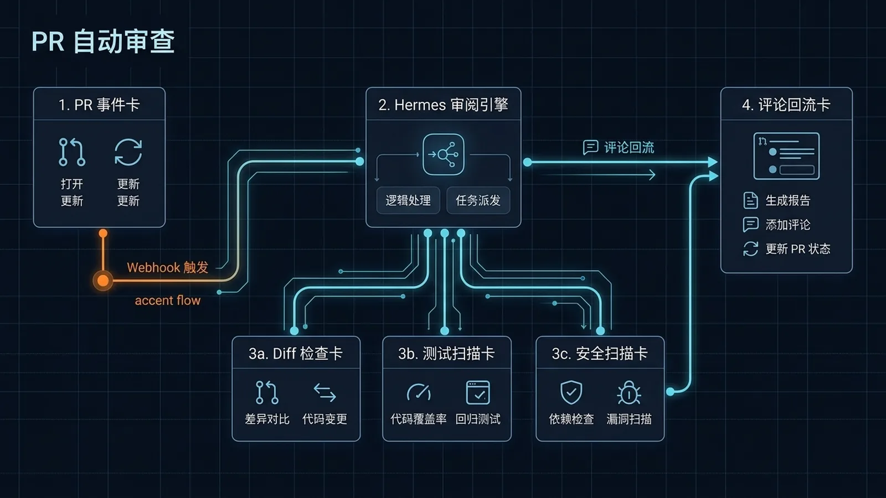

## 标题
实战：将 Hermes Agent 融入个人项目开发工作流

## 适合谁
- **独立开发者或个人项目维护者**：希望有一个统一的工具入口来管理整个开发流程。
- **效率爱好者**：追求自动化，希望减少在不同工具（IDE、GitHub、终端、监控）之间来回切换的精力损耗。
- **AI Agent 实践者**：想了解如何将 AI Agent 的能力真正落地到日常开发中，而不仅仅是代码生成。

## 目标
本文将带你走完一个真实的项目开发迭代周期，展示如何只用 Hermes Agent 这一个入口，完成从**需求澄清、编码实现、代码审查、文档更新**到**部署后监控**的完整闭环。

最终，你将获得一个“监、控、改、查”一体化的个人开发工作流，把 Hermes Agent 变成你的 7x24 小时项目助理。

## 核心信息
个人开发最大的痛点在于“上下文切换”和“重复的琐碎任务”。Hermes Agent 的价值在于，它能将这些分散的环节用一个统一的对话式界面串联起来，并利用 AI 和自动化能力，将你从重复劳动中解放出来。

- **统一入口**：所有操作都在 Hermes 中完成，无需离开你的聊天窗口。
- **流程自动化**：用 Cron 跑测试、用 Webhook 触犯审查，变被动为主动。
- **记忆与知识库**：让 Agent 记住你的项目规范，帮你写出更一致的代码和文档。

---

## ⚙️ 第一步：需求澄清与任务拆解

一个新功能通常始于一个模糊的想法。在动手之前，先让 Hermes 帮你把想法变具体。

你可以直接对 Hermes 说：

> “我想给我的博客增加一个‘相关文章’推荐功能。它应该出现在每篇文章的末尾，根据当前文章的标签来推荐 3 篇最相关的。帮我拆解一下实现步骤。”

Hermes 会像一个 PM 一样，帮你梳理出清晰的步骤，例如：
1.  获取当前文章的标签。
2.  查询所有文章，找到包含相同标签的文章。
3.  计算相关度（例如，共同标签数）。
4.  排序并提取前 3 篇。
5.  在文章页末尾渲染推荐列表。
6.  处理边界情况（如没有足够推荐文章）。

这个过程不仅能帮你理清思路，产出的文字还可以直接作为任务清单或初始设计文档。

## ✍️ 第二步：编码实现与辅助

进入编码阶段，Hermes 可以作为你的编程伙伴。你可以通过两种方式与它协作：

1.  **直接在 CLI/TUI 中**：对于简单的文件修改、脚本运行，可以直接使用 `terminal`、`read_file`、`write_file` 等工具。
2.  **在 IDE 中（推荐）**：通过 [ACP (Agent-Client Protocol)](../04-自己造东西/08-放进编辑器里用.md) 协议，将 Hermes 的能力无缝集成到你的 VS Code 或 JetBrains 编辑器中。

一个典型的场景是，你在 IDE 中遇到一个函数实现难题，可以直接 `@hermes` 提问，它会基于当前文件的上下文给出具体代码建议。

> “帮我用 Python 写一个计算文章相关度的函数，输入是当前文章 ID 和所有文章的列表，输出是排序后的推荐文章 ID 列表。”

这比切换到浏览器搜索、筛选信息要高效得多。

## ✅ 第三步：自动化代码审查 (PR Review)

个人项目也需要质量保证。每次提交代码时，你可以配置一个自动化的工作流来审查你的代码。

这通常利用 Git 的 Webhook 功能实现。当一个新的 PR 被创建时，Webhook 会通知 Hermes，然后 Hermes 会自动执行预设的审查任务。

这个过程的搭建细节可以参考这篇专门的教程：
- [**实战：GitHub PR 自动审查**](./14-GitHub-PR-自动审查.md)

你可以让 Hermes 帮你检查：
- 代码风格是否符合规范。
- 是否有明显的逻辑错误。
- 是否缺少测试用例。
- 文档注释是否完整。

审查结果会以评论的形式自动发到 PR 页面，就像一个真正的同事在帮你 Code Review。

## 🔄 第四步：构建、部署与文档同步

代码合并后，部署和文档更新这类重复性工作最适合交给 Hermes 自动处理。

你可以创建一个 [Skill](./15-自定义%20Skills.md)，将你的部署脚本（例如 `npm run build && scp -r dist/* user@server:/path`）封装起来。以后每次部署，只需要对 Hermes 说：

> “/skill deploy-my-blog”

更进一步，你可以使用 [Cron 自动化](./07-让%20Hermes%20自己自动跑.md)，让 Hermes 在每天凌晨自动拉取最新代码、运行测试并部署到预发布环境。

> “创建一个 Cron Job，每天凌晨 3 点执行 `deploy-staging` 这个 Skill。”

## 📈 第五步：7x24 小时站点监控

部署上线只是开始。你需要确保你的服务一直正常运行。Hermes 的 Cron 功能同样可以胜任监控任务。

设置一个每 5 分钟运行一次的 Cron Job，让它：
1.  访问你的网站首页。
2.  检查 HTTP 返回状态码是否为 200。
3.  如果不是 200，或者响应超时，立即通过飞书/Telegram 等渠道向你发送告警。

这个简单的“心跳检测”脚本可以帮你第一时间发现服务中断问题。

> “创建一个 Cron Job，每 5 分钟访问一次 `https://my-blog.com`，如果状态码不是 200 或访问失败，就给我发一条标题为‘博客挂了！’的紧急通知。”

---

## 总结：你的个人开发中枢

通过以上五个步骤，Hermes Agent 不再仅仅是一个聊天机器人或代码生成器，而是成为了你个人项目的“开发中枢”。它将原本孤立的开发环节串联成一个流畅的闭环，让你能更专注于创造性的工作，而不是被繁琐的流程拖慢脚步。

## CTA
- **下一步**：尝试为你自己的项目[创建一个自定义 Skill](./15-自定义%20Skills.md)，将你最常用的一个脚本封装起来。
- **探索更多**：阅读[《让 Hermes 自己自动跑》](./07-让%20Hermes%20自己自动跑.md)，深入了解 Cron Job 的高级用法。

## 给下游的说明
- **校对**：请检查文中的链接是否都指向了正确的 `.md` 文件。
- **图片**：首图已按要求引用，alt 文本已优化。
- **SEO**：`description` 已为搜索引擎优化，包含了核心关键词。
- **去重**：本文聚焦于“工作流串联”，避免了与 SOUL、Ollama、MCP 等具体技术点的深度重复，只在必要时引用链接。
