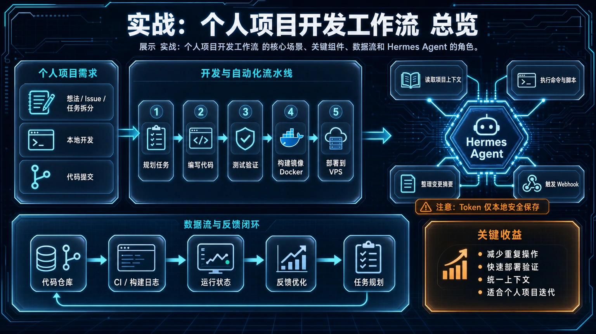
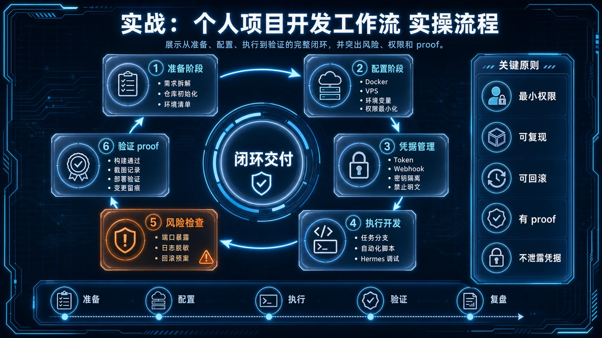

# ⚙️ 23. 实战：个人项目开发工作流

本文面向独立开发者和效率爱好者，展示如何只用 Hermes Agent 这一个入口，将一个模糊的想法，流畅地转化为一个从编码、审查、部署到监控的完整闭环。我们的目标是把 Hermes Agent 变成你的 7x24 小时项目助理，实现“一个入口管所有”的清爽体验。

## 适合谁

- **独立开发者或个人项目维护者**：希望有一个统一的工具入口来管理整个开发流程。
- **效率爱好者**：追求自动化，希望减少在不同工具（IDE、GitHub、终端、监控）之间来回切换的精力损耗。
- **AI Agent 实践者**：想了解如何将 AI Agent 的能力真正落地到日常开发中，而不仅仅是代码生成。

## 先看结论/核心判断

个人开发最大的痛点在于“上下文切换”和“重复的琐碎任务”。Hermes Agent 的核心价值在于，它能将这些分散的环节用一个统一的对话式界面串联起来，并利用 AI 和自动化能力，将你从重复劳动中解放出来。

- **统一入口**：所有操作都在 Hermes 中完成，无需离开你的聊天窗口。
- **流程自动化**：用 Cron 跑测试、用 Webhook 触发审查，变被动为主动。
- **记忆与知识库**：让 Agent 记住你的项目规范，帮你写出更一致的代码和文档。

## 最短路线

从一个想法到一个上线的功能，最高效的路径如下：
1.  **一句话需求** -> Agent 辅助拆解为任务清单。
2.  **编码** -> Agent 在 IDE 中辅助实现具体函数。
3.  **提交代码** -> Agent 自动执行 PR 审查。
4.  **合并代码** -> Agent 自动构建、部署、同步文档。
5.  **部署后** -> Agent 充当 7x24 小时监控哨兵。

## 具体怎么做/工作流拆解

### 第一步：需求澄清与任务拆解

一个新功能通常始于一个模糊的想法。在动手之前，先让 Hermes 帮你把想法变具体。

你可以直接对 Hermes 说：
> “我想给我的博客增加一个‘相关文章’推荐功能。它应该出现在每篇文章的末尾，根据当前文章的标签来推荐 3 篇最相关的。帮我拆解一下实现步骤。”

Hermes 会像一个 PM 一样，帮你梳理出清晰的步骤，这些产出可以直接作为任务清单。

### 第二步：编码实现与辅助

进入编码阶段，推荐通过 [ACP (Agent-Client Protocol)](../04-自己造东西/08-放进编辑器里用.md) 协议，将 Hermes 的能力无缝集成到你的 VS Code 或 JetBrains 编辑器中。

当你在 IDE 中遇到难题，可以直接 `@hermes` 提问，它会基于当前文件的上下文给出具体代码建议。

> “帮我用 Python 写一个计算文章相关度的函数，输入是当前文章 ID 和所有文章的列表，输出是排序后的推荐文章 ID 列表。”

### 第三步：自动化代码审查 (PR Review)

个人项目也需要质量保证。利用 Git 的 Webhook 功能，可以在创建新 PR 时通知 Hermes，让它自动执行预设的审查任务，并将结果以评论形式发到 PR 页面。

这个过程的搭建细节可以参考这篇专门的教程：
- [**实战：GitHub PR 自动审查**](./14-GitHub-PR-自动审查.md)

### 第四步：构建、部署与文档同步

代码合并后，部署和文档更新这类重复性工作最适合交给 Hermes 自动处理。你可以创建一个 [Skill](./15-自定义%20Skills.md)，将你的部署脚本封装起来。以后每次部署，只需要调用这个 Skill 即可。

> “/skill deploy-my-blog”

更可以利用 [Cron 自动化](../04-自己造东西/07-让%20Hermes%20自己自动跑.md)，让 Hermes 在每天凌晨自动拉取最新代码、运行测试并部署。

### 第五步：7x24 小时站点监控

部署上线只是开始。你需要确保你的服务一直正常运行。Hermes 的 Cron 功能同样可以胜任监控任务。

设置一个每 5 分钟运行一次的 Cron Job，让它访问你的网站并检查状态码，如果异常，立即通过飞书/Telegram 等渠道向你发送告警。

> “创建一个 Cron Job，每 5 分钟访问一次 `https://my-blog.com`，如果状态码不是 200 或访问失败，就给我发一条标题为‘博客挂了！’的紧急通知。”

## 常见坑

- **过度依赖代码生成**：Agent 更大的价值是流程串联，而非仅仅写代码。应避免把它当成一个单纯的 Copilot。
- **忽视 Skill 沉淀**：临时的脚本命令应该尽快沉淀为可复用的 Skill，否则会反复编写和调试，丧失了自动化的意义。
- **监控规则不完善**：简单的“心跳检测”可能不够，对于有业务逻辑的站点，还需要检查关键页面的内容是否正确渲染，避免“服务在但页面白板”的情况。

## 过关标准

当你能做到以下几点时，说明你已经成功将 Hermes Agent 融入了你的工作流：

- **新功能开发**：从需求到部署的全流程，都能在 Hermes 中通过对话或命令驱动完成。
- **日常维护**：至少封装了 1 个自定义 Skill 来处理重复性任务（如部署、备份、日志分析）。
- **稳定性保障**：设置了至少 1 个 Cron Job 来 7x24 小时监控你的核心服务，并能成功收到告警。

## ⬅️ 上一步

- [**22-Hermes Agent 深度拆解与自建指南**](./22-Hermes%20Agent%20深度拆解与自建指南.md)

## ➡️ 下一步

- [**24. 实战：用 session_search 打造你的外部记忆**](./24-实战：用-session_search-打造你的外部记忆.md)

## 📖 出处

本文内容基于 Hermes Agent 社区分享的个人开发者最佳实践，并结合了项目开发全生命周期的通用模型进行结构化编排。

