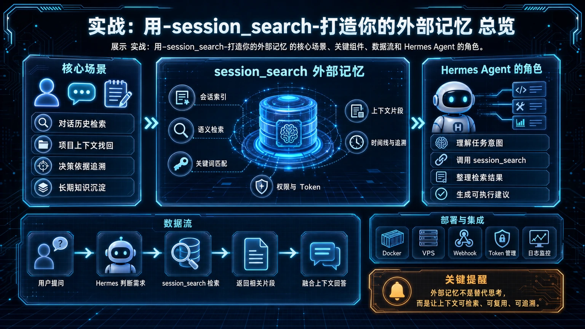
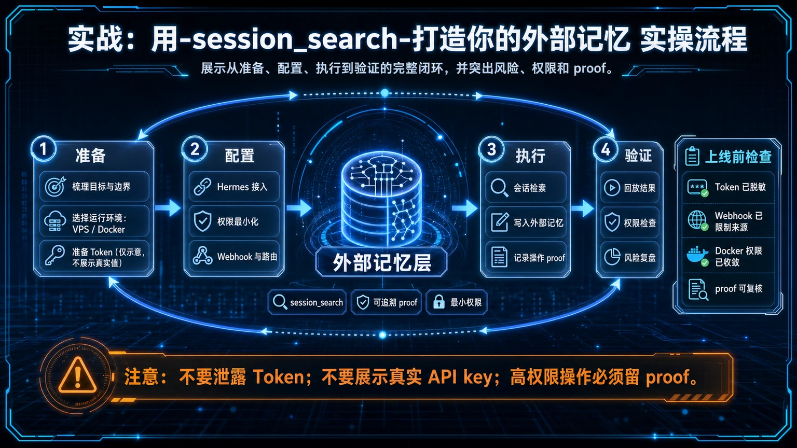

# 🧠 24. 实战：用 session_search 打造你的外部记忆

你是否遇到过这种情况：依稀记得几个月前用 Hermes 解决过一个棘手问题，但具体的命令和步骤却怎么也想不起来了？本文将教你如何使用 `session_search` 这个强大的工具，把 Hermes 的历史记录变成一个随用随查、永不遗忘的“外部记忆”。

## 适合谁

- **Hermes Agent 的重度使用者**：每天都与 Agent 进行大量交互，希望从历史对话中挖掘价值。
- **经常忘记命令的开发者**：不想重复解决同样的问题，希望快速找回过去的解决方案。
- **知识管理爱好者**：希望将 AI 对话记录无缝整合进自己的知识体系。

## 先看结论/核心判断

`session_search` 是 Hermes Agent 内置的“对话历史搜索引擎”。它最大的价值在于，让你不必在不同的笔记应用和终端历史记录之间来回翻找，只需一个简单的查询，就能精准定位到过去任何一次对话的上下文。这不仅仅是“查找”，更是“情景再现”。

## 最短路线

1.  **忘记了？问 Hermes**：当你只记得模糊的关键词（比如 “docker” 和 “端口映射”），直接用 `session_search` 查询。
2.  **定位会话**：Hermes 会列出最相关的历史会话片段。
3.  **获取完整上下文**：通过返回的 `session_id` 和 `message_id`，你可以像翻书一样浏览该次对话的完整记录，找回完整的解决方案。




## 具体怎么做/工作流拆解




### 场景：找回一个旧命令

假设你记得之前配置过一个用于“博客自动备份”的 `cronjob`，但忘记了具体的 `schedule` 和 `script` 内容。

**第一步：用关键词模糊搜索**

直接在对话框中调用 `session_search` 工具：

> `session_search(query="博客 备份 cronjob")`

Hermes 的 `tool_code` 会是：
```python
print(default_api.session_search(query="博客 备份 cronjob", limit=3))
```

**第二步：从结果中定位关键会话**

工具会返回最相关的几个历史会话摘要，包括：
- `session_id`: 会话的唯一标识。
- `snippet`: 包含你查询关键词的上下文片段。
- `bookend_start` & `bookend_end`: 会话开始和结束时的对话，帮你快速回忆起这次任务的“来龙去脉”。

通过阅读 `snippet`，你很快就能找到那个关于配置备份的会话。

**第三步：深入探索，获取完整信息**

找到了目标会话 `session_id`（例如：`a1b2c3d4`）和关键消息 `match_message_id`（例如：`12345`）后，你可以进一步“钻取”进去，查看完整的上下文：

> `session_search(session_id="a1b2c3d4", around_message_id=12345, window=10)`

这会返回指定消息周围 20 条（前后各 10 条）完整对话，让你能完整地看到当时是如何一步步创建那个 `cronjob` 的，所有细节尽收眼底。

## 常见坑

- **查询词过于宽泛**：只用“docker”这样的词会返回大量无关结果。尽量使用多个关键词组合，或者加上引号进行“精确匹配”。
- **只看不记**：找到解决方案后，如果它具有通用性，最好的方法是将其提炼并保存为一个 [Skill](./15-自定义%20Skills.md)，一劳永逸。
- **忽略 FTS5 语法**：`session_search` 支持强大的 FTS5 搜索语法，如 `OR`, `NOT`, `"`，善用它们能极大提升查询效率。

## 过关标准

- 你能够仅凭记忆中的几个关键词，在 3 次 `session_search` 调用内，成功找回一个超过一个月前的复杂操作指令。
- 当你再次遇到重复性问题时，第一反应是 `session_search` 而不是从头开始 google。

## ⬅️ 上一步

- [**23. 实战：个人项目开发工作流**](./23-实战：个人项目开发工作流.md)

## ➡️ 下一步

- [**25. 实战：7x24 小时服务器自动化运维**](./25-实战：服务器自动化运维.md)

## 📖 出处

本实践总结自 Hermes Agent 核心用户对提升长期人机协作效率的探索，旨在将“历史记录”从单纯的日志，转变为可主动利用的“知识资产”。


