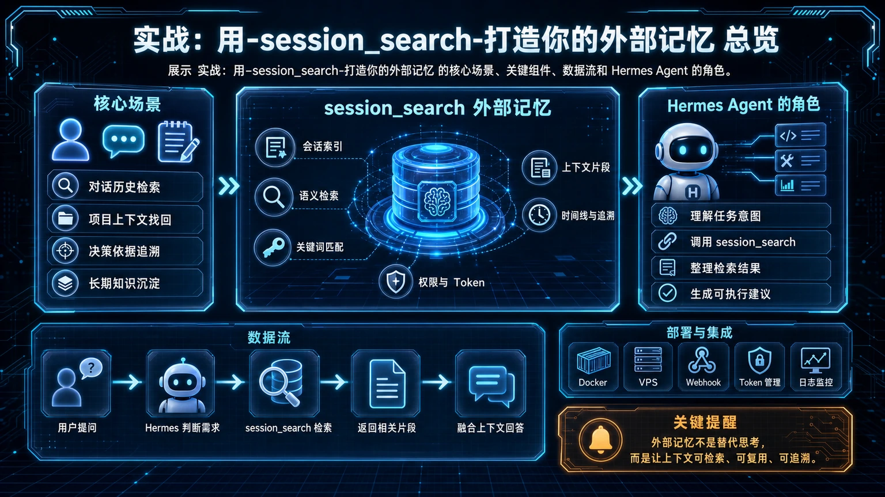
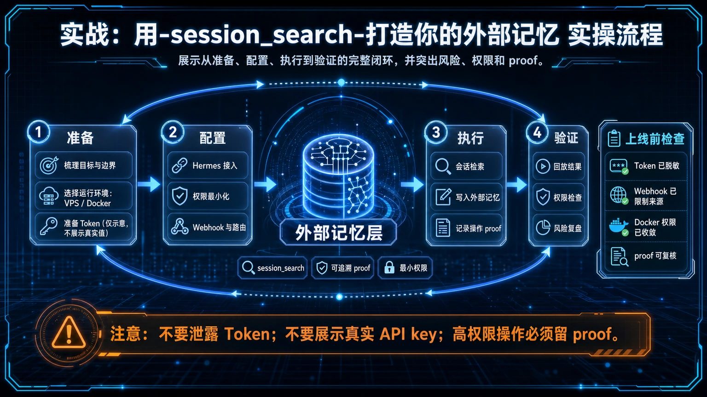

# 🧠 24. 实战：用 session_search 找回历史会话与命令

记得以前解决过一个问题，却找不到当时的命令？`session_search` 能搜索 Hermes 已保存的会话，并读取命中消息附近的上下文。结果受记录保留、profile 和数据库范围影响；没有命中时先核对范围、关键词与时间条件，不据此断言从未发生。

复核日期：**2026-10-05**；依据 **v2026.9.24（Agent v0.21.5）** 工具 schema 与源码。本轮未实际执行 Hermes 会话搜索或重跑历史命令。

## 适合谁

- **Hermes Agent 的重度使用者**：每天都与 Agent 进行大量交互，希望从历史对话中挖掘价值。
- **经常忘记命令的开发者**：不想重复解决同样的问题，希望快速找回过去的解决方案。
- **知识管理爱好者**：希望将 AI 对话记录无缝整合进自己的知识体系。

## 先看结论/核心判断

工具返回实际数据库消息，不靠模型补写历史。先查关键词，再用返回的真实会话与消息 ID 读取上下文；找到旧命令后，还需核对当前版本与权限。

## 最短路线

1. 在对话中要求 Hermes 用 `session_search` 查找关键词。
2. 比较真实返回的会话、消息与来源链接。
3. 沿锚点读取足够上下文，区分原方案、后续修正和未确认结论。




## 具体怎么做/工作流拆解


### 场景：找回一个旧命令

假设你记得之前配置过一个用于“博客自动备份”的 `cronjob`，但忘记了具体的 `schedule` 和 `script` 内容。



**第一步：用关键词搜索，必要时限定时间**

在对话里要求：“用 session_search 找回博客备份 cronjob 的会话，先列最相关结果和来源链接。”以下为 Agent 工具参数示意，不是终端命令或通用 Python SDK：

```json
{"query":"博客 备份 cronjob","limit":3,"after":"2026-09-01","before":"2026-10-01"}
```

此例查找 **9 月开始的会话**。`after` 包含下界，`before` 排除上界；纯日期以 **UTC 午夜**解释，筛选的是会话开始时间，而非每条消息时间。不确定日期时省略过滤。默认搜索 user/assistant，调试工具输出时才明确包含 tool。

**第二步：核对结果和 profile**

查看真实返回的 `session_id`、`match_message_id`、`snippet`、`link`。默认 `detail="adaptive"` 只完整展开最高排名结果，其他结果可能仅返回锚点；需要对比每条结果上下文时可用 `detail="full"`。引用返回的 `link`，不要猜造链接。

默认使用当前 profile 的数据库；已知跨 profile 会话时明确指定 `profile`，该读取为只读。只能搜索已保存、仍可访问的记录，不替代文件、网页或实时系统检查，也不保证自动合并所有机器历史。

**第三步：取得真实 ID 后读取锚点附近上下文**

请 Agent 使用返回的 `session_id`、`around_message_id=match_message_id` 和 `window=10`。最多返回 **前 10 条 + 锚点 + 后 10 条，共 21 条**，实际条数与内容长度以结果为准。一个窗口不等于完整会话；继续沿真实消息 ID 前后读取，或使用会话读取形态取得更多上下文，直到证据足够。

## 常见坑

- **查询词过于宽泛**：只用“docker”这样的词会返回大量无关结果。尽量使用多个关键词组合，或者加上引号进行“精确匹配”。
- **只看不记**：找到解决方案后，如果它具有通用性，最好的方法是将其提炼并保存为一个 [Skill](./15-自定义%20Skills.md)，复用前仍核对版本与权限。
- **忽略 FTS5 语法**：`session_search` 支持强大的 FTS5 搜索语法，如 `OR`, `NOT`, `"`，善用它们能极大提升查询效率。

## 过关标准

- 能定位至少一条相关会话，核对真实消息、时间及当前 profile。
- 能解释检索范围和未命中限制，区分旧命令、后续修正与未确认信息。
- 复用操作前重新检查当前版本、参数与权限；历史结果不能直接作为执行授权。

## 🔗 实战路径

- 回到[实战应用总览](/docs/start/practical)，把会话记忆与 Skills、项目工作流和自动化任务串联起来。

## ⬅️ 上一步

- [**23. 实战：个人项目开发工作流**](./23-实战：个人项目开发工作流.md)

## ➡️ 下一步

- [**25. 实战：7x24 小时服务器自动化运维**](./25-实战：服务器自动化运维.md)

## 📖 出处

- [稳定版 session_search schema 与实现](https://github.com/NousResearch/hermes-agent/blob/v2026.9.24/tools/session_search_tool.py)
- [稳定版会话数据库](https://github.com/NousResearch/hermes-agent/blob/v2026.9.24/hermes_state.py)
- [CLI 命令参考](/docs/reference/cli-commands)
