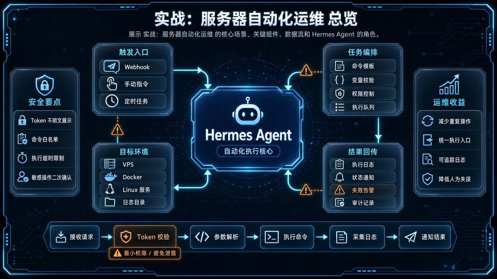
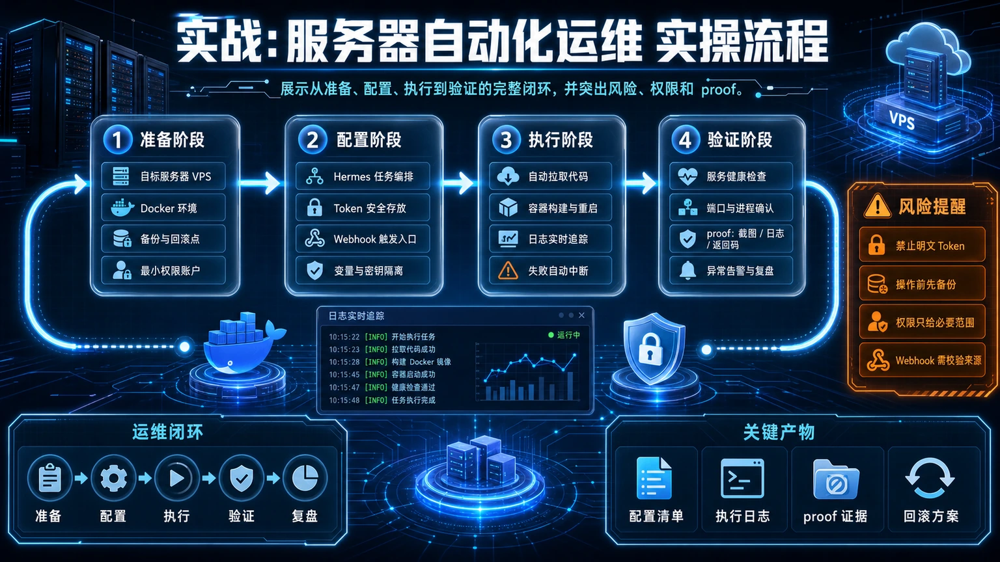

# 🛡️ 25. 实战：7x24 小时服务器自动化运维

本文面向所有拥有 VPS 或服务器的用户，特别是那些追求“没消息就是好消息”的“懒人”运维工程师。我们将带你用 Hermes Agent 打造一个轻量、可靠的服务器“夜班保安”，它会在后台静默巡检，只在异常发生时才向你告警。

## 适合谁

- **VPS/服务器用户**：希望服务器能自我监控、异常告警，降低夜间和节假日的心智负担。
- **懒人运维工程师**：追求“没消息就是好消息”的静默运维模式，只在出问题时接收通知。
- **Hermes Agent 进阶玩家**：想把 Agent 用在生产环境，探索 `cronjob` 和 `no_agent` 模式的真实威力。

## 先看结论/核心判断

传统的监控系统（如 Zabbix, Prometheus）功能强大但配置复杂。对于个人或小团队，我们真正需要的是一个“能干活、少废话”的工具。Hermes Agent 的 `cronjob` 结合 `no_agent` 模式，能用几行简单的 Shell 脚本实现这个目标，无需部署庞大的监控体系，实现极低资源占用的高效告警。

## 最短路线

1.  **准备环境**：确保服务器已部署 Hermes Agent 并配置好 Telegram 等告警接收渠道。
2.  **编写脚本**：创建一个 `server_watchdog.sh` 脚本，用于检查磁盘、内存、核心服务等状态。**核心原则：正常则无输出，异常则输出告警文本**。
3.  **创建 Cron Job**：让 Hermes 每隔30分钟（或自定义）以 `no_agent=True` 模式运行该脚本。
4.  **验证**：手动制造一个故障（如停掉 Nginx），等待 Agent 发送告警。




## 具体怎么做/工作流拆解




### 准备工作：前置条件

在开始之前，请确保你已经完成了以下基础设置：

- **部署 Hermes Agent**：参考 [《VPS 自托管 Hermes》](./06-VPS 自托管 Hermes.md)
- **配置消息入口**：参考 [《Telegram 消息入口接入》](./02-Telegram 消息入口接入.md)

### 第一步：编写巡检脚本

这是我们的核心武器。创建一个 Shell 脚本 `~/.hermes/scripts/server_watchdog.sh`，内容如下：

```bash
#!/bin/bash

# --- 1. 检查磁盘空间 ---
DISK_USAGE=$(df -h / | awk 'NR==2 {print $5}' | sed 's/%//')
if [ "$DISK_USAGE" -gt 90 ]; then
  echo "🚨 **磁盘告警**：根分区使用率已达 ${DISK_USAGE}%！"
fi

# --- 2. 检查内存使用 ---
MEM_FREE=$(free -m | awk 'NR==2{printf "%.2f", $7*100/$2 }')
if (( $(echo "$MEM_FREE < 10" | bc -l) )); then
  echo "🚨 **内存告警**：可用内存仅剩 ${MEM_FREE}%！"
fi

# --- 3. 检查 Nginx 服务状态 ---
if ! systemctl is-active --quiet nginx; then
  echo "🔥 **服务告警**：Nginx 已停止，正在尝试重启..."
  systemctl restart nginx
  if systemctl is-active --quiet nginx; then
    echo "✅ **自动修复**：Nginx 重启成功。"
  else
    echo "❌ **修复失败**：Nginx 重启失败，请手动干预！"
  fi
fi

# --- 4. 检查特定网站健康 ---
HTTP_CODE=$(curl -o /dev/null -s -w "%{http_code}" --max-time 10 "https://your-domain.com")
if [ "$HTTP_CODE" -ne 200 ]; then
  echo "📉 **站点告警**：访问 your-domain.com 失败，状态码: $HTTP_CODE。"
fi
```

然后，让脚本可执行：`chmod +x ~/.hermes/scripts/server_watchdog.sh`

### 第二步：创建 Cron Job

通过对话告诉 Agent：

> “创建一个 cron job，每 30 分钟运行一次 `~/.hermes/scripts/server_watchdog.sh` 脚本，使用 no_agent 模式，任务名叫‘服务器状态巡检’。”

Agent 会为你创建一个定时任务，该任务不消耗 LLM 算力，只执行脚本并根据其输出决定是否发送通知。

## 常见坑

- **脚本权限问题**：确保 `hermes` 运行用户有权限执行脚本和 `systemctl` 等命令。可能需要配置 `sudo` 免密执行。
- **系统命令差异**：`df`, `free` 等命令的输出在不同 Linux 发行版上可能有差异，请先在你的服务器上确认并调整脚本。
- **告警风暴**：如果一个问题持续存在，你会周期性收到告警。这是设计使然，督促你解决问题。

## 过关标准

- **成功创建 Cron Job**：你能通过 `cronjob(action='list')` 看到名为“服务器状态巡检”的定时任务。
- **收到测试告警**：你手动停止 Nginx 后，能在指定时间内收到 Agent 发来的告警和自动修复通知。
- **恢复静默**：Nginx 恢复正常后，Agent 在后续周期内不再发送任何消息。

## ⬅️ 上一步

- [**24. 实战：用 session_search 打造你的外部记忆**](./24-实战：用-session_search-打造你的外部记忆.md)

## ➡️ 下一步

- [**26. Hermes Agent 最佳实践：从工具到助理**](./26-Hermes-Agent-最佳实践：从工具到助理.md)

## 📖 出处

该实践源于 Hermes Agent 社区对“轻量级、低成本、高效率”运维监控方案的探索，旨在为个人开发者提供一个开箱即用的服务器“守护神”模板。


