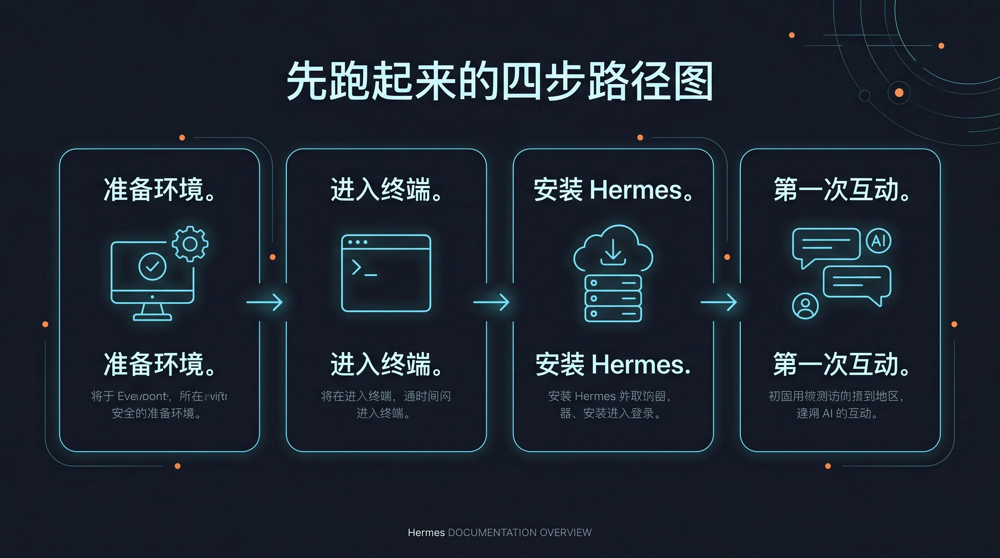

## 标题
Hermes Agent 最佳实践：从工具到助理的 7 条核心原则



## 适合谁
- 已经掌握 Hermes Agent 基础操作，希望提升 Agent 自主性和可靠性的用户。
- 希望将 Agent 从“问一句答一句”的工具，升级为能“主动解决问题”的助理的开发者。
- 对 Agentic Workflow 设计哲学感兴趣，追求构建更健壮、更智能自动化流程的实践者。

## 目标
本文总结了 7 条将 Hermes Agent 从被动工具转变为主动助理的核心实践。掌握它们，你的 Agent 将变得更可靠、更自主，也更值得信赖。我们将跳出具体的功能介绍，专注于高级使用哲学，让你的 Agent 不再是一个“玩具”，而是一个真正的生产力伙伴。

## 核心信息
要让 Agent 成为助理而非工具，你需要改变与之协作的方式。这需要一套清晰的设计哲学：让 Agent 在健康时保持沉默，清晰地划分不同知识系统的边界，确保每个任务都能真正闭环，并用可验证的证据（Proof）说话。一个好的助理应该做到：**可恢复、少打扰、多验证**。

---

## 正文草稿

### 📜 原则一：健康则沉默 (Health Is Silent)
一个成熟的助理不会时刻向你汇报“一切正常”。持续不断的“OK”信息是噪音，会让你忽略真正重要的警报。这条原则要求我们构建的自动化任务（尤其是 Cron Job）只在**出现异常或完成关键里程碑**时才发出通知。

**💡 实际例子：**
假设你设置了一个 [Cron 自动化任务](../03-GitHub-备份-Cron-Job.md) 来每天备份一次 GitHub 仓库。

- **反例 (工具思维)**：每次备份成功后，Agent 都给你发一条消息：“仓库已于 xx:xx 成功备份。” 一周后，你的消息列表会被这些无用的“成功”通知淹没。
- **正例 (助理思维)**：Cron Job 脚本在设计时就遵循“健康则沉默”原则。只有当备份失败（如 GitHub API 认证失败、磁盘空间不足）时，Agent 才会立即发送一条附带错误日志的警报。这样，你收到的每条消息都是需要你关注的信号。

**落地检查清单：**
- [ ] 你的 Cron Job 是否只在失败或需要你介入时才发送通知？
- [ ] 你的监控脚本是否将“正常”状态的日志记录到文件，而不是直接推送到你的聊天窗口？

### 📜 原则二：清晰的知识边界 (Clear Knowledge Boundaries)
Agent 的“大脑”由不同部分组成，混用它们会导致混乱和低效。一个好的助理必须清楚什么知识该记在哪里。

- **Memory**：用于记录你的**偏好、习惯和核心指令**。它是 Agent 的个性化底色，例如“我偏好使用 `uv` 而不是 `pip`”，“向我汇报时请使用中文”。
- **Skills**：用于固化**可重复的工作流程**。它是 Agent 的“肌肉记忆”，例如“如何发布一篇博客文章到我的网站”或“如何审查一个 GitHub PR”。详见 [自定义 Skills](./15-自定义-Skills.md)。
- **外部知识库 (如 Obsidian, Notion)**：用于存储**领域知识和项目文档**。它是 Agent 的“参考书”，当需要特定领域的背景信息时去查阅。详见 [Obsidian 第二大脑知识库](../08-Obsidian-第二大脑知识库.md)。

**💡 实际例子：**
- **反例 (混淆边界)**：将一个复杂的部署脚本直接写入 Memory。这不仅会迅速撑爆 Memory 的容量，也让这个“知识”难以维护和复用。
- **正例 (清晰边界)**：
    1. 将部署脚本保存为一个 `deploy.sh` 文件。
    2. 创建一个名为 `deploy-website` 的 Skill，其核心步骤就是调用 `terminal` 工具执行 `deploy.sh`。
    3. 在 Memory 中只记录一条：“部署网站时，使用 `deploy-website` Skill”。
    4. 部署过程中需要的项目文档和 API
    密钥说明，则存放在 Obsidian 的项目文件夹中。

**落地检查清单：**
- [ ] 你的 Memory 里是否只包含高信号、低密度的偏好信息？
- [ ] 你的重复性任务是否已经沉淀为 Skills？
- [ ] 你的 Agent 是否知道在需要时去哪里查找外部知识？

### 📜 原则三：任务必须闭环 (Tasks Must Be Closed-Loop)
助理的价值在于完成任务，而不仅仅是执行命令。一个“开放回路”的指令链，中间任何一步失败都会导致整个任务中断。而“闭环”设计则要求 Agent **验证每一步的结果，并根据结果决定下一步行动**，直到任务最终完成或确认失败。

**💡 实际例子：**
任务：从网站下载一个压缩包，解压，然后安装。

- **反例 (开环)**：Agent 连续执行三个独立的 `terminal` 命令：`wget ...` -> `tar -xvf ...` -> `./install.sh`。如果 `wget` 因为网络问题失败，Agent 依然会尝试执行后续的解压和安装命令，最终导致一连串的错误。
- **正例 (闭环)**：Agent 使用 `execute_code` 工具编写一个小型 Python 脚本。
    ```python
    from hermes_tools import terminal
    
    # 1. 下载
    download_result = terminal("wget https://example.com/tool.tar.gz")
    if download_result['exit_code'] != 0:
        print("下载失败，任务终止。")
    else:
        # 2. 验证文件存在后解压
        if terminal("ls tool.tar.gz")['exit_code'] == 0:
            unzip_result = terminal("tar -xvf tool.tar.gz")
            if unzip_result['exit_code'] != 0:
                print("解压失败，任务终止。")
            else:
                # 3. 验证安装脚本存在后执行
                if terminal("ls tool/install.sh")['exit_code'] == 0:
                    install_result = terminal("./tool/install.sh")
                    if install_result['exit_code'] == 0:
                        print("安装成功完成！")
                    else:
                        print("安装脚本执行失败。")
                else:
                    print("未找到安装脚本。")
        else:
            print("下载的文件未找到。")
    
    ```
    这个脚本确保了每一步都基于上一步的成功。这才是真正的任务闭环。

**落地检查清单：**
- [ ] 你的多步任务是否考虑了中间步骤失败的可能性？
- [ ] Agent 是否被要求验证其操作的结果（例如，检查文件是否存在，API 调用是否返回 200）？

### 📜 原则四：用证据说话 (Proof Over Trust)
“我完成了”是一句承诺，“这是完成的证据”才是一个结果。优秀的助理从不让你猜测或相信，它会提供可验证的证据（Proof）。

**💡 实际例子：**
任务：将一篇 Markdown 文章发布到你的静态博客仓库。

- **反例 (只有承诺)**：Agent 回答：“好的，文章已经发布。” 你需要自己去 GitHub 仓库检查是否真的提交成功，PR 是否已经创建。
- **正例 (提供证据)**：Agent 回复：
    > 文章已成功提交到 `feature/new-post` 分支，并创建了 Pull Request。
    > 
    > **PR 链接**: https://github.com/your-repo/pull/123
    > **Commit SHA**: `a1b2c3d4`
    > 
    > 你可以点击上方链接审查并合并。

这个回复提供了可立即验证的 URL 和 Commit ID，将信任转化为事实。

**落地检查清单：**
- [ ] 当 Agent 声称完成了一个外部操作（如发邮件、创建文件、提交代码）时，它是否提供了可验证的链接、ID 或路径？
- [ ] 你是否在 Prompt 中明确要求 Agent 返回“证据”，而不仅仅是“确认”？

### 📜 原则五：设计可恢复的工作流 (Design for Recovery)
现实世界的任务充满了意外。网络会中断，API 会超时，服务器会重启。一个专业的助理不会因为一次小小的意外就半途而废，它会尝试恢复。

**💡 实际例子：**
任务：使用 `delegate_task` 让一个子 Agent 去处理一个需要 10 分钟的分析任务。

- **反例 (一次性执行)**：子 Agent 运行到第 9 分钟时，因为一个临时的 API 速率限制而失败。整个任务从头开始，浪费了所有已经完成的工作。
- **正例 (可恢复设计)**：
    1. **任务分片**：将大任务拆分为多个小步骤，并让子 Agent 每完成一步，就将中间结果写入一个临时文件（例如 `task_progress.json`）。
    2. **检查点恢复**：子 Agent 启动时，首先检查 `task_progress.json` 是否存在。如果存在，它会从上次中断的地方继续执行，而不是从头开始。
    3. **利用 `retry`**：在 `execute_code` 中，对可能出现临时性失败的网络请求使用 `retry` 包装器，自动处理瞬时故障。

**落地检查清单：**
- [ ] 你的长耗时任务是否有检查点机制？
- [ ] 对于不稳定的外部依赖，你是否设计了重试逻辑？

### 📜 原则六：减少打扰，批量交互 (Minimize Interruptions, Batch Interactions)
助理不应该为每一件小事都来打扰你。它应该学会收集问题、汇总信息，然后在需要你决策时一次性呈现。

**💡 实际例子：**
任务：为一个新项目搭建开发环境，需要安装 3 个依赖，并需要你确认两项配置。

- **反例 (频繁打扰)**：
    - Agent: "需要安装 `react`，可以吗？" (你: Yes)
    - Agent: "需要安装 `tailwind`，可以吗？" (你: Yes)
    - Agent: "需要安装 `typescript`，可以吗？" (你: Yes)
    - Agent: "数据库端口使用 `5432` 可以吗？" (你: Yes)
    - Agent: "缓存策略使用 `LRU` 可以吗？" (你: Yes)
    这五次打断彻底摧毁了你的工作流。
- **正例 (批量交互)**：Agent 首先分析所有依赖和配置项，然后使用 `clarify` 工具，将所有问题一次性汇总给你：
    > 我准备开始搭建环境，在此之前需要你确认以下几点：
    > 1.  **安装依赖**：将安装 `react`, `tailwind`, `typescript`。
    > 2.  **数据库端口**：计划使用 `5432`。
    > 3.  **缓存策略**：计划使用 `LRU`。
    > 
    > 是否批准？或者你有其他建议？

这样的一次性交互，既尊重了你的时间，也提高了协作效率。

**落地检查清单：- [ ] 在需要用户输入时，Agent 是否会尝试将多个问题打包成一次 `clarify` 调用？- [ ] 你是否鼓励 Agent “先收集所有问题，再向我提问”？### 📜 原则七：多重验证，而非单一信源 (Multiple Verifications, Not Single Source)
Agent 工具的输出可能是幻觉或过时的。一个可靠的助理会交叉验证信息，而不是盲目相信第一个返回的结果。

**💡 实际例子：**
任务：检查网站 `example.com` 是否在线。

- **反例 (单一信源)**：Agent 使用 `web_search` 搜索“is example.com down”。搜索结果可能因为缓存而过时。它回复：“根据搜索结果，网站是在线的。” 但实际上网站可能刚刚宕机。
- **正例 (多重验证)**：Agent 执行一个验证链：
    1.  **`terminal` ping**：`ping -c 1 example.com`，检查网络连通性。
    2.  **`terminal` curl**：`curl -I https://example.com`，检查 HTTP 状态码。
    3.  **`browser` 截图**：如果前两步都成功，启动无头浏览器访问页面并截图，使用 `vision` 确认页面内容是否符合预期（例如，没有显示“维护中”的页面）。
    
    只有当所有验证都通过时，它才会自信地回答：“网站 `example.com` 目前在线且服务正常。我通过 Ping、HTTP 状态码和页面内容截图进行了三重验证。”

**落地检查清单：**
- [ ] 对于关键信息的判断，你的 Agent 是否依赖多个工具进行交叉验证？
- [ ] 你是否在 Prompt 中鼓励 Agent “不要只相信一个来源，尝试从不同角度验证它”？

---

## CTA (Call to Action)
现在，尝试挑选你现有的一项自动化任务，用这 7 条原则重新审视它。你的 Agent 是一个被动的工具，还是一个主动的助理？将它升级，从今天开始。

## 给下游的说明
- **to: Designer** - 文章已完成，包含一张来自 `assets` 的图片，请检查在最终页面上的显示效果。
- **to: PM** - 文章遵循了所有验收标准，包括路径、主题、格式、图片引用和链接引用。可以准备合并。
- **Proof**:
    - **文章路径**: `/opt/projects/awesome-hermes-agent-zh/docs/01-从这开始/05-实战应用/26-Hermes-Agent-最佳实践：从工具到助理.md`
    - **图片路径**: `../../assets/rm2-2-get-running-index-06-stage-map-closed.webp`
    - **引用旧文**:
        - `../03-GitHub-备份-Cron-Job.md`
        - `./15-自定义-Skills.md`
        - `../08-Obsidian-第二大脑知识库.md`
    - **去重说明**: 本文聚焦于高级使用哲学和设计模式，区别于具体的功能操作指南，与现有文档无重复。
    - **验收自查**:
        - [x] 阅读了标准文件、研究矩阵和去重基线。
        - [x] 文章路径正确，编号连续。
        - [x] 主题聚焦高级使用哲学，涵盖所有要求的主题点。
        - [x] 使用了 emoji H2 段落路标和要求的文章结构。
        - [x] 引用了 1 张 .webp 首图，并提供了中文长描述 alt。
        - [x] 链接了 6 篇相关文章，没有重复讲述。
        - [x] 每个原则都配有具体的 Hermes 使用场景和反例。
        - [x] Proof 部分包含了所有要求的信息。
