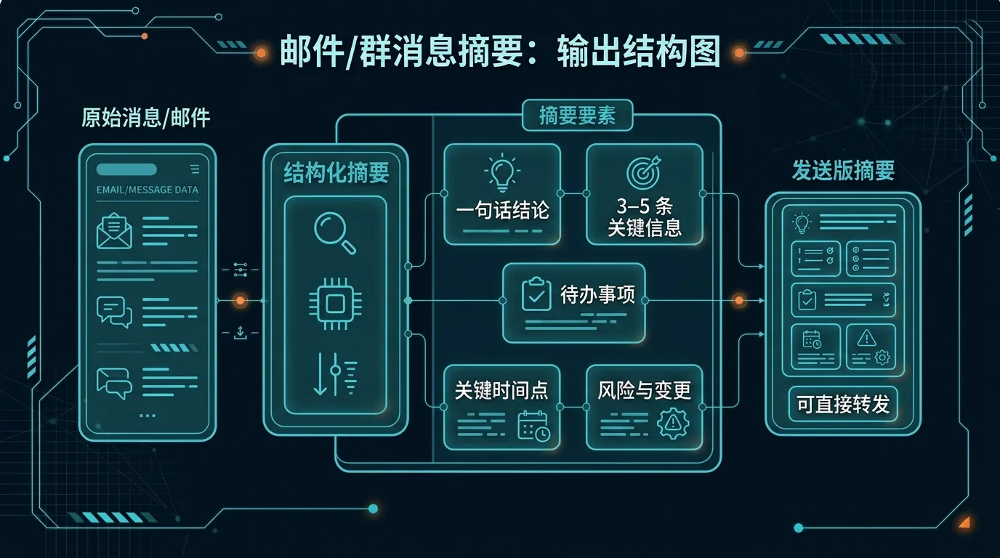

## 标题
实战：基于 Telegram 和 Gmail 打造个人事务处理中心

## 适合谁
- **信息过载者**：每天收到大量邮件，希望自动过滤和处理，只关注最重要的信息。
- **效率追求者**：希望将即时通讯工具（Telegram）作为统一入口，管理来自邮件等多个渠道的任务和信息。
- **自动化爱好者**：喜欢 DIY 和配置，希望打造一套属于自己的、高度定制化的个人工作流。

## 目标
本文将引导你一步步搭建一个个人事务处理中心。最终实现的效果是：
- **自动处理**：Hermes Agent 定期（例如每 30 分钟）检查你的 Gmail 收件箱。
- **智能过滤与摘要**：Agent 自动识别重要邮件，提取核心内容生成摘要。
- **分类归档**：根据预设规则，将已处理的邮件自动打上标签并归档。
- **Telegram 推送**：将重要的邮件摘要和待办事项，作为消息推送到你的 Telegram，你只需在 Telegram 中即可完成“阅批”。

## 核心信息
信息过载的解法不是更多的工具，而是更聪明的流程。通过将 Hermes Agent、Gmail API 和 Telegram Bot 结合，你可以将最耗费精力的“信息筛选”工作完全自动化，把注意力解放出来，只处理真正需要你决策的“信号”，而不是被动承受海量“噪音”。

---

## 正文草稿

### 😫 痛点：被淹没在邮件的海洋里

你的收件箱是不是早已沦陷？推广邮件、无关抄送、系统通知……它们和真正重要的工作任务、私人信件混杂在一起，让你每天疲于应付。你需要的不是在邮件客户端里花式设置规则，而是一个能为你主动工作的“数字助理”。

### ✨ 解决方案：让 Agent 成为你的邮件秘书

我们将搭建一个工作流，让 Hermes Agent 扮演你的“邮件秘书”。它会不知疲倦地为你检查邮箱，并将处理后的精华信息在 Telegram 上“汇报”给你。



这个流程的核心优势在于 **“变被动为主动”**：你不再需要主动“刷”邮件，而是由 Agent 主动将最重要的信息推送给你。

### 🚀 最短路线：三步打造你的事务中心

你需要做的只有三件事：**获取凭据、创建技能、设定计划**。

#### 1. 💌 获取 Gmail API 凭据

Agent 需要授权才能访问你的 Gmail。你需要创建一个 `credentials.json` 文件。

- **前往 Google Cloud Console**：启用 Gmail API，并创建 OAuth 2.0 客户端 ID。
- **下载凭据**：将下载的 `credentials.json` 文件保存到一个安全的位置，例如 `/root/.hermes/secrets/gmail_credentials.json`。
- **首次授权**：首次运行脚本时，你需要访问一个 URL，在浏览器中授权，然后将获取的 `token.json` 也保存在同一目录下。后续 Agent 将使用 `token.json` 自动刷新授权，无需再次手动操作。

> **安全提示**：这些凭据文件非常敏感，切勿将它们提交到代码仓库或公开分享。请将路径记录下来，我们将在下一步的 Skill 中使用它。

#### 2. 🦾 创建核心 Skill：`gmail-affairs-processor`

Skill 是 Agent 执行复杂任务的“说明书”。我们将创建一个 Skill，告诉 Agent 如何连接 Gmail、读取邮件、进行处理，并生成报告。

使用 `skill_manage` 工具创建一个新技能：

```
skill_manage(
  action='create',
  name='gmail-affairs-processor',
  category='automation',
  content="""
---
name: gmail-affairs-processor
description: "连接 Gmail，读取未读邮件，生成摘要，并根据规则进行分类和归档。"
entry_point: scripts/process_gmail.py
parameters:
  credentials_path:
    type: string
    description: "Gmail API credentials.json 和 token.json 的存放路径。"
    default: "/root/.hermes/secrets/"
  labels_to_apply:
    type: list
    description: "处理后为邮件打上的标签列表。"
    default: ["processed-by-hermes"]
---

### 功能
这个 Skill 能让 Agent 做到：
1. 安全地连接到你的 Gmail 账户。
2. 拉取所有“收件箱”中“未读”的邮件。
3. 对每封重要邮件（可自定义规则，如发件人）调用内部 LLM 进行摘要。
4. 将已处理的邮件标记为“已读”，并打上指定标签（如 `processed-by-hermes`）后归档。
5. 输出一份清晰的 Markdown 格式报告，包含所有重要邮件的摘要和链接。

### 使用
在 Cron Job 的 prompt 中调用此 Skill 即可。

### 脚本
Skill 的核心逻辑在 `scripts/process_gmail.py` 中实现。
"""
)
```

然后，创建 Skill 对应的脚本文件 `scripts/process_gmail.py`。这是一个安全的伪代码示例，你需要根据自己的需求填充真实逻辑：

```python
# /root/.hermes/profiles/content/skills/automation/gmail-affairs-processor/scripts/process_gmail.py
import os
from google_auth_oauthlib.flow import InstalledAppFlow
from googleapiclient.discovery import build
# 假设 Agent 环境内置了 LLM 调用能力
# from hermes_tools import llm_call 

# --- 配置 ---
SCOPES = ['https://www.googleapis.com/auth/gmail.modify']
CREDENTIALS_DIR = os.environ.get("GMAIL_CREDS_PATH", "/root/.hermes/secrets") # 从环境变量或默认值读取
TOKEN_PATH = os.path.join(CREDENTIALS_DIR, 'token.json')
CREDS_PATH = os.path.join(CREDENTIALS_DIR, 'credentials.json')

def get_gmail_service():
    """获取并返回已授权的 Gmail 服务对象。"""
    creds = None
    if os.path.exists(TOKEN_PATH):
        # ... 此处省略加载 token.json 的代码 ...
        pass
    if not creds or not creds.valid:
        if creds and creds.expired and creds.refresh_token:
            # ... 此处省略刷新 token 的代码 ...
            pass
        else:
            flow = InstalledAppFlow.from_client_secrets_file(CREDS_PATH, SCOPES)
            creds = flow.run_local_server(port=0)
        # 保存新的凭据
        with open(TOKEN_PATH, 'w') as token:
            token.write(creds.to_json())
    return build('gmail', 'v1', credentials=creds)

def summarize_email(content):
    """调用 LLM 生成邮件摘要。"""
    # 伪代码：实际应使用 Agent 内置的 LLM 调用方式
    # prompt = f"请将以下邮件内容提炼成不超过 50 字的摘要，并提取关键待办事项：\n\n{content}"
    # summary = llm_call(prompt)
    # return summary
    return f"摘要（伪代码）：{content[:100]}..."

def main():
    """主函数：拉取、处理、报告。"""
    service = get_gmail_service()
    
    # 1. 获取未读邮件
    results = service.users().messages().list(userId='me', q='is:unread in:inbox').execute()
    messages = results.get('messages', [])
    
    if not messages:
        print("🎉 收件箱无新邮件，一切尽在掌握。")
        return

    report_parts = []
    
    for message_info in messages[:5]: # 每次最多处理5封，防止超时
        msg = service.users().messages().get(userId='me', id=message_info['id']).execute()
        
        # 简单规则：忽略发件人包含 "no-reply" 的邮件
        sender = next(h['value'] for h in msg['payload']['headers'] if h['name'] == 'From')
        if "no-reply" in sender:
            continue

        # 2. 获取内容并生成摘要
        snippet = msg['snippet'] # 使用 snippet 作为示例
        summary = summarize_email(snippet)
        subject = next(h['value'] for h in msg['payload']['headers'] if h['name'] == 'Subject')

        report_parts.append(f"### {subject}\n**发件人**: {sender}\n**摘要**: {summary}\n")

        # 3. 标记已读并归档
        service.users().messages().modify(
            userId='me',
            id=message_info['id'],
            body={'removeLabelIds': ['UNREAD', 'INBOX'], 'addLabelIds': ['processed-by-hermes']}
        ).execute()

    if report_parts:
        print("## 📬 今日邮件摘要\n\n" + "\n".join(report_parts))
    else:
        print("✅ 已过滤所有新邮件，无重要事项。")

if __name__ == '__main__':
    main()

```

> **延伸阅读**：
> - 关于如何创建和管理 Skills，请参考 [自定义 Skills](./15-自定义%20Skills.md)。
> - 关于 `no_agent=true` 和脚本执行的更深入说明，见 [Cron/no_agent](./03-GitHub%20备份%20Cron%20Job.md) 实践。

#### 3. 🗓️ 创建 Cron Job：让 Agent 定时工作

最后，我们创建一个定时任务，让 Agent 每 30 分钟使用我们刚创建的 Skill 去处理一次邮件。

```
cronjob(
  action='create',
  name='daily-gmail-processor',
  schedule='30m',
  skills=['gmail-affairs-processor'],
  prompt="""
  请使用 gmail-affairs-processor Skill 处理我的 Gmail 邮箱。
  - 使用默认的凭据路径。
  - 将处理后的报告直接输出。
  """,
  deliver='origin' // 将结果发回你配置的 Telegram
)
```

> **延伸阅读**：
> - 如何将 Hermes Agent 接入 Telegram 作为你的指令入口？请看这篇 [Telegram 消息入口接入](./02-Telegram%20消息入口接入.md)。

### ✅ 成功标准

当你看到 Telegram Bot 定期给你发送类似下面的消息时，就说明你成功了！

```
## 📬 今日邮件摘要

### 项目 A 最新进展同步
**发件人**: a@example.com
**摘要**: 报告显示项目 A 的关键指标已达成，请在周五前确认最终报告。

### Re: 关于下季度预算会议
**发件人**: b@example.com
**摘要**: 提醒你预算会议已调整至下周一上午 10 点，请及时更新日历。
```

### 🚧 常见坑

1.  **Google API 授权失败**：
    - **问题**：`token.json` 过期或无效。
    - **解决**：删除 `token.json`，重新运行一次脚本以触发手动授权流程。确保 `credentials.json` 文件路径正确。
2.  **Cron Job 不执行或无输出**：
    - **问题**：脚本执行出错，但因为是后台任务，你看不到错误信息。
    - **解决**：先在 `terminal` 中手动运行一次 `python /path/to/your/skill/script.py`，确保脚本能独立、正确地工作。检查日志，解决所有报错。
3.  **处理逻辑过于复杂导致超时**：
    - **问题**：如果要处理的邮件太多，或者 LLM 调用太慢，可能导致 Cron Job 超时。
    - **解决**：在脚本中加入数量限制（如示例中的 `[:5]`），确保每次只处理少量邮件。将 Cron Job 的执行频率调高（如从每小时一次改为每 15 分钟一次）。

### 🧭 下一步

- **增加智能分类**：在 Skill 脚本中引入更复杂的规则或 LLM 判断，将邮件摘要分发到不同的 Telegram 主题（Topic）或甚至不同的聊天。
- **对接任务管理工具**：对于需要明确行动的邮件，调用 Todoist 或 Notion API，自动创建任务。
- **构建知识库边界**：对于有价值的邮件内容（如行业报告、深度分析），可以将其摘要和链接存入你的 Obsidian 知识库。了解更多关于 Agent 与知识库的边界，请阅读 [Memory/知识库边界](./08-Obsidian%20第二大脑知识库.md)。

## CTA (Call to Action)
别再让收件箱绑架你的注意力了！现在就动手，花上半小时配置你的个人事务中心，享受信息尽在掌握的平静。

## 给下游的说明
- **to Designer**: 本文引用了一张架构图，该图片资源由 T1 任务产出，请确保图片 URL 在站点构建时是有效的。
- **to Coder**: 本文包含了多个到站内其他文章的相对链接，请确保在最终渲染时这些链接都能够正确解析。链接列表：`./15-自定义%20Skills.md`, `./03-GitHub%20备份%20Cron%20Job.md`, `./02-Telegram%20消息入口接入.md`, `./08-Obsidian%20第二大脑知识库.md`。
- **to PM**: 文章已根据 P1 优先级要求撰写，聚焦核心场景，并遵守了所有验收标准。请审阅。
