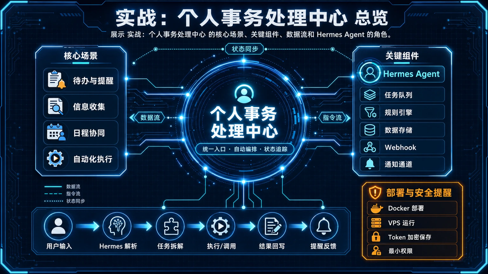
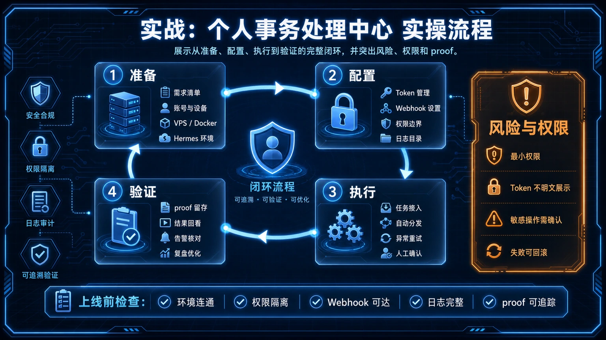

# 实战：基于 Telegram 和 Gmail 打造个人事务处理中心

你是否正被无穷无尽的邮件淹没？推广、无关抄送、系统通知……它们与真正重要的信息混杂在一起，让你每天疲于应付。

是时候夺回主动权了。这一页，我们不谈复杂的邮件规则，只带你动手打造一个真正为你工作的“数字助理”。它会不知疲倦地检查你的 Gmail，并将精华信息在 Telegram 上“汇报”给你，让你彻底从“刷邮件”的循环中解放出来。



这个流程的核心优势在于 **“变被动为主动”**：你不再需要主动“刷”邮件，而是由 Agent 主动将最重要的信息推送给你。

## 🚀 最短路线：三步打造你的事务中心

你需要做的只有三件事：**获取凭据、创建技能、设定计划**。

### 1. 💌 获取 Gmail API 凭据

首先，我们需要让 Agent 获得访问你 Gmail 的授权。这就像给你的助理一把办公室的钥匙。这里的“钥匙”就是 API 凭据。API（应用程序接口）是程序之间互相沟通的桥梁。

1.  **前往 Google Cloud Console**：为你的 Google 账号启用 Gmail API，并创建一个 OAuth 2.0 客户端 ID。
2.  **下载凭据**：将下载的 `credentials.json` 文件保存到一个安全的位置，例如 `/root/.hermes/secrets/gmail_credentials.json`。
3.  **首次授权**：首次运行时，你需要访问一个 URL 在浏览器中手动授权一次。之后，系统会生成一个 `token.json` 文件，用于自动刷新授权，一劳永逸。

> **安全提示**：这些凭据文件非常敏感，切勿公开分享。请将保存路径记录下来，我们下一步马上会用到。

### 2. 🦾 创建核心 Skill

接下来，我们要教 Agent 如何处理邮件。在 Hermes Agent 的世界里，我们通过创建一个 **Skill (技能)** 来封装一套复杂的指令。你可以把 Skill 理解为 Agent 执行特定任务的“说明书”或“脚本”。

我们将创建一个名为 `gmail-affairs-processor` 的 Skill，告诉 Agent 如何连接 Gmail、读取邮件、生成摘要并归档。你可以使用 `skill_manage` 工具来创建它，但更直接的方式是，我们将核心逻辑写在一个 Python 脚本里，让 Skill 直接调用。

以下是这个 Skill 的核心——一个 Python 脚本。它展示了完整的处理流程：

```python
# 建议保存路径：/root/.hermes/skills/scripts/process_gmail.py
import os
from google_auth_oauthlib.flow import InstalledAppFlow
from googleapiclient.discovery import build
# 假设 Agent 环境内置了 LLM 调用能力
# from hermes_tools import llm_call

# --- 配置 ---
SCOPES = ['https://www.googleapis.com/auth/gmail.modify']
CREDENTIALS_DIR = os.environ.get("GMAIL_CREDS_PATH", "/root/.hermes/secrets")
TOKEN_PATH = os.path.join(CREDENTIALS_DIR, 'token.json')
CREDS_PATH = os.path.join(CREDENTIALS_DIR, 'credentials.json')

def get_gmail_service():
    """获取并返回已授权的 Gmail 服务对象。"""
    # ... 此处省略了完整的 Google API 认证代码 ...
    # 真实场景下，你可以直接复用 google-auth-library-python 的标准实现
    # 这里仅为演示结构
    flow = InstalledAppFlow.from_client_secrets_file(CREDS_PATH, SCOPES)
    creds = flow.run_local_server(port=0)
    return build('gmail', 'v1', credentials=creds)

def summarize_email(content):
    """调用 LLM 生成邮件摘要。"""
    # 伪代码：实际应使用 Agent 内置的 LLM 调用方式
    # prompt = f"请将以下邮件内容提炼成不超过 50 字的摘要，并提取关键待办事项：\n\n{content}"
    # summary = llm_call(prompt)
    # return summary
    return f"摘要（伪代码）：{content[:100]}..."

def main():
    """主函数：拉取、处理、报告。"""
    service = get_gmain_service()
    
    # 1. 获取未读邮件
    results = service.users().messages().list(userId='me', q='is:unread in:inbox').execute()
    messages = results.get('messages', [])
    
    if not messages:
        print("🎉 收件箱无新邮件，一切尽在掌握。")
        return

    report_parts = []
    
    for message_info in messages[:5]: # 每次最多处理5封，防止超时
        msg = service.users().messages().get(userId='me', id=message_info['id']).execute()
        
        # 简单规则：忽略包含 "no-reply" 的邮件
        sender = next(h['value'] for h in msg['payload']['headers'] if h['name'] == 'From')
        if "no-reply" in sender:
            continue

        # 2. 获取内容并生成摘要
        snippet = msg['snippet']
        summary = summarize_email(snippet)
        subject = next(h['value'] for h in msg['payload']['headers'] if h['name'] == 'Subject')

        report_parts.append(f"### {subject}\n**发件人**: {sender}\n**摘要**: {summary}\n")

        # 3. 标记已读并归档
        service.users().messages().modify(
            userId='me',
            id=message_info['id'],
            body={'removeLabelIds': ['UNREAD', 'INBOX'], 'addLabelIds': ['processed-by-hermes']}
        ).execute()

    if report_parts:
        print("## 📬 每日邮件摘要\n\n" + "\n".join(report_parts))
    else:
        print("✅ 已过滤所有新邮件，无重要事项。")

if __name__ == '__main__':
    main()
```

这个脚本的核心功能是：连接 Gmail -> 拉取未读邮件 -> 生成摘要 -> 归档邮件 -> 输出报告。

### 3. 🗓️ 创建 Cron Job：让 Agent 定时工作

最后一步，我们要让 Agent “自动”地执行这个邮件处理流程。这里需要用到 **Cron Job (定时任务)**。你可以把它看作一个智能闹钟，它会在指定的时间（例如每 30 分钟）提醒 Agent 使用我们刚准备好的 Skill 去工作。

使用 `cronjob` 工具创建一个新的定时任务：

```
cronjob(
  action='create',
  name='daily-gmail-processor',
  schedule='every 30m',
  # 注意：这里我们使用 script 参数直接指定脚本路径
  # 这是一种更现代、更直接的 no_agent 模式用法
  script='/root/.hermes/skills/scripts/process_gmail.py',
  no_agent=True, # 直接运行脚本，输出即为结果，高效稳定
  prompt="Gmail 邮件定时处理任务",
  deliver='origin' # 将结果发回你配置的 Telegram
)
```

配置完成后，Agent 就会每隔 30 分钟自动运行一次邮件处理脚本，并将结果发送到你的 Telegram。

## ✅ 验收

当你看到 Telegram Bot 定期给你发送类似下面的消息时，就说明你成功了！

> **📬 每日邮件摘要**
>
> ### 项目 A 最新进展同步
> **发件人**: a@example.com
> **摘要**: 报告显示项目 A 的关键指标已达成，请在周五前确认最终报告。
>
> ### Re: 关于下季度预算会议
> **发件人**: b@example.com
> **摘要**: 提醒你预算会议已调整至下周一上午 10 点，请及时更新日历。

## 🚧 常见问题

1.  **Google API 授权失败？**
    *   **解决**: 通常是 `token.json` 过期了。删掉它，重新手动运行一次脚本，会提示你再次在浏览器中授权，生成新的 `token.json` 即可。

2.  **Cron Job 不执行？**
    *   **解决**: 先别急着配 Cron，在 `terminal` 工具里手动执行一次你的 Python 脚本（`python /path/to/your/script.py`），确保它能独立、正确地跑通。

3.  **处理邮件太多导致超时？**
    *   **解决**: 在脚本里限制每次处理的邮件数量（如示例中的 `[:5]`），并将 Cron 的执行频率调高，化整为零。

## ⬅️ 上一步

- [**26. Hermes Agent 最佳实践：从工具到助理**](./26-Hermes-Agent-最佳实践：从工具到助理.md)

## ➡️ 下一步

- [**高级玩法：集成 NotebookLM 打造超级知识库**](./28-高级玩法：NotebookLM%20超级知识库.md)

## 📖 出处
- [Hermes Agent 官方文档：cronjob](/docs/hermes-agent/tools/cronjob)
- [Hermes Agent 官方文档：skill_manage](/docs/hermes-agent/tools/skill_manage)
- [Google API Python Client](https://github.com/googleapis/google-api-python-client)



