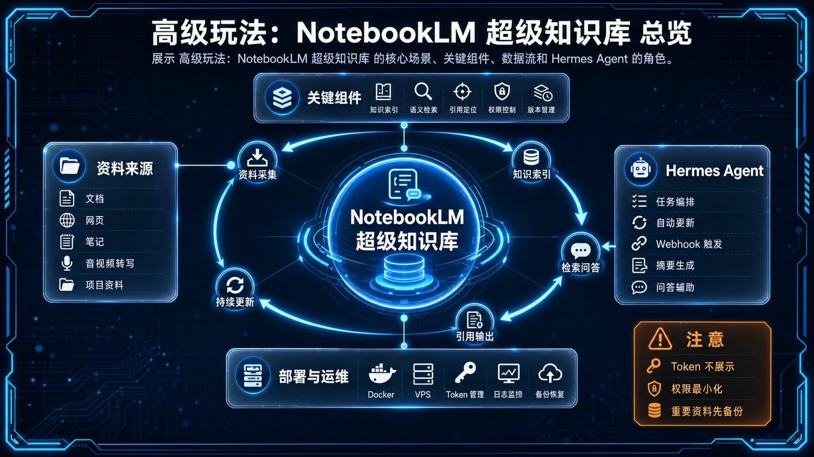
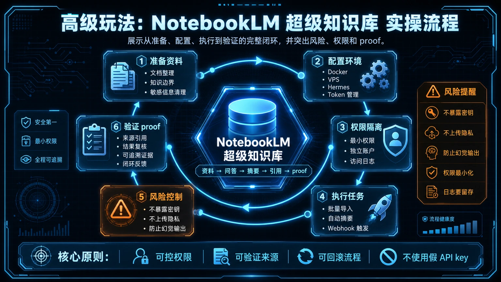

# 高级玩法：集成 NotebookLM 打造超级知识库

想象一下，如果你的 Hermes Agent 能读懂你所有的私人文档——无论是 PDF 还是 Google Docs，并能随时跨文档回答你的复杂问题。本页将引导你实现这个目标，将 Agent 从一个命令执行器，升级为一个熟悉你所有知识的“云端大脑”。

我们将通过一个社区开发的工具，把 Hermes Agent 和 Google 的下一代笔记工具 **NotebookLM** 连接起来。NotebookLM 擅长理解和提炼长篇文档，而 Hermes 擅长执行任务和自动化。两者的结合，将创造出一个真正强大的个性化知识助理。



> **注意**：这是一个高级玩法，需要你具备基本的 Python 和命令行使用经验，并且不畏惧折腾。我们将使用一个非官方 API，这意味着它可能随时会因 Google 的更新而失效。

## 🚀 准备工作：连接到 NotebookLM

连接的关键是一个名为 `notebooklm-py` 的社区开源库。



### 1. 📦 安装连接库

首先，在你的终端环境中安装这个库：
```bash
pip install notebooklm-py
```

### 2. ⚠️ 获取“临时钥匙”：Cookie

由于 `notebooklm-py` 是一个**非官方**工具，它无法像正式产品那样通过标准的“用户名密码”登录。我们需要手动从浏览器中提取一个名为 **Cookie** 的“临时访问钥匙”，并交给它。

1.  在浏览器中登录你的 Google 账户并访问 [NotebookLM](https://notebooklm.google.com/)。
2.  打开浏览器的开发者工具（通常按 F12）。
3.  切换到“网络”（Network）标签页。
4.  随便操作一下 NotebookLM 页面（例如点击一个笔记），在网络请求列表中找到任意一个发往 `notebooklm.google.com` 的请求。
5.  点击该请求，在右侧的“标头”（Headers）中找到 `Cookie` 字段，并**完整复制**其内容。
6.  将这段长长的文本保存好。我们马上就要用到它。

**请像保护密码一样保护你的 Cookie！** 它包含了你当前会话的完整权限，切勿泄露或上传到任何公开地方。最安全的做法是将其设置为环境变量。

## 🦾 封装为 Skill 核心脚本

为了方便 Agent 调用，我们将所有操作都封装在一个 Python 脚本中。这个脚本就是我们未来要创建的 Skill 的核心。

```python
# 建议保存路径: /root/.hermes/skills/scripts/notebooklm_handler.py
import sys
import os
from notebooklm import NotebookLM

# 从环境变量读取 Cookie，这是推荐的安全做法
auth_cookie = os.getenv('NBLM_COOKIE')
if not auth_cookie:
    print("错误：请先设置 NBLM_COOKIE 环境变量。")
    sys.exit(1)

try:
    client = NotebookLM(cookie=auth_cookie)
except Exception as e:
    print(f"初始化 NotebookLM 客户端失败，请检查 Cookie 是否正确或已过期: {e}")
    sys.exit(1)

if len(sys.argv) < 2:
    print("用法: python notebooklm_handler.py [query|add_file|summarize] [参数...]")
    sys.exit(1)

command = sys.argv[1]
args = sys.argv[2:]

if command == "query":
    if not args:
        print("错误: 'query' 命令需要一个问题作为参数。")
        sys.exit(1)
    question = " ".join(args)
    response = client.query(question)
    print(response)

elif command == "add_file":
    if not args:
        print("错误: 'add_file' 命令需要一个文件路径作为参数。")
        sys.exit(1)
    file_path = args[0]
    # ... 此处省略上传文件的具体实现逻辑 ...
    # 你需要根据 notebooklm-py 的文档来实现文件上传
    print(f"文件 {file_path} 上传成功（伪代码）。")

else:
    print(f"未知命令: {command}")

```

这个脚本通过命令行参数来接收指令（如 `query`），然后调用 `notebooklm-py` 库来执行相应操作。

## ✅ 开始使用：三大核心操作

将上述脚本保存好，并设置好 `NBLM_COOKIE` 环境变量后，你就可以通过 Hermes 的 `terminal` 工具开始使用了。

### 1. 📂 添加新知识

**目标**：将本地的 `project-alpha-brief.pdf` 文件上传到 NotebookLM，让它成为知识库的一部分。
**指令**:
```
terminal(
  command="python /root/.hermes/skills/scripts/notebooklm_handler.py add_file /path/to/project-alpha-brief.pdf"
)
```
Agent 会执行脚本，将文件上传并自动建立索引。

### 2. ❓ 跨文档智能问答

**目标**：你上传了多个关于“项目A”和“项目B”的文档，现在想知道它们在技术选型上的主要差异。
**指令**:
```
terminal(
  command="python /root/.hermes/skills/scripts/notebooklm_handler.py query '项目A和项目B在技术选型上的核心差异是什么？'"
)
```
NotebookLM 会综合所有相关文档，提供一个精准的、带有引用来源的答案。

### 3. 📝 内容再创作

**目标**：你需要根据几份市场研究报告，为下周的会议准备一个 PPT 大纲。
**指令**:
```
terminal(
  command="python /root/.hermes/skills/scripts/notebooklm_handler.py query '请根据‘2026年Q2市场分析报告’和‘竞品动态观察’这两份文档，生成一份新产品发布策略的PPT大纲，需包含市场定位、目标用户、核心卖点和推广渠道四部分。'"
)
```
Agent 会返回一个结构清晰的 PPT 大纲，大大节省你的前期工作。

## 🚧 风险与挑战

### 1. 非官方 API 的稳定性
这是最大的风险。Google 随时可能更新 NotebookLM 后端，导致 `notebooklm-py` 库失效，我们建立于其上的整个工作流也会随之瘫痪。

### 2. Cookie 的安全与时效
你提取的 Cookie 有有效期，一旦过期就需要重新获取。同时，必须用安全的方式（如环境变量）来存储它，避免硬编码在脚本里。

## 🧭 所属路径

- 回到[实战应用总览](/docs/start/practical)，按任务类型选择更稳定、可维护的实践路线。

## ⬅️ 上一步

- [**实战：基于 Telegram 和 Gmail 打造个人事务处理中心**](./27-实战：个人事务处理中心.md)

## ➡️ 下一步

- 想先建立本地、可控的知识沉淀流程：继续看[Obsidian 第二大脑知识库](/docs/start/practical/obsidian-second-brain)。
- 想把已经验证过的知识处理流程封装给 Hermes 重复调用：继续看[自定义 Skills](/docs/start/practical/custom-skills)。

## 📖 出处
- notebooklm-py 社区库（原 GitHub 仓库当前不可公开访问，使用前需重新确认可用来源）
- [Hermes Agent 官方文档：terminal](/docs/hermes-agent/tools/terminal)
- [Hermes Agent 官方文档：skills](/docs/hermes-agent/concepts/skills)


