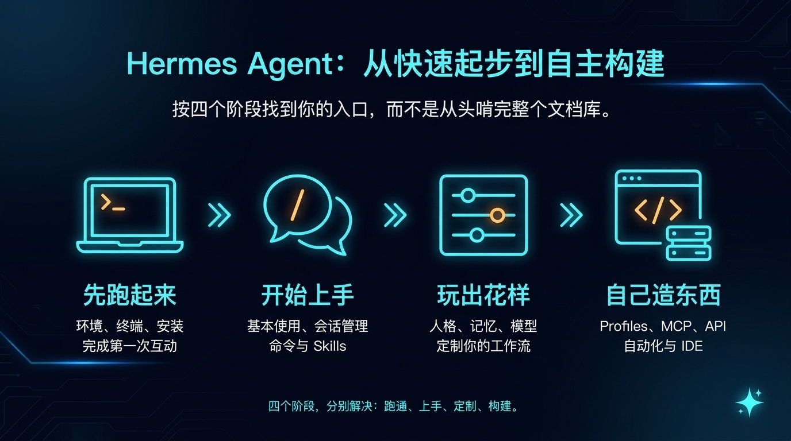

# 🧭 01-从这开始

如果你是第一次接触 Hermes，最容易踩的坑不是不会装，而是一上来就把文档当资料库乱翻。
这一组内容不是按功能堆料，而是按学习路径来带你走：先跑起来，再开始上手，然后玩出花样，最后自己造东西。

---

## ✨ 你在这里能很快知道什么

来到这一页，你应该快速弄清 4 件事：

- 我现在最适合从哪一段开始
- 这一段主要会帮我解决什么问题
- 学完这一段以后，我能达到什么状态
- 下一步应该进入哪个阶段页

一句话记住：

这里不是功能索引页，而是 Hermes 中文站的学习主线入口。

---

## 📌 它和普通文档站有什么不同

普通文档站更像“功能目录”：
先把功能、命令、配置项都列出来，再由你自己决定从哪里开始。

这里不是这样。
这里按学习路径组织，先帮你判断：

- 你现在最该先解决什么问题
- 哪些内容现在不用急着看
- 哪一段学完以后，再进入下一段最顺

所以你在这里看到的，不是资料分类，而是四个清晰的学习阶段。

你可以把它理解成一条递进路径：

1. 先把 Hermes 真正跑通
2. 再把它用顺
3. 再把它调成更像你
4. 最后再把它接进自己的系统

---

## 🚦 你现在应该从哪一段开始

如果你不想先看整张表，直接按当前状态选：

- 你还没完成第一次正常回复 → [01-先跑起来](./01-先跑起来/01-总览.md)
- 你已经装过一次，但平时还不会稳定使用 → [02-开始上手](./02-开始上手/01-总览.md)
- 你已经会日常使用，想让 Hermes 更像你、更顺手 → [03-玩出花样](./03-玩出花样/01-总览.md)
- 你已经不满足于“用一个助手”，想开始接系统、做多助手、做自动化 → [04-自己造东西](./04-自己造东西/01-总览.md)

如果你还拿不准，就默认从 [01-先跑起来](./01-先跑起来/01-总览.md) 开始。

---

## 🧭 四个阶段怎么选

先看左侧阶段名，再看自己现在最像哪一种状态。

<table>
  <colgroup>
    <col style="width: 28%;" />
    <col style="width: 22%;" />
    <col style="width: 25%;" />
    <col style="width: 25%;" />
  </colgroup>
  <thead>
    <tr>
      <th>阶段</th>
      <th>适合谁</th>
      <th>这一阶段你会解决什么</th>
      <th>学完你能达到什么</th>
    </tr>
  </thead>
  <tbody>
    <tr>
      <td><nobr><a href="./01-先跑起来/01-总览.md"><strong>01-先跑起来</strong></a></nobr></td>
      <td>- 还没跑通 Hermes 的人 - 还没完成第一次正常互动的人 - 想先验证 Hermes 能不能真的工作的人</td>
      <td>- 确定运行环境怎么选 - 知道终端怎么进入 - 完成 Hermes 安装 - 接上一个可用模型 - 拿到第一次正常回复</td>
      <td>- 你能真正把 Hermes 跑通 - 你会拥有一条清楚、可重复的起步路径</td>
    </tr>
    <tr>
      <td><nobr><a href="./02-开始上手/01-总览.md"><strong>02-开始上手</strong></a></nobr></td>
      <td>- 已经装过一次，但还不会稳定使用的人 - 想把 Hermes 变成日常助手的人</td>
      <td>- 搞清楚平时到底怎么用 Hermes - 学会会话管理和常用命令 - 知道第一批 Skills 先看什么 - 从“跑通一次”进入“稳定可用”</td>
      <td>- 你能把 Hermes 稳定地用起来 - 你知道日常使用时最该先掌握哪些东西</td>
    </tr>
    <tr>
      <td><nobr><a href="./03-玩出花样/01-总览.md"><strong>03-玩出花样</strong></a></nobr></td>
      <td>- 已经会用 Hermes，想让它更像你的人 - 想做更长期个性化配置的人</td>
      <td>- 让人格更贴近你的表达方式 - 让记忆真正对你有用 - 让模型和工具开关更适合自己 - 让终端体验变得更顺手</td>
      <td>- 你能把一个助手调成更符合自己习惯的工作方式 - 它不只是“能用”，而是开始变得“顺手”</td>
    </tr>
    <tr>
      <td><nobr><a href="./04-自己造东西/01-总览.md"><strong>04-自己造东西</strong></a></nobr></td>
      <td>- 想把 Hermes 接进工作流的人 - 想做自动化、多助手、外部接入的人</td>
      <td>- 开始用多个助手做角色拆分 - 接入外部记忆系统 - 进入 MCP、API、自动化、IDE 这些系统能力 - 从助手使用走向系统化使用</td>
      <td>- 你能从“用一个助手”进入“搭一套系统” - 你会开始拥有自己的 Hermes 工作流</td>
    </tr>
  </tbody>
</table>

---

## 📖 默认顺序

第一次系统看 Hermes，建议按这个顺序往下走：

1. [01-先跑起来](./01-先跑起来/01-总览.md)
2. [02-开始上手](./02-开始上手/01-总览.md)
3. [03-玩出花样](./03-玩出花样/01-总览.md)
4. [04-自己造东西](./04-自己造东西/01-总览.md)

最稳的理解方式是：

- 先让 Hermes 回复你一次
- 再让你会持续使用它
- 再让它更贴近你自己的工作方式
- 最后再让它进入更完整的系统能力

不要一上来就直接看最重的系统层页面。
如果第一步没跑通，后面的理解都会虚。

---

## ✅ 看完这页后你应该已经能判断什么

当下面这些问题你已经能答出来，这一页就完成了：

- 我现在到底该从哪个阶段开始？
- 我现在最缺的是“跑通一次”、 “日常会用”、 “个性化调优”，还是“系统化搭建”？
- 我现在应该继续往下走，还是先回上一阶段补基础？

---

## ➡️ 下一步

如果你现在的目标还是“先把 Hermes 真正跑通一次”，别再继续横跳，直接进入第一阶段：

- [01-先跑起来](./01-先跑起来/01-总览.md)

如果你想先回到上一阶段入口重新确认位置：

- [文档总览](../00-文档总览.md)
