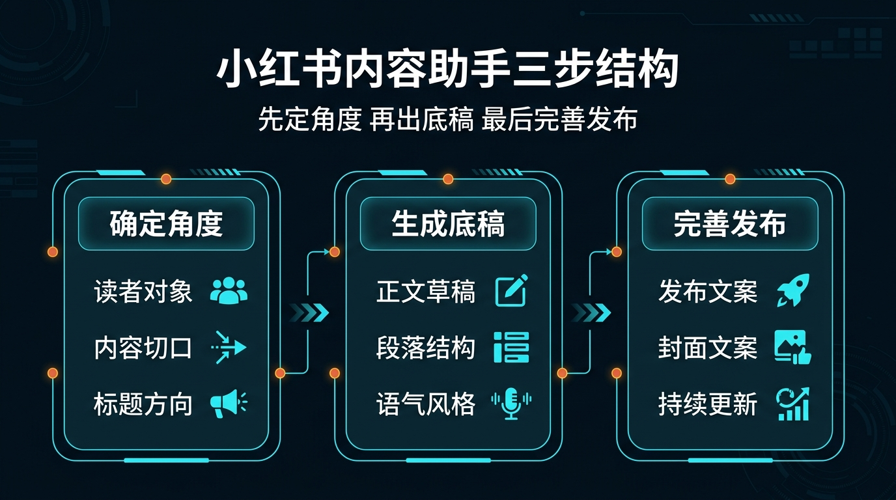
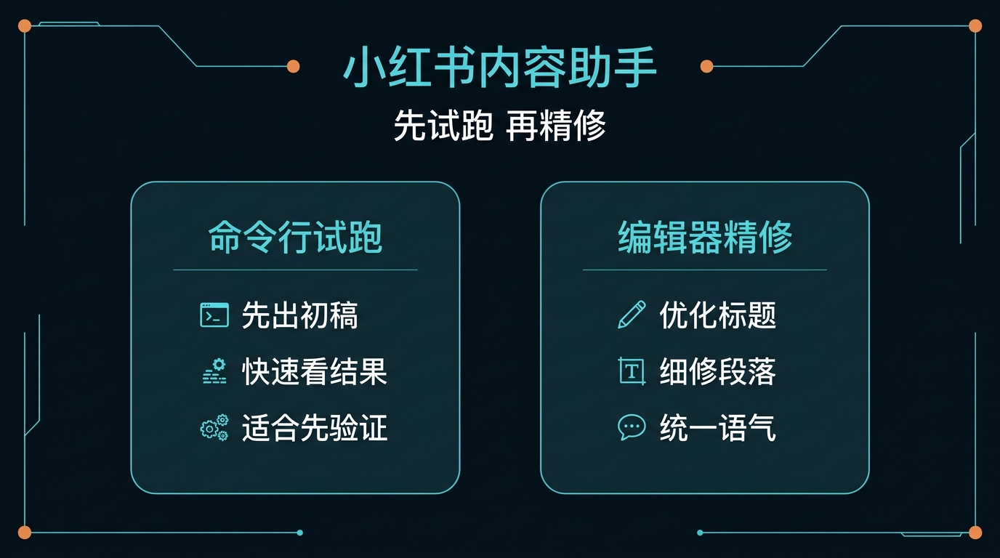

# 02-小红书内容助手

> 一句话先说清楚：这一页不是教你系统学小红书运营，而是帮你把一个产品、服务或观点，直接压成“今天就能发”的小红书内容包。

---

## 👀 先看结论

如果你现在想的是：
- 我想发一篇小红书，但还没想清楚怎么写
- 我不想自己从选题、标题、开头、正文一路磨到半夜
- 我想先让 Hermes 帮我出一版能直接改、能直接发的内容底稿

那这一页就是给你用的。

你用完这页，先拿到的不是空泛建议，而应该是这些东西：
- 这篇内容该从哪个角度讲
- 3 到 5 个可选标题
- 开头 3 句话怎么勾住人
- 一版可直接改的小红书正文
- 封面短句 / 配图提示
- 评论区引导句
- 发布前最后检查单
- 跑完第一轮后下一句该怎么继续

## 🗺 如果你现在只想看最短路线
- 想先看这套东西值不值得用：直接看「⚡ 5 分钟跑一轮」
- 想直接跑团队协作版：直接看「🤝 团队协作版怎么安装和开跑」
- 想看最后会拿到什么：直接看「📦 你最后会拿到什么」
- 想看第一轮跑完以后怎么继续：直接看「🪜 跑完第一轮后，下一句怎么说」
- 想直接下载包：直接看「📁 你现在直接能用的东西」

---

## 🧩 一个真实用例：这页到底怎么帮人

假设你现在要发一篇内容，主题是：

“独立开发者为什么应该尽早把 AI Agent 用进自己的工作流？”

你脑子里可能只有这些零散想法：
- 想讲自己踩过的坑
- 想讲 AI Agent 不是聊天工具，而是能接手工作流
- 想让读者看完以后收藏、评论、来问
- 但不知道标题该怎么起
- 也不知道正文到底该写经验分享、避坑清单，还是案例拆解

这一页做的事，就是先把这些零散想法压成一版可发布内容包。

比如你跑完第一轮后，Hermes 应该先给你：
- 1 个主角度：`从“自己全做”切到“让 Agent 接一段”`
- 5 个标题候选
- 1 个 800～1200 字正文底稿
- 1 组封面短句和配图提示
- 1 条评论区引导句
- 1 份发布前检查单

这样你就不是“还在想怎么发”，而是已经有一版能改、能发、能继续打磨的内容底稿。

---

## 🚦先选哪一种：先发一篇 or 先做一周选题

先别被方法论吓到，直接按你现在的状态选。

| 如果你现在更像这样 | 直接走哪条 | 你真正会拿到什么 |
|---|---|---|
| 今天就想把一篇内容发出去 | 先发一篇 | 一次拿到标题、开头、正文、封面短句、评论引导 |
| 还没确定今天发哪一篇 | 先做一周选题 | 先拿 5～7 个主题方向，再选一篇展开 |
| 已经有素材，只差整理成小红书表达 | 先发一篇 | Hermes 先帮你把素材重写成平台语言 |
| 想把一个产品连续讲一周 | 先做一周选题 | 先拿连续选题清单，再逐篇展开 |


如果你现在拿不准，默认先走：
- 先发一篇

原因很简单：
- 先跑通
- 先拿一版真实内容
- 再决定要不要扩成系列

---

## ✍️ 先发一篇：适合谁，跑完会得到什么

### 适合谁
适合你现在是下面这种状态：
- 今天就想发
- 已经有一个主题或一个产品点
- 想先拿一版像样的小红书底稿

### 它会帮你做什么
你把需求喂进去后，它会先帮你：
- 收敛这一篇的主角度
- 先挑标题方向
- 先写开头钩子
- 先出一版正文底稿
- 补封面短句 / 配图提示
- 补评论区引导和发布检查单

### 你最终应该看到什么
一个合格输出，应该至少让你看懂这些：
- 这篇到底打哪一个角度
- 标题是偏经验、偏反差，还是偏清单
- 开头前三句怎么把人留住
- 正文有哪些段落已经可以直接改
- 配图应该拍什么 / 截什么 / 怎么配一句封面文案
- 这一篇发出去前最后要检查什么

如果它只给你一堆“建议多互动、建议真实分享”这种空话，那就不对。

---

## 🗓 先做一周选题：适合谁，和先发一篇差在哪

### 适合谁
适合你已经进入下面这种状态：
- 不是只想发一篇
- 想围绕同一个产品或主题连续发
- 想先把一周内容线定下来

### 它和先发一篇最大的区别
先发一篇：
- 一个主题直接压成可发布底稿
- 重点是今天就能发
- 适合先验证表达方向

先做一周选题：
- 先把连续内容方向排出来
- 重点是持续输出不空档
- 适合产品冷启动或账号起号阶段

### 一周选题版里最应该拿到什么
| 你会拿到什么 | 它在输出里大概长什么样 | 你拿它立刻能干嘛 |
|---|---|---|
| 7 个选题方向 | `误区 / 清单 / 案例 / 前后对比 / 真问题` | 先挑本周要发哪几篇 |
| 每篇一句主钩子 | `这不是效率工具，而是接管工作流的开始` | 先看哪篇最有传播感 |
| 发文顺序建议 | `先反差，后案例，再方法` | 先定一周排期 |
| 哪一篇先展开 | `从最容易讲清的第一篇开始` | 立刻进入单篇写稿 |

---

## 🤝 团队协作版：适合谁，和单人版差在哪

### 适合谁
适合你已经不是一个人单独出稿，而是开始出现：
- 选题的人和写稿的人不是同一个人
- 需要有人专门润色和审校
- 发前希望有人把风险和可发状态单独把关

### 团队协作版怎么分工
| 角色 | 它主要产出什么 | 下一个角色拿它干嘛 |
|---|---|---|
| 01-topic-strategist | 选题角度、目标读者、标题方向、内容结构 | 给 drafter 一个清楚的起稿主线 |
| 02-drafter | 开头、正文底稿、分页建议 | 给 polisher 一版可改的初稿 |
| 03-polisher | 润色版正文、封面短句、评论引导 | 给 review 一版更像真实发帖的稿 |
| 04-review | 发布风险点、必须修改项、可发判断 | 给 validator 做总体验收 |
| 99-solution-validator | 最终结论：pass / pass with fixes / fail | 帮你判断这篇是否能进入发布环节 |

### 它和单人版最大的区别
- 单人版：一个 Agent 先帮你把整篇内容压出来，重点是快
- 团队协作版：多角色接力，重点是边界更清楚、发前把关更稳


---

## 📦 你最后会拿到什么

别把它想得太抽象。

你跑完后，真正拿到的通常会长这样：

| 你会拿到什么 | 它在输出里大概长什么样 | 你拿它立刻能干嘛 |
|---|---|---|
| 选题角度 | `从“全自己做”切到“让 Agent 接一段”` | 先把整篇口径定住 |
| 标题候选 | `为什么独立开发者越早用 Agent 越省时间` | 先挑最顺手的一条 |
| 开头钩子 | `我以前以为 AI 就是帮我写两句文案…` | 直接改成自己的开头 |
| 正文底稿 | `问题 -> 经历 -> 方法 -> 结果 -> 收口` | 直接开始细修，而不是从空白开始 |
| 封面短句 / 配图提示 | `别再一个人硬扛全部工作流` | 立刻准备封面和配图 |
| 评论区引导句 | `你现在最想先让 Agent 接哪一段？` | 提高评论互动 |
| 发布检查单 | `标题、首图、口语感、评论钩子、违禁词` | 发前最后过一遍 |



如果你觉得表格还是偏文字，这张图可以帮助你更快扫一眼：
- 第一层看选题角度
- 第二层看可发布底稿
- 第三层看发布动作和下一轮续写

---

## 🖥 CLI 和 ACP，到底怎么选

这里尽量说得像人话一点。

| 你现在要干嘛 | 用哪个 | 跑完你会看到什么 |
|---|---|---|
| 我先想看这篇内容能不能出得像样 | CLI | 一次完整输出：标题、开头、正文、封面短句、检查单 |
| 我还没进编辑器，只想先拿一版稿子 | CLI | 先确认这套内容方向值不值得发 |
| 我已经准备开始逐段改文案 | ACP | 可以顺着结果继续精修标题、段落、语气和 CTA |
| 我想边看边改成自己的语气 | ACP | 可以在编辑器里持续细修，不只停在第一稿 |



最简单的记法：
- CLI：先拿第一稿
- ACP：确认方向对了以后，继续把它改到能发

---

## ⚡ 5 分钟跑一轮

如果你现在只想先跑通一次，默认走“先发一篇”。

### 第一步：下载它
先拿这个包：
- [01-super-individual.zip](../../../packs/xhs-lab/01-super-individual.zip)

### 第二步：解压后进入目录
```bash
cd /path/to/01-super-individual
```

### 第三步：创建一个独立 profile
```bash
hermes profile create xhs-solo --clone
```

### 第四步：安装
```bash
bash ./install_to_profile.sh xhs-solo
```

### 第五步：直接跑现成示例
```bash
hermes -p xhs-solo chat --skills xiaohongshu-content-assistant -q "$(cat skills/solutions/xiaohongshu-content-assistant/examples/sample-input.md)"
```

跑完以后，先看这 5 件事：
- 有没有先收敛一个明确角度
- 有没有给出 3～5 个标题而不是只给 1 个
- 有没有把开头和正文底稿写出来
- 有没有补封面短句 / 配图提示 / 评论引导
- 有没有告诉你下一轮该怎么继续

如果这 5 件事都没有，那说明输出不合格。

### 🤝 团队协作版怎么安装和开跑
如果你已经不是一个人单独出稿，而是想按角色接力推进，就直接走团队协作版。

#### 第一步：下载团队包
先拿这个包：
- [02-team.zip](../../../packs/xhs-lab/02-team.zip)

#### 第二步：解压后进入目录
```bash
cd /path/to/02-team
```

#### 第三步：先创建 5 个 profile
```bash
hermes profile create xhs-strategy --clone
hermes profile create xhs-draft --clone
hermes profile create xhs-polish --clone
hermes profile create xhs-review --clone
hermes profile create xhs-validator --clone
```

#### 第四步：一键安装
```bash
bash ./install_all.sh
```

#### 第五步：先跑第一棒
```bash
hermes -p xhs-strategy chat --skills xiaohongshu-topic-strategist -q "$(cat 01-topic-strategist/skills/solutions/xiaohongshu-topic-strategist/examples/sample-input.md)"
```

跑完以后，先看这 4 件事：
- 有没有先把选题角度压清楚
- 有没有把标题方向和内容结构定下来
- 有没有产出可交给 drafter 的起稿主线
- 有没有知道下一棒该交给谁

如果第一棒还没把方向压清楚，就不要急着让后面的角色接棒。

### 🏃 跑完第一棒，怎么接第二棒？
当 `xhs-strategy` 已经把选题角度、标题方向和内容结构压出来以后，第二棒就交给 `xhs-draft` 开写。

```bash
hermes -p xhs-draft chat --skills xiaohongshu-drafter -q "$(cat 02-drafter/skills/solutions/xiaohongshu-drafter/examples/sample-input.md)"
```

更稳的用法是：
- 先把第一棒里已经确认的选题角度、标题方向、内容结构贴进去
- 再让 drafter 开写正文底稿
- 如果第一棒还在摇摆，不要跳到第二棒

### 🤝 全链路接力图谱
| 这一棒是谁 | 这一棒主要做什么 | 交给下一棒时，手里应该有什么 |
|---|---|---|
| 第一棒：`xhs-strategy` | 定选题角度、目标读者、标题方向、内容结构 | 一版清楚的起稿主线 |
| 第二棒：`xhs-draft` | 写开头、正文底稿、分页建议 | 一版可继续改的初稿 |
| 第三棒：`xhs-polish` | 压语气、补封面短句、补评论引导 | 一版更像真实发帖的润色稿 |
| 第四棒：`xhs-review` | 查风险点、查人设一致性、列必须修改项 | 一版发前审校结论 |
| 终点站：`xhs-validator` | 判断 pass / pass with fixes / fail | 最终“这篇现在能不能发”的结论 |

你可以把这条链理解成：
- `xhs-strategy` 先定调子
- `xhs-draft` 再把内容写出来
- `xhs-polish` 负责把语气和发布动作补到更像真实帖文
- `xhs-review` 负责发前把关
- `xhs-validator` 最后只回答一件事：这篇现在能不能进入发布环节

### ⚡ 团队协作：最短命令总览
| 第一棒：战略（Strategy） | 第二棒：出稿（Draft） | 最终棒：验收（Validator） |
|---|---|---|
| `hermes -p xhs-strategy chat --skills xiaohongshu-topic-strategist -q "$(cat 01-topic-strategist/skills/solutions/xiaohongshu-topic-strategist/examples/sample-input.md)"` | `hermes -p xhs-draft chat --skills xiaohongshu-drafter -q "$(cat 02-drafter/skills/solutions/xiaohongshu-drafter/examples/sample-input.md)"` | `hermes -p xhs-validator chat --skills solution-validator-xhs -q "$(cat 99-solution-validator/skills/solutions/solution-validator-xhs/examples/sample-input.md)"` |
| 先拿选题角度、标题方向、内容结构 | 先拿开头、正文底稿、分页建议 | 最后拿到 `pass / pass with fixes / fail` |

### 🚦 什么时候不要往下一棒走
- 不要交第二棒：如果 `xhs-strategy` 产出的选题角度还很泛，只剩空口号，没有明确目标读者、标题方向和内容结构。
- 不要交第三棒：如果 `xhs-draft` 还没写出完整开头和正文底稿，只是在重复第一棒的大纲。
- 不要交第四棒：如果 `xhs-polish` 还没把语气、封面短句和评论区引导收成真实帖文感。
- 不要交 Validator：如果 `xhs-review` 还没把风险点、必须修改项和可发判断压清楚。

### 🛠️ 交付验收：怎么交给 Validator？
当 `xhs-review` 已经把发前风险、必须修改项和可发判断压清楚以后，再把这一版交给 `xhs-validator`。

交过去前，最少要准备这 3 类东西：
- 当前最终稿：标题、开头、正文、分页结构
- 发布动作：封面短句、配图提示、评论区引导句
- 审校结论：风险点、必须修改项、当前是否建议发布

`xhs-validator` 主要只看这几件事：
- 这篇内容现在是不是已经能进入发布环节
- 有没有明显违禁词、广告感过重或人设跑偏的问题
- 封面短句、配图建议、评论引导是不是和正文口径对齐

如果返回的是 `pass with fixes`，默认这样回：
- 语气、封面、评论引导没收干净：回 `xhs-polish`
- 风险点、边界判断、可发标准还没压清：回 `xhs-review`

### ✅ 团队协作版最小通过标准
- 最终生成的 `output.md` 在语气、封面文案、互动引导上无违和感，且经由 `xhs-validator` 判定为 `pass`，才算这一页的团队版真的跑通。

---

## 🪜 跑完第一轮后，下一句怎么说

很多人卡在这里：
第一轮跑完了，然后呢？

你不用自己想复杂，直接这样继续说就行：

```text
基于刚才这版小红书内容底稿，继续往“能直接发”收：
1. 先从 5 个标题里选出最适合收藏传播的一条
2. 把开头前三句改得更口语一点
3. 把正文压到更像真实创作者在说话的语气
4. 给我一版更适合配 6 张图的分页结构
5. 给我封面短句 3 版备选
6. 再给我评论区引导句 3 版备选
7. 最后列一个发前检查单，提醒我哪些句子太硬、太像广告
```

你可以把这段理解成：
- 第一轮：先拿一版稿
- 第二轮：开始把它改成真的想发出去的内容

---

## 📁 你现在直接能用的东西

- 团队协作版 zip：[02-team.zip](../../../packs/xhs-lab/02-team.zip)
- 团队协作版安装说明：[xhs-lab/02-team/README.md](../../../packs/xhs-lab/02-team/README.md)
- 超级个体版 zip：[01-super-individual.zip](../../../packs/xhs-lab/01-super-individual.zip)
- 输入示例：[sample-input.md](../../../packs/xhs-lab/01-super-individual/skills/solutions/xiaohongshu-content-assistant/examples/sample-input.md)
- 输出示例：[sample-output.md](../../../packs/xhs-lab/01-super-individual/skills/solutions/xiaohongshu-content-assistant/examples/sample-output.md)
- 安装说明：[xhs-lab/INSTALL.md](../../../packs/xhs-lab/INSTALL.md)

---

## 🎯 这页写对了，用户应该一眼看懂什么

一页合格的“小红书内容助手”，用户应该一眼就能看懂这 4 件事：
- 这页是帮我把一个主题压成可发布内容，不是教我系统学运营
- 我现在应该先发一篇，还是先做一周选题
- 我第一步具体该怎么跑
- 我跑完后下一句该怎么继续

如果这 4 件事看不出来，这页就还没写对。

---

## ➡️ 下一步

完成后进入：

- [03-公众号写作助手](./03-公众号写作助手.md)

如果你想先回到现成方案入口重新确认位置：

- [回 01-总览｜现成方案](../01-总览.md)
