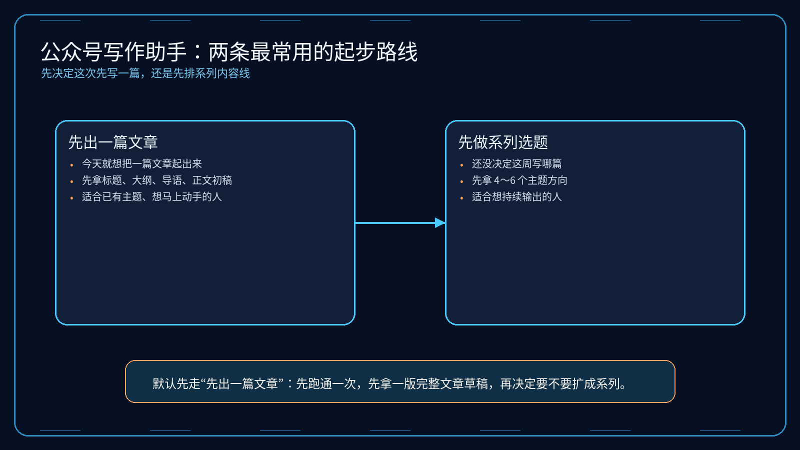
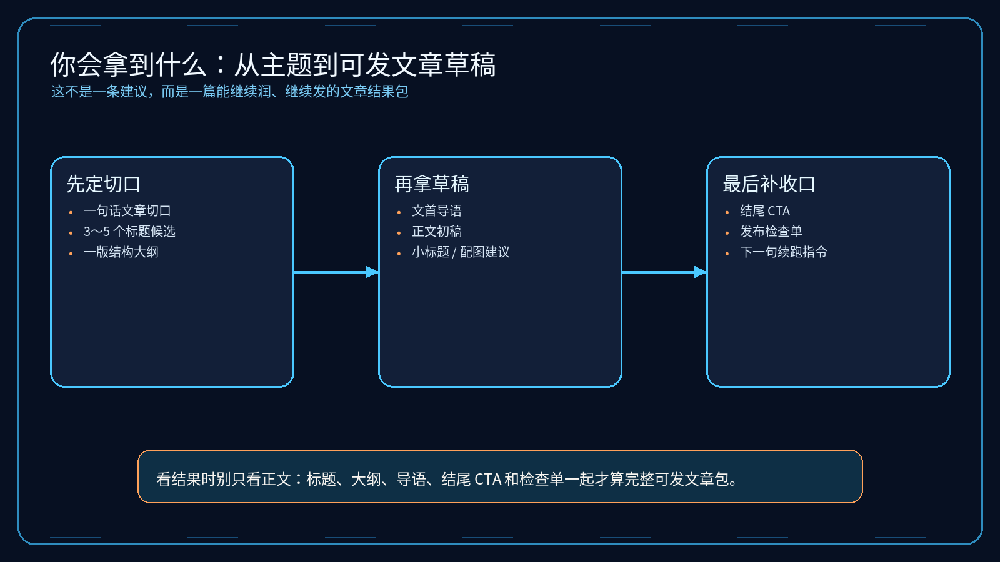
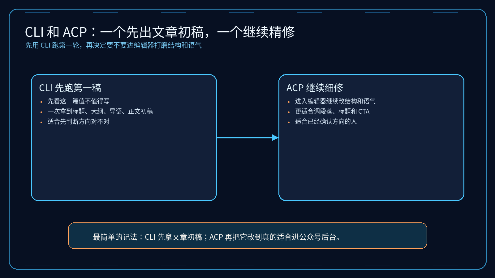

# 03-公众号写作助手

> 一句话先说清楚：这一页不是教你系统学公众号运营，而是帮你把一个观点、案例、产品更新或行业判断，直接压成“能发的一篇公众号草稿”。

---

## 👀 先看结论

如果你现在想的是：
- 我知道这篇公众号想讲什么，但不知道怎么展开
- 我不想自己从标题、大纲、开头、正文一路从零写
- 我想先让 Hermes 帮我出一版能继续改、能继续润的文章初稿

那这一页就是给你用的。

你用完这页，先拿到的不是空泛写作建议，而应该是这些东西：
- 这篇文章最适合从哪个切口写
- 3 到 5 个标题候选
- 一版文章结构大纲
- 一版可继续润色的正文初稿
- 文首摘要 / 导语
- 结尾收口与 CTA 建议
- 配图 / 引用 / 小标题建议
- 跑完第一轮后下一句该怎么继续

## 🗺 如果你现在只想看最短路线
- 想先看这套东西值不值得用：直接看「⚡ 5 分钟跑一轮」
- 想看最后会拿到什么：直接看「📦 你最后会拿到什么」
- 想看第一轮跑完以后怎么继续：直接看「🪜 跑完第一轮后，下一句怎么说」
- 想直接下载包：直接看「📁 你现在直接能用的东西」

---

## 🧩 一个真实用例：这页到底怎么帮人

假设你现在想发一篇公众号，主题是：

“为什么一个小团队在接入 AI Agent 之前，应该先想清楚哪一段工作流值得交出去？”

你脑子里可能只有这些零散想法：
- 想讲自己踩过的坑
- 想让读者明白不是所有流程都该自动化
- 想把判断标准讲清楚
- 但不知道这篇文章该从经验复盘、方法总结，还是案例拆解切进去
- 也不知道整篇文章怎么铺得更像公众号，而不是一条短帖

这一页做的事，就是先把这些零散想法压成一版可发的公众号文章草稿。

比如你跑完第一轮后，Hermes 应该先给你：
- 1 个主切口：`先判断值不值得交，再谈怎么交给 Agent`
- 5 个标题候选
- 1 版结构大纲
- 1 篇 1500～2200 字正文初稿
- 1 段文首导语
- 1 组小标题 / 配图 / 结尾 CTA 建议

这样你就不是“还在想怎么写公众号”，而是已经有一版能改、能润、能继续补案例的文章初稿。

---

## 🚦先选哪一种：先出一篇文章 or 先做系列选题

先别被内容规划吓到，直接按你现在的状态选。

| 如果你现在更像这样 | 直接走哪条 | 你真正会拿到什么 |
|---|---|---|
| 这一篇今天就想开始写 | 先出一篇文章 | 一次拿到标题、大纲、导语、正文初稿、结尾 CTA |
| 还没决定这周公众号发哪一篇 | 先做系列选题 | 先拿 4～6 个选题方向，再挑一篇展开 |
| 已经有素材，只差整理成公众号表达 | 先出一篇文章 | Hermes 先帮你把素材压成文章结构 |
| 想围绕一个主题连发几周 | 先做系列选题 | 先拿系列结构，再逐篇展开 |



如果你现在拿不准，默认先走：
- 先出一篇文章

原因很简单：
- 先跑通
- 先拿一版完整文章结构
- 再决定要不要扩成系列内容

---

## ✍️ 先出一篇文章：适合谁，跑完会得到什么

### 适合谁
适合你现在是下面这种状态：
- 这篇文章今天就想开始写
- 已经有一个主题、案例或观点
- 想先拿一版像样的公众号文章初稿

### 它会帮你做什么
你把需求喂进去后，它会先帮你：
- 收敛这篇文章的主切口
- 先挑标题方向
- 先拉出文章大纲
- 先写导语和正文初稿
- 补结尾收口 / CTA
- 补小标题、配图、引用建议

### 你最终应该看到什么
一个合格输出，应该至少让你看懂这些：
- 这篇文章到底从什么切口写更顺
- 标题是偏判断、偏案例，还是偏方法论
- 大纲层级是不是已经能直接展开
- 正文哪些段落已经能直接继续润
- 结尾怎么收，CTA 怎么下
- 如果要进公众号后台，这篇文章还差什么

如果它只给你“建议真实、有价值、多互动”这种空话，那就不对。

---

## 🗓 先做系列选题：适合谁，和先出一篇差在哪

### 适合谁
适合你已经进入下面这种状态：
- 不是只想写一篇
- 想围绕同一个主题持续输出
- 想先把系列内容线排清楚

### 它和先出一篇最大的区别
先出一篇：
- 一个主题直接压成可发草稿
- 重点是先把这一篇写出来
- 适合先验证表达切口

先做系列选题：
- 先把连续内容方向排出来
- 重点是持续输出不断档
- 适合品牌栏目、创始人观察、产品更新线

### 系列选题版里最应该拿到什么
| 你会拿到什么 | 它在输出里大概长什么样 | 你拿它立刻能干嘛 |
|---|---|---|
| 4～6 个选题方向 | `误区 / 复盘 / 方法 / 判断 / 案例` | 先决定未来几周写什么 |
| 每篇一句切口 | `先判断哪段值得交给 Agent` | 先看哪篇最适合先发 |
| 连续发布顺序建议 | `先误区，再案例，再方法，再工具` | 先定内容排期 |
| 第一篇优先建议 | `先写最容易建立信任的一篇` | 立刻进入单篇起稿 |

---

## 📦 你最后会拿到什么

别把它想得太抽象。

你跑完后，真正拿到的通常会长这样：

| 你会拿到什么 | 它在输出里大概长什么样 | 你拿它立刻能干嘛 |
|---|---|---|
| 文章切口 | `先判断值不值得交，再谈如何交给 Agent` | 先把整篇文章方向定住 |
| 标题候选 | `别急着自动化，先判断哪段工作值得交给 Agent` | 先挑最顺手的一条 |
| 结构大纲 | `问题 -> 误区 -> 判断标准 -> 案例 -> 建议` | 先确认文章骨架顺不顺 |
| 正文初稿 | `导语 -> 展开 -> 案例 -> 结论 -> CTA` | 直接开始润色，而不是从空白开始 |
| 导语 / 摘要 | `这篇文章先把问题抛出来，再给判断框架` | 直接进文首区域 |
| 小标题 / 配图建议 | `判断标准一 / 判断标准二 / 案例拆解` | 立刻准备排版节奏 |
| 结尾 CTA | `如果你现在也在判断第一段该交给谁…` | 先把收口和互动补上 |



如果你觉得表格还是偏文字，这张图可以帮助你更快扫一眼：
- 第一层看文章切口
- 第二层看文章草稿
- 第三层看发布收口和下一轮续写

---

## 🖥 CLI 和 ACP，到底怎么选

这里尽量说得像人话一点。

| 你现在要干嘛 | 用哪个 | 跑完你会看到什么 |
|---|---|---|
| 我先想看这篇公众号能不能搭出一版像样结构 | CLI | 一次完整输出：标题、大纲、导语、正文初稿、结尾 CTA |
| 我还没进编辑器，只想先拿一版文章草稿 | CLI | 先确认这套表达方向值不值得写 |
| 我已经准备开始逐段润文 | ACP | 可以顺着结果继续细修标题、结构、段落和语气 |
| 我想边看边改成自己的品牌语言 | ACP | 可以在编辑器里持续打磨，不只停在第一稿 |



最简单的记法：
- CLI：先拿第一稿
- ACP：确认方向对了以后，继续把它改到真的能发

---

## ⚡ 5 分钟跑一轮

如果你现在只想先跑通一次，默认走“先出一篇文章”。

### 第一步：下载它
先拿这个包：
- [01-super-individual.zip](../../../packs/wechat-writer-lab/01-super-individual.zip)

### 第二步：解压后进入目录
```bash
cd /path/to/01-super-individual
```

### 第三步：创建一个独立 profile
```bash
hermes profile create gzh-solo --clone
```

### 第四步：安装
```bash
bash ./install_to_profile.sh gzh-solo
```

### 第五步：直接跑现成示例
```bash
hermes -p gzh-solo chat --skills wechat-official-account-writer -q "$(cat skills/solutions/wechat-official-account-writer/examples/sample-input.md)"
```

跑完以后，先看这 5 件事：
- 有没有先收敛一个明确切口
- 有没有给出 3～5 个标题而不是只给 1 个
- 有没有把大纲、导语和正文初稿写出来
- 有没有补小标题 / 配图 / 结尾 CTA 建议
- 有没有告诉你下一轮该怎么继续

如果这 5 件事都没有，那说明输出不合格。

---

## 🪜 跑完第一轮后，下一句怎么说

很多人卡在这里：
第一轮跑完了，然后呢？

你不用自己想复杂，直接这样继续说就行：

```text
基于刚才这版公众号文章初稿，继续往“能直接发”收：
1. 先从 5 个标题里选出最适合转发传播的一条
2. 把导语改得更像公众号开头，而不是提纲摘要
3. 把正文压得更顺一点，减少太硬的术语
4. 给我一版更适合公众号排版的小标题结构
5. 给我文首摘要 3 版备选
6. 再给我结尾 CTA 3 版备选
7. 最后列一个发前检查单，提醒我哪些段落还太像内部笔记
```

你可以把这段理解成：
- 第一轮：先拿一版文章草稿
- 第二轮：开始把它改成真的能发进公众号后台的版本

---

## 📁 你现在直接能用的东西

- 超级个体版 zip：[01-super-individual.zip](../../../packs/wechat-writer-lab/01-super-individual.zip)
- 输入示例：[sample-input.md](../../../packs/wechat-writer-lab/01-super-individual/skills/solutions/wechat-official-account-writer/examples/sample-input.md)
- 输出示例：[sample-output.md](../../../packs/wechat-writer-lab/01-super-individual/skills/solutions/wechat-official-account-writer/examples/sample-output.md)
- 安装说明：[wechat-writer-lab/INSTALL.md](../../../packs/wechat-writer-lab/INSTALL.md)

---

## 🎯 这页写对了，用户应该一眼看懂什么

一页合格的“公众号写作助手”，用户应该一眼就能看懂这 4 件事：
- 这页是帮我把一个主题压成可继续润的公众号文章草稿，不是教我系统学写作
- 我现在应该先出一篇文章，还是先做系列选题
- 我第一步具体该怎么跑
- 我跑完后下一句该怎么继续

如果这 4 件事看不出来，这页就还没写对。

---

## ➡️ 下一步

完成后进入：

- [回 01-总览｜现成方案](../01-总览.md)

如果你想先回到现成方案入口重新确认位置：

- [回 01-总览｜现成方案](../01-总览.md)
