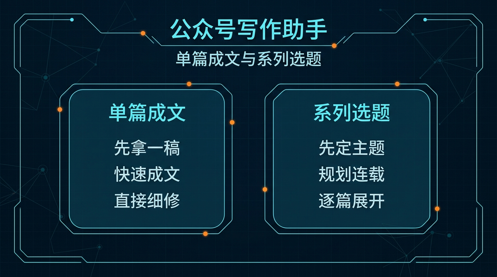
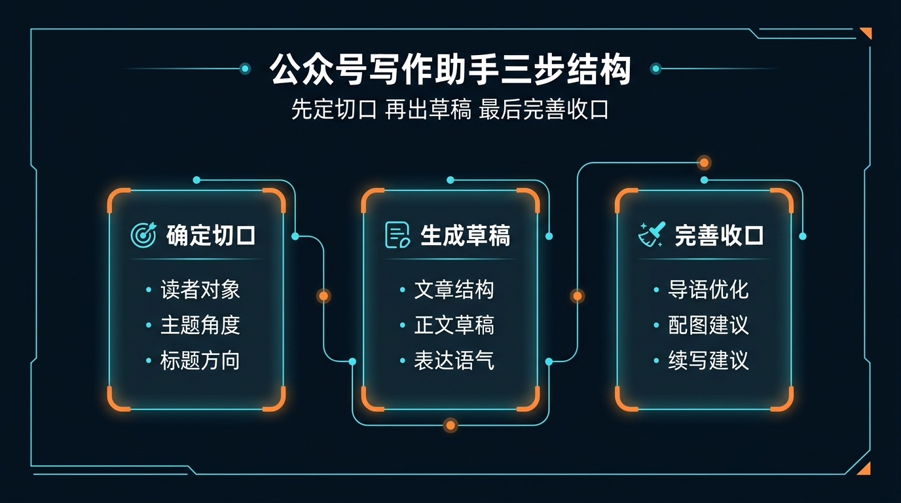
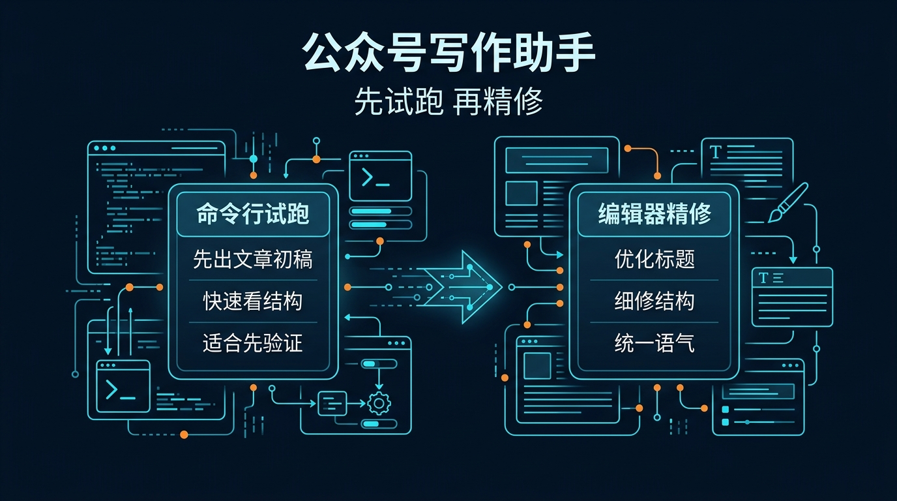

# 03-公众号写作助手

> 一句话先说清楚：这一页不是教你系统学公众号运营，而是帮你把一个观点、案例、产品更新或行业判断，直接压成“能发的一篇公众号草稿”。

---

## 👀 先看结论

如果你现在想的是：
- 我知道这篇公众号想讲什么，但不知道怎么展开
- 我不想自己从标题、大纲、开头、正文一路从零写
- 我想先让 Hermes 帮我出一版能继续改、能继续润的文章初稿

那这一页就是给你用的。

你用完这页，先拿到的不是空泛写作建议，而应该是这些东西：
- 这篇文章最适合从哪个切口写
- 3 到 5 个标题候选
- 一版文章结构大纲
- 一版可继续润色的正文初稿
- 文首摘要 / 导语
- 结尾收口与 CTA 建议
- 配图 / 引用 / 小标题建议
- 跑完第一轮后下一句该怎么继续

## 🗺 如果你现在只想看最短路线
- 想先看这套东西值不值得用：直接看「⚡ 5 分钟跑一轮」
- 想直接跑团队协作版：直接看「🤝 团队协作版怎么安装和开跑」
- 想看最后会拿到什么：直接看「📦 你最后会拿到什么」
- 想看第一轮跑完以后怎么继续：直接看「🪜 跑完第一轮后，下一句怎么说」
- 想直接下载包：直接看「📁 你现在直接能用的东西」

---

## 🧩 一个真实用例：这页到底怎么帮人

假设你现在想发一篇公众号，主题是：

“为什么一个小团队在接入 AI Agent 之前，应该先想清楚哪一段工作流值得交出去？”

你脑子里可能只有这些零散想法：
- 想讲自己踩过的坑
- 想让读者明白不是所有流程都该自动化
- 想把判断标准讲清楚
- 但不知道这篇文章该从经验复盘、方法总结，还是案例拆解切进去
- 也不知道整篇文章怎么铺得更像公众号，而不是一条短帖

这一页做的事，就是先把这些零散想法压成一版可发的公众号文章草稿。

比如你跑完第一轮后，Hermes 应该先给你：
- 1 个主切口：`先判断值不值得交，再谈怎么交给 Agent`
- 5 个标题候选
- 1 版结构大纲
- 1 篇 1500～2200 字正文初稿
- 1 段文首导语
- 1 组小标题 / 配图 / 结尾 CTA 建议

这样你就不是“还在想怎么写公众号”，而是已经有一版能改、能润、能继续补案例的文章初稿。

---

## 🚦先选哪一种：先出一篇文章 or 先做系列选题

先别被内容规划吓到，直接按你现在的状态选。

| 如果你现在更像这样 | 直接走哪条 | 你真正会拿到什么 |
|---|---|---|
| 这一篇今天就想开始写 | 先出一篇文章 | 一次拿到标题、大纲、导语、正文初稿、结尾 CTA |
| 还没决定这周公众号发哪一篇 | 先做系列选题 | 先拿 4～6 个选题方向，再挑一篇展开 |
| 已经有素材，只差整理成公众号表达 | 先出一篇文章 | Hermes 先帮你把素材压成文章结构 |
| 想围绕一个主题连发几周 | 先做系列选题 | 先拿系列结构，再逐篇展开 |



如果你现在拿不准，默认先走：
- 先出一篇文章

原因很简单：
- 先跑通
- 先拿一版完整文章结构
- 再决定要不要扩成系列内容

---

## ✍️ 先出一篇文章：适合谁，跑完会得到什么

### 适合谁
适合你现在是下面这种状态：
- 这篇文章今天就想开始写
- 已经有一个主题、案例或观点
- 想先拿一版像样的公众号文章初稿

### 它会帮你做什么
你把需求喂进去后，它会先帮你：
- 收敛这篇文章的主切口
- 先挑标题方向
- 先拉出文章大纲
- 先写导语和正文初稿
- 补结尾收口 / CTA
- 补小标题、配图、引用建议

### 你最终应该看到什么
一个合格输出，应该至少让你看懂这些：
- 这篇文章到底从什么切口写更顺
- 标题是偏判断、偏案例，还是偏方法论
- 大纲层级是不是已经能直接展开
- 正文哪些段落已经能直接继续润
- 结尾怎么收，CTA 怎么下
- 如果要进公众号后台，这篇文章还差什么

如果它只给你“建议真实、有价值、多互动”这种空话，那就不对。

---

## 🗓 先做系列选题：适合谁，和先出一篇差在哪

### 适合谁
适合你已经进入下面这种状态：
- 不是只想写一篇
- 想围绕同一个主题持续输出
- 想先把系列内容线排清楚

### 它和先出一篇最大的区别
先出一篇：
- 一个主题直接压成可发草稿
- 重点是先把这一篇写出来
- 适合先验证表达切口

先做系列选题：
- 先把连续内容方向排出来
- 重点是持续输出不断档
- 适合品牌栏目、创始人观察、产品更新线

### 系列选题版里最应该拿到什么
| 你会拿到什么 | 它在输出里大概长什么样 | 你拿它立刻能干嘛 |
|---|---|---|
| 4～6 个选题方向 | `误区 / 复盘 / 方法 / 判断 / 案例` | 先决定未来几周写什么 |
| 每篇一句切口 | `先判断哪段值得交给 Agent` | 先看哪篇最适合先发 |
| 连续发布顺序建议 | `先误区，再案例，再方法，再工具` | 先定内容排期 |
| 第一篇优先建议 | `先写最容易建立信任的一篇` | 立刻进入单篇起稿 |

---

## 🤝 团队协作版：适合谁，和单人版差在哪

### 适合谁
适合你已经不是一个人单独写公众号，而是开始出现：
- 有人定主题和栏目节奏
- 有人负责初稿
- 有人负责编辑、审校和发前把关

### 团队协作版怎么分工
| 角色 | 它主要产出什么 | 下一个角色拿它干嘛 |
|---|---|---|
| 01-article-strategist | 切口、标题方向、文章大纲 | 给 writer 一个清楚的起稿主线 |
| 02-article-writer | 导语、正文初稿、段落重点 | 给 editor 一版可改的文章骨架 |
| 03-editor | 润色版正文、小标题、配图、CTA | 给 review 做发前精修 |
| 04-review | 发布风险点、必须修改项、可发判断 | 给 validator 做总体验收 |
| 99-solution-validator | 最终结论：pass / pass with fixes / fail | 帮你判断这篇是否能进入发送环节 |

### 它和单人版最大的区别
- 单人版：一个 Agent 先帮你压出整篇文章草稿，重点是快
- 团队协作版：多角色接力，重点是结构、语言和发前把关更稳


---

## 📦 你最后会拿到什么

别把它想得太抽象。

你跑完后，真正拿到的通常会长这样：

| 你会拿到什么 | 它在输出里大概长什么样 | 你拿它立刻能干嘛 |
|---|---|---|
| 文章切口 | `先判断值不值得交，再谈如何交给 Agent` | 先把整篇文章方向定住 |
| 标题候选 | `别急着自动化，先判断哪段工作值得交给 Agent` | 先挑最顺手的一条 |
| 结构大纲 | `问题 -> 误区 -> 判断标准 -> 案例 -> 建议` | 先确认文章骨架顺不顺 |
| 正文初稿 | `导语 -> 展开 -> 案例 -> 结论 -> CTA` | 直接开始润色，而不是从空白开始 |
| 导语 / 摘要 | `这篇文章先把问题抛出来，再给判断框架` | 直接进文首区域 |
| 小标题 / 配图建议 | `判断标准一 / 判断标准二 / 案例拆解` | 立刻准备排版节奏 |
| 结尾 CTA | `如果你现在也在判断第一段该交给谁…` | 先把收口和互动补上 |



如果你觉得表格还是偏文字，这张图可以帮助你更快扫一眼：
- 第一层看文章切口
- 第二层看文章草稿
- 第三层看发布收口和下一轮续写

---

## 🖥 CLI 和 ACP，到底怎么选

这里尽量说得像人话一点。

| 你现在要干嘛 | 用哪个 | 跑完你会看到什么 |
|---|---|---|
| 我先想看这篇公众号能不能搭出一版像样结构 | CLI | 一次完整输出：标题、大纲、导语、正文初稿、结尾 CTA |
| 我还没进编辑器，只想先拿一版文章草稿 | CLI | 先确认这套表达方向值不值得写 |
| 我已经准备开始逐段润文 | ACP | 可以顺着结果继续细修标题、结构、段落和语气 |
| 我想边看边改成自己的品牌语言 | ACP | 可以在编辑器里持续打磨，不只停在第一稿 |



最简单的记法：
- CLI：先拿第一稿
- ACP：确认方向对了以后，继续把它改到真的能发

---

## ⚡ 5 分钟跑一轮

如果你现在只想先跑通一次，默认走“先出一篇文章”。

### 第一步：下载它
先拿这个包：
- [packs/wechat-writer-lab/01-super-individual.zip](../../../packs/wechat-writer-lab/01-super-individual.zip)

### 第二步：解压后进入目录
```bash
cd /path/to/01-super-individual
```

### 第三步：创建一个独立 profile
```bash
hermes profile create gzh-solo --clone
```

### 第四步：安装
```bash
bash ./install_to_profile.sh gzh-solo
```

### 第五步：直接跑现成示例
```bash
hermes -p gzh-solo chat --skills wechat-official-account-writer -q "$(cat skills/solutions/wechat-official-account-writer/examples/sample-input.md)"
```

跑完以后，先看这 5 件事：
- 有没有先收敛一个明确切口
- 有没有给出 3～5 个标题而不是只给 1 个
- 有没有把大纲、导语和正文初稿写出来
- 有没有补小标题 / 配图 / 结尾 CTA 建议
- 有没有告诉你下一轮该怎么继续

如果这 5 件事都没有，那说明输出不合格。

### 🤝 团队协作版怎么安装和开跑
如果你已经不是一个人单独写公众号，而是想按角色接力推进，就直接走团队协作版。

#### 第一步：下载团队包
先拿这个包：
- [packs/wechat-writer-lab/02-team.zip](../../../packs/wechat-writer-lab/02-team.zip)

#### 第二步：解压后进入目录
```bash
cd /path/to/02-team
```

#### 第三步：先创建 5 个 profile
```bash
hermes profile create gzh-strategy --clone
hermes profile create gzh-writer --clone
hermes profile create gzh-edit --clone
hermes profile create gzh-review --clone
hermes profile create gzh-validator --clone
```

#### 第四步：一键安装
```bash
bash ./install_all.sh
```

默认不传参数时，这个脚本会按 `gzh` 作为前缀，把内容分别装进：
- `gzh-strategy`
- `gzh-writer`
- `gzh-edit`
- `gzh-review`
- `gzh-validator`

#### 第五步：先跑第一棒
```bash
hermes -p gzh-strategy chat --skills wechat-article-strategist -q "$(cat 01-article-strategist/skills/solutions/wechat-article-strategist/examples/sample-input.md)"
```

跑完以后，先看这 4 件事：
- 有没有先把文章切口压清楚
- 有没有把标题方向和文章大纲定下来
- 有没有产出可交给 writer 的起稿主线
- 有没有知道下一棒该交给谁

如果第一棒还没把切口和结构压清楚，就不要急着让 writer 接着写。

### 🏃 跑完第一棒，怎么接第二棒？
当 `gzh-strategy` 已经把切口、标题方向和文章大纲压出来以后，第二棒就交给 `gzh-writer` 开写正文。

```bash
hermes -p gzh-writer chat --skills wechat-article-writer -q "$(cat 02-article-writer/skills/solutions/wechat-article-writer/examples/sample-input.md)"
```

更稳的用法是：
- 先把第一棒已经确认的切口、标题方向和大纲贴进去
- 再让 writer 继续扩成正文初稿
- 如果第一棒还没把结构定住，就先不要往第二棒走

### 🤝 全链路接力图谱
| 这一棒是谁 | 这一棒主要做什么 | 交给下一棒时，手里应该有什么 |
|---|---|---|
| 第一棒：`gzh-strategy` | 定文章切口、标题方向、文章大纲 | 一版清楚的起稿主线 |
| 第二棒：`gzh-writer` | 写导语、正文初稿、段落重点 | 一版可继续润的文章骨架 |
| 第三棒：`gzh-edit` | 顺语气、补小标题、补配图和 CTA | 一版更适合进公众号后台的编辑稿 |
| 第四棒：`gzh-review` | 查风险点、查结构问题、列必须修改项 | 一版发前审校结论 |
| 终点站：`gzh-validator` | 判断 pass / pass with fixes / fail | 最终“这篇现在能不能发”的结论 |

你可以把这条链理解成：
- `gzh-strategy` 先定切口和结构
- `gzh-writer` 再把正文写出来
- `gzh-edit` 负责把文章整理得更像可发布稿
- `gzh-review` 负责发前把关
- `gzh-validator` 最后只回答一件事：这篇现在能不能进入发送环节

### ⚡ 团队协作：最短命令总览
| 第一棒：战略（Strategy） | 第二棒：写稿（Writer） | 最终棒：验收（Validator） |
|---|---|---|
| `hermes -p gzh-strategy chat --skills wechat-article-strategist -q "$(cat 01-article-strategist/skills/solutions/wechat-article-strategist/examples/sample-input.md)"` | `hermes -p gzh-writer chat --skills wechat-article-writer -q "$(cat 02-article-writer/skills/solutions/wechat-article-writer/examples/sample-input.md)"` | `hermes -p gzh-validator chat --skills solution-validator-gzh -q "$(cat 99-solution-validator/skills/solutions/solution-validator-gzh/examples/sample-input.md)"` |
| 先拿文章切口、标题方向、文章大纲 | 先拿导语、正文初稿、段落重点 | 最后拿到 `pass / pass with fixes / fail` |

### 🚦 什么时候不要往下一棒走
- 不要交第二棒：如果 `gzh-strategy` 还没把文章切口、标题方向和大纲压清楚，读完还不知道这篇到底从哪里切进去。
- 不要交第三棒：如果 `gzh-writer` 还没写出可读的导语和正文初稿，只是在展开提纲。
- 不要交第四棒：如果 `gzh-edit` 还没把语气、小标题、摘要和 CTA 收成可发布文章。
- 不要交 Validator：如果 `gzh-review` 还没把结构风险、必须修改项和可发判断压清楚。

### 🛠️ 交付验收：怎么交给 Validator？
当 `gzh-review` 已经把结构风险、必须修改项和可发判断压清楚以后，再把这一版交给 `gzh-validator`。

交过去前，最少要准备这 3 类东西：
- 当前最终稿：标题、导语、正文、小标题结构
- 发布动作：文首摘要、配图建议、结尾 CTA
- 审校结论：风险点、必须修改项、当前是否建议发送

`gzh-validator` 主要只看这几件事：
- 这篇文章现在是不是已经能进入公众号发送环节
- 文章结构、段落节奏和语气是不是已经顺到可发布
- 摘要、配图和结尾 CTA 是不是和正文口径对齐

如果返回的是 `pass with fixes`，默认这样回：
- 语气、小标题、摘要、CTA 还没收干净：回 `gzh-edit`
- 结构风险、发前标准、可发判断还没压清：回 `gzh-review`

### ✅ 团队协作版最小通过标准
- 最终产出的文章导语、正文及 CTA 逻辑闭环，且经由 `gzh-validator` 判定为 `pass`，才算这一页的团队版真的跑通。

---

## 🪜 跑完第一轮后，下一句怎么说

很多人卡在这里：
第一轮跑完了，然后呢？

你不用自己想复杂，直接这样继续说就行：

```text
基于刚才这版公众号文章初稿，继续往“能直接发”收：
1. 先从 5 个标题里选出最适合转发传播的一条
2. 把导语改得更像公众号开头，而不是提纲摘要
3. 把正文压得更顺一点，减少太硬的术语
4. 给我一版更适合公众号排版的小标题结构
5. 给我文首摘要 3 版备选
6. 再给我结尾 CTA 3 版备选
7. 最后列一个发前检查单，提醒我哪些段落还太像内部笔记
```

你可以把这段理解成：
- 第一轮：先拿一版文章草稿
- 第二轮：开始把它改成真的能发进公众号后台的版本

---

## 📁 你现在直接能用的东西

- 超级个体版下载：[packs/wechat-writer-lab/01-super-individual.zip](../../../packs/wechat-writer-lab/01-super-individual.zip)
- 团队协作版下载：[packs/wechat-writer-lab/02-team.zip](../../../packs/wechat-writer-lab/02-team.zip)
- 安装说明：[packs/wechat-writer-lab/INSTALL.md](../../../packs/wechat-writer-lab/INSTALL.md)
- 使用说明：当前页里的「⚡ 5 分钟跑一轮」和「🤝 团队协作版怎么安装和开跑」就是默认 doc 入口

---

## 🎯 这页写对了，用户应该一眼看懂什么

一页合格的“公众号写作助手”，用户应该一眼就能看懂这 4 件事：
- 这页是帮我把一个主题压成可继续润的公众号文章草稿，不是教我系统学写作
- 我现在应该先出一篇文章，还是先做系列选题
- 我第一步具体该怎么跑
- 我跑完后下一句该怎么继续

如果这 4 件事看不出来，这页就还没写对。

---

## ➡️ 下一步

完成后进入：

- [04-PPT 助手](<./04-PPT%20%E5%8A%A9%E6%89%8B.md>)

如果你想先回到现成方案入口重新确认位置：

- [回 01-总览｜现成方案](../01-总览.md)

---

## 🔗 相关入口

- Pack 详情：[公众号写作助手 Pack](/packs/wechat-writer-lab)，先确认适合谁用、安装入口和下载入口。
- 同类方案：回到[当前方案分组](/docs/solutions/content)，继续比较同一类任务。
- 下一步延展：如果这个方案不完全匹配，可以继续看[相邻方案](/docs/solutions/ppt)。
- 跑不起来时：先去[遇到问题](/docs/issues)按安装、模型、Tools、Profiles 分类排查。
- 要查命令和配置：进入[Reference](/docs/reference)查看 CLI、Slash Commands、Profiles、Tools、Skills 与环境变量。
