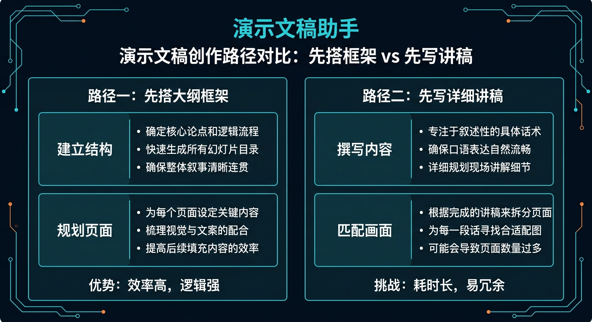
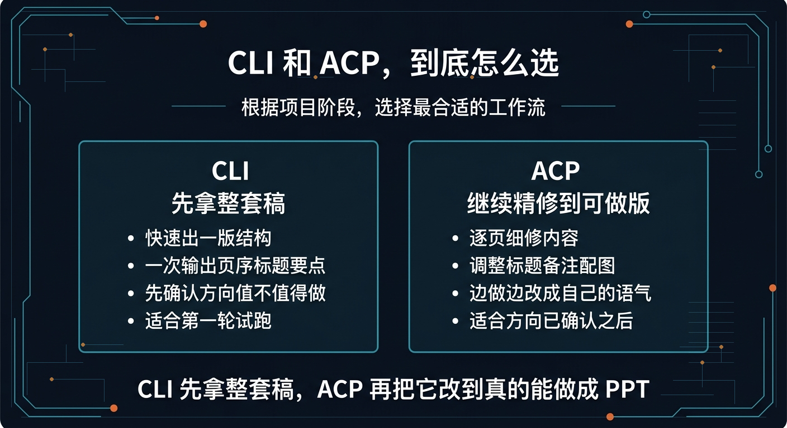

# 04-PPT 助手

> 一句话先说清楚：这一页不是教你系统学做 PPT，而是帮你把一个零散想法、复盘主题、路演题目或汇报任务，直接压成“可继续做成 PPT 的整套稿”。

---

## 👀 先看结论

如果你现在想的是：
- 我知道这次 PPT 大概要讲什么，但不知道怎么排页
- 我不想自己从标题、结构、逐页要点一路从零搭
- 我想先让 Hermes 帮我出一版能直接继续做成 PPT 的大纲和逐页稿

那这一页就是给你用的。

你用完这页，先拿到的不是泛泛建议，而应该是这些东西：
- 这套 PPT 最适合从哪个叙事切口讲
- 一版完整页序结构
- 每一页该写什么要点
- 每一页适合放什么图 / 表 / 结论
- 开场页和结尾页怎么收
- 演讲备注 / 口播提示
- 发给设计或自己继续做 PPT 时的执行清单
- 跑完第一轮后下一句该怎么继续

## 🗺 如果你现在只想看最短路线
- 想先看这套东西值不值得用：直接看「⚡ 5 分钟跑一轮」
- 想看最后会拿到什么：直接看「📦 你最后会拿到什么」
- 想看第一轮跑完以后怎么继续：直接看「🪜 跑完第一轮后，下一句怎么说」
- 想直接下载包：直接看「📁 你现在直接能用的东西」

---

## 🧩 一个真实用例：这页到底怎么帮人

假设你现在要做一份 PPT，主题是：

“季度业务复盘与下季度规划”

你脑子里可能只有这些零散想法：
- 想讲这季度发生了什么
- 想把增长、问题、经验和下季度计划讲清楚
- 想让老板或团队一眼看懂重点
- 但不知道到底该分几页
- 也不知道这份 PPT 应该先讲成绩、先讲问题，还是先讲结论

这一页做的事，就是先把这些零散想法压成一版可继续做成 PPT 的整套稿。

比如你跑完第一轮后，Hermes 应该先给你：
- 1 个主切口：`先给结论，再讲数据，再落到下季度动作`
- 1 版完整页序结构
- 每页标题 + 核心要点
- 每页配图 / 图表建议
- 开场页、结尾页、Q&A 页建议
- 一份交给自己或设计继续落版的执行清单

这样你就不是“还在想 PPT 怎么排”，而是已经有一版能继续做、继续美化、继续讲的逐页稿。

---

## 🚦先选哪一种：先出一版结构 or 先出逐页讲稿

先别被方法论吓到，直接按你现在的状态选。

| 如果你现在更像这样 | 直接走哪条 | 你真正会拿到什么 |
|---|---|---|
| 先想知道这份 PPT 该怎么排页 | 先出一版结构 | 一次拿到页序、每页标题、每页核心内容 |
| 结构已经差不多有了，只差展开 | 先出逐页讲稿 | 先拿每页要点、图表建议、讲稿备注 |
| 还没想清楚这份汇报该先讲什么 | 先出一版结构 | Hermes 先帮你定叙事主线 |
| 已经确定主题，只想快点做成稿 | 先出逐页讲稿 | 先拿逐页可执行内容，再进 PPT 工具 |



如果你现在拿不准，默认先走：
- 先出一版结构

原因很简单：
- 先跑通
- 先把整套页序定清楚
- 再决定要不要直接展开逐页讲稿

---

## 🧱 先出一版结构：适合谁，跑完会得到什么

### 适合谁
适合你现在是下面这种状态：
- 这份 PPT 还没成型
- 已经有主题，但页序和重点不清楚
- 想先拿一版像样的结构骨架

### 它会帮你做什么
你把需求喂进去后，它会先帮你：
- 收敛这份 PPT 的主切口
- 先定页序结构
- 先给每页标题与要点
- 补每页图表 / 配图建议
- 补开场页、结尾页和 Q&A 页建议
- 补继续做版的执行清单

### 你最终应该看到什么
一个合格输出，应该至少让你看懂这些：
- 这份 PPT 到底先讲什么、后讲什么
- 每页分别负责什么
- 哪几页该用图，哪几页该用表
- 哪一页是结论页，哪一页是证据页
- 如果要继续做版，先补哪些素材

如果它只给你“建议逻辑清楚、建议图文结合”这种空话，那就不对。

---

## 🗒 先出逐页讲稿：适合谁，和先出一版结构差在哪

### 适合谁
适合你已经进入下面这种状态：
- 页序大体已经有了
- 现在更缺的是每一页该写什么
- 想先拿逐页内容，再进入 PPT 工具或交给设计

### 它和先出一版结构最大的区别
先出一版结构：
- 先把整套逻辑和页序搭出来
- 重点是先知道怎么排这份 PPT
- 适合还没定骨架的人

先出逐页讲稿：
- 先把每页内容展开
- 重点是让你能立刻继续做版
- 适合已经确认大方向的人

### 逐页讲稿版里最应该拿到什么
| 你会拿到什么 | 它在输出里大概长什么样 | 你拿它立刻能干嘛 |
|---|---|---|
| 页序清单 | `封面 / 结论 / 数据 / 问题 / 计划 / Q&A` | 先确认整套路径顺不顺 |
| 每页标题 | `本季度核心结论`、`增长来源拆解` | 先决定每页讲什么 |
| 每页 3～5 个要点 | `问题、证据、结论、动作` | 立刻开始填内容 |
| 图表 / 配图建议 | `柱状图 / 趋势图 / 对比图 / 截图` | 先补素材再进 PPT 工具 |

---

## 🤝 团队协作版：适合谁，和单人版差在哪

### 适合谁
适合你已经不是一个人单独做 PPT，而是开始出现：
- 有人定主线和页序
- 有人负责逐页写内容
- 有人负责润稿、口播和汇报前审校

### 团队协作版怎么分工
| 角色 | 它主要产出什么 | 下一个角色拿它干嘛 |
|---|---|---|
| 01-structure-planner | 主线、页序、每页职责 | 给 slide-writer 一个清楚的结构骨架 |
| 02-slide-writer | 每页标题、要点、图表建议 | 给 polisher 一版逐页稿 |
| 03-slide-polisher | 口播备注、删减建议、页间过渡 | 给 review 做汇报前把关 |
| 04-review | 结构风险点、必须修改项、可讲判断 | 给 validator 做总体验收 |
| 99-solution-validator | 最终结论：pass / pass with fixes / fail | 帮你判断这份 PPT 是否能进入正式汇报 |


上面这张图要表达的是：
- 团队协作版不是把同一句需求扔给 5 个 Agent，而是按交接物一棒一棒往下传
- 每个角色都只做自己最该做的那一段，避免一个 Agent 同时兼顾结构、写稿、润稿和审校
- 最后一棒不是继续写内容，而是给出这份 PPT 能不能进入正式汇报的判断

### 它和单人版最大的区别
- 单人版：一个 Agent 先帮你压出整套逐页稿，重点是快
- 团队协作版：多角色接力，重点是结构、逐页内容和汇报把关更稳


---

## 📦 你最后会拿到什么

别把它想得太抽象。

你跑完后，真正拿到的通常会长这样：

| 你会拿到什么 | 它在输出里大概长什么样 | 你拿它立刻能干嘛 |
|---|---|---|
| 叙事切口 | `先给结论，再讲证据，再落到行动` | 先把整套 PPT 逻辑定住 |
| 页序结构 | `封面 -> 结论 -> 数据 -> 问题 -> 计划 -> Q&A` | 先知道该分几页 |
| 每页标题与要点 | `第 3 页讲增长来源，第 4 页讲主要问题` | 直接开始填每页内容 |
| 图表 / 配图建议 | `折线图 / 漏斗图 / 三栏对比` | 立刻准备素材 |
| 演讲备注 | `这一页口头重点是先讲结论，不先讲细节` | 方便自己讲或交给汇报人 |
| 继续执行清单 | `缺哪些数据、截图、素材、图表` | 立刻推进下一轮落版 |


如果你觉得表格还是偏文字，这张图可以帮助你更快扫一眼：
- 第一层看叙事主线
- 第二层看逐页稿
- 第三层看图表、备注和继续落版

---

## 🖥 CLI 和 ACP，到底怎么选

这里尽量说得像人话一点。

| 你现在要干嘛 | 用哪个 | 跑完你会看到什么 |
|---|---|---|
| 我先想看这份 PPT 能不能搭出一版像样结构 | CLI | 一次完整输出：页序、每页标题、每页要点、图表建议 |
| 我还没进 PPT 工具，只想先拿一版整套稿 | CLI | 先确认这套汇报方向值不值得做 |
| 我已经准备开始逐页落版 | ACP | 可以顺着结果继续细修每页内容、标题、备注和配图 |
| 我想边做边改成自己的汇报语气 | ACP | 可以在编辑器里持续打磨，不只停在第一稿 |



最简单的记法：
- CLI：先拿整套稿
- ACP：确认方向对了以后，继续把它改到真的能做成 PPT

---

## ⚡ 5 分钟跑一轮

如果你现在只想先跑通一次，默认走“先出一版结构”。

### 第一步：下载它
先拿这个包：
- [01-super-individual.zip](../../../packs/ppt-lab/01-super-individual.zip)

### 第二步：解压后进入目录
```bash
cd /path/to/01-super-individual
```

### 第三步：创建一个独立 profile
```bash
hermes profile create ppt-solo --clone
```

### 第四步：安装
```bash
bash ./install_to_profile.sh ppt-solo
```

### 第五步：直接跑现成示例
```bash
hermes -p ppt-solo chat --skills ppt-assistant -q "$(cat skills/solutions/ppt-assistant/examples/sample-input.md)"
```

跑完以后，先看这 5 件事：
- 有没有先收敛一个明确主线
- 有没有把页序和每页标题定出来
- 有没有把每页要点写出来
- 有没有补图表 / 配图 / 备注建议
- 有没有告诉你下一轮该怎么继续

如果这 5 件事都没有，那说明输出不合格。

---

## 🪜 跑完第一轮后，下一句怎么说

很多人卡在这里：
第一轮跑完了，然后呢？

你不用自己想复杂，直接这样继续说就行：

```text
基于刚才这版 PPT 结构稿，继续往“能直接做版”收：
1. 把每一页扩成更完整的逐页讲稿
2. 给我每页 3～5 个 bullet 的最终版
3. 给我适合这一页的图表 / 配图建议
4. 标出哪些页需要老板一眼看懂，哪些页适合讲细一点
5. 给我一版开场口播和结尾收口
6. 最后列一个做版前检查单，提醒我哪些数据和素材还没补齐
```

你可以把这段理解成：
- 第一轮：先拿整套结构稿
- 第二轮：开始把它改成真的能做成 PPT 的逐页稿

---

## 📁 你现在直接能用的东西

- 团队协作版 zip：[02-team.zip](../../../packs/ppt-lab/02-team.zip)
- 团队协作版安装说明：[ppt-lab/02-team/README.md](../../../packs/ppt-lab/02-team/README.md)
- 超级个体版 zip：[01-super-individual.zip](../../../packs/ppt-lab/01-super-individual.zip)
- 输入示例：[sample-input.md](../../../packs/ppt-lab/01-super-individual/skills/solutions/ppt-assistant/examples/sample-input.md)
- 输出示例：[sample-output.md](../../../packs/ppt-lab/01-super-individual/skills/solutions/ppt-assistant/examples/sample-output.md)
- 安装说明：[ppt-lab/INSTALL.md](../../../packs/ppt-lab/INSTALL.md)

---

## 🎯 这页写对了，用户应该一眼看懂什么

一页合格的“PPT 助手”，用户应该一眼就能看懂这 4 件事：
- 这页是帮我把一个主题压成可继续做成 PPT 的整套稿，不是教我系统学排版
- 我现在应该先出一版结构，还是先出逐页讲稿
- 我第一步具体该怎么跑
- 我跑完后下一句该怎么继续

如果这 4 件事看不出来，这页就还没写对。

---

## ➡️ 下一步

完成后进入：

- [01-总览｜办公效率与知识整理](../02-办公效率与知识整理/01-总览.md)

如果你想先回到现成方案入口重新确认位置：

- [01-总览｜现成方案](../01-总览.md)
