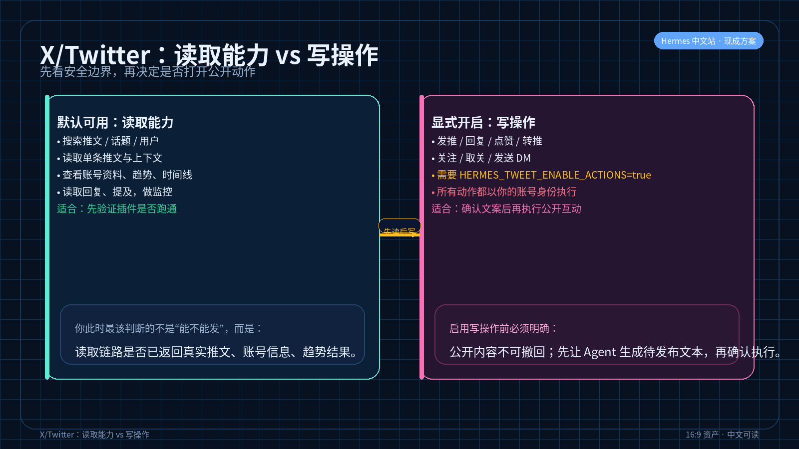
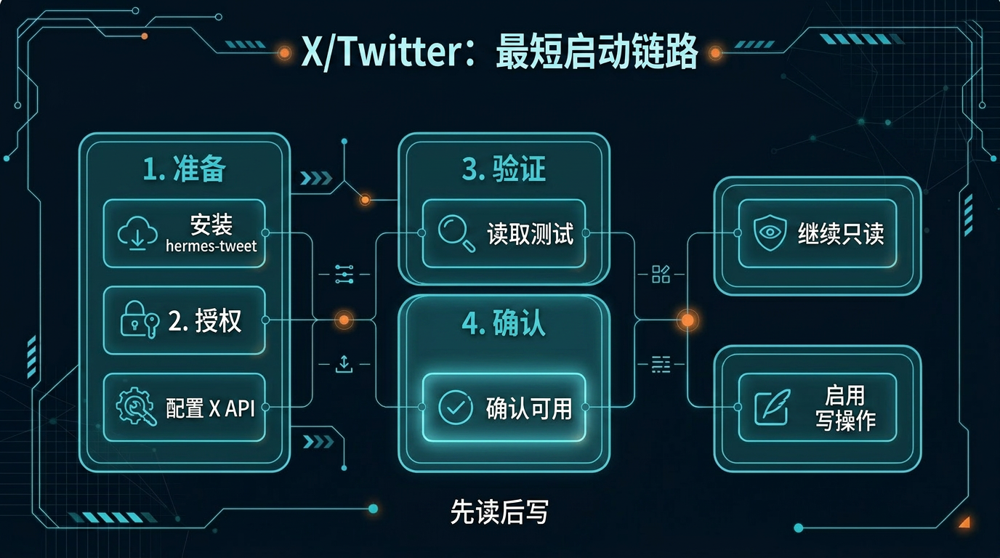

# X/Twitter 内容与互动助手

> 一句话先说清楚：这一页是帮你把 X/Twitter 上的搜索、阅读、发推、回复、互动等操作，通过一个第三方插件接入 Hermes Agent，让你能用对话方式完成 X 平台的内容工作。

**摘要**：本页介绍如何通过第三方插件 [Hermes Tweet](https://github.com/Xquik-dev/hermes-tweet)（由 [Xquik-dev](https://github.com/Xquik-dev) 开发维护），将 X/Twitter 搜索、推文阅读、时间线浏览、趋势查看、发推、回复等操作接入 Hermes Agent。插件分为读取能力（默认可用）和写操作（需显式启用 `HERMES_TWEET_ENABLE_ACTIONS=true`）。本方案为第三方解决方案，非 Hermes 官方内置功能，采用 weekly review only 策略，不自动更新正文。

> ⚠️ **第三方插件声明**
> Hermes Tweet 是由 [Xquik-dev](https://github.com/Xquik-dev) 开发和维护的**第三方 Hermes Agent 插件**，不是 Hermes 官方内置功能。它的功能边界、更新节奏和安全策略由第三方作者负责。本页仅做中文介绍与使用引导，不对其稳定性、安全性和持续维护做官方背书。

## 🔍 这页在回答什么

如果你搜的是"X Twitter 自动化工具"、"怎么用 AI 搜推文"或者"能不能在对话里管 Twitter 互动"，这页会给你一个清晰的答案：通过第三方插件 Hermes Tweet，把 X 平台的搜索、阅读、发推、回复等操作接入 Hermes Agent 工作流。需要强调的是，这是一个第三方社区开发的插件，不是 Hermes 官方内置功能——所以安装、配置和安全边界这页都会说清楚。

---

## 👀 先看结论

如果你现在想的是：
- 我想在 Hermes 里直接搜索 X 上的推文和趋势
- 我想让 Agent 帮我读某个账号的内容、监控回复
- 我想通过对话发推、回复、点赞、转推，而不是手动操作 X
- 我想把 X 上的内容工作流接入 Hermes 的日常工作链路

那这一页就是给你用的。

你用完这页，先拿到的不是泛泛建议，而应该是这些东西：
- 明确知道这个插件能做什么、不能做什么
- 知道读取操作和写操作的安全边界
- 知道怎么安装、配置和验证
- 能直接跑一轮搜索或读取，确认插件可用
- 知道发推、回复等写动作需要显式授权才能启用

---

## 🧩 这个插件到底解决什么

假设你现在是这种场景：

- 你在做产品推广，需要每天搜索 X 上和你产品相关的讨论
- 你想快速读取某个意见领袖的最新推文和上下文
- 你想监控自己账号下的回复和提及
- 你想在确认内容后，直接从 Hermes 里发推或回复，而不是切换到 X 网页/App
- 你想把这些操作串进 Hermes 的自动化工作流

Hermes Tweet 做的事，就是把这些 X 平台操作变成 Hermes Agent 可直接调用的工具能力。

### 适合谁
- 每天需要在 X 上搜索话题、监控提及的内容运营或产品人员
- 想在 Hermes 对话中完成推文阅读和互动，不想频繁切换工具
- 能接受第三方插件处理自己 X 账号凭据，并理解相关风险

### 不适合谁
- 在找 Hermes 官方内置的 Twitter 功能（这是第三方插件，非官方能力）
- 需要完整的 Twitter 分析和管理套件（比如排期发布、多账号管理、数据分析看板——这类需求更适合 Hootsuite、Buffer 等专业工具）
- 不放心把自己的 X API 凭据交给第三方插件处理的人

---

## 🚦 它能做什么：读取 vs 写操作

Hermes Tweet 把能力分成两层，这是你需要先搞清楚的：

### 读取能力（默认可用）

这些操作**不需要额外授权**，安装完成后即可使用：

| 能力 | 说明 | 你什么时候会用 |
|---|---|---|
| 搜索推文 | 按关键词、话题、用户搜索 | 找竞品讨论、找用户反馈、找行业趋势 |
| 读取推文 | 查看单条推文的完整内容 | 看某条推文的原文和上下文 |
| 查看用户信息 | 查看账号资料、关注数等 | 快速了解某个账号 |
| 读取趋势 | 查看 X 上的热门话题 | 内容选题参考 |
| 读取回复/提及 | 看到人对你账号的回复和 @ | 监控品牌提及 |
| 读取时间线 | 看指定账号或自己的时间线 | 快速扫一圈最新动态 |

### 写操作（需要显式启用）

这些操作**默认关闭**，必须设置环境变量 `HERMES_TWEET_ENABLE_ACTIONS=true` 后才会启用：

| 能力 | 说明 | 风险边界 |
|---|---|---|
| 发推 | 发布新推文 | 会直接在你的 X 账号上发布公开内容 |
| 回复 | 回复别人的推文 | 会以你的账号名义公开回复 |
| 点赞 | 对推文点赞 | 会留下公开的互动记录 |
| 转推 | 转推或引用推文 | 会出现在你的时间线上 |
| 关注/取关 | 关注或取消关注用户 | 会改变你的社交图谱 |
| 发送 DM | 发私信 | 会直接向他人发送消息 |

> ⚠️ **写操作风险边界**
> - 所有写操作都以**你的 X 账号身份**执行，等同于你手动操作
> - 发推和回复是**公开且不可撤回**的（删除不算撤回）
> - DM 是**私密通信**，一旦发出无法撤回
> - X 平台有 API 调用频率限制，高频操作可能触发限流
> - 你需要自行承担因自动化操作带来的账号风险（包括但不限于被 X 限流、标记为机器人等）
> - **强烈建议**：先用读取能力验证环境正确，再考虑启用写操作



---

## 🛡️ 安全与授权说明

### 谁在控制你的 X 数据

- Hermes Tweet 通过 X 官方 API 访问你的数据
- 你的 API 凭据只存储在你自己的环境中（本地配置文件或环境变量）
- 插件不会将你的凭据发送到任何第三方服务器

### 写操作授权方式

写操作受一个环境变量显式控制：

```bash
# 启用写操作（发推、回复、点赞等）
export HERMES_TWEET_ENABLE_ACTIONS=true

# 不设置或设置为 false 时，只有读取能力可用
```

这个设计的意思是：
- **默认安全**：装完只能读，不会意外发推
- **显式授权**：你必须主动设置，才开启写操作
- **可控边界**：你随时可以把环境变量改回 false 来关闭写操作

### 你需要准备什么

使用前，你需要自己准备：
1. 一个 X 开发者账号（在 https://developer.x.com 申请）
2. API 凭据（API Key、API Secret、Bearer Token 等）
3. 按插件文档配置好凭据

---

## ⚡ 5 分钟跑一轮（读取）

如果你现在只想先试一下读取能力，跟着走就行。

### 第一步：安装插件

```bash
pip install hermes-tweet
```

### 第二步：配置 API 凭据

按 [官方使用指南](https://docs.xquik.com/guides/hermes-tweet) 配置你的 X API 凭据。

### 第三步：在 Hermes 中加载并测试

```bash
hermes chat --skills hermes-tweet -q "搜索 X 上最近关于 AI Agent 的讨论，给我看前 5 条"
```

跑完后，先看这 3 件事：
- 有没有正常返回搜索结果
- 返回的内容是否是真实的推文（不是模拟数据）
- 有没有报 API 权限或认证错误

如果这 3 件事都正常，说明读取链路通了。



---

## ✍️ 如果你准备好启用写操作

> 以下操作涉及公开的 X 账号动作，请确认你已经理解上面的风险边界。

### 第一步：显式启用写操作

```bash
export HERMES_TWEET_ENABLE_ACTIONS=true
```

### 第二步：先试一个低风险操作

```bash
hermes chat --skills hermes-tweet -q "帮我点赞这条推文：https://x.com/someuser/status/1234567890"
```

### 第三步：确认后再发推

```bash
hermes chat --skills hermes-tweet -q "帮我发一条推文：独立开发者用 AI Agent 接管重复工作流，真的不是噱头。用了三个月，节省了每周至少 5 小时。"
```

> **重要提醒**：
> - 发推前让 Agent 先给你看拟发布的文本，确认无误再执行
> - 不要直接让 Agent 不经确认就发推
> - 避免高频发布，X 会对自动化行为做限流

---

## 📦 你最后会拿到什么

装完并跑通后，你能在 Hermes 里直接做的事：

| 你会拿到什么 | 它大概长什么样 | 你拿它立刻能干嘛 |
|---|---|---|
| 推文搜索结果 | 关键词匹配的推文列表 + 用户 + 时间 | 快速了解某个话题的讨论现状 |
| 账号信息 | 用户名、简介、关注数、推文数 | 快速了解目标账号 |
| 趋势话题 | 当前 X 上的热门话题列表 | 内容选题参考 |
| 回复/提及监控 | @你的推文列表 | 及时响应互动 |
| 推文发布能力 | 从 Hermes 对话中直接发推 | 不用切到 X 就能发内容 |

---

## 🖥 常见用法参考

| 你想做什么 | 在 Hermes 里怎么说 |
|---|---|
| 搜竞品讨论 | "搜索 X 上最近提到 [产品名] 的推文" |
| 看大 V 在说什么 | "读取 @username 最近 10 条推文" |
| 监控品牌提及 | "看最近谁 @了我的账号" |
| 查趋势选题 | "X 上现在什么话题最火" |
| 发一条推文 | "帮我发一条推文：[内容]"（需启用写操作） |
| 回复一条推文 | "帮我回复这条推文 [链接]：[回复内容]"（需启用写操作） |

---

## 🔧 安装方式

### pip 安装

```bash
pip install hermes-tweet
```

### 验证安装

```bash
hermes chat --skills hermes-tweet -q "检查 Hermes Tweet 插件状态"
```

### 完整文档

- GitHub: https://github.com/Xquik-dev/hermes-tweet
- PyPI: https://pypi.org/project/hermes-tweet/
- 使用指南: https://docs.xquik.com/guides/hermes-tweet
- AgentSkill: https://agentskill.sh/@xquik-dev/hermes-tweet

---

## 🎯 这页写对了，用户应该一眼看懂什么

一页合格的"X/Twitter 内容与互动助手"，用户应该一眼就能看懂这 4 件事：
- 这是一个**第三方插件**，不是 Hermes 官方内置功能
- 它能帮我做 X 上的搜索和阅读（读取），也能帮我发推和回复（写操作，需显式启用）
- 我第一步具体该怎么安装和配置
- 写操作有风险边界，我需要自己决定是否启用

如果这 4 件事看不出来，这页就还没写对。

---

## ❓ 常见问题

### Hermes Tweet 是官方插件还是第三方的？

第三方。Hermes Tweet 由 [Xquik-dev](https://github.com/Xquik-dev) 独立开发和维护，不是 Hermes 官方内置功能。它的更新节奏、功能范围和安全策略由第三方作者决定。使用前请自行评估风险。

### 读取操作安全吗？会不会意外发推？

安全。插件默认只开放读取能力（搜索、浏览时间线、查看回复等）。写操作（发推、回复、点赞等）必须手动设置环境变量 `HERMES_TWEET_ENABLE_ACTIONS=true` 才会启用。不设置就不会有任何写动作。

### 需要什么级别的 X API？

具体取决于你想用的功能。搜索和读取公开推文一般需要 Basic 及以上 tier；部分高级功能（如读取完整对话上下文）可能需要 Pro tier。建议先到 [X 开发者平台](https://developer.x.com) 确认你当前 API tier 的权限范围，再对照插件文档看支持哪些操作。

### 能处理推文串（Thread）吗？

可以读取。你可以给 Hermes 一条推文链接，让它读取该推文及其回复串的完整上下文。不过目前插件本身不提供"一键发一条 Thread"的能力——发多条串起来的推文需要逐条执行。

### 支持定时发推吗？

不支持。Hermes Tweet 目前没有内置定时发布功能。如果你需要排期发推，建议结合其他工具（如 Hootsuite、Buffer），或者通过 Hermes 的工作流 + 外部定时任务来自行实现。

---

## ➡️ 下一步

完成后进入：

- [06-多平台内容改写助手](./06-多平台内容改写助手.md)

如果你想先回到当前位置重新确认：

- [01-总览｜内容创作与发布](./01-总览.md)

---

## 🔗 相关入口

- 插件详情：[Hermes Tweet on GitHub](https://github.com/Xquik-dev/hermes-tweet)，先确认版本和兼容性。

## 📋 来源与核验

> 本块用于记录本页所引用第三方方案的来源信息与核验状态，确保内容可追溯。

| 项目 | 值 |
|---|---|
| 方案名称 | Hermes Tweet |
| 性质 | **第三方 Hermes Agent 插件**（非官方内置） |
| 维护者 | [Xquik-dev](https://github.com/Xquik-dev) |
| GitHub | https://github.com/Xquik-dev/hermes-tweet |
| PyPI | https://pypi.org/project/hermes-tweet/ |
| 使用指南 | https://docs.xquik.com/guides/hermes-tweet |
| AgentSkill | https://agentskill.sh/@xquik-dev/hermes-tweet |
| 当前记录版本 | 0.1.6 |
| 本页最后核验 | 2026-05-16 |
| 来源 Issue | [#5 建议补充 Hermes Tweet：X/Twitter 搜索与自动化插件入口](https://github.com/zcweah1981/awesome-hermes-agent-zh/issues/5) |
| 核验人 | ikki-content-1 |

> **版本说明**：当前记录版本 0.1.6 为本页创建时通过 PyPI 确认的版本号。如需确认最新版本，请直接访问上方 PyPI 链接。
