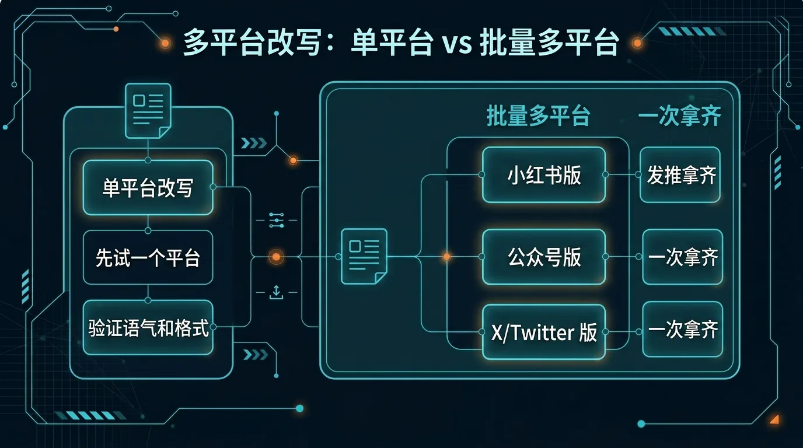
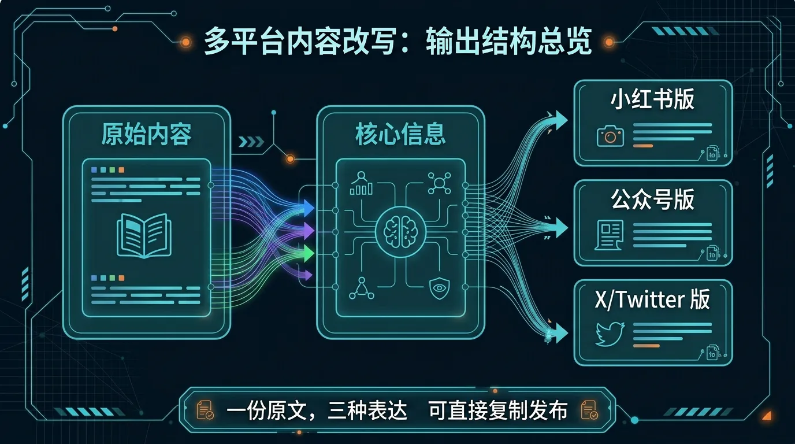

# 06-多平台内容改写助手

> 一句话先说清楚：这一页不是教你系统学跨平台运营，而是帮你把一篇已有的内容，直接改写成适配小红书、公众号、X/Twitter 等不同平台风格的可发布稿件——复制就能发。

## 🔍 这页在回答什么

如果你搜索过「同一个内容怎么发多个平台」「跨平台内容改写」或者「小红书、公众号、X 怎么同时发」，那这页就是为你准备的。这页是一个现成的 AI Agent 内容分发方案——用 Hermes Agent（一个开源的 AI 智能助手框架）帮你把一篇文章、一段文案或一篇分享稿，同时改写成小红书笔记、公众号文章和 X/Twitter 推文。你不需要懂每个平台的运营技巧，把原文喂进去，拿到的就是可以直接复制发布的成品稿件。

---

## 👀 先看结论

如果你现在想的是：
- 写了一篇好内容，想分发到多个平台但不想手动改写
- 同一个产品信息，小红书/公众号/X 各有不同受众，每次都要改三遍
- 每天花太多时间在"同一个内容改来改去"上
- 我想先让 Hermes 帮我把一篇原文直接改成多平台版本

那这一页就是给你用的。

你用完这页，先拿到的不是空泛建议，而应该是这些东西：
- 小红书版本（标题带 emoji、正文口语化、末尾带话题标签）
- 公众号版本（深度完整、小标题清晰、引导关注）
- X/Twitter 版本（精炼犀利、拆成 1-3 条推文）
- 每个版本都是可以直接复制发布的完整稿件
- 跑完第一轮后下一句该怎么继续

## 🗺 如果你现在只想看最短路线
- 想先看这套东西值不值得用：直接看「⚡ 5 分钟跑一轮」
- 想看最后会拿到什么：直接看「📦 你最后会拿到什么」
- 想看第一轮跑完以后怎么继续：直接看「🪜 跑完第一轮后，下一句怎么说」

---

## 🧩 一个真实用例：这页到底怎么帮人

假设你写了一篇 2000 字的公众号文章，主题是：

"独立开发者如何用 AI Agent 提效"

你手里可能有这些：
- 公众号文章全文
- 飞书文档中的产品文案
- 一段分享/演讲的逐字稿

但真正麻烦的是：
- 小红书要短要炸，标题得有钩子，正文要口语化
- 公众号要深要完整，结构清晰、引导关注
- X/Twitter 要精要利落，一条推文不超过 280 字符
- 一个内容改三遍，每一遍还得想标题、调语气、改长度

这一页做的事，就是先把你的一篇原文直接压成多平台可发布稿件。

比如你跑完第一轮后，Hermes 应该先给你：
- 1 份小红书完整笔记（标题 + 正文 + 封面短句 + 话题标签）
- 1 份公众号适配版（标题 + 导语 + 正文结构调整 + 收口）
- 1-3 条 X/Twitter 推文（核心观点 + 补充 + 引导互动）
- 每个版本都能直接复制发布

这样你就不是"还在改第三遍"，而是已经拿到多份可发布的成品。

---

## 🚦 先选哪一种：先改两个平台 or 先改一个平台

先别被方法论吓到，直接按你现在的状态选。

| 如果你现在更像这样 | 直接走哪条 | 你真正会拿到什么 |
|---|---|---|
| 今天就想把一篇内容分发到小红书和 X | 原文 → 小红书 + X 双平台 | 两个平台的完整可发布稿件 |
| 只想先试一个平台看看效果 | 先改小红书 | 一份完整的小红书笔记 |
| 团队有内容日历，需要批量多平台分发 | 批量改写 | 多篇内容 × 多个平台 = 多份成品 |
| 公众号文章已经写好了，想扩散到其他平台 | 原文 → 小红书 + X 双平台 | 公众号原文不变，另外两个平台的适配版本 |

> **两种路线对比**
> - **单平台改写**：先选一个平台试效果。拿到一版完整稿件后，再换平台改写。适合第一次用、想先感受效果。
> - **多平台同时改写**：一次喂原文，同时输出小红书 + 公众号 + X/Twitter 多个版本。适合已经熟悉流程、想一次拿齐。

如果你现在拿不准，默认先走：
- 原文 → 小红书 + X/Twitter 双平台改写

原因很简单：
- 小红书和 X 是最常见的跨平台分发组合
- 两个平台风格差异大，改写效果最直观
- 公众号改写通常只做结构微调，相对简单，可后续追加



---

## ✍️ 先改小红书 + X/Twitter：适合谁，跑完会得到什么

### 适合谁
适合你现在是下面这种状态：
- 手里已经有一篇现成内容
- 想分发到小红书和 X/Twitter 两个平台
- 不想自己手动改两遍

### 不适合谁
如果你属于下面这些情况，这个方案可能帮不到你：
- 你想要全自动发布（自动上传到各平台、定时发送）——这个方案只生成内容文本，你需要自己复制粘贴到各平台发布
- 你需要配图、封面设计或视觉素材制作——Hermes 输出的是文字内容，图片和设计需要你自己准备或用其他工具生成
- 你在找内容排期和发布日历管理工具——这页专注在内容改写本身，不涉及排期和定时发布功能
- 你的内容需要大量数据图表或专业排版——输出的纯文本格式可能无法直接满足复杂排版需求

### 它会帮你做什么
你把原文喂进去后，它会先帮你：
- 提炼原文核心信息（一句话概括原文在讲什么）
- 改写小红书版本：标题带 emoji、正文口语化、末尾加话题标签、补封面短句和评论引导
- 改写 X/Twitter 版本：提炼核心观点做主推文，补充推文展开，最后一条引导互动

### 每个平台的改写规则

| 平台 | 改写重点 | 输出格式 |
|---|---|---|
| 小红书 | 标题炸裂、emoji 丰富、口语化、带话题 | 标题 + 正文 + 封面短句 + 话题标签 |
| 公众号 | 深度完整、小标题清晰、引导关注 | 标题 + 导语 + 正文 + 收口 |
| X/Twitter | 精炼犀利、一条主推 + 补充推文 | 1-3 条推文（每条不超过 280 字符） |

### 你最终应该看到什么
一个合格输出，应该至少让你看懂这些：
- 原文核心信息有没有丢
- 小红书版本有没有 emoji、话题标签和口语感
- X 推文够不够精炼，能不能直接发
- 每个版本复制粘贴到对应平台，格式是否正常

如果它只给你一堆"建议根据平台特点调整"这种空话，那就不对。

---

## 📦 你最后会拿到什么

别把它想得太抽象。

你跑完后，真正拿到的通常会长这样：

| 你会拿到什么 | 它在输出里大概长什么样 | 你拿它立刻能干嘛 |
|---|---|---|
| 小红书完整笔记 | 标题 + 口语化正文 + emoji + 话题标签 | 直接复制发布到小红书 |
| 小红书封面短句 | "别再一个人硬扛全部工作流" | 准备封面和配图 |
| X 主推文 | 核心观点，不超过 280 字符 | 直接发推 |
| X 补充推文 | 展开说明和引导互动 | 继续发推文串 |
| 公众号适配版（如有） | 标题 + 导语 + 正文结构调整 | 直接发公众号或存草稿 |



---

## ⚡ 5 分钟跑一轮

如果你现在只想先跑通一次，默认走"原文 → 小红书 + X/Twitter"。

### 第一步：准备原始内容

比如你写了这样一段产品介绍（示例）：

```
Hermes Agent 是一个开源的 AI Agent 框架，支持多模型切换、Skills 技能系统、Telegram 和 Discord 多端接入。
它可以帮你自动整理会议纪要、生成项目日报、改写多平台内容，甚至搭建自动化工作流。
我们用三个月时间把它打磨到可以每天稳定使用，核心能力包括：
1. 多模型自由切换（Gemini、Claude、GPT-4o 等）
2. Skills 技能系统（可安装社区技能包）
3. 跨平台对话（Telegram、Discord、CLI）
4. 自动化调度（cron 定时任务）
```

### 第二步：喂给 Hermes

```
请把以下内容改写成两个平台版本：小红书和 X/Twitter。

要求：
- 小红书：标题要吸引人、带 emoji、正文口语化、末尾加话题标签
- X/Twitter：提炼核心观点，每条不超过 280 字符，可以拆成 2-3 条推文

原始内容：
[粘贴你的内容]
```

### 第三步：拿到结果后检查

重点看这 3 件事：
1. **平台风格对不对**：小红书有没有 emoji 和话题标签？X 推文够不够精炼？
2. **信息有没有丢**：原始内容的核心信息，改写版本里是否都保留了？
3. **能不能直接发**：复制粘贴到对应平台，格式是否正常？

如果这 3 件事都 OK，直接复制发布。

---

## 🧍 超级个体版：一个人用

适合你是独立内容创作者、自媒体人或个人品牌运营者。

**你的输入方式**：
- 把写好的文章、笔记或分享稿直接喂给 Hermes
- 告诉它你要发哪几个平台
- 拿到结果后自己复制发布

**示例 Prompt**：

```
我写了一篇关于"独立开发者效率工具"的分享稿，想改写成小红书和 X/Twitter 两个版本。

小红书要求：标题要抓眼球、正文带 emoji、末尾加 #独立开发者 #效率工具 话题。
X/Twitter 要求：提炼 3 个核心观点，每个一条推文，每条不超过 280 字符。

原文：
[粘贴内容]
```

**你会拿到**：小红书完整笔记（标题+正文+话题标签）+ X/Twitter 推文串。复制即可发。

---

## 🤝 团队协作版：多人用

适合你是内容团队负责人、品牌运营或市场团队，需要统一口径、批量输出。

**你的输入方式**：
- 提供品牌语气指南或账号人设说明
- 提供内容日历或本周发布计划
- Hermes 批量改写，团队成员各自认领发布

**示例 Prompt**：

```
团队内容分发任务：

品牌人设：技术驱动的效率工具品牌，语气专业但不生硬，避免过度营销。

本周要分发的内容：
1. 产品更新公告（附件/粘贴）
2. 客户案例故事（附件/粘贴）

请改写成以下平台版本：
- 小红书（每篇带 emoji + 话题标签）
- 公众号（深度版，保留技术细节）
- X/Twitter（每篇 1-2 条推文）

每个平台版本都要可以直接复制发布。
```

**你会拿到**：2 篇内容 × 3 个平台 = 6 份可直接发布的成品稿件。

---

## 🪜 跑完第一轮后，下一句怎么说

很多人卡在这里：第一轮跑完了，然后呢？

你不用自己想复杂，直接这样继续说就行：

```text
基于刚才的改写结果，继续往"能直接发"收：
1. 小红书标题再给我 3 个备选，要更抓眼球
2. X 推文帮我压一下，当前第一条超过 200 字符了
3. 小红书正文的 emoji 再调整一下，当前太多了
4. 帮我补一个公众号版本，保持原文深度但调整结构
5. 每个平台版本各给我一版最终检查单
```

你可以把这段理解成：
- 第一轮：先拿多平台初版
- 第二轮：开始把每个版本改成真的能发的状态

---

## 📁 你现在直接能用的东西

**Pack 下载与安装**：

- Pack 详情与元数据：[manifest.yaml](../../../packs/multi-platform-rewrite-lab/manifest.yaml)
- 超级个体版下载：[01-super-individual.zip](../../../packs/multi-platform-rewrite-lab/01-super-individual.zip)
- 安装说明：[INSTALL.md](../../../packs/multi-platform-rewrite-lab/INSTALL.md)
- 一键安装到 Profile：[install_to_profile.sh](../../../packs/multi-platform-rewrite-lab/01-super-individual/install_to_profile.sh)
- 使用说明：当前页里的「⚡ 5 分钟跑一轮」就是默认 doc 入口

**可直接使用的 Prompt 模板**：

**模板 1：单篇内容多平台改写**

```
请把以下内容改写为小红书和 X/Twitter 两个版本。

小红书要求：
- 标题：15 字以内，带 emoji，能引发点击
- 正文：口语化，分段清晰，带 emoji
- 末尾：加 3-5 个相关话题标签
- 附：封面短句和评论区引导语

X/Twitter 要求：
- 主推文：核心观点，不超过 280 字符
- 补充推文 1-2 条：展开说明
- 最后一条：引导互动或关注

原始内容：
[在此粘贴]
```

**模板 2：批量内容改写**

```
请把以下 N 篇内容分别改写成小红书和 X/Twitter 版本。

每篇的改写要求：
- 小红书：标题 + 口语化正文 + emoji + 话题标签
- X/Twitter：核心推文 1 条（不超过 280 字符）+ 补充推文 1 条

品牌语气：[填写你的语气要求，如"专业但不生硬，避免过度营销"]

内容 1：
[粘贴]

内容 2：
[粘贴]
```

**模板 3：特定平台改写（只选一个）**

```
请把以下内容改写为小红书版本。

要求：
- 标题要吸引点击
- 正文口语化，分段清晰
- 适当加 emoji 但不要过多
- 末尾加话题标签：#话题1 #话题2 #话题3
- 附封面短句

原始内容：
[在此粘贴]
```

---

## ❓ 常见问题

### 支持哪些平台的内容改写？
目前覆盖三个主流平台：小红书、微信公众号和 X（Twitter）。小红书版本会带 emoji、话题标签和口语化正文；公众号版本保持深度和结构完整；X/Twitter 版本会压成不超过 280 字符的推文。如果你有其他平台需求（比如知乎、豆瓣、微博），也可以在 Prompt 里说明，Hermes 会根据平台特点做适配。

### 改写完会自动发布到各平台吗？
不会。这个方案只负责生成内容文本，你需要自己复制粘贴到对应平台手动发布。这样设计是因为各平台的发布接口和审核机制各不相同，而且大多数创作者希望在发布前做最后一轮人工确认。

### 原文很长（比如 5000 字以上的深度文章），能处理吗？
可以。长文章建议在 Prompt 里补充一句「请先提炼 3-5 个核心观点，再基于核心观点改写各平台版本」，这样输出更聚焦。如果你希望保留更多细节，也可以要求「小红书版拆成上下两篇」或「X 推文拆成 5-7 条推文串」。

### 怎么保证改写后的内容符合我的品牌语气？
在 Prompt 里加上你的语气要求就行，比如「语气专业但不生硬，避免过度营销」或「用朋友聊天的口吻，亲切自然」。如果是团队使用，建议提前整理一份简短的品牌语气指南（3-5 条规则），每次改写时附上，这样输出一致性更好。

### 英文内容也可以改写吗？
可以。Hermes 支持中英文互译和改写。你可以把英文原文改写成中文的小红书/公众号版本，也可以把中文内容改写成英文的 X/Twitter 版本。在 Prompt 里注明目标语言即可。

---

## ➡️ 下一步

完成后进入：

- [01-总览｜办公效率与知识整理](../02-办公效率与知识整理/01-总览.md)

如果你想先回到当前位置重新确认：

- [01-总览｜内容创作与发布](./01-总览.md)

---

**🔗 相关入口**

- Pack 详情：[多平台内容改写助手 Pack](/packs/multi-platform-rewrite-lab)，先确认适合谁用、安装入口和下载入口。
