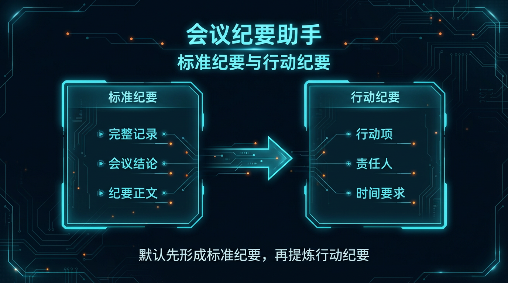
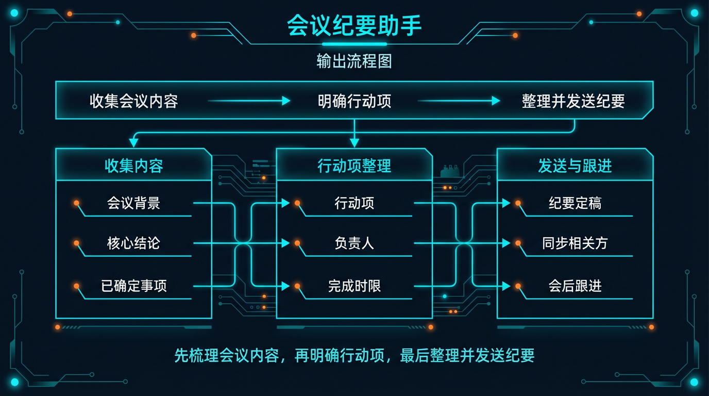
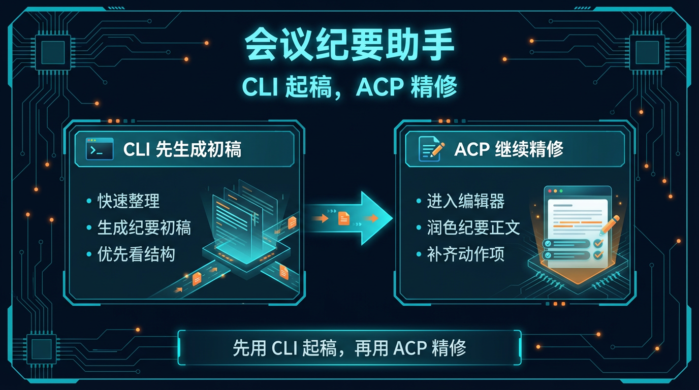

# 02-会议纪要助手

> 一句话先说清楚：这一页不是教你系统学会议管理，而是帮你把一段会议内容，直接压成“能发给团队执行的会议纪要”。

---

## 👀 先看结论

如果你现在想的是：
- 会刚开完，但记录很乱
- 我不想自己从聊天记录、录音转写、飞书/企微/钉钉纪要里一点点抠结论
- 我想先让 Hermes 帮我出一版能直接发出去的会议纪要

那这一页就是给你用的。

你用完这页，先拿到的不是空泛总结，而应该是这些东西：
- 这次会议到底讨论了什么
- 核心结论是什么
- 明确决定了哪些事
- 待跟进动作有哪些
- 谁负责、什么时候交付
- 哪些问题还没定
- 一版可以直接发给团队的纪要正文
- 跑完第一轮后下一句该怎么继续

## 🗺 如果你现在只想看最短路线
- 想先看这套东西值不值得用：直接看「⚡ 5 分钟跑一轮」
- 想看最后会拿到什么：直接看「📦 你最后会拿到什么」
- 想看第一轮跑完以后怎么继续：直接看「🪜 跑完第一轮后，下一句怎么说」
- 想直接下载包：直接看「📁 你现在直接能用的东西」

---

## 🧩 一个真实用例：这页到底怎么帮人

假设你刚开完一场周例会，主题是：

“新版本发布前最后一周的任务确认会”

你手里可能有这些东西：
- 飞书会议自动纪要
- 企微群里会后补的几条消息
- 钉钉里记下来的两三条待办
- 一段比较乱的口头转写

但真正麻烦的是：
- 这次会到底定了什么
- 哪些是结论，哪些只是讨论
- 谁要做什么，什么时候做完
- 哪些问题还没定，不能误写成已决策

这一页做的事，就是先把这些零散内容压成一版可执行会议纪要。

比如你跑完第一轮后，Hermes 应该先给你：
- 1 段会议背景摘要
- 1 份核心结论清单
- 1 份已决策事项
- 1 份待办动作表
- 1 份未决问题清单
- 1 版可直接发群或发邮件的纪要正文

这样你就不是“还在整理会议记录”，而是已经有一版能直接发出去的纪要。

---

## 🚦先选哪一种：先出标准纪要 or 先出行动版纪要

先别被方法论吓到，直接按你现在的状态选。

| 如果你现在更像这样 | 直接走哪条 | 你真正会拿到什么 |
|---|---|---|
| 先想把会议内容完整整理清楚 | 先出标准纪要 | 一次拿到背景、结论、决定、待办、未决问题 |
| 这次会重点是推进执行 | 先出行动版纪要 | 先把负责人、截止时间、动作项拉清楚 |
| 手上是飞书/企微/钉钉导出的原始内容 | 先出标准纪要 | Hermes 先帮你把内容压成结构化纪要 |
| 会后最怕漏任务、漏 owner | 先出行动版纪要 | 先把待办表和责任人对齐 |



如果你现在拿不准，默认先走：
- 先出标准纪要

原因很简单：
- 先把内容收清
- 先把已决策和未决分开
- 再决定要不要压成更强执行版

---

## 📝 先出标准纪要：适合谁，跑完会得到什么

### 适合谁
适合你现在是下面这种状态：
- 会刚开完
- 内容还比较乱
- 想先拿一版完整、可信的会议纪要

### 它会帮你做什么
你把原始内容喂进去后，它会先帮你：
- 还原会议背景和讨论主题
- 区分结论、决定、待办和未决问题
- 把零散原始记录压成结构化纪要
- 先拉出可直接发出的纪要正文
- 顺手补一版发前检查点

### 你最终应该看到什么
一个合格输出，应该至少让你看懂这些：
- 这次会到底围绕什么开的
- 最终决定了哪些事
- 哪些只是在讨论，不能误写成定案
- 后续谁做什么、什么时候交付
- 哪些问题要下次会继续跟

如果它只给你一段模糊总结，没有动作项、owner、截止时间，那就不对。

---

## ✅ 先出行动版纪要：适合谁，和标准纪要差在哪

### 适合谁
适合你已经进入下面这种状态：
- 会议内容你大体都知道
- 现在最缺的是动作项、owner、时间点
- 想先把团队执行链路收清楚

### 它和标准纪要最大的区别
先出标准纪要：
- 先把会议内容收完整
- 重点是保证结论和记录可信
- 适合会后第一轮整理

先出行动版纪要：
- 先把执行动作压清楚
- 重点是让团队下一步能立刻动起来
- 适合项目推进、版本推进、跨团队协同会

### 行动版纪要里最应该拿到什么
| 你会拿到什么 | 它在输出里大概长什么样 | 你拿它立刻能干嘛 |
|---|---|---|
| 动作清单 | `动作 / owner / 截止时间 / 依赖项` | 立刻发给团队执行 |
| 风险提醒 | `哪些动作卡依赖、哪些时间点可能冲突` | 先把风险讲清楚 |
| 未决问题 | `还没定、需要谁拍板` | 防止团队误以为已经决定 |
| 会后发送版纪要 | `一段可直接发群或发邮件的正文` | 节省会后整理时间 |

---

## 📦 你最后会拿到什么

别把它想得太抽象。

你跑完后，真正拿到的通常会长这样：

| 你会拿到什么 | 它在输出里大概长什么样 | 你拿它立刻能干嘛 |
|---|---|---|
| 会议背景摘要 | `这次会为什么开、围绕什么问题` | 先让没参会的人也能看懂 |
| 核心结论 | `版本发布日期不改，文案和埋点今天定稿` | 先把结论讲清楚 |
| 已决策事项 | `哪些事已经明确，不再反复讨论` | 防止会后再跑偏 |
| 待办动作表 | `动作 / owner / 截止时间` | 直接发给团队执行 |
| 未决问题 | `还差谁确认、还卡哪一步` | 先保护信息边界 |
| 纪要正文 | `可直接发群 / 发邮件 / 发飞书文档` | 立刻发送，不再手工重写 |



如果你觉得表格还是偏文字，这张图可以帮助你更快扫一眼：
- 第一层看会议内容
- 第二层看执行动作
- 第三层看会后发送和续跟

---

## 🖥 CLI 和 ACP，到底怎么选

这里尽量说得像人话一点。

| 你现在要干嘛 | 用哪个 | 跑完你会看到什么 |
|---|---|---|
| 我先想把这次会的纪要快速整理出来 | CLI | 一次完整输出：背景、结论、待办、未决问题、发送版纪要 |
| 我还没进文档工具，只想先拿一版纪要 | CLI | 先确认这次会到底整理成什么结构最合适 |
| 我已经准备开始细修文案或同步到文档 | ACP | 可以顺着结果继续润正文、改表述、补发送版格式 |
| 我想边看边改成自己团队惯用纪要模板 | ACP | 可以在编辑器里持续打磨，不只停在第一稿 |



最简单的记法：
- CLI：先拿第一版纪要
- ACP：确认方向对了以后，继续把它改到真的能发

---

## ⚡ 5 分钟跑一轮

如果你现在只想先跑通一次，默认走“先出标准纪要”。

### 第一步：下载它
先拿这个包：
- [packs/meeting-lab/01-super-individual.zip](../../../packs/meeting-lab/01-super-individual.zip)

### 第二步：解压后进入目录
```bash
cd /path/to/01-super-individual
```

### 第三步：创建一个独立 profile
```bash
hermes profile create meeting-solo --clone
```

### 第四步：安装
```bash
bash ./install_to_profile.sh meeting-solo
```

### 第五步：直接跑现成示例
```bash
hermes -p meeting-solo chat --skills meeting-minutes-assistant -q "$(cat skills/solutions/meeting-minutes-assistant/examples/sample-input.md)"
```

跑完以后，先看这 5 件事：
- 有没有把背景、结论、待办、未决分开
- 有没有明确 owner 和截止时间
- 有没有把讨论和定案区分开
- 有没有给可直接发出的纪要正文
- 有没有告诉你下一轮该怎么继续

如果这 5 件事都没有，那说明输出不合格。

---

## 🪜 跑完第一轮后，下一句怎么说

很多人卡在这里：
第一轮跑完了，然后呢？

你不用自己想复杂，直接这样继续说就行：

```text
基于刚才这版会议纪要，继续往“能直接发给团队执行”收：
1. 把动作项整理成更清楚的表格
2. 把 owner、截止时间、依赖项都补齐
3. 把未决问题单独拉出来，避免和已决策事项混在一起
4. 给我一版更适合发飞书/企微/钉钉群的短版纪要
5. 再给我一版适合发邮件的正式版纪要
6. 最后列一个会后跟进检查单，提醒我哪些动作需要再确认
```

你可以把这段理解成：
- 第一轮：先拿一版完整纪要
- 第二轮：开始把它改成真的能发、能执行、能跟进的版本

---

## 📁 你现在直接能用的东西

- 超级个体版下载：[packs/meeting-lab/01-super-individual.zip](../../../packs/meeting-lab/01-super-individual.zip)
- 安装说明：[packs/meeting-lab/INSTALL.md](../../../packs/meeting-lab/INSTALL.md)
- 使用说明：当前页里的「⚡ 5 分钟跑一轮」就是默认 doc 入口

---

## 🎯 这页写对了，用户应该一眼看懂什么

一页合格的“会议纪要助手”，用户应该一眼就能看懂这 4 件事：
- 这页是帮我把会议内容压成可发送、可执行的纪要，不是教我系统学开会
- 我现在应该先出标准纪要，还是先出行动版纪要
- 我第一步具体该怎么跑
- 我跑完后下一句该怎么继续

如果这 4 件事看不出来，这页就还没写对。

---

## ➡️ 下一步

完成后进入：

- [03-项目日报助手](./03-项目日报助手.md)

如果你想先回到当前位置重新确认：

- [01-总览｜办公效率与知识整理](./01-总览.md)

---

## 🔗 相关入口

- Pack 详情：[会议纪要助手 Pack](/packs/meeting-lab)，先确认适合谁用、安装入口和下载入口。

