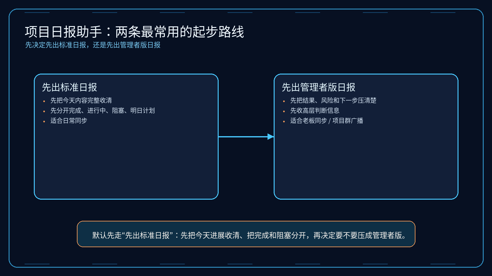
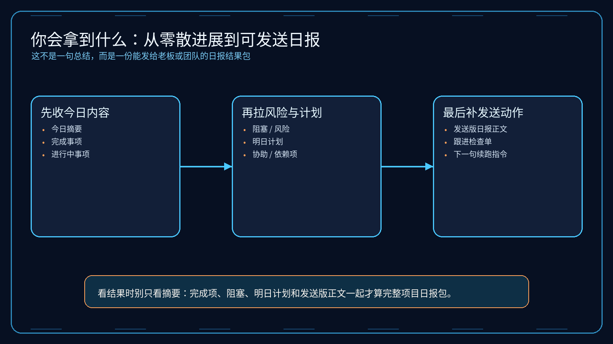
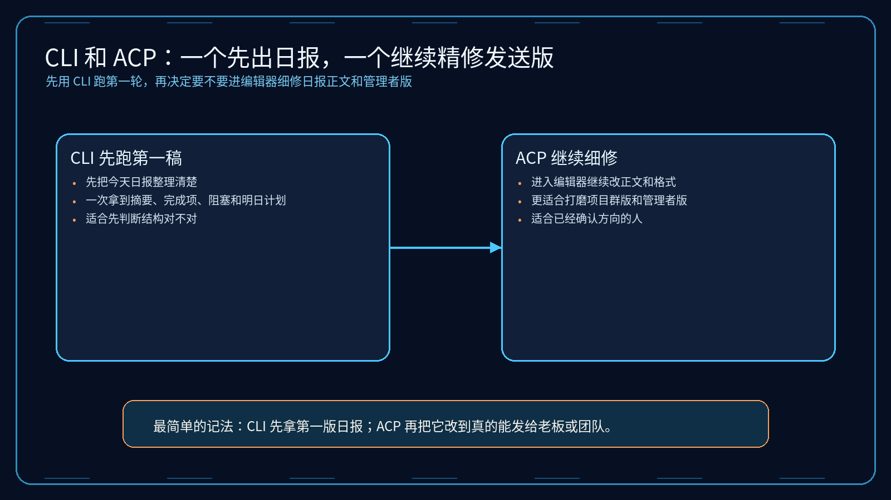

# 03-项目日报助手

> 一句话先说清楚：这一页不是教你系统学项目管理，而是帮你把一天的零散进展，直接压成“能发给老板、团队或项目群的项目日报”。

---

## 👀 先看结论

如果你现在想的是：
- 今天做了不少事，但记录很散
- 我不想自己从聊天记录、待办、提交记录、会议内容里一点点拼日报
- 我想先让 Hermes 帮我出一版能直接发出去的项目日报

那这一页就是给你用的。

你用完这页，先拿到的不是空泛总结，而应该是这些东西：
- 今天到底推进了哪些事
- 哪些已经完成
- 哪些还在进行中
- 哪些被阻塞了
- 明天要接着做什么
- 需要谁协助、卡在哪
- 一版可以直接发群或发邮件的日报正文
- 跑完第一轮后下一句该怎么继续

## 🗺 如果你现在只想看最短路线
- 想先看这套东西值不值得用：直接看「⚡ 5 分钟跑一轮」
- 想看最后会拿到什么：直接看「📦 你最后会拿到什么」
- 想看第一轮跑完以后怎么继续：直接看「🪜 跑完第一轮后，下一句怎么说」
- 想直接下载包：直接看「📁 你现在直接能用的东西」

---

## 🧩 一个真实用例：这页到底怎么帮人

假设你今天围绕一个新版本做了这些事情：
- 跟开发确认了埋点补齐进度
- 把 FAQ 页面补了一版简化说明
- 跑了一轮回归测试
- 和运营确认了发布文案
- 但还有 2 个动作卡在别人手里

你手里可能有这些东西：
- 飞书待办
- 企微群里今天的同步消息
- Git 提交记录
- 钉钉里的项目更新
- 自己随手记的几条笔记

真正麻烦的是：
- 今天到底做成了哪些事
- 哪些该写成完成项，哪些只是推进中
- 哪些风险或阻塞必须讲清楚
- 明天最该盯什么

这一页做的事，就是先把这些零散信息压成一版清楚、可信、能直接发的项目日报。

比如你跑完第一轮后，Hermes 应该先给你：
- 1 段今日工作摘要
- 1 份完成事项清单
- 1 份进行中事项清单
- 1 份阻塞 / 风险说明
- 1 份明日计划
- 1 版可直接发送的日报正文

这样你就不是“还在拼今天干了什么”，而是已经有一版能直接发出去的日报。

---

## 🚦先选哪一种：先出标准日报 or 先出管理者版日报

先别被方法论吓到，直接按你现在的状态选。

| 如果你现在更像这样 | 直接走哪条 | 你真正会拿到什么 |
|---|---|---|
| 先想把今天的工作完整整理清楚 | 先出标准日报 | 一次拿到摘要、完成项、进行中、阻塞、明日计划 |
| 今天最重要的是让老板快速看懂进展和风险 | 先出管理者版日报 | 先把关键进展、风险、资源诉求压清楚 |
| 手上是飞书/企微/钉钉/待办的零散内容 | 先出标准日报 | Hermes 先帮你压成结构化日报 |
| 最怕日报写了很多但重点不清楚 | 先出管理者版日报 | 先把结果、风险、下一步收紧 |



如果你现在拿不准，默认先走：
- 先出标准日报

原因很简单：
- 先把今天内容收清
- 先把完成、进行中、阻塞分开
- 再决定要不要压成更高层的管理者版

---

## 📋 先出标准日报：适合谁，跑完会得到什么

### 适合谁
适合你现在是下面这种状态：
- 一天工作刚结束
- 信息很散
- 想先拿一版完整、可信的日报

### 它会帮你做什么
你把原始内容喂进去后，它会先帮你：
- 还原今天围绕什么目标在推进
- 区分完成、进行中、阻塞和明日计划
- 把零散信息压成结构化日报
- 先拉出可直接发出的日报正文
- 顺手补一版发前检查点

### 你最终应该看到什么
一个合格输出，应该至少让你看懂这些：
- 今天到底做完了什么
- 哪些还没做完，但已经推进到哪
- 哪些卡住了，为什么卡
- 明天最该接着推进什么
- 如果发给别人，他们一眼能不能看懂重点

如果它只给你一段模糊总结，没有完成项、阻塞项和明日计划，那就不对。

---

## 📈 先出管理者版日报：适合谁，和标准日报差在哪

### 适合谁
适合你已经进入下面这种状态：
- 今天的细节你自己都知道
- 现在更缺的是给管理者看的高密度版本
- 想先把结果、风险和资源诉求讲清楚

### 它和标准日报最大的区别
先出标准日报：
- 先把今天内容收完整
- 重点是保证记录可信、执行链路清楚
- 适合团队日常同步

先出管理者版日报：
- 先把结果和风险压得更高密度
- 重点是让管理者快速判断今天推进情况
- 适合老板同步、项目群广播、周报前置素材

### 管理者版日报里最应该拿到什么
| 你会拿到什么 | 它在输出里大概长什么样 | 你拿它立刻能干嘛 |
|---|---|---|
| 核心进展摘要 | `今天最重要的 2～3 个推进结果` | 先让老板一眼看懂 |
| 风险 / 阻塞 | `卡在哪、影响什么、需要谁协助` | 先把风险讲清楚 |
| 明日优先动作 | `明天最该盯的 1～3 件事` | 防止后续跑偏 |
| 管理者发送版 | `一段更短、更聚焦结果的日报正文` | 直接发给管理者 |

---

## 📦 你最后会拿到什么

别把它想得太抽象。

你跑完后，真正拿到的通常会长这样：

| 你会拿到什么 | 它在输出里大概长什么样 | 你拿它立刻能干嘛 |
|---|---|---|
| 今日摘要 | `今天围绕版本发布完成了文案、测试、FAQ 收口` | 先把整体背景讲清楚 |
| 完成事项 | `FAQ 已补、回归已跑、文案已对齐` | 先证明今天有实质推进 |
| 进行中事项 | `埋点补齐中、发布素材补充中` | 让别人知道当前状态 |
| 阻塞 / 风险 | `还差谁确认、卡在哪、可能影响什么` | 先保护信息边界 |
| 明日计划 | `先补埋点、再过 checklist、再确认 FAQ` | 直接接明天动作 |
| 发送版日报正文 | `可直接发群 / 发邮件 / 发飞书文档` | 立刻发送，不再手工重写 |



如果你觉得表格还是偏文字，这张图可以帮助你更快扫一眼：
- 第一层看今日进展
- 第二层看结果与阻塞
- 第三层看发送动作和明日计划

---

## 🖥 CLI 和 ACP，到底怎么选

这里尽量说得像人话一点。

| 你现在要干嘛 | 用哪个 | 跑完你会看到什么 |
|---|---|---|
| 我先想把今天的日报快速整理出来 | CLI | 一次完整输出：摘要、完成项、进行中、阻塞、明日计划、发送版日报 |
| 我还没进文档工具，只想先拿一版日报 | CLI | 先确认今天内容到底怎么结构化最合适 |
| 我已经准备开始细修文案或同步到文档 | ACP | 可以顺着结果继续润正文、改格式、补发送版 |
| 我想边看边改成自己团队惯用日报模板 | ACP | 可以在编辑器里持续打磨，不只停在第一稿 |



最简单的记法：
- CLI：先拿第一版日报
- ACP：确认方向对了以后，继续把它改到真的能发

---

## ⚡ 5 分钟跑一轮

如果你现在只想先跑通一次，默认走“先出标准日报”。

### 第一步：下载它
先拿这个包：
- [01-super-individual.zip](../../../packs/daily-report-lab/01-super-individual.zip)

### 第二步：解压后进入目录
```bash
cd /path/to/01-super-individual
```

### 第三步：创建一个独立 profile
```bash
hermes profile create daily-report-solo --clone
```

### 第四步：安装
```bash
bash ./install_to_profile.sh daily-report-solo
```

### 第五步：直接跑现成示例
```bash
hermes -p daily-report-solo chat --skills daily-report-assistant -q "$(cat skills/solutions/daily-report-assistant/examples/sample-input.md)"
```

跑完以后，先看这 5 件事：
- 有没有把摘要、完成、进行中、阻塞、明日计划分开
- 有没有明确哪些真的完成了
- 有没有把阻塞和需要协助的地方说清楚
- 有没有给可直接发出的日报正文
- 有没有告诉你下一轮该怎么继续

如果这 5 件事都没有，那说明输出不合格。

---

## 🪜 跑完第一轮后，下一句怎么说

很多人卡在这里：
第一轮跑完了，然后呢？

你不用自己想复杂，直接这样继续说就行：

```text
基于刚才这版项目日报，继续往“能直接发给老板和团队”收：
1. 把完成项和进行中事项整理得更短更清楚
2. 把阻塞 / 风险单独拉出来，讲清影响和需要谁协助
3. 给我一版更适合发项目群的短版日报
4. 再给我一版适合发给管理者的高密度日报
5. 最后列一个明日跟进检查单，提醒我哪些事项必须再追
```

你可以把这段理解成：
- 第一轮：先拿一版完整日报
- 第二轮：开始把它改成真的能发、能同步、能跟进的版本

---

## 📁 你现在直接能用的东西

- 超级个体版 zip：[01-super-individual.zip](../../../packs/daily-report-lab/01-super-individual.zip)
- 输入示例：[sample-input.md](../../../packs/daily-report-lab/01-super-individual/skills/solutions/daily-report-assistant/examples/sample-input.md)
- 输出示例：[sample-output.md](../../../packs/daily-report-lab/01-super-individual/skills/solutions/daily-report-assistant/examples/sample-output.md)
- 安装说明：[daily-report-lab/INSTALL.md](../../../packs/daily-report-lab/INSTALL.md)

---

## 🎯 这页写对了，用户应该一眼看懂什么

一页合格的“项目日报助手”，用户应该一眼就能看懂这 4 件事：
- 这页是帮我把一天进展压成可发送、可跟进的项目日报，不是教我系统学管理
- 我现在应该先出标准日报，还是先出管理者版日报
- 我第一步具体该怎么跑
- 我跑完后下一句该怎么继续

如果这 4 件事看不出来，这页就还没写对。

---

## ➡️ 下一步

完成后进入：

- [回 01-总览｜现成方案](../01-总览.md)

如果你想先回到现成方案入口重新确认位置：

- [回 01-总览｜现成方案](../01-总览.md)
