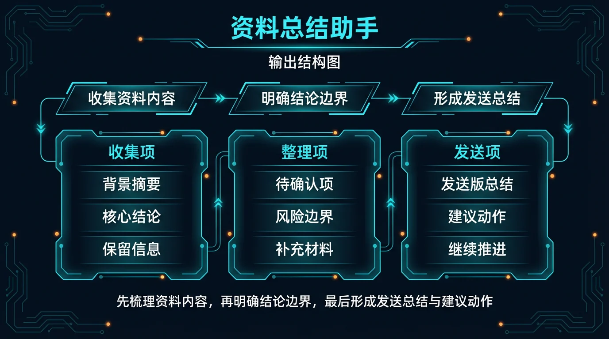
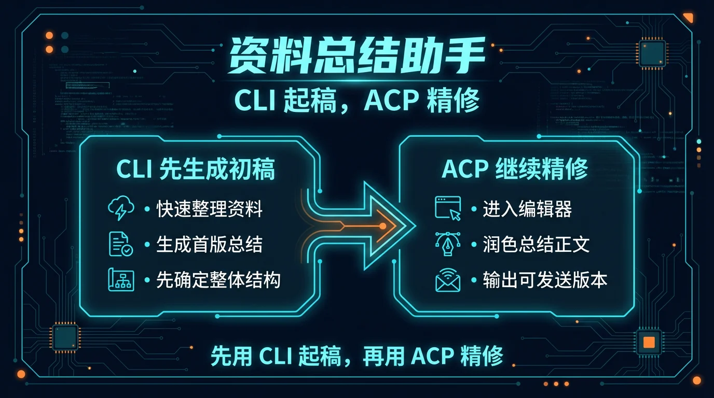

# 04-资料总结助手

> 一句话先说清楚：这一页不是教你系统学做研究摘要，而是帮你把一堆零散资料、文章、会议记录或网页内容，直接压成“能继续看、能继续用、能继续转给别人”的总结稿。

---

## 👀 先看结论

如果你现在想的是：
- 手上资料很多，但看完还是很乱
- 我不想自己一篇一篇抠重点、抠结论、抠行动项
- 我想先让 Hermes 帮我出一版结构化总结

那这一页就是给你用的。

你用完这页，先拿到的不是空泛摘要，而应该是这些东西：
- 这批资料到底讲了什么
- 核心观点 / 结论是什么
- 哪些信息值得保留
- 哪些信息只是背景，不是重点
- 如果要继续给别人同步，最短应该怎么说
- 如果要继续行动，下一步该看什么 / 补什么
- 一版可以直接发群、发邮件、贴飞书文档的总结正文
- 跑完第一轮后下一句该怎么继续

## 🗺 如果你现在只想看最短路线
- 想先看这套东西值不值得用：直接看「⚡ 5 分钟跑一轮」
- 想看最后会拿到什么：直接看「📦 你最后会拿到什么」
- 想看第一轮跑完以后怎么继续：直接看「🪜 跑完第一轮后，下一句怎么说」
- 想直接下载包：直接看「📁 你现在直接能用的东西」

---

## 🧩 一个真实用例：这页到底怎么帮人

假设你今天收到了这样一批资料：
- 一篇产品调研文章
- 两段会议记录
- 一份用户反馈摘录
- 几条飞书 / 企微 / 钉钉里的补充说明

你真正卡住的通常不是“有没有内容”，而是：
- 这些资料到底合起来在说什么
- 哪些是重复信息
- 哪些是可以往下行动的结论
- 如果要同步给老板 / 团队，最短该怎么讲

这一页做的事，就是先把这些散资料压成一版结构化总结。

比如你跑完第一轮后，Hermes 应该先给你：
- 1 段背景摘要
- 1 份核心结论清单
- 1 份关键信息保留项
- 1 份可行动项 / 待确认项
- 1 版可直接同步出去的总结正文

这样你就不是“还在翻资料”，而是已经有一版能继续传播、继续决策、继续补材料的总结稿。

---

## 🚦先选哪一种：先出标准总结 or 先出决策版总结

先别被方法论吓到，直接按你现在的状态选。

| 如果你现在更像这样 | 直接走哪条 | 你真正会拿到什么 |
|---|---|---|
| 先想把资料完整收清 | 先出标准总结 | 一次拿到背景、核心结论、关键信息、待确认项 |
| 重点是同步给老板 / 负责人 | 先出决策版总结 | 先把结论、风险、建议动作压得更短更清楚 |
| 手上是飞书 / 企微 / 钉钉 / 网页 / 笔记混在一起 | 先出标准总结 | Hermes 先帮你压成结构化总结 |
| 最怕总结写很多但看不出结论 | 先出决策版总结 | 先把结果、判断、下一步收紧 |


如果你现在拿不准，默认先走：
- 先出标准总结

原因很简单：
- 先把内容收清
- 先把背景、结论、待确认分开
- 再决定要不要压成更高层的决策版

---

## 📚 先出标准总结：适合谁，跑完会得到什么

### 适合谁
适合你现在是下面这种状态：
- 资料很多
- 信息很散
- 想先拿一版完整、可信的总结

### 它会帮你做什么
你把原始资料喂进去后，它会先帮你：
- 还原这批资料围绕什么问题
- 区分背景、核心结论、关键信息和待确认项
- 把零散信息压成结构化总结
- 先拉出可直接发出的总结正文
- 顺手补一版发前检查点

### 你最终应该看到什么
一个合格输出，应该至少让你看懂这些：
- 这批资料到底主要在讲什么
- 哪些才是最重要的结论
- 哪些是支持信息，哪些不是重点
- 哪些还要补材料或补判断
- 如果转给别人，他们一眼能不能看懂重点

如果它只给你一段模糊概述，没有核心结论、保留项和待确认项，那就不对。

---

## 🧠 先出决策版总结：适合谁，和标准总结差在哪

### 适合谁
适合你已经进入下面这种状态：
- 资料细节你自己都知道
- 现在更缺的是给负责人看的高密度版本
- 想先把结论、风险和建议动作讲清楚

### 它和标准总结最大的区别
先出标准总结：
- 先把资料内容收完整
- 重点是保证结构清楚、信息不漏
- 适合第一轮资料整理

先出决策版总结：
- 先把结论和建议动作压得更高密度
- 重点是让管理者快速判断
- 适合老板同步、项目判断、会前预读

### 决策版总结里最应该拿到什么
| 你会拿到什么 | 它在输出里大概长什么样 | 你拿它立刻能干嘛 |
|---|---|---|
| 核心判断 | `这批资料最关键的 2～3 个结论` | 先让负责人一眼看懂 |
| 风险 / 不确定项 | `哪些还要再确认，影响什么` | 先把边界讲清楚 |
| 建议动作 | `下一步该补什么、问谁、推进什么` | 直接进入行动 |
| 决策版发送稿 | `一段更短、更聚焦结论的总结正文` | 直接发给管理者 |

---

## 📦 你最后会拿到什么

别把它想得太抽象。

你跑完后，真正拿到的通常会长这样：

| 你会拿到什么 | 它在输出里大概长什么样 | 你拿它立刻能干嘛 |
|---|---|---|
| 背景摘要 | `这批资料围绕什么问题、为什么要看` | 先把上下文讲清楚 |
| 核心结论 | `最值得保留的 3～5 条判断` | 先让别人快速抓重点 |
| 关键信息保留项 | `哪些数据、案例、反馈值得继续带着走` | 防止总结后信息丢失 |
| 待确认项 | `哪些结论还不能直接定案` | 保护信息边界 |
| 建议动作 | `接下来该补什么、问谁、推进什么` | 直接进入下一步 |
| 发送版总结正文 | `可直接发群 / 发邮件 / 发飞书文档` | 立刻发送，不再手工重写 |



如果你觉得表格还是偏文字，这张图可以帮助你更快扫一眼：
- 第一层看资料背景
- 第二层看结论与待确认
- 第三层看发送动作和建议下一步

---

## 🖥 CLI 和 ACP，到底怎么选

这里尽量说得像人话一点。

| 你现在要干嘛 | 用哪个 | 跑完你会看到什么 |
|---|---|---|
| 我先想把这批资料快速整理出来 | CLI | 一次完整输出：背景、结论、关键信息、待确认项、发送版总结 |
| 我还没进文档工具，只想先拿一版总结 | CLI | 先确认这批资料到底怎么结构化最合适 |
| 我已经准备开始细修文案或同步到文档 | ACP | 可以顺着结果继续润正文、改格式、补发送版 |
| 我想边看边改成自己团队惯用模板 | ACP | 可以在编辑器里持续打磨，不只停在第一稿 |



最简单的记法：
- CLI：先拿第一版总结
- ACP：确认方向对了以后，继续把它改到真的能发

---

## ⚡ 5 分钟跑一轮

如果你现在只想先跑通一次，默认走“先出标准总结”。

### 第一步：下载它
先拿这个包：
- [packs/summary-lab/01-super-individual.zip](../../../packs/summary-lab/01-super-individual.zip)

### 第二步：解压后进入目录
```bash
cd /path/to/01-super-individual
```

### 第三步：创建一个独立 profile
```bash
hermes profile create summary-solo --clone
```

### 第四步：安装
```bash
bash ./install_to_profile.sh summary-solo
```

### 第五步：直接跑现成示例
```bash
hermes -p summary-solo chat --skills material-summary-assistant -q "$(cat skills/solutions/material-summary-assistant/examples/sample-input.md)"
```

跑完以后，先看这 5 件事：
- 有没有把背景、结论、保留项、待确认项分开
- 有没有明确哪些才是真正重点
- 有没有把建议动作讲清楚
- 有没有给可直接发出的总结正文
- 有没有告诉你下一轮该怎么继续

如果这 5 件事都没有，那说明输出不合格。

---

## 🪜 跑完第一轮后，下一句怎么说

很多人卡在这里：
第一轮跑完了，然后呢？

你不用自己想复杂，直接这样继续说就行：

```text
基于刚才这版资料总结，继续往“能直接发给老板和团队”收：
1. 把核心结论压得更短更清楚
2. 把待确认项单独拉出来，讲清影响和需要谁继续判断
3. 给我一版更适合发项目群的短版总结
4. 再给我一版适合发给管理者的高密度决策版总结
5. 最后列一个后续补材料检查单，提醒我哪些信息还要再追
```

你可以把这段理解成：
- 第一轮：先拿一版完整总结
- 第二轮：开始把它改成真的能发、能判断、能继续推进的版本

---

## 📁 你现在直接能用的东西

- 超级个体版下载：[packs/summary-lab/01-super-individual.zip](../../../packs/summary-lab/01-super-individual.zip)
- 安装说明：[packs/summary-lab/INSTALL.md](../../../packs/summary-lab/INSTALL.md)
- 使用说明：当前页里的「⚡ 5 分钟跑一轮」就是默认 doc 入口

---

## 🎯 这页写对了，用户应该一眼看懂什么

一页合格的“资料总结助手”，用户应该一眼就能看懂这 4 件事：
- 这页是帮我把散资料压成可发送、可继续判断的结构化总结，不是教我系统学做摘要
- 我现在应该先出标准总结，还是先出决策版总结
- 我第一步具体该怎么跑
- 我跑完后下一句该怎么继续

如果这 4 件事看不出来，这页就还没写对。

---

## ➡️ 下一步

完成后进入：

- [05-行动计划助手](./05-行动计划助手.md)

如果你想先回到当前位置重新确认：

- [01-总览｜办公效率与知识整理](./01-总览.md)

---

## 🔗 相关入口

- Pack 详情：[资料总结助手 Pack](/packs/summary-lab)，先确认适合谁用、安装入口和下载入口。

