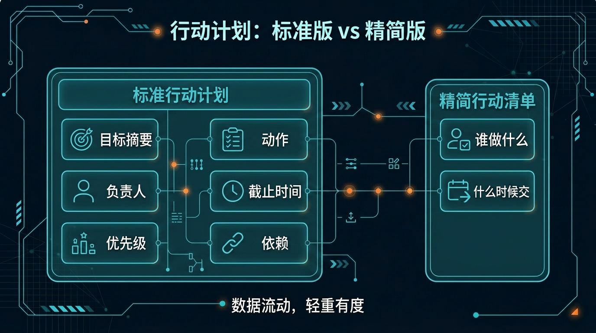
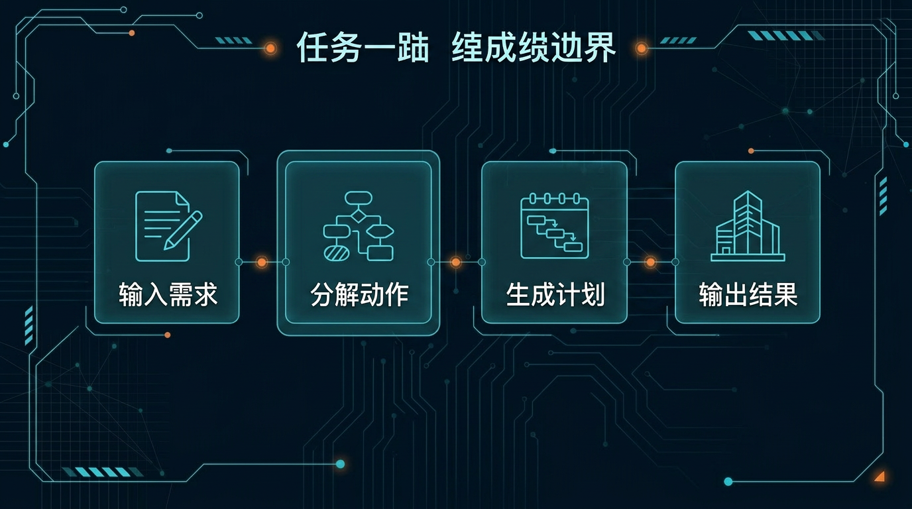

# 05-行动计划助手

> 一句话先说清楚：这一页不是教你系统学项目管理，而是帮你把一个目标、一场会或一次讨论的结果，直接压成"团队能立刻执行的行动计划表"。

## 🔍 这页在回答什么

如果你搜索过「会议纪要怎么变成行动计划」「AI 帮我拆任务」或者「项目目标怎么拆解成可执行步骤」，那这页就是你要找的。这页是一个现成的 AI Agent 工作流方案——用 Hermes Agent（一个开源的 AI 智能助手框架）帮你把会议纪要、项目目标或群讨论记录，直接转化成带负责人、截止时间、优先级和依赖关系的行动计划表。不需要学项目管理理论，也不需要安装复杂软件，把内容喂给 Hermes，拿到的就是能直接发到飞书、企微或钉钉群的任务分配表。

---

## 👀 先看结论

如果你现在想的是：
- 会刚开完，纪要有了，但还没拆成具体任务
- 项目刚启动，目标定了，但执行路径不清晰
- 飞书/企微/钉钉群里讨论了一堆，但没人总结谁做什么
- 我想先让 Hermes 帮我把结论直接拆成可执行的任务表

那这一页就是给你用的。

你用完这页，先拿到的不是一篇文章，而应该是这些东西：
- 动作项（具体要做什么）
- 负责人（谁来做）
- 截止时间（什么时候交）
- 优先级（先做哪个）
- 依赖关系（哪些动作之间有先后）
- 一版可以直接发到飞书/企微/钉钉群的任务分配表
- 跑完第一轮后下一句该怎么继续

## 🗺 如果你现在只想看最短路线
- 想先看这套东西值不值得用：直接看「⚡ 5 分钟跑一轮」
- 想看最后会拿到什么：直接看「📦 你最后会拿到什么」
- 想看第一轮跑完以后怎么继续：直接看「🪜 跑完第一轮后，下一句怎么说」

---

## 🧩 一个真实用例：这页到底怎么帮人

假设你刚开完一场需求评审会，主题是：

"小程序 v2.0 上线前的任务确认"

你手里可能有这些东西：
- 一份飞书会议纪要
- 企微群里会后补的几条消息
- 一段比较乱的口头转写

但真正麻烦的是：
- 这次会到底定了什么
- 谁要做什么，什么时候做完
- 哪些事必须先做，哪些可以并行
- 哪些动作之间有依赖，顺序排不对会卡住

这一页做的事，就是先把这些零散内容压成一版可执行行动计划表。

比如你跑完第一轮后，Hermes 应该先给你：
- 1 段目标摘要
- 1 份动作项清单（每项含负责人、截止时间、优先级、依赖项）
- 1 份风险与阻塞提醒
- 1 份建议执行顺序
- 1 版可直接发群的发送版正文

这样你就不是"还在手动拆任务"，而是已经有一版能直接发出去的行动计划。

---

## 🚦 先选哪一种：标准行动计划 or 精简行动清单

先别被名字吓到，直接按你现在的状态选。

| 如果你现在更像这样 | 直接走哪条 | 你真正会拿到什么 |
|---|---|---|
| 会刚开完，纪要有了，想先拆成完整行动计划 | 标准行动计划 | 动作项 + 负责人 + 截止时间 + 优先级 + 依赖 + 发送版 |
| 项目刚启动，目标定了，想先拆阶段性动作 | 标准行动计划 | 按阶段拆分的行动计划表 |
| 群里讨论了一堆，只想快速拆出谁做什么 | 精简行动清单 | 只保留动作 + 负责人 + 截止时间，方便发群 |
| 每周例会后都要手动整理待办，想省时间 | 精简行动清单 | 一版可直接发群的任务清单 |

如果你现在拿不准，默认先走：
- 标准行动计划

原因很简单：
- 先出完整版，保证不漏信息
- 再从完整版里提炼精简版，方便群内快速同步
- 两版都有了，进可攻退可守



---

## 📋 标准行动计划：适合谁，跑完会得到什么

### 适合谁
适合你现在是下面这种状态：
- 会刚开完，纪要已有
- 想先拿一版完整、可执行的行动计划表
- 需要把每个动作的负责人、截止时间、优先级和依赖关系都对清楚

### 不适合谁
如果你属于下面这些情况，这个方案可能帮不到你：
- 你需要一套完整的项目管理工具（比如 Jira、Asana 的看板、Sprint、工时统计等功能）——这页只生成行动计划文本，不替代项目管理平台
- 你需要甘特图、时间轴视图或可视化的项目排期——Hermes 输出的是文本格式的计划表，不是图形化排期工具
- 你想让 AI 自动把任务分配到每个人的待办列表里，且不需要人工确认——这页的输出仍需你复制粘贴到群里，由团队成员自行认领
- 你的项目涉及复杂的多团队协同和资源调度，需要专业的项目管理方法论支撑

### 它会帮你做什么
你把原始内容喂进去后，它会先帮你：
- 提炼目标摘要（这次行动到底要达成什么）
- 拆动作项（具体要做什么）
- 标注负责人（谁来做）
- 推算截止时间（什么时候交）
- 排优先级（先做哪个）
- 拉依赖关系（哪些动作之间有先后）
- 提醒风险和阻塞点
- 输出一版可发群的发送版正文

### 你最终应该看到什么
一个合格输出，应该至少让你看懂这些：
- 目标摘要：一句话概括本次行动要达成什么
- 每个动作项至少包含 5 个字段：

| 字段 | 说明 | 示例 |
|---|---|---|
| 动作 | 具体要做什么 | 完成首页改版设计稿 |
| 负责人 | 谁来做 | @张三 |
| 截止时间 | 什么时候交 | 2026-05-22（周五） |
| 优先级 | P0/P1/P2 | P0 — 阻塞后续所有前端 |
| 依赖 | 依赖哪些前置动作 | 依赖：API 接口文档定稿 |

如果它只给你一堆"建议制定计划、建议明确责任"这种空话，那就不对。

---

## 🪄 精简行动清单：适合谁，跑完会得到什么

### 适合谁
适合你现在是下面这种状态：
- 不需要完整版的所有字段
- 只想快速知道"谁做什么、什么时候交"
- 准备直接发到飞书/企微/钉钉群里同步

### 不适合谁
如果你需要以下能力，精简版可能不够用：
- 需要标注任务之间的依赖关系和执行顺序——精简版只保留动作、负责人和截止时间，不包含依赖分析
- 需要风险提醒和阻塞点预警——精简版不生成风险分析
- 需要存档级别的正式行动计划文档——建议用标准版

### 它和标准版最大的区别
- 标准版：完整字段，适合存档和正式下发
- 精简版：只保留动作 + 负责人 + 截止时间，适合群内快速同步

### 你会拿到什么

| 你会拿到什么 | 它在输出里大概长什么样 | 你拿它立刻能干嘛 |
|---|---|---|
| 动作项清单 | "完成首页设计稿 / 张三 / 周五" | 直接发群，大家认领 |
| 优先级排序 | "P0 先做、P1 紧接着、P2 本周内" | 先推最紧急的 |
| 发送版正文 | 一段可直接复制的群消息 | 粘贴到飞书/企微/钉钉 |

---

## 📦 你最后会拿到什么

别把它想得太抽象。

你跑完后，真正拿到的通常会长这样：

| 你会拿到什么 | 它在输出里大概长什么样 | 你拿它立刻能干嘛 |
|---|---|---|
| 目标摘要 | "小程序 v2.0 上线前最后一周任务确认" | 先把本次行动目标定住 |
| 动作项清单 | 每项含任务/负责人/截止时间/优先级/依赖 | 直接分配和追踪 |
| 风险提醒 | "设计稿 CTA 位置待定，可能阻塞前端" | 提前规避 |
| 建议执行顺序 | "先定稿设计 → 再开前端 → 最后联调" | 按顺序推 |
| 发送版正文 | 一段可直接发群的消息 | 粘贴到飞书/企微/钉钉 |



---

## ⚡ 5 分钟跑一轮

如果你现在只想先跑通一次，默认走"标准行动计划"。

### 第一步：准备原始内容

从飞书、企微或钉钉复制一段会议讨论或项目目标，比如：

```
今天产品评审会结论：
1. 首页改版要做，优先级最高
2. 张三负责设计稿，这周五交
3. 李四负责前端开发，等设计稿出来后开始
4. 数据埋点方案王五这周先出一版
5. 下周三全员对齐进度
```

### 第二步：喂给 Hermes

```
请根据以下内容，帮我生成一份行动计划表。要求：每个动作项包含"具体任务 / 负责人 / 截止时间 / 优先级 / 依赖关系"，最后附一版可以直接发群的消息正文。

[粘贴你的原始内容]
```

### 第三步：拿到结果后检查

重点看这 3 件事：
1. **有没有漏动作**：原始内容里提到的每件事，行动计划里都覆盖了吗？
2. **依赖关系对不对**：谁等谁的东西，逻辑是否正确？
3. **截止时间是否合理**：如果有冲突或太紧，需要手动调整

如果这 3 件事都 OK，直接把发送版正文复制到飞书/企微/钉钉群即可。

---

## 🧍 超级个体版：一个人用

适合你是独立工作者、自由职业者或一个人负责多个项目的场景。

**你的输入方式**：
- 直接把待办、想法、目标丢给 Hermes
- 不需要标注"负责人"（都是你自己）
- 重点看优先级和执行顺序

**示例 Prompt**：

```
我现在有三个并行任务：
1. 给客户 A 出方案（本周四前）
2. 写一篇技术博客（本周内）
3. 准备下周二的线上分享 PPT

请帮我排一个行动计划，按优先级和依赖关系排序，标注建议的每天时间分配。
```

**你会拿到**：一份按天排列的个人执行计划 + 每个任务的优先级理由。

---

## 🤝 团队协作版：多人用

适合你是项目经理、产品经理或团队负责人，需要把任务拆分给不同人。

**你的输入方式**：
- 把会议纪要、群讨论或项目文档喂给 Hermes
- 附上团队成员名单和各自职责
- 明确项目里程碑和关键日期

**示例 Prompt**：

```
团队：张三（设计）、李四（前端）、王五（数据）、赵六（后端）
项目：小程序 v2.0 上线
目标日期：6 月 15 日

以下是今天的评审会纪要：
[粘贴纪要]

请生成行动计划表，标注每个动作的负责人、截止时间、优先级和依赖关系。最后输出一版可直接发到飞书群的行动计划消息。
```

**你会拿到**：
- 完整行动计划表（飞书/企微/钉钉可直接使用）
- 风险提醒（哪些动作可能卡住）
- 发送版消息（复制粘贴即发）

---

## 🪜 跑完第一轮后，下一句怎么说

很多人卡在这里：第一轮跑完了，然后呢？

你不用自己想复杂，直接这样继续说就行：

```text
基于刚才这版行动计划，继续往"能直接发"收：
1. 从完整版里提炼一版精简行动清单（只保留动作 + 负责人 + 截止时间）
2. 按依赖关系重新排一下执行顺序
3. 帮我检查一下有没有漏动作
4. 帮我检查一下截止时间有没有冲突
5. 输出一版可以直接发到飞书群的行动计划消息
```

你可以把这段理解成：
- 第一轮：先拿一版完整行动计划表
- 第二轮：开始把它收成能直接发群的内容

---

## 📁 你现在直接能用的东西

**Pack 下载与安装**：

- Pack 详情与元数据：[manifest.yaml](../../../packs/action-plan-lab/manifest.yaml)
- 超级个体版下载：[01-super-individual.zip](../../../packs/action-plan-lab/01-super-individual.zip)
- 安装说明：[INSTALL.md](../../../packs/action-plan-lab/INSTALL.md)
- 一键安装到 Profile：[install_to_profile.sh](../../../packs/action-plan-lab/01-super-individual/install_to_profile.sh)
- 使用说明：当前页里的「⚡ 5 分钟跑一轮」就是默认 doc 入口

**可直接使用的 Prompt 模板**：

**模板 1：会议纪要 → 行动计划**

```
请根据以下会议纪要，生成行动计划表。

要求：
1. 每个动作项包含：具体任务 / 负责人 / 截止时间 / 优先级（P0/P1/P2） / 依赖关系
2. 最后附一版可以直接发到 [飞书/企微/钉钉] 群的行动计划消息
3. 标注可能的风险或阻塞点

会议纪要内容：
[在此粘贴]
```

**模板 2：项目目标 → 阶段性行动计划**

```
请根据以下项目目标，帮我拆解成阶段性行动计划。

项目名称：[填写]
目标日期：[填写]
团队：[列出成员和角色]

要求：
1. 按阶段拆分（准备期 / 执行期 / 收尾期）
2. 每个阶段列出具体动作项
3. 标注关键里程碑和风险点

项目目标内容：
[在此粘贴]
```

**模板 3：群讨论 → 待办清单**

```
请从以下群讨论记录中，提取所有待办事项，生成一份行动计划。

要求：
1. 每个待办标注：任务内容 / 建议负责人 / 建议截止时间
2. 按优先级排序
3. 输出一版可直接发群的消息

群讨论记录：
[在此粘贴]
```

---

## ❓ 常见问题

### 行动计划的输出格式是什么？
Hermes 输出的是纯文本格式的行动计划表，包含目标摘要、动作项清单（每项含任务/负责人/截止时间/优先级/依赖）、风险提醒和可直接发群的消息正文。你可以直接复制粘贴到飞书、企微或钉钉，也可以手动整理到 Excel 或项目管理工具里。

### 支持中文会议纪要吗？
完全支持。Hermes 对中文的理解和处理没有问题，无论是飞书会议纪要、企微群讨论还是钉钉消息记录，直接粘贴进去就行。输出也是中文。

### 一个人用和团队用有什么区别？
核心区别在于「负责人」字段。一个人用的时候，所有任务都是你自己的，重点看优先级和执行顺序的排列；团队用的时候，Hermes 会根据你提供的成员名单和职责，自动建议每个动作的负责人。团队版还会额外生成风险提醒和依赖分析，方便多人协同。

### 同一个项目的多场会议可以合并处理吗？
可以。你可以先把多场会议的纪要一次性喂给 Hermes，告诉它「这些是同一个项目的多场会议」，它会帮你合并去重、统一排优先级。如果会议特别多，建议每次不超过 3-4 场，保证输出质量。

### 第一轮结果不满意，怎么调整？
直接在对话里继续说就行。比如「帮我检查一下有没有漏动作」「截止时间帮我往后推两天」「优先级重新排一下，把 XX 的优先级提到 P0」。Hermes 是对话式的，你可以反复调整直到满意。

---

## ➡️ 下一步

完成后进入：

- [06-邮件群消息摘要助手](./06-邮件群消息摘要助手.md)

如果你想先回到当前位置重新确认：

- [01-总览｜办公效率与知识整理](./01-总览.md)

---

**🔗 相关入口**

- Pack 详情：[行动计划助手 Pack](/packs/action-plan-lab)，先确认适合谁用、安装入口和下载入口。
